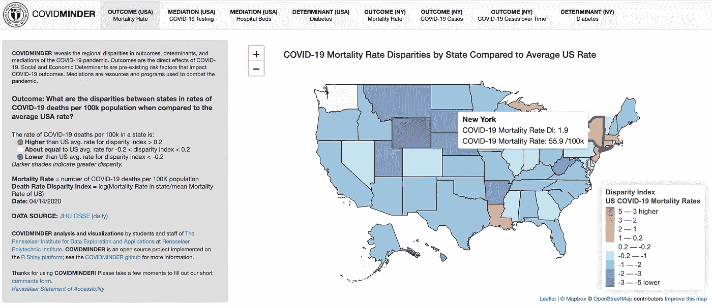
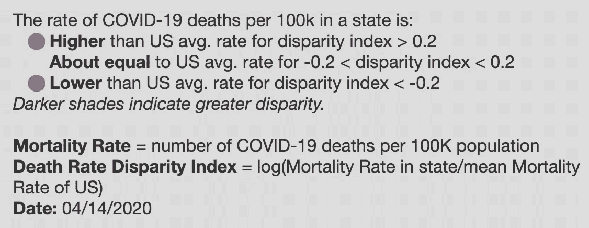
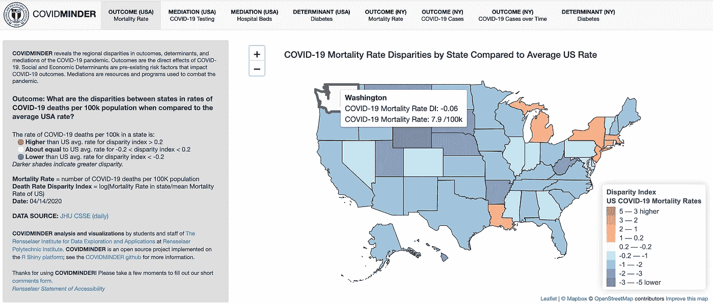
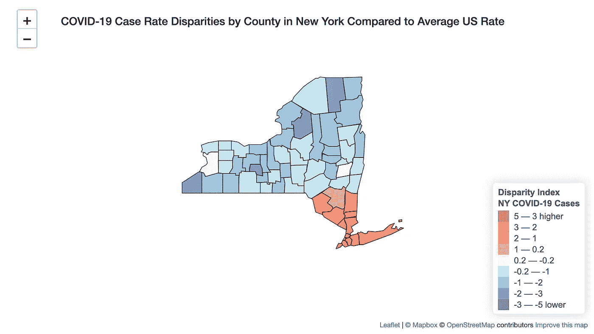
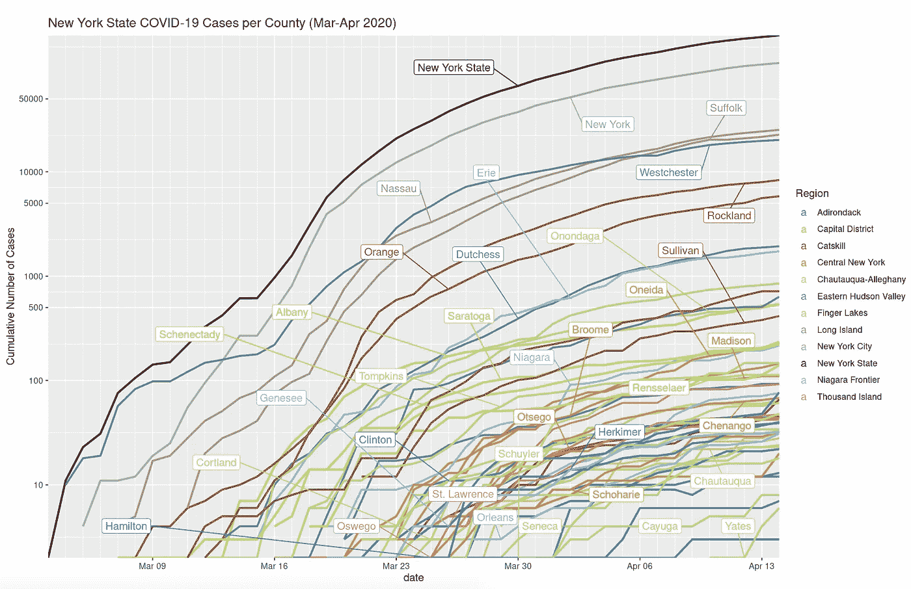
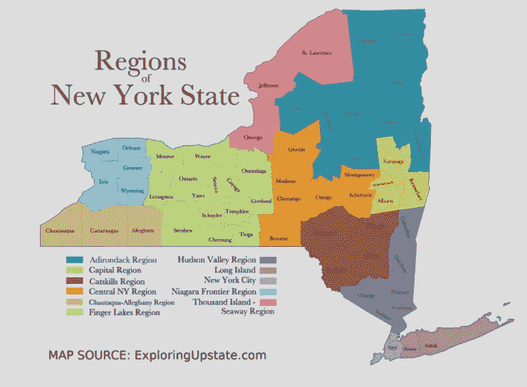

# 你住在哪里很重要！—基于 RShiny 和传单的可视化工具

> 原文：<https://towardsdatascience.com/covidminder-where-you-live-matters-rshiny-and-leaflet-based-visualization-tool-168e3857dbf2?source=collection_archive---------38----------------------->

## 美国各地的 COVID 差异



COVIDMINDER

在过去的一个月里，我一直在积极地与我的研究团队合作，探索 COVID 周围的数据，并开发一个可视化工具来了解美国各地的差异。我们最近发布了应用程序 COVIDMINDER 的第一次迭代，其中包括美国各地死亡率、测试病例、糖尿病和医院床位的差异，特别关注纽约。

在本帖中，我们将详细探究各种选项卡，并了解应用程序是如何设计的。此外，应用程序在不断发展，如果您在更晚的时间点阅读本文，您可能会看到更多的功能和选项卡。作为快速参考，这个应用是实时的:[https://covidminder.idea.rpi.edu/](https://covidminder.idea.rpi.edu/)，你可以继续探索 GitHub 上的代码:[https://github.com/TheRensselaerIDEA/COVIDMINDER](https://github.com/TheRensselaerIDEA/COVIDMINDER)

## 这个想法

**COVIDMINDER** 是一个揭示结果、决定因素和药物的地区差异的应用程序。它探索有关新冠肺炎的数据，并试图提取和传播有关各种因素的信息。



差异指数

到目前为止，你一定遇到过一些仪表板，它们的基本概念是显示当前的统计数据、死亡病例数、总阳性计数等。在一个漂亮的界面中。

但是我们想做一些不同的事情。我们希望我们的仪表板不仅仅是直接输出数字。因此，我们决定扩大我们的数据范围，纳入可能与死亡率相关的因素。我们决定不仅包括死亡率，还包括每个州的医院床位、当前测试病例的数量以及糖尿病在全国的传播情况。此外，在这些因素中，我们计算了与该州人口相关的差异指数，以提供更好的可视化能力。

此外，我们决定将纽约纳入我们的分析，因为它不仅是目前最令人担忧的州，而且我也不在纽约，所以我可以亲眼目睹一切。

# r-闪亮和传单



应用主页

你看到的应用程序是使用 **R Shiny** 从头设计的，这是一个 R 包，允许你使用 **R 代码、HTML、CSS 和 Javascript** 开发网站。我们探索了各种设计风格、布局和配色方案，最终选择了我们在图片中看到的那个。图中的颜色与背景形成强烈对比，以便更好地突出它们。

所有的情节(线情节除外)，都是用**传单**包设计的。由于我非常熟悉传单图是如何制作的，我可以说地图设计非常直观，并且使得使用 geo 图非常简单。

# 情节

## 地理图



使用传单的地理图

对于每个选项卡，我们决定在美国或纽约州的*地理地图上绘制数据。各个州/县基于视差指数值进行颜色编码，范围从深蓝色到深红色。正如我前面提到的，我们用传单来产生这些情节。*

您可以将鼠标悬停在任何州/县上，查看该地区的更多统计数据。每个悬停信息根据您所在的选项卡和差异指数而变化。

这些图是交互式的，允许你放大和缩小每个图。图例已添加到右下角。

## 线形图



纽约测试用例折线图

我们的申请中包含的第二种情节是自 3 月以来发生的*纽约 COVID 案件。不出所料，纽约州作为一个整体是最高的。此外，紧随其后的是纽约，它实际上是迄今为止病例最多的县。*

您可以通过选择边界框来放大和缩小图像，并更深入地探索绘图。各县的颜色基于下面定义的颜色图:



纽约地区的颜色编码

# 数学

差异指数用于描述一个州或县的相对位置。我们使用`log`值来标识索引。例如，为了计算美国各州死亡率的差异指数，我们使用以下公式

```
index = log(Mortality rate in state/Mean mortality rate in US)
```

**韩国**能够使用测试“拉平曲线”,因此，我们将我们的测试案例与韩国的比率进行比较。**意大利**的医院床位数较高，但仍无法满足所有需求，因此，我们将医院床位数与意大利的最低比率进行比较。

# 结论

开发这个应用程序让我们了解了很多关于 COVID 的情况，以及我们如何使用 R Shiny 和 Leaflet 等容易获得的工具来生成漂亮的可视化效果，使理解信息变得更加容易。

继续尝试 **COVIDMINDER** 应用程序，并与我们分享您的想法、想法和建议。

你可以通过网站上的评论表格联系我们，或者通过 LinkedIn 联系我:[https://www.linkedin.com/in/bhanotkaran22/](https://www.linkedin.com/in/bhanotkaran22/)