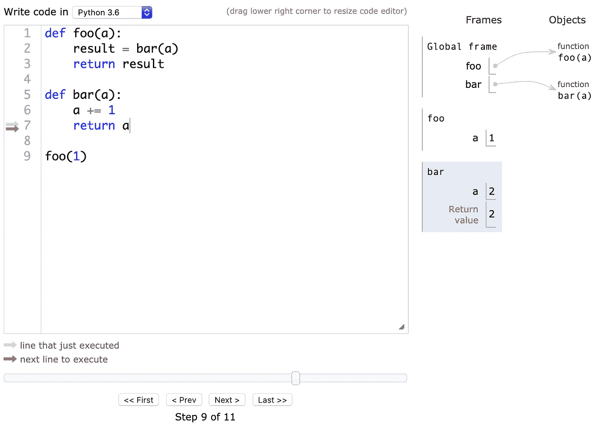

# Python 生成器是如何工作的？

> 原文：<https://towardsdatascience.com/cpython-internals-how-do-generators-work-ba1c4405b4bc?source=collection_archive---------12----------------------->

## CPython 解释器的内部


照片由[克里斯里德](https://unsplash.com/@cdr6934?utm_source=medium&utm_medium=referral)在 [Unsplash](https://unsplash.com?utm_source=medium&utm_medium=referral) 上拍摄

在本文中，我将试图提供对 Python 生成器的深入理解，以及它们如何从内部操作。它将包括**如何**和**为什么**。部分将是独立的，你可以随意跳过。事不宜迟，让我们开始我们的旅程。⛵️

# 什么是发电机？

从 [Python 2.2](https://www.python.org/dev/peps/pep-0255/) 开始添加，生成器是可以暂停、恢复和迭代的独特函数。让我们看一个例子:

通过定义包含`yield`关键字的函数，该函数被标记为生成器。然后，我们按以下顺序运行生成器:

1.  初始化发生器并将其放入`g`。此时，我们有了一个尚未运行的新生成器对象。
2.  通过呼叫`next()`推进发电机。这导致生成器前进到第一个`yield`关键字，在途中打印“Hello”。
3.  再次推进发电机。它打印“Goodbye ”,由于它到达了函数的末尾，它引发了一个`StopIteration`异常并结束。

为了理解这三个简单的步骤，我们首先需要从 Python 中一个函数如何运行的基础开始。

# 函数如何工作

运行一个函数包括两个主要步骤:**初始化**和**求值。**


Jukan Tateisi 在 [Unsplash](https://unsplash.com?utm_source=medium&utm_medium=referral) 上拍摄的照片

## 初始化功能

在幕后，CPython 在一个**框架**对象中运行一个函数。

一个帧对象，有时称为**堆栈帧**，由以下字段组成:

*   ***代码对象*** ，包含函数实际编译的代码。
*   ***释放堆栈空间*** ，称为 ***value-stack*** ，用于运行解释器。
*   ***执行指针*** 为当前正在执行的代码行。
*   其他领域，如局部变量的映射。

所有帧场的列表可以在[代码](https://github.com/python/cpython/blob/1b55b65638254aa78b005fbf0b71fb02499f1852/Include/cpython/frameobject.h#L17)中看到，而更短的列表可以在[文档](https://docs.python.org/3/library/inspect.html#types-and-members)中看到。

当我们初始化一个函数时，一个帧被[创建](https://github.com/python/cpython/blob/6d86a2331e6b64a2ae80c1a21f81baa5a71ac594/Python/ceval.c#L4063)。在伪代码中:

```
f = Frame()
```

我们传递给函数的参数然后在框架内被赋值为:

```
f.f_locals["arg1"] = arg1
f.f_locals["arg2"] = arg2
```

帧的执行点[被设置为函数中的第一行代码](https://github.com/python/cpython/blob/master/Objects/frameobject.c#L880):

```
f.lasti = 0  # Last Instruction
f.lineno = 0 # Function line number on file
```

此时，我们的函数开始运行。

## 运行功能

几乎整个 Python 解释器可以概括为一个 C 级函数:[**pye val _ eval frameex**](https://github.com/python/cpython/blob/25104949a5a60ff86c10691e184ce2ecb500159b/Python/ceval.c#L880)。

这个函数就是解释器循环。由 3k 行代码组成，它的工作是*评估一个帧*，或者换句话说，运行它。Python 中的每个函数，解释器运行的每个字节码或操作码，都要经过那个函数。

在“PyEval”期间，Python 对帧的唯一值栈进行操作。这条信息以后会很重要。

总之，当你输入一个函数，并运行它，解释器创建一个帧，并进入解释器循环。

一个叫做 PythonTutor 的网站有一个非常好的关于这种机制的交互例子。



PythonTutor 的例子截图

# 发电机如何工作

与函数非常相似，运行一个生成器包括**初始化**步骤和**评估**步骤。

## 初始化发电机

在这一步，我们正在创建生成器对象。生成器对象由**帧对象**和**代码对象**组成。如果你想知道，是的，框架对象中也包含代码对象。在伪代码中:

```
g = Generator()
f = Frame() # Initialized as before
g.gi_frame = f
g.gi_code = f.f_code = Code()  # The compiled function
```

此时，我们的发电机`g`已经准备好运行。

## 推进(运行)发电机

每次我们调用`next(g)`时，都会使用同一个[**pye val _ eval frameex**](https://github.com/python/cpython/blob/25104949a5a60ff86c10691e184ce2ecb500159b/Python/ceval.c#L880)对[帧进行求值](https://github.com/python/cpython/blob/master/Objects/genobject.c#L223)。

不同的是，在运行生成器时，我们可以到达`yield`关键字，此时帧评估停止，生成器“暂停”。

保存帧中的指针，标记我们当前的堆栈位置，以便准确地知道停止时发生器的状态。

重要的是要记住，与函数不同，当求值停止时**框架不会被破坏**，因为它仍然连接到生成器对象。这将允许我们稍后加载它。

PyEval 返回，我们的调用函数恢复。

## 再次推进发电机

当我们再次推进发生器时，帧从`gi_frame`加载，PyEval 在**相同的帧**上再次被调用。它检查我们停止的地方，转到我们的执行指针，并使用存储在帧中的值堆栈。

因为我们使用的是同一个堆栈，而且这个框架也包含了所有的局部变量，我们可以从完全相同的地方继续，就好像函数从来没有停止过一样。

当我们到达生成器或返回语句的末尾时，`StopIteration` [被抛出](https://github.com/python/cpython/blob/master/Objects/genobject.c#L236)，该帧被删除。`gi_frame` [然后将](https://github.com/python/cpython/blob/master/Objects/genobject.c#L274)设置为`None`。

# 发电机特征


米克·豪普特在 [Unsplash](https://unsplash.com?utm_source=medium&utm_medium=referral) 上拍摄的照片

现在我们已经知道了生成器内部是如何暂停和恢复的，让我们深入了解一些使生成器真正不同凡响的特性。

## 产生价值

生成器可以产生值，允许它们被迭代并以一种懒惰的方式返回结果。例如:

在内部，产生值非常类似于获得函数的结果。当 **PyEval** [到达](https://github.com/python/cpython/blob/25104949a5a60ff86c10691e184ce2ecb500159b/Python/ceval.c#L2191)操作码`YIELD_VALUE`时，弹出栈顶值并返回。很简单，不是吗？

## 从发电机返回

生成器可以使用`return`关键字返回一个结果:

如您所见，return 语句设置了`StopIteration`异常。异常可以有参数，这里，发送给`StopIteration`异常的第一个参数是返回值。

可以通过捕获异常并获取其第一个参数来检索返回值:

## 与发电机通信

我们还可以使用`[.send()](https://docs.python.org/3/reference/expressions.html#generator.send)`和`[.throw()](https://docs.python.org/3/reference/expressions.html#generator.throw)`与发电机通信:

如您所见，我们使用`.send()`向生成器发送数字，它们是`yield`关键字的返回值。

在内部，`.send()`的工作方式是将值放在生成器堆栈的顶部。然后它评估帧，弹出栈顶值，把它放入我们的局部变量。

类似地，`.throw()`通过向 **PyEval** 发送一个`[throwflag](https://github.com/python/cpython/blob/25104949a5a60ff86c10691e184ce2ecb500159b/Python/ceval.c#L1315)`来说明发生了异常。然后，它正常处理异常。如果生成器没有捕捉到它，异常就会像普通函数一样向外传播。

## 嵌套生成器

可以使用关键字`yield from`嵌套生成器(或"[委托](https://www.python.org/dev/peps/pep-0380)"):

正如你所看到的，使用`yield from`创建了一种在最里面的发生器之间通信的方式，一直到外面。

在内部，它通过使用生成器对象的`gi_yieldfrom`字段来工作。它指向内部发生器，当你使用`.send()`时它会一直进去。

当内部生成器返回时，它沿着链向上，并相应地设置`yield from`的返回值。

# 结论

在本文中，我对 CPython 生成器实现的内部工作方式提供了一些见解。虽然这篇文章不是初学者的材料，但它只是触及了这个主题的表面，要理解解释器是如何工作的还有很多。完整的实现当然是开源的，欢迎大家随意探索。享受😉