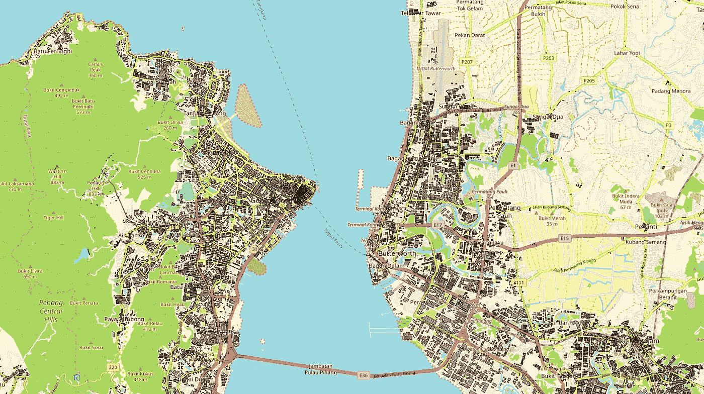

# 地理空间分析破解选址难题(上)

> 原文：<https://towardsdatascience.com/crack-site-selection-puzzle-by-geospatial-analysis-part-1-684ecabf8df7?source=collection_archive---------31----------------------->

## 基于开源工具和数据的端到端地理空间应用



图 1 槟城所有类型建筑的局部视图

选址是咨询行业的一个热门话题。在这篇博客中，我将介绍一个由开源 OpenStreetMap 数据集和 QGIS 支持的新颖解决方案。希望本案例研究能给从事选址相关项目的分析师和顾问带来一些新的思路。

# 问题陈述

假设我们有一个客户，他是一家连锁超市。他们计划在一个新城市开设零售店，比如马来西亚的槟城。为了实现利润最大化，他们需要决定要建多少分店以及应该建在哪里。如果我们试图从预测建模的角度开发解决方案，这将成为一个复杂的问题。利润似乎是一个合适的预测目标变量。然而，确定要使用的特性和编译特性集需要付出巨大的努力。

我提出的策略可以用一句话来概括:“**找出客户密度较高、竞争对手较少的地点**”。有了这个想法，这个问题可以通过以下三个步骤来解决。
1。模拟客户在整个城市的地理分布。
2。获取城市中潜在竞争对手的地理位置，包括任何其他连锁超市和杂货店。
3。根据不同地区的供需缺口，提出网点的位置。

本博客将重点介绍第一部分:客户分布模拟。

*   输入数据:槟榔屿市建筑物的 OpenStreetMap 形状文件，按地区分布的估计槟榔屿人口。
*   使用的工具:Python 3、QGIS(量子地理信息系统)3.4

# 数据源

让我们先来看看我们将要处理的数据。OpenStreetMap (OSM)是一个合作项目，旨在创建一个开源的可编辑世界地图。数据集包含各种类型的基础设施的形状文件，例如目标区域中的建筑物、道路、铁路。数据集每隔几小时更新一次。为了获得槟城的 OSM 数据集，我从 [OSM 网站](https://download.geofabrik.de/asia.html)下载了马来西亚、新加坡和文莱的 shape 文件包。有几个 Python 库可以用来用*处理形状文件。shp* 后缀:[菲奥娜](https://pypi.org/project/Fiona/)， [PyShp](https://pypi.org/project/pyshp/) ，[身材匀称](https://pypi.org/project/Shapely/)， [GeoPandas](https://geopandas.org/) 等。在这项工作中，PyShp 用于将 shapefile 读入 dataframe。

osm_preprocessor.py


图 2 形状文件读取为熊猫数据帧

我想强调的一个有趣的特性是**坐标**，它以顺时针方向给出了建筑物顶点的纬度和经度。它可以用来估计建筑物的具体位置以及它们的占地面积。

另一个正在使用的数据是由槟榔屿研究所提供的按地区分布的估计槟榔屿人口。

估计 _ 槟城 _ 人口 _ 按 _ 地区 _2018.csv

地理上，槟榔屿市被槟榔屿海峡分为槟榔屿岛和槟榔屿。槟榔屿的五个区可以在下面的地图中看到。

[](https://commons.wikimedia.org/wiki/File:Districts_of_Penang.jpg) [## Penang.jpg 的行政区划

### 来自维基共享，自由媒体仓库

commons.wikimedia.org](https://commons.wikimedia.org/wiki/File:Districts_of_Penang.jpg) 

# 模拟方法和假设

在我们深入实施之前，这里我们有一个方法的概述。可以在以下步骤中模拟客户分布。

1.  估计所有住宅建筑的中心地理编码和建筑面积(Python)。
2.  将槟城分割成 1km x 1km 的网格，分别标注属于哪个区(QGIS)。
3.  根据建筑物的中心地理编码将住宅建筑分配到网格中，并计算网格总面积(Python)。
4.  根据面积将地区人口分配到网格中(Python)。

该解决方案在以下假设下是有意义的。

*   超市的目标顾客是槟榔屿的全体居民。
*   所有的住宅建筑可以分为两种类型:公寓和平房。
*   对于每个地区，公寓的居住密度是一致的。更具体地说，居住密度是指每 **建筑面积**的**人口。**
*   平房的居住密度在整个城市是一致的:每 100 平方米 5 个人。

第三个假设表明所有公寓共用相同数量的楼层。引入它是为了简化问题，因为 OSM 数据集中缺少建筑物高度信息。

# 实施演练

## 占地面积计算

将形状文件读入 dataframe 后，我们需要选择槟城住宅建筑的条目。这可以通过根据建筑物类型和建筑物的中心地理编码过滤数据帧来实现。中心地理编码是通过取建筑物所有顶点的纬度和经度的平均值来计算的。槟城的边界以下列地理编码范围宣布。

*   纬度:5.1175–5.5929
*   经度:100.1691–100.5569

[槟城 _ 住宅 _ 建筑. py](https://gist.github.com/Shenghao1993/3f48d6e4e7eb454543ff1145db3a3336#file-penang_residential_buildings-py)


图 3 槟榔屿住宅建筑的数据框架

可以根据建筑物顶点的地理编码来估计建筑物的占地面积。Mapbox 提供了一个 [API](https://github.com/scisco/area) 来计算 geojson 多边形或多重多边形的面积，可以在这里应用。

[calc_floor_area.py](https://gist.github.com/Shenghao1993/b6c23dc26427dba3270199bdc3dd7e97#file-calc_floor_area-py)

导出的数据如下所示。

[Penang _ residential _ buildings . CSV](https://gist.github.com/Shenghao1993/2374e685a20f21632b96e439e0d27ac0#file-penang_residential_buildings-csv)

## 基于网格的城市离散化

该项目的最终目标是提出城市中超市网点的位置。因此，我们将创建网格，并针对各个网格分析需求和供应。插座的位置将以网格的形式提出。QGIS 是一个开源的桌面地理信息系统应用程序。它用于此目的，因为它提供了各种地图操作和可视化功能。将 OSM 形状文件导入 QGIS，并使用*创建网格*功能创建网格。

```
Vector -> Research Tools -> Create Grid
```


图 4 创建 QGIS 的格网功能

上图对话框中的*网格范围*用于定义网格覆盖的区域。我们可以选择“使用画布范围”选项来手动拖动选择一个覆盖槟城的矩形区域。生成的网格层如下图所示。


图 5 网格层的局部视图

为了分配建筑物和计算网格上的人口，我们可以将网格的边界信息从 QGIS 导出到文本文件和形状文件中。网格的 4 个边界在*左、上、右和下*列中产生，其遵循 **EPSG:3857** ，一种由诸如谷歌和 OSM 的网络服务推广的球面墨卡托投影坐标系。在下一步中，它将被转换为正常的纬度、经度。*区*列是手动添加的，用来标记网格的父区。

[Penang _ grid _ epsg 3857 _ WGS 84 . CSV](https://gist.github.com/Shenghao1993/438b350cc74df7274c6b54d02668a6ad#file-penang_grid_epsg3857_wgs84-csv)

## 建筑物到网格的分配

在这一步，我们将根据建筑物的中心地理编码和网格的边界，将住宅建筑分配到网格中。在分配发生之前，建筑物和网格的坐标系统是同步的。

[allocate _ buildings _ to _ grids . py](https://gist.github.com/Shenghao1993/cb488d5fd8eda647d8885fd3129775ad#file-allocate_buildings_to_grids-py)


图 6 分配了网格的建筑物的数据框架

## 将地区人口分布到网格中

这是模拟的最后一步。我们将计算每个网格的总建筑面积，并根据网格的总建筑面积将地区人口分配到网格中。

公寓和平房的建筑面积需要分别计算，因为它们适用于不同的人口密度。

[calc _ grid _ floor _ area . py](https://gist.github.com/Shenghao1993/fc043ad4fe38494773316818bfe5d311#file-calc_grid_floor_area-py)


图 7 网格总占地面积的数据框架

然后，我们可以汇总各区的建筑面积，并估计不同区的人口密度。假设平房的统一人口密度为 5 人/ 100 米。

[calc _ district _ pop _ density . py](https://gist.github.com/Shenghao1993/8aad1a1115a3fc7628ff9df5ff0e1a7d#file-calc_district_pop_density-py)


图 8 不同地区的人口数据框架

现在让我们根据网格占地面积计算网格人口，我们就完成了！

[calc _ grid _ population . py](https://gist.github.com/Shenghao1993/6446273db7711a945986408c9e10a7f7#file-calc_grid_population-py)


图 9 网格群体的数据框架

我们可以将网格人口导出到 shape 文件，并在 QGIS 上生成人口分布热图。

[generate _ grid _ population _ shape . py](https://gist.github.com/Shenghao1993/d167415b89aa3d80c555288b9e77bec6#file-generate_grid_population_shape-py)


图 10 槟榔屿市人口分布的局部视图

在图 10 中，网格数量随着色温的增加而增加(从无色、黄色、橙色到红色)。可以观察到，槟榔屿的人口主要集中在槟榔屿海峡沿岸，形成一个 X 形。

# 结束了

*   我们已经经历了一种模拟城市人口分布的新方法。该解决方案是使用开源工具和 OSM 数据集开发的。
*   由于假设居民密度一致，预计会有一些误差。此外，OSM 数据本身可能不是 100%正确和最新的。

谢谢你的阅读。代码库可以在 [GitHub](https://github.com/Shenghao1993/asiatique) 上获得。请在媒体上关注我，了解我未来的博客。我欢迎反馈和建设性的批评，可以通过 [LinkedIn](https://www.linkedin.com/in/shenghao-wang-41172163/) 联系到我。