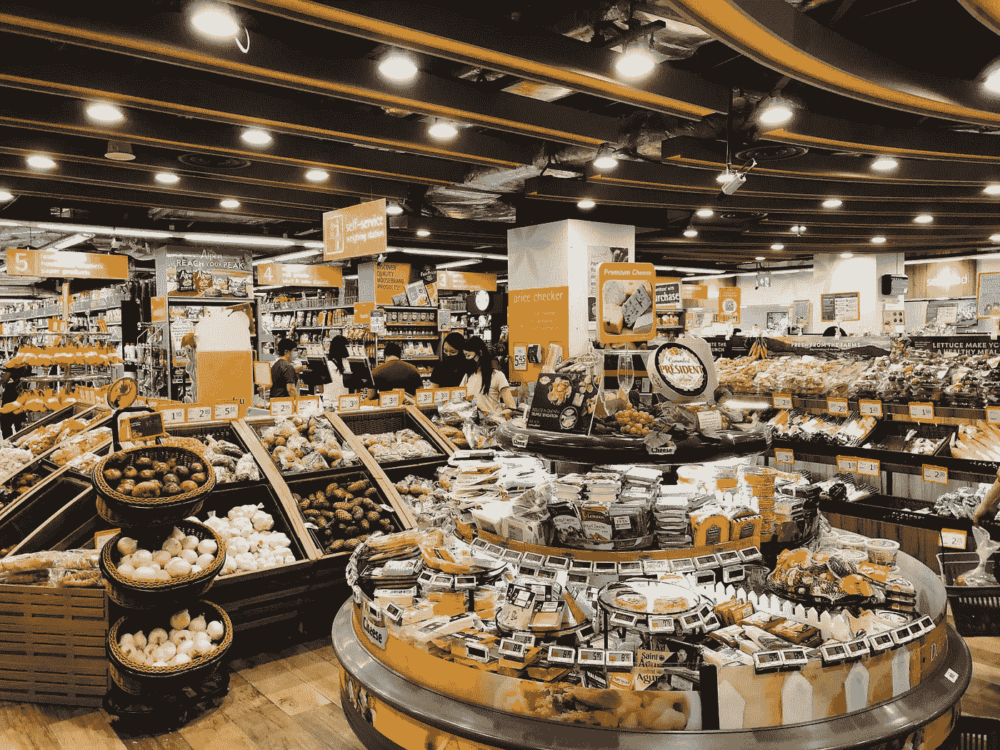
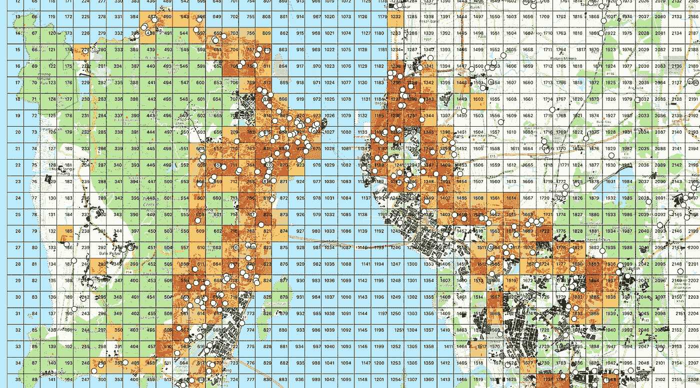
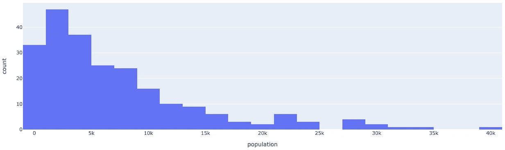
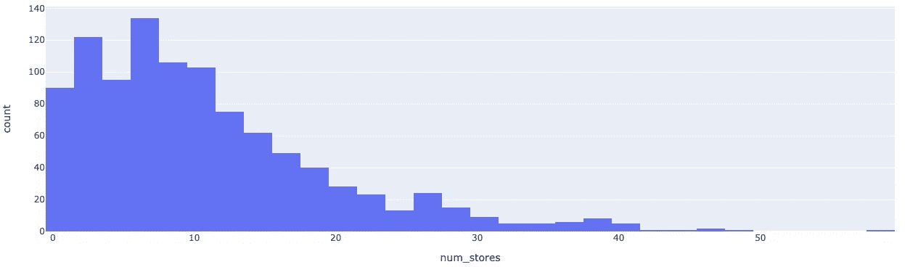
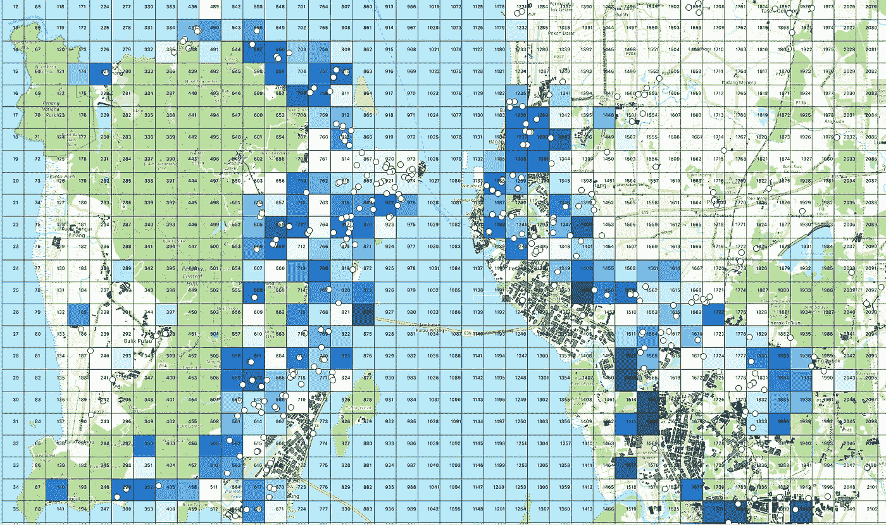

# 地理空间分析破解选址难题(下)

> 原文：<https://towardsdatascience.com/crack-site-selection-puzzle-by-geospatial-analysis-part-2-2eefc5f5140?source=collection_archive---------81----------------------->

## 发现需求和供给之间的不平衡



图 1 在新加坡 FairPrice Finest 中巴鲁广场拍摄的照片

在本系列的第一篇博客中，我们提出了一个想法，旨在从需求和供给的角度解决选址问题。我们完成了需求方面的分析，并模拟了目标城市槟榔屿的客户分布。尽管案例研究是在食品杂货行业的场景中进行的，但同样的解决方案也可以应用于房地产、电子商务和教育行业。在这篇博客中，我们将解决供应方面的问题，并研究整个城市的需求和供应之间的不平衡。请记住，我们的客户是一家连锁超市，其潜在客户是整个城市的人口。

供应分析由以下部分组成。

1.  **竞争对手发现**:寻找现有超市和杂货店的位置。
2.  **距离估算**:估算参赛者与城市不同区域之间的距离。
3.  **顾客密度估算**:估算一家超市或杂货店在城市不同位置服务的平均顾客数量。

# **竞争对手发现**

使用 [Google Places API](https://developers.google.com/places/web-service/intro) 可以获得关于现有杂货店供应商的信息。它提供了关于不同类型的名胜古迹的各种信息，包括它们的商店名称、地理位置、开放时间，甚至游客评级等。这里我们期望 API 提供的信息是最新的。然而，并不能保证 API 可以检测到所有符合搜索标准的地方，尤其是欠发达地区。为了这项研究的目的，这是我们可以依赖的最好的可访问数据源。

Places API 使用 API 键，通常使用 3 个参数进行查询:设施类型、中心位置和半径。在第一个系列中，我们将整个城市区域分割成数千个 1 公里 x 1 公里的网格。为了通过 API 收集所有现有的杂货店供应商，我们获取网格中心的地理坐标，并搜索 2 公里范围内的超市和杂货店。为了使博客更简洁，代码更少，我将省略输入数据和配置参数的准备步骤，只强调如何查询 Places API。以下代码提取新加坡乌节路 2 公里范围内的超市。

[查询 _ 地点 _api.py](https://gist.github.com/Shenghao1993/7e32e631b408f51bbec7ef4b2022604b)

查询结果以 Python 字典列表的形式返回。其中一个看起来如下。在这项研究中，我们只使用现有超市的地理位置信息。

```
{
   "business_status":"OPERATIONAL",
   "formatted_address":"491 River Valley Rd, #01-14, Singapore 248371",
   **"geometry":{**
      **"location":{**
         **"lat":1.2929051,**
         **"lng":103.8270208**
      **}**,
      "viewport":{
         "northeast":{
            "lat":1.294498079892722,
            "lng":103.8284264298927
         },
         "southwest":{
            "lat":1.291798420107278,
            "lng":103.8257267701073
         }
      }
   },
   "icon":"[https://maps.gstatic.com/mapfiles/place_api/icons/shopping-71.png](https://maps.gstatic.com/mapfiles/place_api/icons/shopping-71.png)",
   "id":"fda0ec60faa787f2bf992132e66c80f29daa5964",
   "name":"FairPrice Finest Valley Point",
   "opening_hours":{
      "open_now":False
   },
   "photos":[
      {
         "height":2048,
         "html_attributions":[
            "<a href=\"[https://maps.google.com/maps/contrib/111973208857299784904\](https://maps.google.com/maps/contrib/111973208857299784904\)">Anusha Lalwani</a>"
         ],
         "photo_reference":"CmRaAAAAQ6An4L-A5PbgDFkpZVllEGuB4Ayw0hdrZ9coCBaF6esLM2B7RVnJCvf0DPeZrlcbZ3KVFUz9cciPtArUAZ6tof_lJHzJHqKzcEFyRGJurK_Drld0GUec9sCWm25bXURVEhD6GZqf6j_Kb5IOTtQ1ogslGhQas22jzBT2rJ0jkj9zUhDvCLYj_w",
         "width":1536
      }
   ],
   "place_id":"ChIJTyWXW4EZ2jERNKBCOx_-4LA",
   "plus_code":{
      "compound_code":"7RVG+5R Singapore",
      "global_code":"6PH57RVG+5R"
   },
   "rating":4,
   "reference":"ChIJTyWXW4EZ2jERNKBCOx_-4LA",
   "types":[
      "grocery_or_supermarket",
      "food",
      "point_of_interest",
      "store",
      "establishment"
   ],
   "user_ratings_total":112
}
```

从所有网格中收集超市和杂货店，并在移除重复项后绘制在 QGIS 地图上，如图 2 所示。可以观察到，现有杂货店供应商的分布(白点)与客户分布大致一致。



图 2 槟城现有超市和杂货店的局部视图

# 距离估计

允许我问你一个问题。你愿意花多长时间在购物旅行上？

生活在不同城市的人可能会有不同的答案。我对这个问题的回答是 15 分钟的步行距离。在封锁期间，步行去杂货店可以作为一种常规的体育锻炼。在这项研究中，由于槟榔屿的人口密度相对较小，我们预计旅行时间的阈值会更长。根据马来西亚朋友的建议，我们假设阈值为 **10 分钟车程**。这是此分析中使用的最重要的参数，如果以后将解决方案部署为仪表板应用程序，可以很容易地对其进行调整。请注意，在咨询项目中，这些参数需要通过严格的市场调查获得。

这个旅行距离问题在这里很重要，因为，**给定旅行时间的阈值，我们可以** **估计每个杂货店可以接触到的顾客数量**，这就是所谓的 ***流域分析*** 。为了便于分析，我们通过[Google Distance Matrix API](https://developers.google.com/maps/documentation/distance-matrix/start)提取每对网格和现有杂货店之间的预计行驶时间。以下代码提取了从乌节路到新加坡滨海湾金沙的行驶时间。

[query_dist_api.py](https://gist.github.com/Shenghao1993/72772aee1633d917b412b9f032cddd3d#file-query_dist_api-py)

结果表明，从起点到目的地址的行驶时间为 13 分钟。

```
{
   "destination_addresses":[
      "10 Bayfront Ave, Singapore 018956"
   ],
   "origin_addresses":[
      "2 Orchard Turn, Singapore 238801"
   ],
   "rows":[
      {
         "elements":[
            {
               "distance":{
                  "text":"5.2 km",
                  "value":5194
               },
               "duration":{
                  "text":"13 mins",
                  "value":761
               },
               "status":"OK"
            }
         ]
      }
   ],
   "status":"OK"
}
```

# 客户密度估计

让我们总结一下我们在网格级别获得的关键信息。

*   人口，或每个网格的客户数量。
*   为每个网格中的顾客提供服务的杂货店和超市的数量。

现在我们快速看一下网格中顾客和杂货店数量的分布。没有填充的网格在下面的直方图中被忽略。



图 3 电网客户数量的分布



图 4 10 分钟车程内的网格状商店数量分布

顾客和杂货店的数量看起来都很合理。在这里，我们将为每个网格计算一个客户密度指数，以评估整个城市的供需不平衡。从概念上讲，它相当于*需求与供给之比* (DSR)。

> 顾客密度=顾客数量/网格中为顾客服务的杂货店和超市数量

我们将根据顾客密度值推荐新超市的位置。一般来说，高顾客密度意味着新商店的好位置。因此，我们的客户可以将其作为选址的参考。

图 5 显示了整个槟城的顾客密度分布。DSR 高的区域用深蓝色突出显示。



图 5 整个槟城的顾客密度分布

# 最后的话

选址案例研究系列到此结束。你可能已经注意到，在估计顾客密度时，超市的容量没有被考虑在内。换句话说，在这项研究中，所有现有商店的容量都是一样的，这在现实中是不准确的。此问题的一个可能解决方案是将现有商店与 OpenStreetMap (OSM)数据中相应的形状进行匹配。利用坐标可以计算出占地面积，并用来估计商店的容量。

此外，请在执行之前计划好您对 Google API 的查询。对查询数量和总成本进行估计。

本研究中使用的脚本和笔记本可在 [GitHub](https://github.com/Shenghao1993/asiatique) 上获得。谢谢你的阅读。