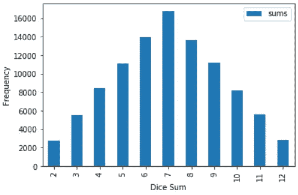
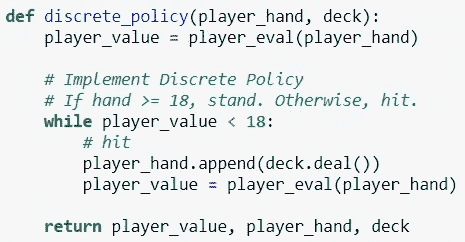
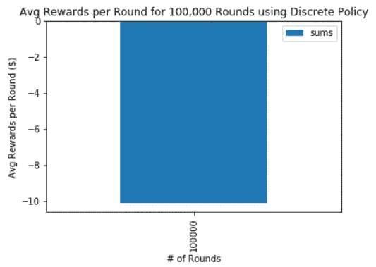
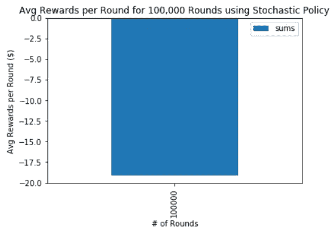

# 破解 21 点—第 1 部分

> 原文：<https://towardsdatascience.com/cracking-blackjack-part-1-31da28aeb4bb?source=collection_archive---------37----------------------->

## [破解二十一点](https://towardsdatascience.com/tagged/Cracking-Blackjack)

## 设置+简单的蒙特卡罗模拟

嗨！

我写这个“破解 21 点”博客系列是为了巩固我在强化学习领域获得的知识。当我创建这个 21 点项目时，我需要结合 30+文章和博客帖子的信息，我想让下一个人更容易。

我绝不是这方面的专家。如果您对我将要展示的信息有任何问题或疑虑，请随时联系我们！我的联系信息在底部。

图片来自 [Unsplash](https://unsplash.com/photos/P787-xixGio)

## 21 点快速总结

21 点是一种与庄家对抗的纸牌游戏。在一轮开始时，玩家和庄家都有 2 张牌。玩家只能看到庄家的一张牌。游戏的目标是让我们的牌的值尽可能接近 21，而不超过 21。下面列出了每张卡的价值。

*   10/杰克/皇后/国王→ 10
*   2 到 9 →与卡的值相同
*   Ace → 1 或 11(玩家选择)

如果玩家的牌少于 21 张，他们可以选择“击中”并从这副牌中随机抽取一张牌。他们也可以选择“站”，保留手中的牌。如果玩家超过 21，他们“破产”并自动输掉这一轮。如果玩家正好有 21 点，他们自动获胜。否则，如果玩家比庄家更接近 21，则玩家获胜。

*二十一点还有更细的规则，这里读它们****。***

## **为什么要看这个帖子？**

**这篇文章的目的是展示即使是简单的模拟在模拟我们周围的世界中令人眼花缭乱的力量。对于任何强化学习的努力，最好是通过像 21 点这样的简单游戏来学习，因为它们只有一些不确定性要跟踪，明确的奖励和惩罚规则，以及一个直截了当的目标。**

**像 21 点这样的赌场游戏在统计上被设计成有利于“房子”，我有兴趣看看我是否能通过强化学习算法“破解”它。对于 21 点，我的目标是得出一个玩家策略**，从长远来看，这个策略实际上会比赌场/庄家产生优势。****

## **一些关键术语**

**在这种情况下，策略是一个剧本，告诉玩家(或我们的人工智能代理)在每种可能的情况下应该做什么样的决定。人工智能代理是抽象的存在，它将通过我们的强化学习算法学习和更新它的知识。**

**在我们简化的 21 点模型中，我们只给玩家两个选项:打或者站。我们将以 1000 美元开始我们的玩家，并假设他们每轮下注 100 美元。以下是赢/输/平的奖励/惩罚:**

*   **赢:+100 美元**
*   **平局:0 美元**
*   **输了:$100**

## **建筑 21 点**

**我建议在读完这篇文章后，按照你自己的速度浏览下面的代码。现在浏览一下代码，以便获得一些关于如何构建最适合您需求的模拟环境的想法。点击查看完整的笔记本[。](https://github.com/adithyasolai/Monte-Carlo-Blackjack/blob/master/MC_Blackjack_Part_1/Monte%20Carlo%20Blackjack%20Part%201.ipynb)**

## **上面代码的一个 TL:DR:**

*   **使用 OOP 原则(类、函数等)和基本数据结构(列表、字典等)定义了一张卡和一副牌。**
*   **定义了两个函数，用于实现庄家转牌和评估庄家牌局背后的逻辑。这里定义的[和](https://bicyclecards.com/how-to-play/blackjack/)有一个固定的、可预测的逻辑。**
*   **定义了一个函数来实现评估玩家手牌背后的逻辑。有不同的方法来解决这个问题。**
*   **定义了一个主`play_game()`函数，在给定玩家策略、回合数等参数的情况下模拟 21 点游戏。**

**本文剩余部分的重点将是研究这个模拟环境的**玩家策略**输入，看看我们能获得什么样的见解。**

## **简单的蒙特卡罗模拟**

**任何蒙特卡罗方法的关键是:**

> **"利用随机性来解决原则上可能是确定性的问题."— [维基百科](https://en.wikipedia.org/wiki/Monte_Carlo_method)**

**更简单地说，我们将依靠机器的计算能力来近似某些结论，而不是通过铅笔和纸来精确地得出那些结果。**

## **蒙特卡洛方法的快速(非 21 点)示例**

**例如，让我们用蒙特卡罗方法来回答这个简单的问题:**

***“如果我掷出两个六面骰子，两个骰子的和最有可能是多少？”***

**正如每堂统计课所教授的那样，我们可以使用纸笔通过创建可能总和的概率分布来解决这个问题，并查看哪个出现的概率最大。**

**然而，如果我们懒得把这些都写出来，我们可以编写一个蒙特卡罗模拟程序来代替！**

**在下面的代码中，我将两个骰子掷 100，000 次，并绘制出我从 100，000 次模拟中得到的总和的分布。**

****

**来源:[作者图片](https://github.com/adithyasolai/Monte-Carlo-Blackjack/tree/master/Monte%20Carlo%20on%20Dice%20Game)**

**瞧啊。我们从分布图中清楚地看到，掷出 2 个骰子时，7 是最有可能的和。计算能力的魔力！**

## **回到 21 点**

**上面的骰子例子有点做作——蒙特卡罗方法最适用于需要人类花费大量时间尝试和手工解决的问题。**

**这里有一个更适合蒙特卡洛模拟的问题:**

***“在 21 点游戏中，如果我们的手牌≥ 18，我们就站着，否则就打，那么每回合的预期回报是多少？”***

**像这样的问题对人类来说太难解决了。**

**为了回答这个问题，我们将我们的**玩家政策**定义如下:**

****离散策略:****

*   **如果手≥ 18:站立。**
*   **否则:打。**

****

**来源:[图片作者](https://github.com/adithyasolai/Monte-Carlo-Blackjack/blob/master/MC_Blackjack_Part_1/Monte%20Carlo%20Blackjack%20Part%201%20-%20Discrete%20Policy.ipynb)**

## **运行模拟**

**接下来，我们将利用计算能力和 21 点环境的随机性来运行 100，000 轮并计算预期回报:**

****

**来源:[图片作者](https://github.com/adithyasolai/Monte-Carlo-Blackjack/blob/master/MC_Blackjack_Part_1/Monte%20Carlo%20Blackjack%20Part%201%20-%20Discrete%20Policy.ipynb)**

**结果显示，如果玩家决定使用离散策略，平均来说，他们每轮会损失 10 美元。我们需要找到一个能产生更好回报的政策！**

## **随机政策**

**离散策略被认为是“离散的”，因为只要满足一个条件(例如，手牌≥ 18)，我们的玩家只会采取一种可能的行动。**

**然而，当我们设计我们的强化学习人工智能代理时，我们希望它有机会探索其他行为，即使一些标准告诉它做其他事情。对于我们的人工智能代理来说，在学习过程的早期阶段保持探索是很重要的，因为它的拣选动作策略是由太小的样本量决定的。**

**因此，我们需要习惯于**随机**变量和政策，这些变量和政策在选择行动时允许随机性。这里有一个我们可以试试:**

****随机策略:****

*   **如果手≥ 18: 80%站立/ 20%命中。**
*   **否则:80%命中/ 20%站立。**

## **运行模拟**

****

**来源:[作者图片](https://github.com/adithyasolai/Monte-Carlo-Blackjack/blob/master/MC_Blackjack_Part_1/Monte%20Carlo%20Blackjack%20Part%201%20-%20Stochastic%20Policy.ipynb)**

**结果显示，如果玩家决定使用随机策略，平均来说，他们每轮会损失 18 美元(T1)，比离散策略多 8 美元(T3)。尽管我强调了随机策略在强化学习中的重要性，离散策略还是赢了！**

**利用我们人类的直觉，我们可以理解为什么会发生这种情况。从长远来看，在牌局中继续击球总是更好< 18 and keep standing when hand ≥ 18\. It is detrimental in the long run to add a 20% chance of doing a counter-intuitive action in either of these states.**

**However, our AI agent will not be born with this intuition. Stochastic policies are fluid, and can be tweaked on the fly. This approach allows our AI agent to suffer through countless rounds of hitting when hand ≥18, and incrementally tweak its policy until it stands 100% of the time when hand ≥ 18.**

## **What’s Next**

**The upcoming installments of this series will strive to answer these questions:**

*   ***“玩 21 点的最佳方法是什么？***
*   ***“如何通过蒙特卡洛强化学习算法自发地学习这种最优策略？”***

**在我的下一篇文章中，我们将更深入地探究基本的强化学习理论。此外，我们将在 OpenAI Gym 的标准化框架内重建我们的 21 点环境。这将使我们能够轻松地探索算法和调整关键因素。**

**如果你想向前看，我的整个 21 点项目可以在这里找到。**

**感谢您的阅读！**

**我真的很感激任何形式的反馈！我想成为一个更一致、更有效的内容创作者。**

**你学到什么了吗？我很难理解吗？**

**欢迎在下面留言或发电子邮件给我，地址是 adithyasolai7@gmail.com！**

**[本项目 GitHub 回购。](https://github.com/adithyasolai/Monte-Carlo-Blackjack)**

## **请继续阅读！**

**[*此处第二部分。*](/cracking-blackjack-part-2-75e32363e38?source=friends_link&sk=41bdbc0e16dddd80c172c7ddb039eb42)**