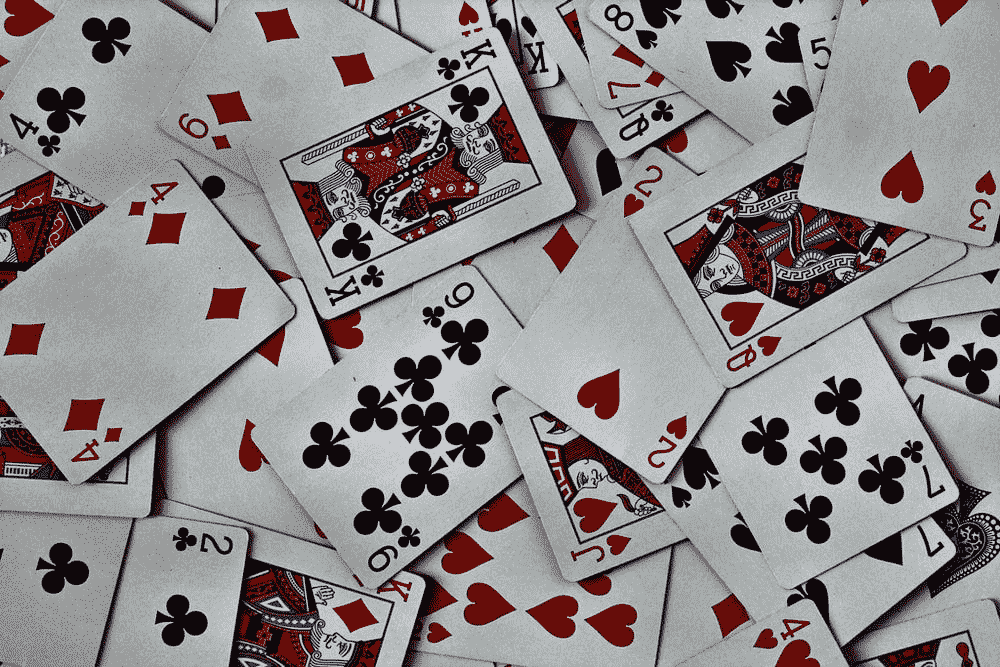
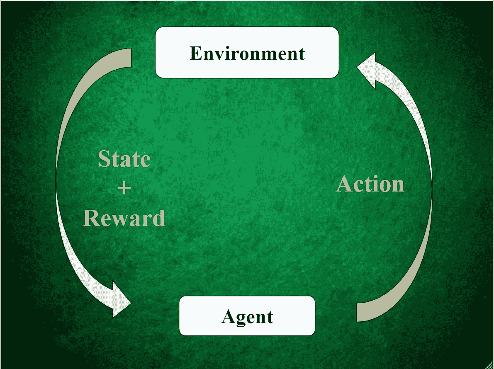
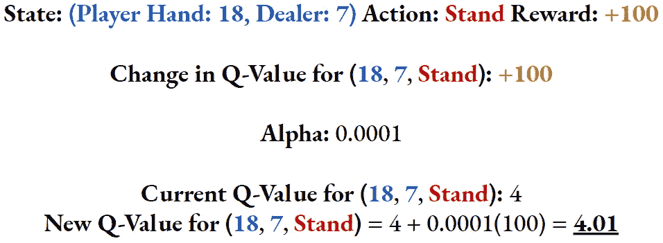
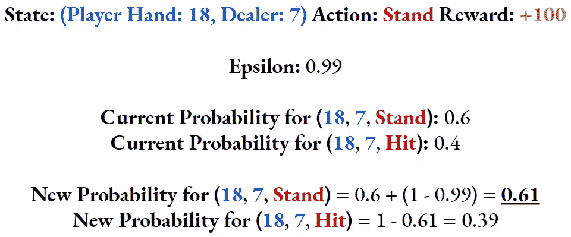
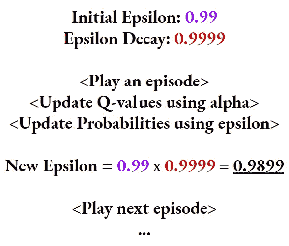
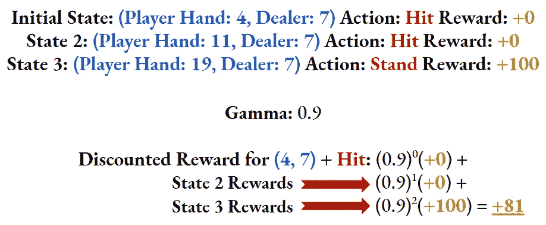

# 破解 21 点——第三部分

> 原文：<https://towardsdatascience.com/cracking-blackjack-part-3-8fd3a5870efd?source=collection_archive---------67----------------------->

## [破解二十一点](https://towardsdatascience.com/tagged/Cracking-Blackjack)

## 强化学习算法的构建模块

嗨！

如果您还没有这样做，请在继续之前阅读[第 1 部分](https://medium.com/@ppalanic/cracking-blackjack-part-1-31da28aeb4bb?source=friends_link&sk=ce1251c59477bf8a6977ef232fd1d234)和[第 2 部分](/cracking-blackjack-part-2-75e32363e38?source=friends_link&sk=41bdbc0e16dddd80c172c7ddb039eb42)。本文的其余部分将假设您已经阅读并理解了前面的文章。

图片来自 [Unsplash](https://unsplash.com/photos/P787-xixGio)

## 这篇文章的大纲

在本文中，我将解释强化学习算法中使用的关键构建模块，我们将使用它来最大化 21 点回报。这些构建模块也在许多其他强化学习算法中使用，因此在我们知道并喜爱的上下文中理解它们是值得的:二十一点！

当你阅读这篇文章的时候，一定要记住第二部分中的强化学习循环图！

作者制作的图像

# 我们 RL 算法的构建模块

简而言之，我们的强化学习算法唯一会做的事情就是在每一集之后，用**状态→动作→奖励**元组(在[第二部分](/cracking-blackjack-part-2-75e32363e38?source=friends_link&sk=41bdbc0e16dddd80c172c7ddb039eb42)中解释)来定义代理应该做什么。下面描述的构建模块有助于我们的代理在学习过程中进行更新，以获得玩 21 点的最佳策略。

## **我们的算法将使用和更新的关键数据结构**

*   Q 表:记录给定状态下选择动作的值(或 Q 值)的表。Q 表是通过从第 2 部分的[中获取 21 点环境中定义的`observation_space`和`action_space`的叉积构建的。所有状态/动作对的初始 Q 值都是 0。](/cracking-blackjack-part-2-75e32363e38?source=friends_link&sk=41bdbc0e16dddd80c172c7ddb039eb42)
*   Prob 表:以与 Q 表相同的方式创建的表:`observation_space`和`action_space`的叉积。此表包含代理在给定状态下选择动作的概率。这加强了在[第一部分](https://medium.com/@ppalanic/cracking-blackjack-part-1-31da28aeb4bb?source=friends_link&sk=ce1251c59477bf8a6977ef232fd1d234)中描述的政策的随机方法。每个状态的行动的初始概率将是 50%命中/ 50%站立。
*   Q 表和 Prob 表定义了一个活的、呼吸的、随机的策略，我们的代理将不断地使用它来做出决策，并在从环境中获得回报后进行更新。

## **影响代理学习过程的重要变量**

*   **Alpha (α):** 这可以认为是**学习率**。当我们的代理在某个状态下从环境中获得行为奖励后，它将更新 Q 表中相应状态-行为对的 Q 值。α是 Q 值变化的权重(或系数)。α必须是> 0 且≤ 1。**较低的** α意味着每一轮 21 点对政策的**影响较小**，并且有助于在大量事件中进行更准确的学习。

作者制作的图像

*   **Epsilon (ε):** 这可以被认为是 Prob 表中概率的类似“学习率”。当我们的代理人因某个状态+行动获得奖励时，它也会调整未来采取相同行动的概率。ε将与α相似的权重/系数应用于这些变化中的每一个。ε必须≥ 0 且≤ 1。更高的**ε产生更小的**采取行动的概率变化。****

作者制作的图像

*   **ε衰变(ε-衰变):**这是每次发作后ε衰变的速率。在代理学习过程的开始，我们希望ε从高开始，对 Prob 表进行小的修改，因为我们希望我们的代理**探索**新的行动。这有助于确保最终的政策不会因为学习过程早期的随机性而严重扭曲。例如，我们不希望在学习过程的早期对 player-hand-value = 18 进行几次成功的“hit”操作，以使我们的代理人决定从长远来看 hit 在这个位置是正确的。随着学习过程的继续，我们使用ε-decay 减少ε，因为我们希望代理**利用**它在先前的探索阶段获得的准确见解。

作者制作的图像

*   **ε最小值(ε-min):** 探索 vs 利用动态非常微妙；如果不小心，从探索到利用的转变可能会非常突然。ε-min 变量设定了一个事件对概率表中某个状态的动作概率的影响限度。
*   **Gamma (γ):** 在给定的一集(或一轮)21 点中，AI 智能体在某些情况下会做出不止一个决定。比方说，当玩家手牌值= 4 时，我们的 AI 智能体命中，并在此之后再做出 2 个决策。在这一集的最后，代理人得到了一份奖励。最初的“击中”动作对最终的奖励有多大的责任？γ有助于解释这一点。我们使用γ作为一集最终奖励的**贴现率**，来近似初始“击中”动作的奖励。γ必须为> 0 且≤ 1。

作者制作的图像

上面的变量应该被认为是杠杆:它们可以被增加或减少来试验代理的学习过程。稍后，我们将讨论这些杠杆的哪种组合在 21 点中产生最佳策略和最高回报。

## 下一步是什么

在下一篇文章中，我将从高层次上解释首次访问蒙特卡罗算法，然后深入代码。我将展示我是如何实现本文中描述的算法和所有构件的。

类似于第 2 部分中的 OpenAI Gym Blackjack 环境，该算法的实现通过几个关键的 Python 函数协同工作来实现。

感谢您的阅读！

我真的很感激任何形式的反馈！我想成为一个更一致、更有效的内容创作者。

你学到什么了吗？我很难理解吗？

欢迎在下面留言或发电子邮件给我，地址是 adithyasolai7@gmail.com！

[本项目的 GitHub 回购。](https://github.com/adithyasolai/Monte-Carlo-Blackjack)

在此阅读[第 4 部分](/cracking-blackjack-part-4-8b4a9caa38eb?source=friends_link&sk=1e6c7e29a69e70f123a863f100f15c86)。