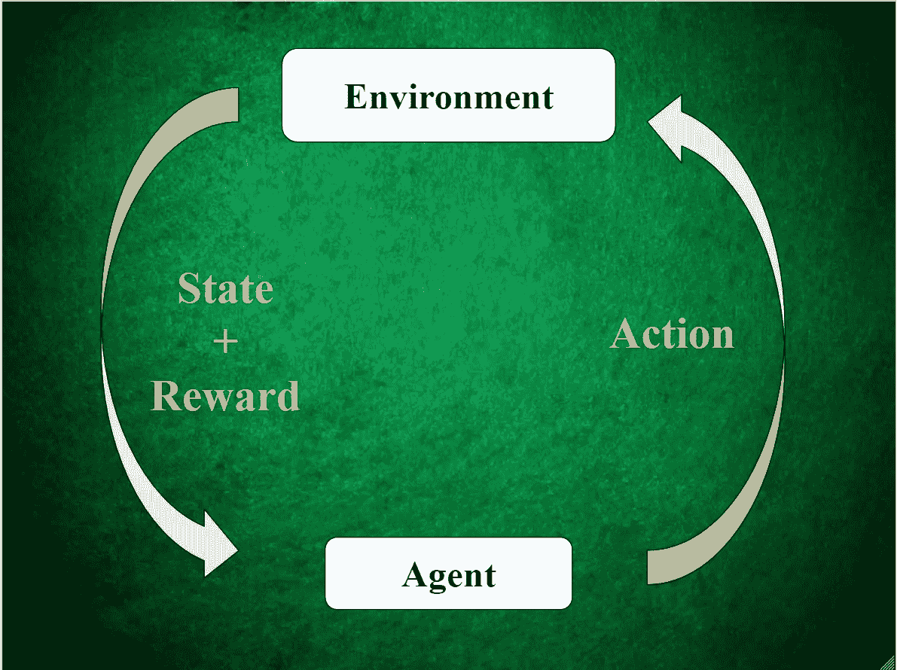
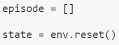
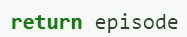
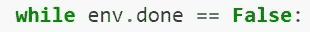
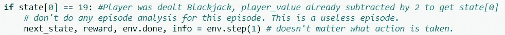
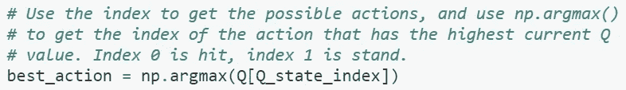
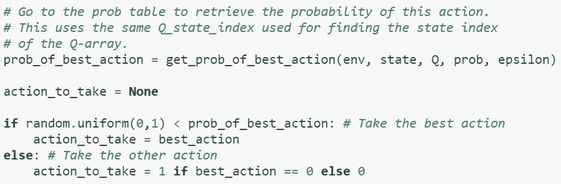
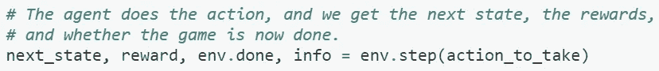
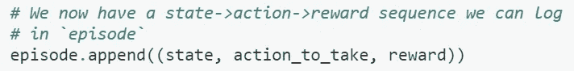

# 破解 21 点——第四部分

> 原文：<https://towardsdatascience.com/cracking-blackjack-part-4-8b4a9caa38eb?source=collection_archive---------45----------------------->

## [破解二十一点](https://towardsdatascience.com/tagged/Cracking-Blackjack)

## 初访蒙特卡罗算法+编码吧！

嗨！

如果您还没有这样做，请在继续之前阅读[第 1 部分](https://medium.com/@ppalanic/cracking-blackjack-part-1-31da28aeb4bb?source=friends_link&sk=ce1251c59477bf8a6977ef232fd1d234)、[第 2 部分](/cracking-blackjack-part-2-75e32363e38?source=friends_link&sk=41bdbc0e16dddd80c172c7ddb039eb42)和[第 3 部分](/cracking-blackjack-part-3-8fd3a5870efd?source=friends_link&sk=98055a00e2e685239d7148524a2d0b17)。本文的其余部分将假设您已经阅读并理解了前面的文章。

图片来自 [Unsplash](https://unsplash.com/photos/P787-xixGio)

## 这篇文章的大纲

在这篇文章中，我将解释首次访问蒙特卡罗(MC)算法是如何工作的，以及我们如何将其应用于 21 点，以教会人工智能代理最大化回报。下面是这篇文章的结构:

1.  从高层次解释算法。
2.  在第二部分的[中的 OpenAI Gym Blackjack 环境中实现算法。](/cracking-blackjack-part-2-75e32363e38?source=friends_link&sk=41bdbc0e16dddd80c172c7ddb039eb42)

在阅读时，请记住，首次访问 MC 算法的主要影响是定义代理在某个给定状态下采取某个行动获得奖励后应该如何更新其策略。请参考下面的图表来帮助形象化这一点。

作者制作的图像

# 首次访问 MC 算法的 10，000 英尺概述

1.  从[第 2 部分](/cracking-blackjack-part-2-75e32363e38?source=friends_link&sk=41bdbc0e16dddd80c172c7ddb039eb42)初始化 21 点环境。
2.  定义第三部分中解释的 Q 表、概率表、α、ε、ε衰减、ε最小和γ。
3.  定义您希望您的代理学习多少集。更多的情节通常会产生更有利可图的政策。
4.  播放一集。记录剧集中所有的(**状态→动作→奖励)**元组。
5.  剧集结束后，对ε应用ε-decay/ε-min。
6.  然后，使用来自步骤 4 的(**状态→动作→奖励)**元组和相关公式更新 Q 表和概率表。
7.  对于步骤 3 中定义的剧集数量，重复步骤 4-6。
8.  在所有事件之后，产生的 Q 表和概率表代表了 AI 代理刚刚学习的 21 点的优化策略。

# 更详细的步骤 4-6

在上面的概述中，我故意对第 4、5 和 6 步解释不足。这些都需要代码和公式来正确解释，这就是我在这里要做的！我建议打开完整的笔记本，快速查阅我提到的、我没有深入研究的任何更小的功能。在这里找到它[。](https://github.com/adithyasolai/Monte-Carlo-Blackjack/blob/master/MC_Blackjack_Part_3_and_4/Monte%20Carlo%20Blackjack%20Part%203_and_4.ipynb)

## 第 4 步:播放一集

我们将利用[第 2 部分](/cracking-blackjack-part-2-75e32363e38?source=friends_link&sk=41bdbc0e16dddd80c172c7ddb039eb42)中定义的 21 点环境的功能来模拟一集。我们还将利用 Q 表和概率表。

浏览下面`play_game()`函数的代码片段。之后我会分解关键步骤。

*   使用[第二部分](/cracking-blackjack-part-2-75e32363e38?source=friends_link&sk=41bdbc0e16dddd80c172c7ddb039eb42)中描述的`env.reset()`功能开始一集二十一点。`reset()`函数返回一个`state`:代理必须做出决定的初始状态。这将在我们播放剧集时更新。当我们播放这一集时，一个列表`episodes`将存储所有的(**状态→动作→奖励)**元组。

作者制作的图像

*   播放一集的全部意义就是记录并返回我们的代理人通过做决定和拿回奖励而产生的(**状态→动作→奖励)**元组。我们的算法将使用这些元组来改变定义我们的代理策略的 Q 表和概率表。

作者制作的图像

*   当`env.done`变成`True`时，我们这一集就结束了。这在第 2 部分的[中有解释。](/cracking-blackjack-part-2-75e32363e38?source=friends_link&sk=41bdbc0e16dddd80c172c7ddb039eb42)

作者制作的图像

*   如果给代理发了 21 点(21！)幸运的是，在这一集开始时，这一集被废弃了。我们的人工智能代理无法从这一事件中学到任何东西，因为它不需要做出任何决定。我们将返回一个空的`episode`列表。(我们检查`state[0] == 19`，而不是 21，因为我们将所有玩家手牌值减去 2，以满足我们的 21 点环境中的`observation_space`。)(参见[第二部分](/cracking-blackjack-part-2-75e32363e38?source=friends_link&sk=41bdbc0e16dddd80c172c7ddb039eb42)或[代码](https://github.com/adithyasolai/Monte-Carlo-Blackjack/blob/master/MC_Blackjack_Part_3_and_4/Monte%20Carlo%20Blackjack%20Part%203_and_4.ipynb)。)

作者制作的图像

*   否则，代理必须决定一个行动:打或站。它使用 Q 表来确定对于给定的`state`，哪个动作当前具有最高值(或 Q 值)。**这个** `**state**` **的击中和站立的这些 Q 值将在本集之后在我们算法的步骤 6 中更新。**

作者制作的图像

*   接下来，ε(出自[第三部](/cracking-blackjack-part-3-8fd3a5870efd?source=friends_link&sk=98055a00e2e685239d7148524a2d0b17))和**探索**和**开拓**之间的微妙平衡就要发挥作用了。我们使用这个概率表来找出选择`best_action`的概率。然后，我们使用这个分布随机决定一个动作。如果我们由于低ε而处于**利用**阶段，则`best_action`极有可能被选中。如果我们由于高ε而处于**探索**阶段，我们的代理有更大的机会选择`best_action`的反面。这是该算法如何利用随机策略和蒙特卡罗方法的一个完美例子:*它使用随机性来处理本质上确定性的问题*。**这个** `**state**` **的这些击中和站立的概率将在本集之后在我们算法的步骤 6 中更新。**

作者制作的图像

*   接下来，代理使用`env.step()`函数提交到`action_to_take`(参见[第 2 部分](/cracking-blackjack-part-2-75e32363e38?source=friends_link&sk=41bdbc0e16dddd80c172c7ddb039eb42)了解更多关于`env.step()`)。代理收到一个`next_state`并因其动作获得奖励。`env.done`也更新了。

作者制作的图像

*   我们仍然可以访问`state`——我们开始时的状态。我们仍然可以访问`action_to_take`——我们在`state`采取的行动。我们也是刚刚收到`state`里拿`action_to_take`的`reward`。所以我们有一个(**状态→动作→奖励)**元组要添加到`episode`！

作者制作的图像

*   最后，我们设置`state = next_state`重复这个过程，直到`env.done`变为`True`。

***我们将在这里停止这篇文章，因为我想让这些信息以更小的、一口大小的部分来消化！***

## 下一步是什么

在下一篇文章中，我们将直接深入讨论**步骤 5** 和**步骤 6** ，就像我们讨论**步骤 4** 一样。

在理解了**步骤 5** 和**步骤 6** 之后，你将了解这种强化学习算法的所有技术方面。然而，解决人工智能/人工智能问题既是一门科学又是一门艺术

在之后的文章中，我们将更深入地探讨这个 21 点问题的**艺术**部分。我们将通过对α、ε和γ进行实验，展示如何优化该算法。

感谢您的阅读！

我真的很感激任何形式的反馈！我想成为一个更一致、更有效的内容创作者。

你学到什么了吗？我很难理解吗？

欢迎在下面留言或发电子邮件给我，地址是 adithyasolai7@gmail.com！

[本项目的 GitHub 回购。](https://github.com/adithyasolai/Monte-Carlo-Blackjack)

在这里阅读[第五部分](https://medium.com/@ppalanic/cracking-blackjack-part-5-70bd2f726133?source=friends_link&sk=d27caa3eb27b111aacade0f9dd5d41e6)。