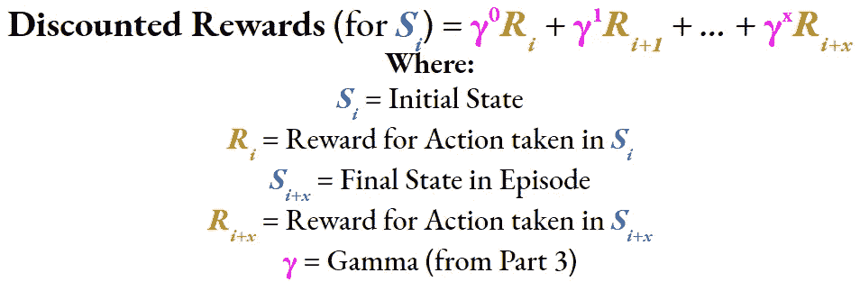
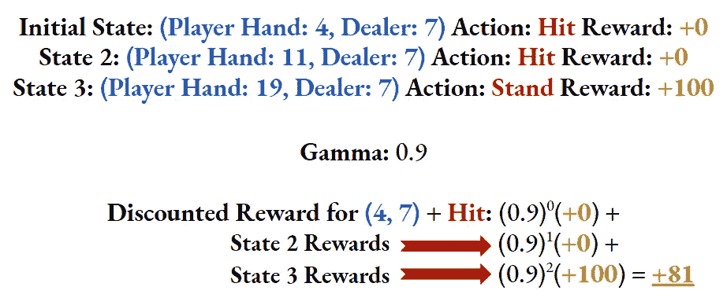
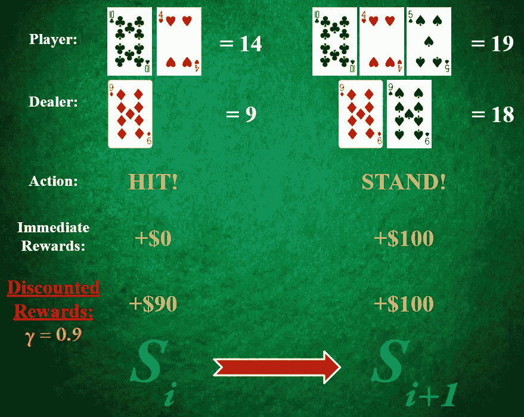
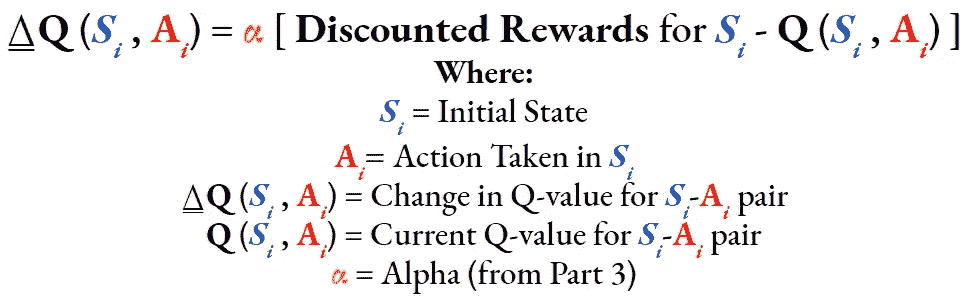

# 破解 21 点——第五部分

> 原文：<https://towardsdatascience.com/cracking-blackjack-part-5-70bd2f726133?source=collection_archive---------27----------------------->

## [破解二十一点](https://towardsdatascience.com/tagged/Cracking-Blackjack)

## 完成首次访问蒙特卡罗算法

嗨！

如果您还没有这样做，请在继续之前阅读[第 1–4 部分](https://towardsdatascience.com/tagged/Cracking-Blackjack)。本文的其余部分将假设您已经阅读并理解了前面的文章。


图片来自 [Unsplash](https://unsplash.com/photos/P787-xixGio)

# 这篇文章的大纲

*   了解`run_mc()`函数如何简化算法。
*   深入研究初诊 MC 算法的第 6 步，在这一步中，Q 表和概率表在每集之后更新。

# 第 4 部分首次访问 MC 的 10，000 英尺概述

1.  从第 2 部分的[中初始化 21 点环境。](/cracking-blackjack-part-2-75e32363e38?source=friends_link&sk=41bdbc0e16dddd80c172c7ddb039eb42)
2.  定义第三部分中解释的 Q 表、概率表、α、ε、ε衰减、ε最小和γ。
3.  定义您希望您的代理学习多少集。更多的情节通常会产生更有利可图的政策。
4.  播放一集。记录剧集中所有的(**状态→动作→奖励)**元组。
5.  剧集结束后，对ε应用ε-decay/ε-min。
6.  然后，使用来自步骤 4 的(**状态→动作→奖励)**元组和相关公式更新 Q 表和概率表。
7.  对于步骤 3 中定义的剧集数量，重复步骤 4-6。
8.  在所有事件之后，产生的 Q 表和概率表代表了 AI 代理刚刚学习的 21 点的优化策略。

# 如何促进第 4-6 步

在[第 4 部分](/cracking-blackjack-part-4-8b4a9caa38eb)中，我们学习了如何在`play_game()`函数中实现步骤 4。在深入到第 5 步&第 6 步之前，我想介绍一下`run_mc()`函数，它允许第 4 步到第 6 步协同工作。

浏览下面的代码。我将在下面详细解释。点击查看完整的代码。

## 实现关键数据结构和值

`run_mc()`是明确定义 Q 表和 Prob 表的地方。

Q 表存储每个可能状态的每个动作的相对值(或 Q 值)。同样，状态由玩家的手牌值和庄家的上牌组成。

为了在 Python 中表示这一点，`Q`是一个二维列表，其中外部列表的每个索引对应于一个唯一的状态，每个内部列表是一个 2 元素的 Q 值列表，用于命中和站立在与索引对应的状态。

`numpy.zeros()`函数允许我们指定想要用来表示 Q 表的 Numpy 数组的形状，从而简化了这个过程。我们还希望所有的 Q 值都从 0 开始，以便在代理开始试验和探索选项时不会产生偏差。`numpy.zeros()`通过用零填充我们指定的 Numpy 数组来实现这一点。

根据我们在[第 2 部分](/cracking-blackjack-part-2-75e32363e38?source=friends_link&sk=41bdbc0e16dddd80c172c7ddb039eb42)中的 21 点环境，`env.observation_space[0].n`是 18，代表可能的玩家手牌值(3–20)，而`env.observation_space[1].n`是 10，代表可能的庄家升牌值(2–11)。`env.action_space.n`是 2，因为唯一可能的行动是打和站。

因此，可能的状态数为`env.observation_space[0].n` * `env.observation_space[1].n`，为 180。这意味着`Q`的外部列表有 180 个值。`Q`中的这 180 个值中的每一个都是一个大小为`env.action_space.n`(或 2)的内部零列表。

```
Q = np.zeros([env.observation_space[0].n * env.observation_space[1].n, env.action_space.n], dtype=np.float16)
```

我们以完全相同的方式定义 Prob-table(或`prob` ) **，**，除了每个值从 0.5(或 50%)而不是 0 开始，以确保每个动作在学习过程开始时有均等的机会被选中。

```
prob = np.zeros([env.observation_space[0].n * env.observation_space[1].n, env.action_space.n], dtype=np.float16) + 0.5
```

`run_mc()`也是[第 3 部分](/cracking-blackjack-part-3-8fd3a5870efd?source=friends_link&sk=98055a00e2e685239d7148524a2d0b17)中讨论的重要杠杆(ε、α和γ)被明确定义的地方。赋予每个值背后的原因将在下一篇文章中解释。

```
alpha = 0.001

epsilon = 1

decay = 0.9999

epsilon_min = 0.9

gamma = 0.8
```

## 步骤 4–6 协同工作

这几行代码概括了所有的步骤 4-6。

```
**for** _ **in** range(num_episodes):
    episode = play_game(env, Q, prob)

    epsilon = max(epsilon * decay, epsilon_min)

    Q = update_Q(env, episode, Q, alpha, gamma)
    prob = update_prob(env, episode, Q, prob, epsilon)
```

首先，我们使用[第四部分](/cracking-blackjack-part-4-8b4a9caa38eb?source=friends_link&sk=1e6c7e29a69e70f123a863f100f15c86)中讨论的`play_game()`功能模拟一集。**这是第四步**。

然后，我们将`decay`因子应用于`epsilon`，或者如果`epsilon`已经低于`epsilon_min`，就使用`epsilon_min`。**这是第五步**。

最后，我们使用`update_Q()`和`update_prob()`更新我们的 Q 表和 Prob 表。`episode`和`epsilon`是这些功能的关键论据，而且每集都有变化。**这是第 6 步**。

# 深入第 6 步

在我继续之前，祝贺你读到这里！你将要学习这个蒙特卡罗过程的最后，也是最重要的部分。你已经走了很长的路了！花点时间思考一下吧！

## update_Q()

之所以称之为**“首次访问”** MC 算法，是因为我们有一种**首次访问**的方法来评估奖励。

“首次访问”意味着我们希望从一集第一次出现开始跟踪状态-动作对的奖励，然后使用该集的累积奖励来更新我们的`Q`-表中该状态-动作对的 Q 值。

另一个选项是**“每次访问”**方法。在这种方法中，每当 **在一集**中出现时，我们使用状态-动作对**的即时奖励来更新 Q 值。**

鉴于 21 点的形式以及我们如何设置我们的环境，对我们的问题使用**每次访问**的方法是没有意义的。

在我们的剧集中，除了最后的状态-动作对，状态-动作对的奖励都是 0。这是因为在 21 点回合(或插曲)的结果已知之前，21 点玩家(和我们的代理人)可能必须做出不止一个决定(意味着不止一个国家行动对)。

因此，如果我们强迫我们的代理在每个状态-动作对之后使用$0 的即时奖励来更新 Q 表中的 Q 值，我们的代理将不会有很大的改进。相反，我们将使用最终状态-动作对的奖励，并**贴现**它们，以近似同一集内先前状态-动作对的价值。

我们将使用以下公式为每集中的状态-动作对找到折扣奖励:



作者制作的图像

计算折扣奖励的示例如[第 3 部分](/cracking-blackjack-part-3-8fd3a5870efd?source=friends_link&sk=98055a00e2e685239d7148524a2d0b17)所示:



作者制作的图像

**一个直观的例子:**



作者制作的图像

**放在一起:**对于`episode`中的每个(**状态→动作→奖励)**元组，我们将使用状态-动作对的**折扣奖励**来更新`Q`表中相应的 Q 值。

以下是我们这一集遇到的每个状态-动作对的 Q 值变化公式:



作者制作的图像

`update_Q()`本质上为我们这一集看到的每个状态-动作对计算⍙ **Q** ，并将⍙ **Q** 加到当前 q 值上。实现如下。

下面是我们`episode`中每个状态-动作对的**贴现奖励**的计算。`step`在前面已经定义过了，本质上是我们公式中的 *i* 下标，它记录了我们正在分析的状态-动作对。

```
total_reward = 0
gamma_exp = 0
**for** curr_step **in** range(step, len(episode)):
    curr_reward = episode[curr_step][2]
    total_reward += (gamma ** gamma_exp) * curr_reward
    gamma_exp += 1
```

下面是⍙ **Q** 的计算，并使用它来更新我们的`Q`表中相应的 q 值。

```
*# Update the Q-value*
Q_state_index = get_Q_state_index(state)
curr_Q_value = Q[Q_state_index][action]
Q[Q_state_index][action] = curr_Q_value + alpha * (total_reward - curr_Q_value)
```

在学习过程的最后，我们可以简单地查看我们的`Q`-表，看看对于任何给定的状态，哪个动作具有更大的相对值。

## update_prob()

请多花点时间消化`update_Q()`。如果你完全理解了`update_Q()`，那么`update_prob()`就轻而易举了！

为了刷新你的记忆，`update_prob()`调整了在我们的剧集中遇到的每个状态采取行动的概率分布。`update_prob()`在`update_Q()`结束后被调用，因为 Q 值影响概率更新的方式，我们需要最新的 Q 值。

这次我将从代码开始，因为`update_prob()`的公式比**简单得多。**

在`update_prob()`中，我们使用`Q`表来找出哪个动作(击打或站立)对于我们正在更新的状态具有更大的 Q 值。这是`best_action`。

首先，我们调整给定状态下选择`best_action`的概率。⍙ **概率**的计算公式如下(其中`prob[Q_state_index][best_action]`是选择`best_action`的当前概率):

```
⍙**Prob =** prob[Q_state_index][best_action] + 1 - epsilon
```

⍙ **概率**有可能超过 1(或 100%)，所以我们更新`prob`表中的概率如下:

```
prob[Q_state_index][best_action] = min(1, ⍙**Prob**)
```

最后，我们将根据`best_action`的新概率更新`other_action`的概率:

```
prob[Q_state_index][other_action] = 1 - prob[Q_state_index][best_action]
```

更新这些概率很重要，因为这将影响我们学习过程中的**探索**与**利用**动态(详见[第 3 部分](/cracking-blackjack-part-3-8fd3a5870efd?source=friends_link&sk=98055a00e2e685239d7148524a2d0b17))。

学习过程开始时较小的⍙ **概率**值确保了在`best_action`成为代理的主导选择之前需要一段时间。接近结束时较大的⍙ **概率**值将最终导致`best_action`的概率为 100%，代理可以开始总是采取它认为是最优的决策。

## 下一步是什么

恭喜你。你现在知道“破解”21 点背后的所有**科学**！接下来，我们将深入到试验这种算法的**艺术**中，以找到可能的最佳 21 点回报！

感谢您的阅读！

我真的很感激任何形式的反馈！我想成为一个更一致、更有效的内容创作者。

你学到什么了吗？我很难理解吗？

欢迎在下面留言或发电子邮件给我，地址是 adithyasolai7@gmail.com！

[本项目的 GitHub 回购。](https://github.com/adithyasolai/Monte-Carlo-Blackjack)