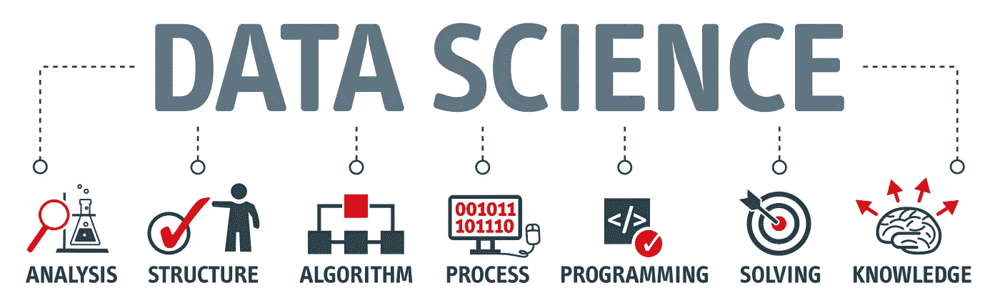

# 破解数据科学面试

> 原文：<https://towardsdatascience.com/cracking-the-data-science-interview-3ef62653eafc?source=collection_archive---------29----------------------->

## 重点是技术问题

图片鸣谢:[https://www . datanami . com/2018/09/17/improving-your-odds-with-data-science-hiring/](https://www.datanami.com/2018/09/17/improving-your-odds-with-data-science-hiring/)

# 技术问题

问题有几个类别，根据你面试的地点，问题的难度会有所不同。这篇文章的目的是介绍这些类别，并强调一些相关的问题。讨论的问题来自 https://datascienceprep.com/的[，涵盖了顶级科技公司的面试问题。](https://datascienceprep.com/)

## 可能性

问这些问题是为了证明你理解概率的基本原理。常见主题包括:联合概率和条件概率以及概率的各种规则和定理(乘法法则、包含-排除等。)很多时候，它们纯粹是技术性的“脑筋急转弯”问题，可能与特定产品有关，也可能无关，其难度从容易的一端(a)到困难的一端(b)不等。

示例:

a)假设您正在推出一项新功能 X。你有 1000 个用户，每个用户要么是 X 的粉丝，要么不是。1000 个用户中有 50 个不喜欢 x。你将在独立抽样 5 个用户的基础上决定是否发布该功能，如果他们都喜欢该功能，你将发布它。您发布该功能的可能性有多大？

B)有两组 n 个用户，A 和 B，A 中的每个用户都是 B 中的用户的朋友，反之亦然。A 中的每个用户将随机选择 B 中的一个用户作为他们的好友，B 中的每个用户将随机选择 A 中的一个用户作为他们的好友。如果两个人都选择了对方，那就是相互最好的朋友。不会有互相最好的友谊的概率是多少？

## 统计数字

这些问题旨在测试您的基本统计基础——虽然通常不直接适用，因为您通常不会从头开始编写 A/B 测试，但更多的是为了让您可以在必要时调整实验，并理解和解释结果。常见的主题包括各种分布，中心极限定理和大数定律，假设检验，等等。这些问题从更多的“脑筋急转弯”(a)到更多的与产品相关的开放式问题(b)，前者需要以简洁的方式应用统计概念。

示例:

a)您可以玩两种与骰子相关的游戏。在第一场游戏中，你同时掷出两个骰子，并获得与掷骰子的结果相等的金额。在第二个游戏中，你掷出一个骰子，得到相当于该值平方的金额。哪个期望值更高，为什么？

b)你如何决定一个实验进行多长时间？仅使用固定的 p 值阈值存在哪些问题，您如何解决这些问题？

## 产品

产品问题是专门为手头的公司设计的，为了衡量你对一个很可能与公司相关的特定主题的直觉。因此，重要的是要始终适应你面试的公司，以及他们生产的产品类型和跟踪的指标。通常，主题将包括从比较和对比平台(a)到理解特性变化如何影响特定指标(b)的任何内容。

示例:

a)想象一下脸书和推特的社交图。它们有什么不同？你会用什么标准来衡量社交图表的偏斜程度？

b)你的团队正在试图弄清楚一款具有额外 UI 功能的新司机应用程序是否会增加乘车次数。你如何测试应用程序中的额外功能是否使它比原始版本更好？

## 编码

由于数据科学需要精通编程，这里的编码在风格上类似于你可能找到的软件工程角色的面试水平。常见的主题包括数组、链表、字典，并经常利用基本算法，如 BFS 和 DFS。

示例:

a)给定一个数 n，返回连续正整数列表的个数总和为 n，能在线性时间内完成吗？

b)你有一个完整的用户社交图，节点代表用户，边代表用户之间的友谊。给定图的边和节点数，写一个函数返回两个用户之间的最小数量的友谊。

## 结构化查询语言

与编程类似，数据科学需要 SQL 技能来快速查询和分割数据。这些通常很简单，涉及基本原理，偶尔也涉及窗口函数。和产品问题一样，它们往往相当实用。

示例:

a)假设您在 app analytics 上有一个事件表。写一个查询，得到 2019 年每个 app 的点击率。

b)假设您有用户拥有的会话表和一个用户表。编写一个查询来获取每日群组的活动用户计数。

## 机器学习

虽然并非所有数据科学职位都直接或间接利用机器学习，但如果你正在寻找更高级的数据科学或机器学习工程职位，那么在应用和理论方面都有良好的熟练程度肯定会有所帮助。根据你面试的公司，这里的话题会有很大的不同，因此问题的范围可以从针对特定应用的更面向产品的问题(a)到更具体的理论问题(b)。

示例:

a)假设您需要为欺诈检测生成一个二元分类器。您会查看哪些指标，每个指标是如何定义的，每个指标的解释是什么？

b)假设我们正在运行一个概率线性回归，它很好地模拟了一些 y 和 x 之间的潜在关系。现在假设所有输入都添加了一些噪声，这与训练数据无关。新的目标函数是什么？你是怎么计算的？

# 感谢阅读！

如果你有兴趣进一步探索不同类别的面试准备问题，请查看:[https://datascienceprep.com/](https://datascienceprep.com/)