# 制作一个机器学习模型，使用 R

> 原文：<https://towardsdatascience.com/crafting-a-machine-learning-model-to-predict-student-retention-using-r-5eb009dcb1ec?source=collection_archive---------23----------------------->


图片由 [education_free](https://www.freepik.com/education-free) 在 [Freepik](https://www.freepik.com/premium-photo/back-school-concept-school-empty-classroom-lecture-room-with-desks-chairs-iron-wood-studying_5007778.htm#page=1&position=1) 上拍摄

## 建模一个 ML 实验来预测 R

## 学生保留率是高等教育中最重要的指标之一。因此，预测分析在这方面发挥着至关重要的作用。

首先，让我们从定义什么是学生*保持*开始，至少在本文的范围内。我们将把它定义为一个指标，它告诉我们，一个在某个特定的秋季学期第一次进入大学的学生，是否会在下一个秋季回来(或不回来)。例如，假设一名学生在 2018 年秋季第一次开始上某所大学。如果这名学生报名参加了 2019 年秋季课程，那么这名学生将被*保留*。

*保留*的另一个常见名称是，*持续*，和/或*退出*。在这里，这些名字的意思是一样的:一年本科*留级*。此时，读者可能会问，“**为什么学生保留率无论如何都很重要？“这是一个很好的问题，我们没有必要穷尽这个答案，我们可以说这很重要，原因有很多，首先是财务影响、学校可以获得的排名和声望，还有很多。顺便说一下，当我们在这里说“学校”时，我们特指大学和学院(高等教育)。**

## 寻找合适数据集的挑战

找到一个学生级别的数据集是非常困难的——如果你有一个，想发给我，请这样做，但它必须是匿名的。这意味着，没有学生的姓名或 ID，或任何其他信息，使研究人员能够识别学生——特别是，当我们有适当的法规，保护学生的数据，如 FERPA。这是一件大事，我们在处理敏感信息时必须非常小心。

也就是说，明确地为这个实验定位正确的数据集，确实是一个挑战。然而，积极的一面是，我们设法找到了一个可以使用的数据集，这就是我们将在这里操作的数据集。你可以在 **UCI 机器学习资源库**找到，点击[这里](https://archive.ics.uci.edu/ml/datasets/student+performance)就可以了。

为了使用这些数据，我们需要进行适当的引用，请参考本文的“参考资料”部分。另外值得一提的是，为这些研究者提供了这个数据集。谢谢你。

## 棍子和石头

虽然我们发现了这个数据集，但事实是，对于机器学习(ML)项目来说，它实际上是一个小数据集，除此之外，我们稍后会看到，变量在大的事物方案中并不真正相关。所以，最终，ML 模型可能会有一个很差的性能。我们会继续讨论这个问题。

另一个需要强调的重点是，最初，这个数据集是用来预测学生的表现[1]，而不是保留。有趣的是，数据集具有有趣的特征，但在预测性能[1]和保留时没有相关的意义。我在这里的意思是，尽管我们有几个变量，但基本上，只有很少一部分能告诉我们历史。

## 我们实验的布局

我们将在这里运用大量的创造力。注意，原始数据是关于高中学生的。但是对于这里，我们假设那些学生是大学生。此外，我们必须创建并整合一个名为“*”的新功能，该功能是随机创建的，用于模拟学生是否被保留。显然，这对模型有负面影响，因为这实际上是我们的*预测变量*——而且是随机的。*

*尽管如此，**进行这个实验的主要目标是提供一个可用的机器学习管道，特别是使用正确的数据集，以利用高等教育中的学生保留率**。我希望这个 ML 项目可以帮助这方面的管理者和研究者。下面是我们如何将我们的任务分成如下四个主要阶段:*

*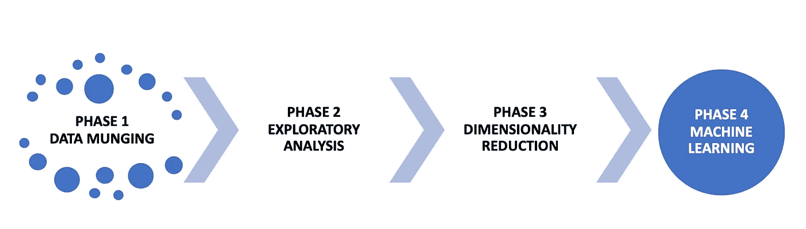*

*图 1 —主要阶段概述*

*   ***第一阶段:数据管理***

*在这一阶段，我们将寻找缺失的数据，并熟悉数据集。奇怪的是，我们在这里没有发现任何缺失的数据。虽然有人可能认为这很好，最终也确实如此，但这也让我们思考，在我们使用这个数据集之前，是否进行了一些插补。这里有一个提示:当您决定输入缺失值时，请记录下来，将缺失值留在原始列，将插补值留在新列。此外，如果您刚刚放弃，请说明使用了哪种技术来输入值。通过阅读与该数据集一起使用的原始文章，我们得出的结论是丢失的数据被遗漏了，我们得到的是实际的响应，这意味着我们没有丢失的值。*

*   ***第二阶段:探索性分析***

*在不知道哪些变量在特定数据集中真正相关的情况下，我永远无法理解那些执行“探索性分析”的人。不要到处乱画图表。有一些最初的假设是没问题的，但是你应该总是试图弄清楚什么特征对于你正在试图研究的东西是重要的。所以，我们的一些图表是基于我们发现的相关的和我们想看到的，但主要是基于对数据集的科学理解。*

*   ***第三阶段:降维***

*在我看来，最重要的一步。特别是，因为这个数据集非常小，而且有相当多的变量。在这里，我们将寻找**多重共线性**，以及如何消除变量。我们将使用逻辑回归来剔除不相关的变量。除此之外，我们还将执行 **PCA** (主成分分析)，目的是找出相关特征。*

*   ***第四阶段:机器学习***

*这就是我们执行 ML 建模并获得惊人结果的部分，对吧！？事实证明，这一阶段相当具有挑战性，我们稍后会谈到这一点。但我们在这里使用的一些技术是使用 **ROSE** [2]库来平衡预测值，评估 AUC(曲线下面积)和 ROC 曲线，并检查多个算法的*准确性*和 *kappa* 分数，以便检查每个算法对该数据的最佳效果。*

# *最坏的情况:假设得到一个低性能的机器学习模型*

*小数据集往往会给 ML 算法带来挑战。尤其是当特征并不真正重要，并且预测因子是人为创建的、随机的且不平衡时。真是一场灾难啊。！*

*考虑到这一点，甚至在实际开始使用该数据集之前，我们就提出了以下假设，但不限于此:*

*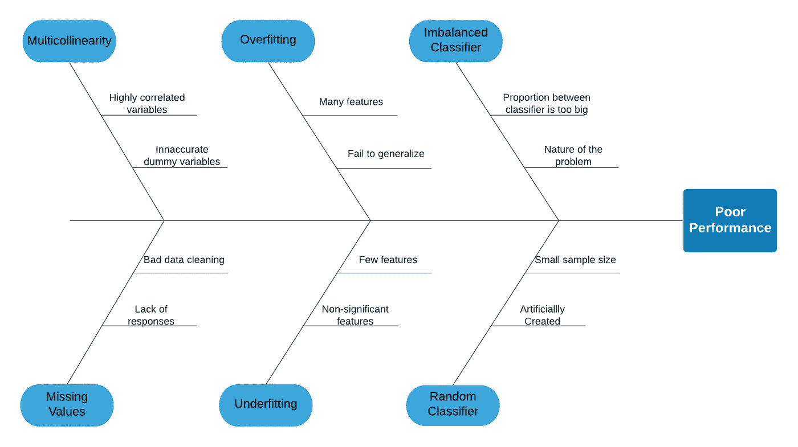*

*图 2 —低性能的假设*

*上面我们可以看到六个主要假设和它们的一些原因。由于时间关系，我们不会在这里一一介绍，但是在编码和开发模型时，我们会尽可能地减轻它们的影响。请注意，不平衡和随机分类器问题是为此项目创建的，它们不是原始数据集的一部分。*

*请记住，我们预测这些问题的原因与我们人为创建了一个名为 *retention* 的新功能有关，该功能根据赋予它们的权重，对二进制值(1 或 0)进行随机排序。*

*为了说明这一点，我们使用的数据集中的学生总数仅为 649 人，在创建这个人工预测值时，我们说大约 85%的学生将被标记为“保留”(二进制指标为 1)，大约 15%的学生将被标记为“未保留”(二进制指标为 0)。这几乎是公立学院/大学的平均保留率。*

# *弄脏我们的手:是时候编码了！*

**

*[Sarinya9940](https://www.freepik.com/sarinya9940) 在 [Freepik](https://www.freepik.com/premium-photo/developing-programmer-development-website-design-coding-technologies_3473825.htm#page=1&query=coding&position=42) 上拍摄的照片*

*我们使用名为 **R** 的统计和开源应用程序来执行这项任务。并且，为了使它在视觉上更吸引人(这是我们的希望)，我们不会在这里显示所有的代码，但是您可以在如下所示的链接中找到所有的代码。*

> *所有代码和文件都可以在我的 GitHub 页面的 这里找到 [**。**](https://github.com/Lucianoboas/Crafting-a-ML-Model-to-Predict-Student-Retention-Using-R)*

*同样，我们将把这一动手部分分解成我们之前看到的四个阶段。事不宜迟，让我们从头开始:*

## *阶段 1:数据管理*

*同样，你可以在 UCI ML 知识库中找到原始数据集和论文。但是，这里有一个所有变量的快照:*

*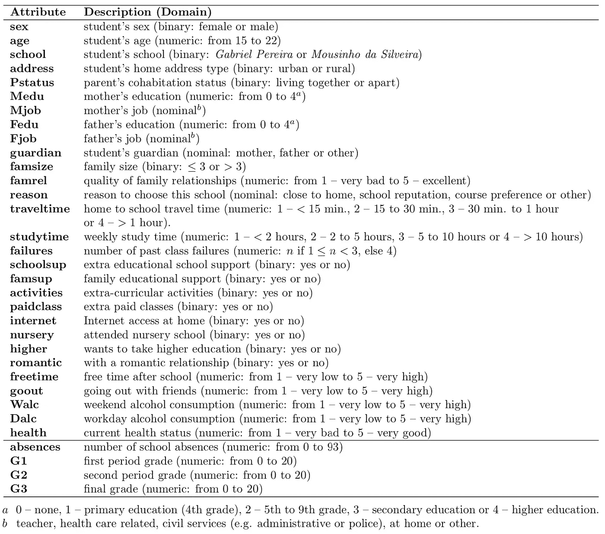*

*表 1-预处理的学生相关变量。该表摘自原始论文[1]。*

*请记住，我们之前谈到的*保持力*变量是人为插入到该数据集的，目的是模拟学生保持力的预测模型。你在这张表中看不到，但在 R 代码中可以看到。还有两个数据集可用，一个是数学数据集，一个是葡萄牙语数据集。我们将只使用葡萄牙语的，因为这是一个有更多学生(649)的。文章[1]将数学和葡萄牙语合并到一个集合中，但是样本量更小。*

*此*阶段 1* 的主要目标之一是创建人工变量，熟悉该数据集，并检查缺失值。*

*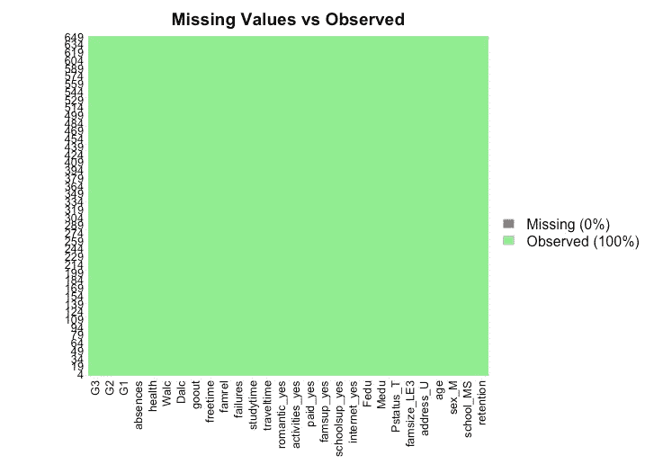*

*图 1 —缺失值*

*正如我们在*图 1* 中看到的，该数据集中没有缺失值。事实上，我们以前已经说过了，但这里有证据。请注意，我们在该图中添加了*保留值*变量。*

*此外，我必须为数据集中的一些变量创建伪变量，这些变量不是伪编码的。在该处理结束时，可以使用提供的 R 代码导出一个新的 *csv* 文件，其中包含虚拟代码、数值和预测值。*

*既然我们已经开了绿灯，数据集也准备好进行初始评估，我们就可以进入下一步了。*

## *阶段 2:探索性分析*

**

*照片由 [Freepik](https://www.freepik.com/premium-photo/compass-computer-circuit-board_6051195.htm#page=2&query=explore+computer&position=19) 上的 [sema_srinouljan](https://www.freepik.com/sema-srinouljan) 拍摄*

*这就是人们疯狂绘制直方图和箱线图的地方，不是吗？！他们是必要的，不要误解我。我们一会儿就会看到其中的一些。此外，您还可以在 R 代码上检查诸如*偏斜度*、*峰度*等基本的统计检查表。*

*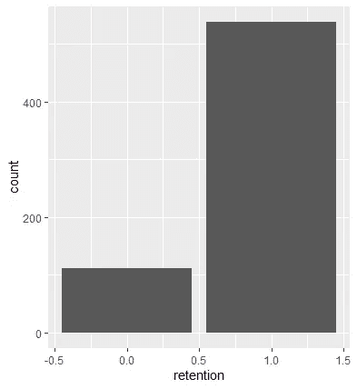*

*图 2 —保留计数(保留= 1.0，未保留= 0.0)*

*在这个简单的条形图中，我们可以看到预测变量的计数，根据我们在创建这个人工预测器时为它们设置的权重。*

*如前所述，保留的学生标记为“1”(538)，未保留的学生标记为“0”(111)。*

*最终，它也显示了分类器之间的不平衡，我们将在后面处理。*

*在最初的文章[1]中，变量“G1”是学生表现的一个非常强有力的预测因素。下面的散点图告诉我们一年级(G1)和期末(G3)之间预期的正相关关系。我们还可以发现一些潜在的异常值。*

*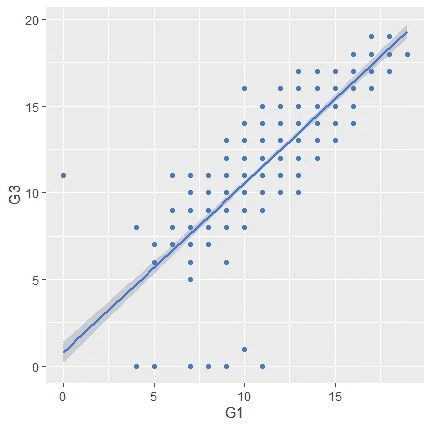*

*图 3 —散点图 G1/G3*

*继续这个分析，我们有兴趣看看什么会影响学生在 G1 的表现。为此，我们重点检查了*学习时间*，以及*学生可用的*空闲时间，并按*性别*进行了细分。*

*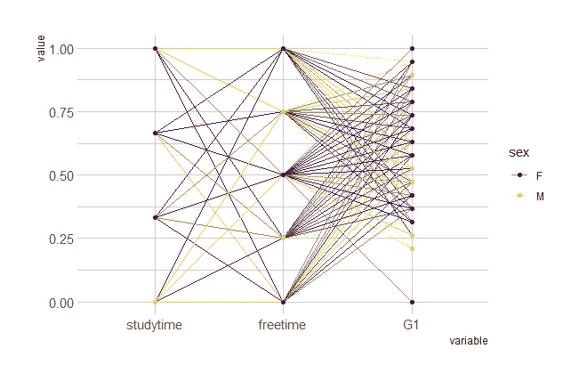*

*图 4-标准化平行坐标图*

*好吧，我投降！在这里，我想出了一个所有变量的方框图。我们可以很容易地在这里看到异常值的存在，并快速思考是否要处理这个问题的一些选项。对于这个测试，我们不会排除异常值。*

*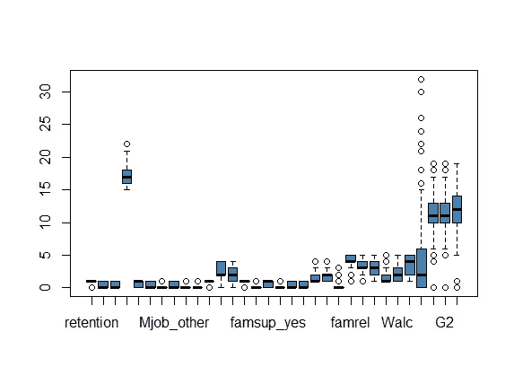*

*图 5 —所有变量的箱线图*

*再一次，我想给变量 G1 一些关注，所以让我们检查它的分布如下:*

*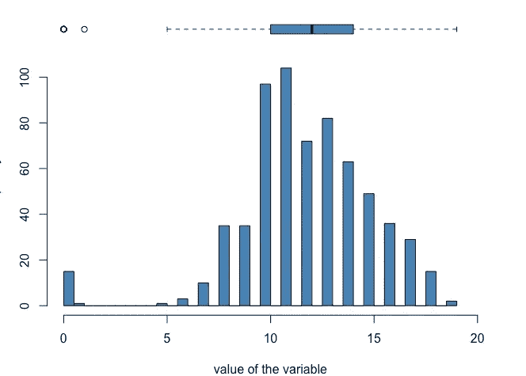*

*图 6 —可变 G1 的直方图/箱线图*

*考虑到这是真实世界的数据，它的分布真的不算太差。但是，它显然并不完美。*

*作为第三阶段的总结，我们只想再检查一件事。也就是说，当将学生添加到二元图中时，G1 和 G2 变量是如何相互作用的，如下所示:*

*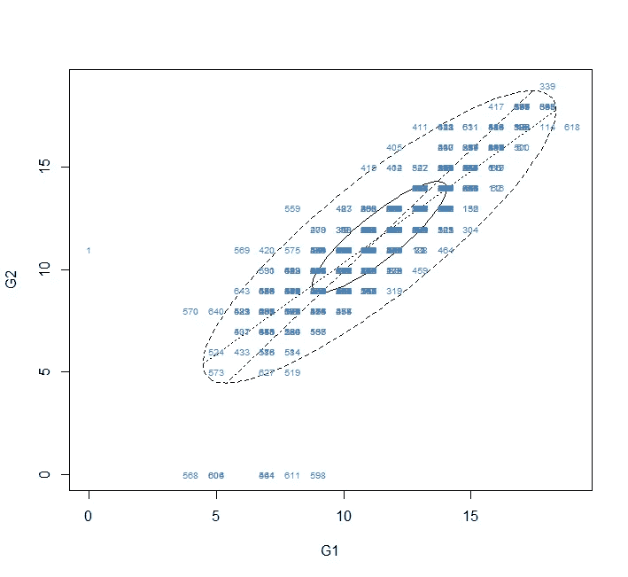*

*图 7——G1 和 G2 变量的二元图*

*把这个二元图想象成一个普通的箱线图，但是混合了两个变量而不是一个。具体来说，蓝色的数字可能是学生 ID(这里不是这样，因为我们在数据集中没有学生 ID)。任何在大椭圆之外的学生都是离群值。这可能有助于确定我们应该联系哪些学生，以便采取一些积极的行动，比如说，提高他们在 G3 上的成绩。*

## *阶段 3:降维*

*这就是乐趣的开始。一个好的做法是始终检查数据集中的共线性/多重共线性。最简单的方法是检查自变量和因变量之间的相关性。如果两个或更多变量具有非常强或几乎完美的相关性，这可能是共线性/多重共线性的迹象。*

*当面对两个或更多变量具有强相关性的场景时，我们希望消除其中一个变量。为什么？因为本质上，你有两个变量告诉你同一个故事。但是说得更专业一点，共线性可能会扰乱至少一个估计回归系数的方差，这可能会导致一些回归变量得出错误的符号。这会影响你的分析并把你引向错误的方向。*

*让我们用下面的相关矩阵来看看是否能发现一些问题:*

*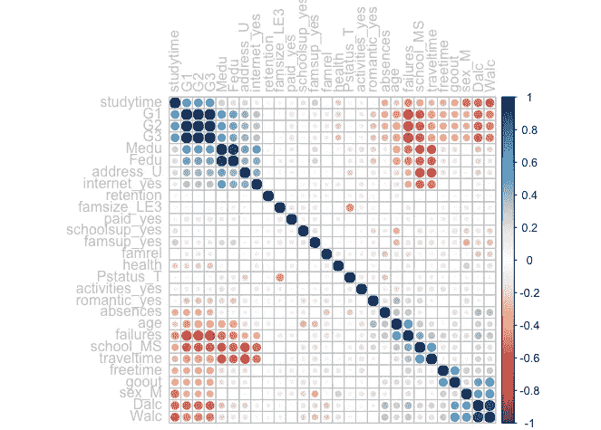*

*图 8——所有变量的相关矩阵*

*这里有一些有趣的相关性，但主要是关于等级(G1、G2 和 G3)。它们似乎有很强的相关性，表明存在潜在的共线性。我们也看到成绩和失败之间有很强的负相关性，还有其他一些特征。您总是可以使用相关表来检查实际数字，或者直接在图上添加它们。现在，我们只想对变量之间的关系有一个大致的了解。*

***主成分分析(PCA)** 用于将原始变量塑造成一组新的特征，这些特征是原始变量的线性组合。主成分分析的主要目标是减少变量的数量，但尽可能考虑原始变异。*

*在第一个分量或维度中，您将看到原始变量的组合，其样本方差在所有可能的线性组合中是最大的。在第二维中，我们考虑剩余方差的最大比例，它可以与第一维不相关。其他组件遵循类似的方法。*

*当分析运行 PCA 的输出时，我们希望看到一维和二维之间的“累积比例”，这是有意义的。一般来说，累积比例等于或大于 0.7 被认为是非常好的。也就是说，从多个变量缩减到两个维度仍然可以很好地代表整个数据集。*

*在执行 PCA 之前，一件重要的事情是确保数据集是标准化的。在这一点上，决定是否移除异常值也是一个好的做法。*

*为了使用 PCA 开始我们的分析，我们将从一个条形图开始，它显示了所有成分之间的累积比例以及它们的方差。*

*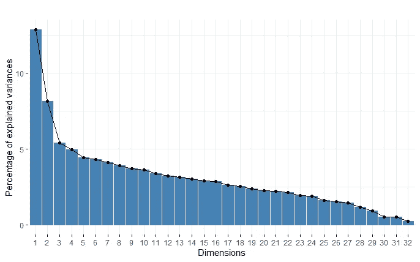*

*图 9——五氯苯甲醚累积比例*

*本质上，我们特别感兴趣的是将我们的分析缩小到前两个维度。我们希望确保它们之间的累积比例足以“解释”数据集的其余部分。*

*不幸的是，正如你将在下一张图中看到的，累计比例仅为 21% (12.9% + 8.1%)。因此，减少到两个维度是不推荐的，因此，我们将丢失信息，并最终得到两个不能“解释”数据集的维度。*

*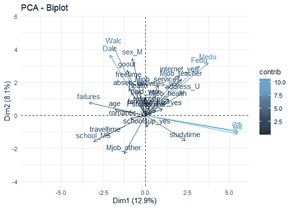*

*图 10—尺寸 1 和尺寸 2 的 PCA 双标图*

*从双标图中，我们还可以看到变量之间的相关性，例如等级(G1、G2 和 G3)和指向相反方向的*故障*。虽然两个维度的累积比例在归结到该数据集的维度减少时并不真正有用，但我们希望检查每个维度的前十个变量的贡献。这可能有助于我们更好地理解这个数据集。*

*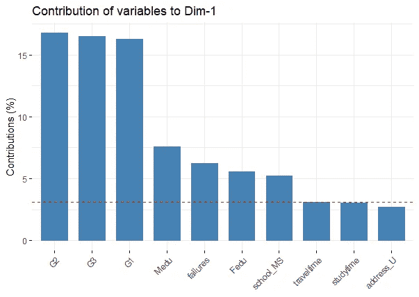**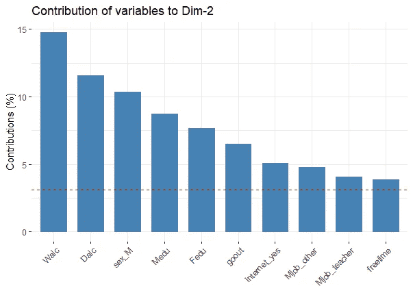*

*图 11-Dim 1 和 Dim 2 的 PCA 贡献*

*我们可以看到，在 Dim 1 中，*等级*是该维度贡献最大的变量。但是，需要强调是，这里仍然存在共线性假设。所以这是又一个线索，事实上，我们在这里可能有共线性，因为我们看到所有的*等级*都有非常相似的贡献水平。另一方面，在 Dim 2 中， *Walc* 特性的贡献最大。*

*总之，如果有人问 Dim 1 和 Dim 2 是关于什么的，我们可以说 Dim 1 是关于学生成绩的，Dim 2 是关于学生饮酒量的。这意味着，在预测*保留率*时，我们应该预期这些变量中的一些具有统计*显著性*。*

*所有这些测试在指导我们决定哪些变量应该保留，哪些变量应该忽略时都非常有帮助。不幸的是，我们还不能使用 PCA 来做任何决定。*

*回过头来看，我们有共线性的假设仍然存在，但是如何测量它，以及如何决定去掉每个变量？*

*鉴于对这一问题的认识，并考虑到这一点，我们将利用 VIF(可变通货膨胀系数)来检测并支持我们在处理多重共线性时采用最佳方法的决策。简而言之，VIF 检测变量之间的相关性有多强，它的分数指导我们在每个变量上降低和减轻共线性。*

*根据一般经验，VIF 分数等于或大于 5 表示共线性。我们在这里也将使用 5 作为阈值。正如我们在下面看到的，基于逻辑回归的 VIF 输出告诉我们，G2 和 G3 是我们在进一步分析中应该忽略的变量。*

*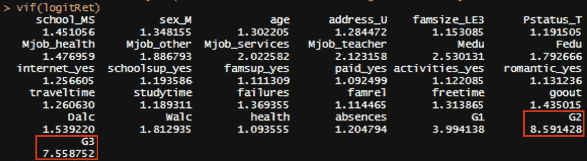*

*图 3 — VIF 输出*

*通常情况下，您应该去掉当时的一个变量，然后再次运行分析。也就是说，G2 是第一个离开的，G3 是第二个。这里有一个图形化的方法来显示移除这两个变量(G2 和 G3)之前和之后的情况:*

*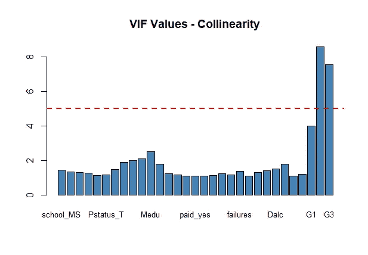**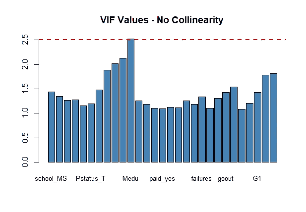*

*图 12-在阈值 5 处检测到共线性(左侧)。未检测到高于 2.5 的共线性(右侧)。*

*作为所有这些争论的结果，我们只是去掉了两个变量。从某种意义上说，这并不是真正有成效的。我们仍然有一个相当大的功能集，它并没有告诉我们要做什么。因此，我们的捷径将是使用逻辑回归，不仅帮助我们找到预测，而且消除非统计意义上的变量。*

*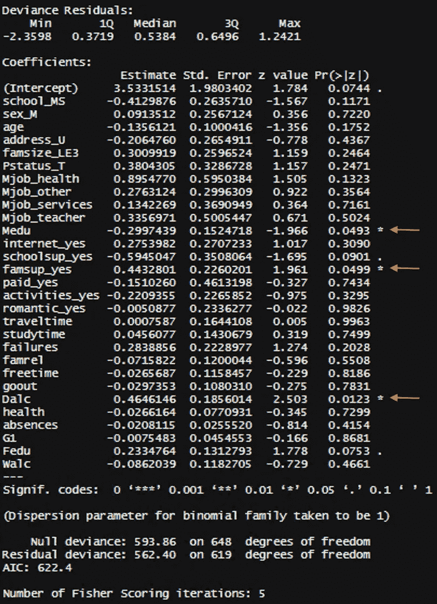*

*图 4 —逻辑回归输出*

*正如从 Logit 回归输出(在左侧)中注意到的，我们有五个变量可以作为预测因子。*

*然而，其中只有三个在 0.05 处有显著性，我们用红色箭头标出。*

**R 平方*是一些研究人员在选择模型时可能使用的一个常用指标。这里，我们将只使用 AIC(赤池信息标准)分数来比较具有 5 个变量的输出和具有 3 个变量的输出。*

*正如你在下面看到的，消除两个不太重要的变量并不会对 AIC 分数产生太大影响。*

*   *所有五个统计显著变量:AIC: 589.84*
*   *所有三个统计上显著的变量在 0.05:AIC:589.67 米*

*是的，整个数据集的 AIC 更大(622.4)，但因为它充满了并不真正有用的要素，我们在这里绘制了这条曲线，并决定在下一阶段只处理这三个变量。*

## *第四阶段:机器学习*

**

*在 [Freepik](https://www.freepik.com/premium-photo/vintage-rocket-takes-flight-with-uncertain-trajectory_8439336.htm) 上[铜管](https://www.freepik.com/copperpipe)的照片*

*考虑到我们到目前为止所面临的所有挑战，在建模 ML 模型时可能会出什么问题呢？糟糕的性能模型可能会出错。但是，我们希望得到最好的结果，至少是一个公平的模型。*

*也就是说，我们在这里必须是真实的，ML 非常适合大型数据集。但是经过一些调整，我们可以让它工作。在这种情况下，我们将利用名为 **ROSE** 的库来平衡预测器并提高模型的性能。*

*最初，我们的预测器是这样分割的:1= 538，0= 111。你可以清楚地看到，我们有一个不平衡的分类器。我们将人为地平衡它，以改善结果，并减轻随之而来的一些统计问题。然而，我们将对*列车拆分的数量进行评估。*因此，我们的*列车*车组共有 553 名学生，其中:1= 458，0= 95。换句话说，我们现在将平衡*训练*数据，而不是整个数据集。*

*ROSE 提供了一些不同的选项来平衡分类器。我们将涵盖 4 种不同的方法，并选择一种给我们最好的结果。下面是我们从论文《ROSE:二进制不平衡学习的一个包》[2]中借用的代码。*

```
*### Balancing the data:
**# Resampling Option 1 (over):**
data.bal.ov <- ovun.sample(retention ~ ., data = trainSplit, method = "over", p=0.5, seed = 2)$datatable(data.bal.ov$retention)**# Resampling Option 2 (under):**
data.bal.un <- ovun.sample(retention ~ ., data = trainSplit, method = "under", p = 0.5, seed = 2)$data

table(data.bal.un$retention)**# Resampling Option 3 (both):**
data.bal.ou <- ovun.sample(retention ~ ., data = trainSplit, method = "both", N = 553, p = 0.5, seed = 2)$data

table(data.bal.ou$retention)**# Resampling Option 4 (ROSE):**
data.rose <- ROSE(retention ~ ., data = trainSplit, seed = 1)$datatable(data.rose$retention)*
```

*   ***重采样选项 1 (over):** 这里我们对“0”进行过采样，直到它与“1”的计数持平。因此，我们将分类器平衡如下:1= 458，0=453。*
*   ***重采样选项 2(下):**通过对多数类(1)进行欠采样以匹配少数类，我们得到这个结果:1=97，0=95。*
*   ***重采样选项 3(两者):**在这种情况下我们使用整个 *train* 集合(553)并拆分，比如:1=281，0=272。*
*   ***重采样选项 4 (ROSE):** 最后我们用 ROSE 来拆分数据，得到了这个结果:1=293，0=260。*

*接下来，我们训练分类器，使用分类树运行测试集，并绘制 ROC 曲线。*

```
*# Training the Classifiers and run test set using classification trees:
library(rpart)
tree.ov <- rpart(retention ~ ., data = data.bal.ov)
tree.un <- rpart(retention ~ ., data = data.bal.un)
tree.ou <- rpart(retention ~ ., data = data.bal.ou)
tree.rose <- rpart(retention ~ ., data = data.rose)# Predict in the new data (test):
pred.tree.ov <- predict(tree.ov, newdata = testSplit)
pred.tree.un <- predict(tree.un, newdata = testSplit)
pred.tree.ou <- predict(tree.un, newdata = testSplit)
pred.tree.rose <- predict(tree.rose, newdata = testSplit)# Plot ROC Curve - Model Evaluation:
roc.curve(testSplit$retention, pred.tree.rose[,2], col = 0, main= "AUC: 0.75", lty = 1)
roc.curve(testSplit$retention, pred.tree.ov[,2], add.roc = TRUE, col = 12, lty = 2) 
roc.curve(testSplit$retention, pred.tree.un[,2], add.roc = TRUE, col = 0, lty = 3) 
roc.curve(testSplit$retention, pred.tree.ou[,2], add.roc = TRUE, col = 0, lty = 4)*
```

***重采样选项 2(下)**为我们提供了最佳 AUC(曲线下面积)输出。见下文:*

*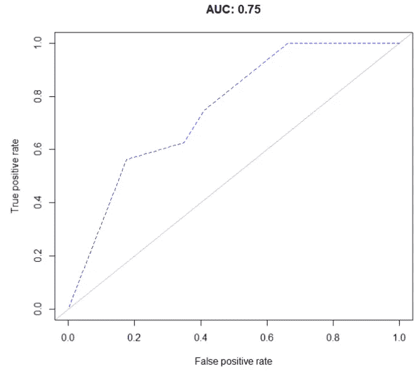*

*图 13 —重采样选项 2 的 ROC 曲线(下)*

*AUC 是一种算法，广泛用于测量所述 ML 分类器的真阳性(TP)率和假阳性(FP)率之间的权衡。*

*同样地，预测失败的模型得分为 0%，而能够做出“完美”预测的模型得分为 100%。*

*相应地，我们的模型得分为 75%,这还不算太差，但是一个≥80%的数字会更好。*

*从积极的一面来看，使用 ROSE 包给了我们一个巨大的改善。所以，我们会庆祝这是一个巨大的胜利。耶！*

*衡量分类器的另一个非常常见的方法是通过决策树，这将使我们对模型的表现有更多的直觉。这里我们将跳过这一步，转到 ML 分析的下一步，也是最后一步。*

## *通过准确度和 Kappa 选择机器学习模型*

*很多人依靠准确性来选择 ML 模型。仅仅这一点可能会引起误解，但是因为这是一个非常 ***【快速和肮脏】*** 类型的项目，我将允许我自己尝试一下。*

*   ***准确性:**它基本上指出了被正确标记的“1”和“0”的比例。*
*   ***Kappa:** 告诉我们与随机分配的值相比，分类器的性能。*

*下面是我们处理这部分分析的方法:我们将再次使用 ROSE 来平衡整个数据集(649 行)。这次我们不会在*训练*和*测试*之间拆分，那是因为集合非常小。我们将利用我们拥有的一切。*

*类似地，我们将使用下面的代码来平衡预测值，但是正如您将看到的，我们人工复制了多达 1298 个观察值的数据集，并且在这里使用了“both”方法。*

```
*# Create balanced training data for LR:
dataC <- ovun.sample(retention ~ ., data = dataC, method = "both",
                        N = 1298, seed =1)$data # 1298 (649x2)
table(dataC$retention)*
```

*因此，我们得到了新的平衡分类器，例如:1=652，0=646。现在，我们将使用“ *mlbench* ”库来运行几个不同算法之间的基准比较，以查看每个算法是否具有最佳性能。*

*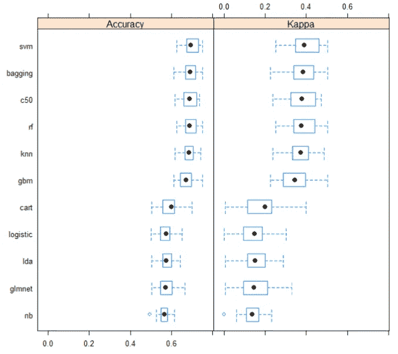*

*图 14-箱线图 ML 模型选择。你可以在这里找到源代码[。](https://machinelearningmastery.com/evaluate-machine-learning-algorithms-with-r/)*

*正如我们在上面看到的，这种分析的“最佳”算法是 *svm* (支持向量机)，其*准确率*接近 70%，而 *kappa* 为 39%。这些是公平的结果，但肯定不是最佳的。*

*请记住，在选择实际用于*生产*的每个型号时，必须考虑许多其他因素，而不仅仅是准确性得分。为了我们试图完成的目的，我们的 ML 分析到此结束。*

## *最后的想法*

*总之，你看到三个主要的预测器是 *Medu* 、 *famsup_yes* 和 *Dalc* 。下一步将是从 Logit 回归中获得优势比，并使分析更具可解释性。我将把它留给将来的改进，以节省我们的时间。*

*提醒一下，我们这里的目标是提供一些如何使用多种技术来处理小数据集并获得相当好的结果的指南。有许多其他方法来解决这个问题，这里我们提供给你一个可靠的方法——使用真实世界的数据集。*

*有了一个设计更好的适合预测*保留*的数据集，有了更多的观察，我们当然可以期待有更好的结果。该分析就是为此目的而创建的。*

*最终，*保留率*是高等教育中最重要的指标之一，这一管道有助于进一步研究这一主题，并有助于管理员根据数据做出更好的决策。*

*下次见！*

*参考资料:*

*[1] P .科尔特斯和 a .席尔瓦。使用数据挖掘预测中学生成绩。在 a .布里托和 j .特谢拉编辑的。，第五届未来商业技术会议论文集(FUBUTEC 2008)第 5–12 页，葡萄牙波尔图，2008 年 4 月，EUROSIS，ISBN 978–9077381–39–7。*

*[2] Nicola Lunardon、Giovanna Menardi 和 Nicola Torelli。ROSE:Binay 不平衡学习包。R 杂志第 6/1 卷，2014 年 6 月。国际刊号 2073-4859。*

*[3] Whitlock，Joshua Lee，“使用数据科学和预测分析来了解 4 年制大学学生流失”(2018)。电子论文。3356 号文件。https://dc.etsu.edu/etd/3356*