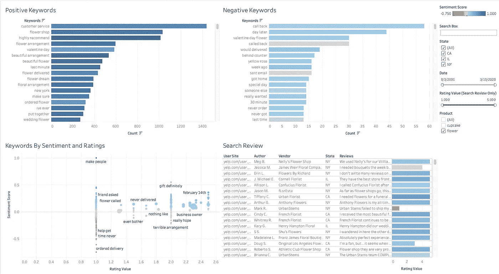
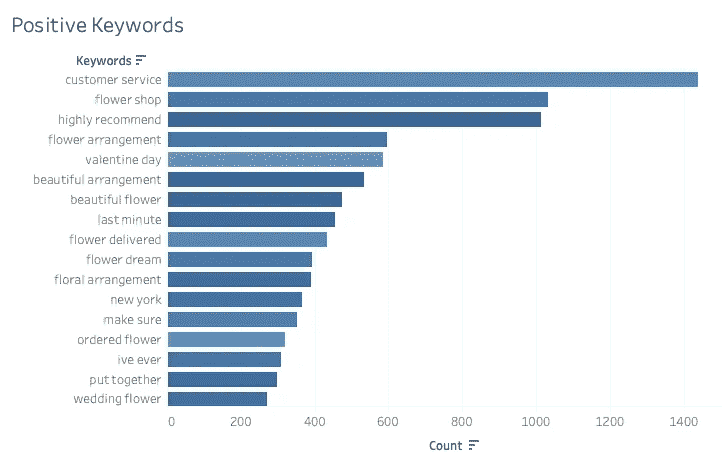
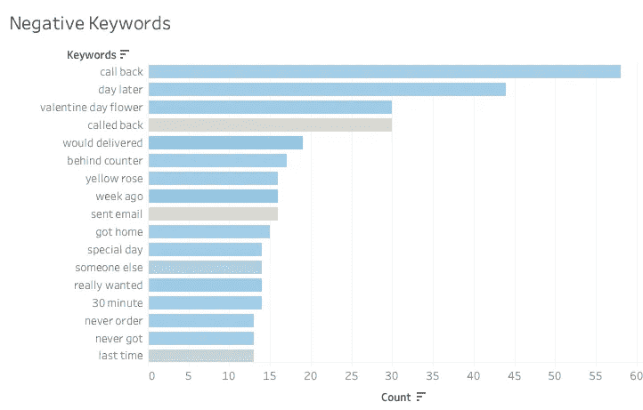
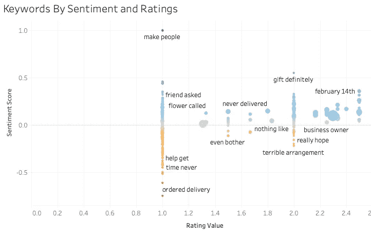
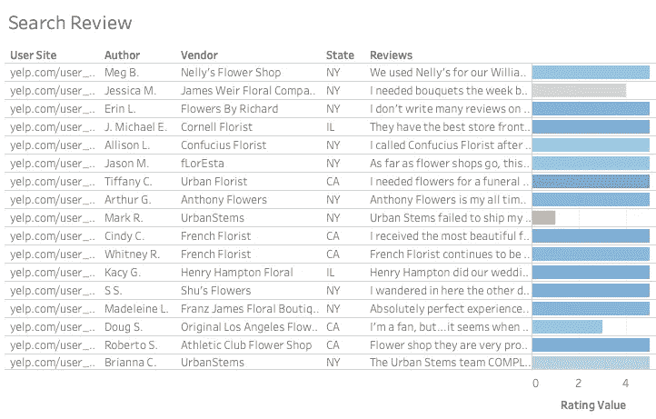

# CRAIG:客户评论分析洞察生成器

> 原文：<https://towardsdatascience.com/craig-customer-review-analytical-insights-generator-676fd1d76ffe?source=collection_archive---------69----------------------->

## 使用 NLP 和 TextBlob 分析客户评论的情感指标

杰里米·蔡在 [Unsplash](https://unsplash.com?utm_source=medium&utm_medium=referral) 上的照片

你好！希望大家在疫情爆发期间保持安全和健康。

今天我想分享一个有趣的项目，是我的团队在 Gesture 做的。对[克里斯多佛·里吉奥](https://medium.com/u/af5b3245b5ed?source=post_page-----676fd1d76ffe--------------------------------)和[梅格娜·穆拉利哈兰](https://medium.com/u/53bec7e76a96?source=post_page-----676fd1d76ffe--------------------------------)的快速大喊，感谢他们成为令人敬畏的团队成员。

在衡量公司业绩或评估公司底线指标时，CRAIG dashboard 不是高管们日常使用的仪表盘，而是一种创新而实用的数据应用，用于推动**行为分析**。该项目旨在通过分析我们公司产品的评论来更好地了解客户体验，并确定产品中可能代表趋势或洞察力的方面。

不用说，评论是企业衡量产品和服务表现的一种重要方式。通过它们，我们可以确定哪些因素推动了好的和坏的客户体验，并允许公司有改进的空间。通过分析 Yelp 和 Google Places 等在线业务平台上存在的大量客户评论，公司能够调整其产品和服务，以更好地满足客户的需求，从而提高保留率和积极的品牌知名度。

在按需礼品交付应用程序 **Gesture** 中，我们利用自然语言处理和数据辩论技术，使用客户评论分析洞察生成器 **CRAIG** 来洞察产品评论**和**。有了 CRAIG，我们可以在粒度和聚合级别上更深入地了解单个客户的体验。通过提取和分析来自 Yelp 的产品评论，CRAIG 建立了实际应用程序来帮助各部门的工作，例如:

*   根据评论向 Yelp 客户进行个性化营销推广
*   基于顾客偏好和推荐的 SKU 新产品构思
*   与积极和消极情绪相关的手势产品和类别分析
*   对竞争对手和潜在合作伙伴的洞察

那么，CRAIG 有哪些功能呢？

*   正负关键词跟踪系统
*   对客户情绪的趋势洞察
*   具有搜索功能的评论
*   洞察推动客户体验的因素

为了提供一个直观的分析，这里是克雷格的样子。

CRAIG(一个 2x2 的自动化 Tableau 仪表板)

我们从 Yelp 网站上收集了来自加州、伊利诺伊州和纽约三个州的花店和纸杯蛋糕店的超过 20，000 条评论。收集数据的脚本是通过谷歌云功能按计划触发的，在这里数据被抓取、清理并安全地加载到我们的谷歌云平台上。

## 正面关键词

肯定关键词图表是按计数频率对最肯定关键词的直观表示。它显示增加评论平均评分的关键词(二元模型和三元模型的组合)。每个条形的颜色表示情绪-颜色越暗，包含该关键字的评论越积极，颜色越暗，包含该关键字的评论越消极。

这些发现验证了我们的直觉，即**的客户服务**对于一个健康且表现良好的企业来说绝对至关重要，评级良好的企业极有可能被推荐给他人。**最后一分钟**送货也很重要，这也是 Gesture 努力成为按需送货服务，在一小时内将礼物送上门的原因。

如果你想知道数据是如何被清理的，评论需要一些预处理步骤，包括单词的小写，删除标点符号和停用词，评论的标记化和词条化。通过使用 TextBlob 包和基于位置(州)和日期的过滤来生成 ngrams。

## 负面评论

负面关键词图表遵循与正面关键词相同的结构，但显示的是导致负面评价的负面关键词。图表上的颜色是较浅的蓝色，表明积极情绪比积极评价中观察到的情绪要少。

我们看到**交付**是差评中的一个常见问题，在这种情况下，客户因服务不满意而不得不打电话回来，或者产品没有按时交付或根本没有交付。黄玫瑰似乎也不是受欢迎的选择。

## 按情感和评级的关键词

“按情感和评级列出的关键字”图表是一个可视报告，允许用户按情感和评级发现关键字。这两个参数呈正相关，特定评论的评分值越高，客户对其体验的评价就越积极。每个圆圈的颜色在 CRAIG 的所有网格中保持一致，每个圆圈的大小对应于计数。圆圈越大，该关键词在整个评论语料库中被提及的频率就越高。

## 搜索评论

最后一个网格是所有评论、供应商和作者的数据库，用户可以通过在搜索框中输入关键字来搜索任何评论。它还可以选择导航到第一列中的每个用户配置文件。

克雷格到此为止。CRAIG 旨在将所有客户评论集中到一个仪表板中，提取来自社交渠道的数据，并允许企业更好地与客户互动。感谢您的阅读，祝您有美好的一天！