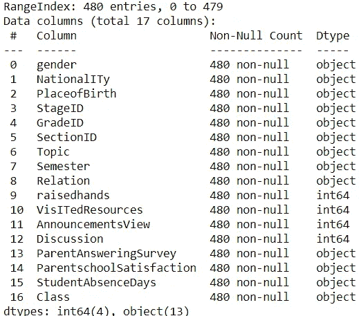
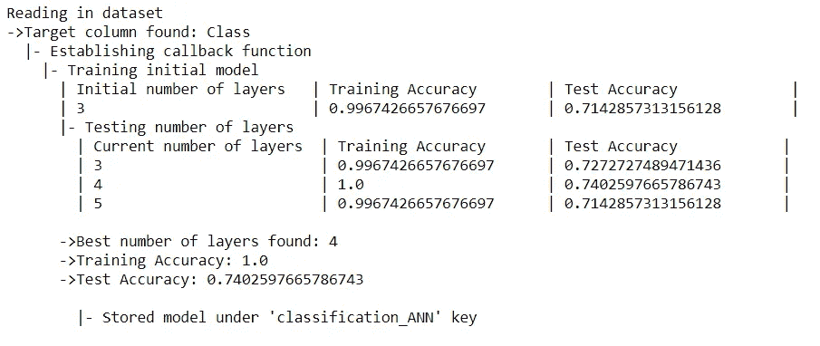
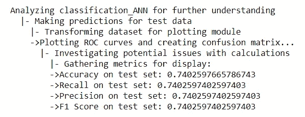
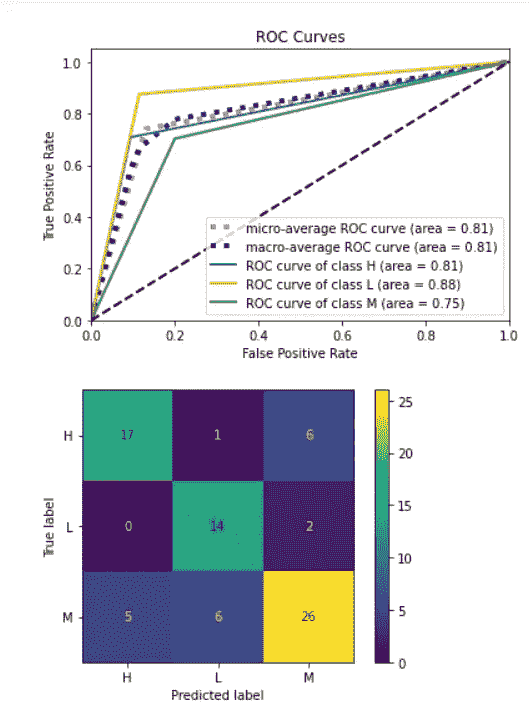

# 用 Libra 创建一个复杂的机器学习模型

> 原文：<https://towardsdatascience.com/create-a-complex-machine-learning-model-in-one-line-with-libra-a253e05d15a1?source=collection_archive---------51----------------------->

## 非专家使用的一行建模查询


韦斯·希克斯在 [Unsplash](https://unsplash.com?utm_source=medium&utm_medium=referral) 上的照片

在最近一段时间，有许多与数据相关的项目爆炸，尤其是以机器学习为骨干的项目。在商业行业项目中，许多机器学习被应用于创建预测模型(预测事件、搅动、欺诈等)。).

所有机器学习的问题是，我们需要学习复杂的代码，结果有时对于非专家来说太复杂了。

基于以上原因，现在有一个面向非专家的机器学习 python 包叫做 [Libra](https://medium.com/@funpalash/machine-learning-in-one-line-of-code-c2c7cdb4983e) 。这个包的前提很简单:**他们优先考虑易用性和人体工程学；**意思是用尽可能少的行创建一个机器学习模型。

# 磅

那么，这个天秤座套餐到底是什么？根据他们的说法，它是一个机器学习 API，让我们只需一行代码就可以构建和部署机器学习。多整洁啊！

此外，目标检测、预处理和评分是默认完成的。我们只需要选择模型并输入数据。

让我们试试它是如何工作的。

在我们安装 Libra 包之前，我们需要安装 Python 3.6 或更高版本。任何低于这个数字的都不行。要安装这个包，我们只需要在命令提示符下运行下面的代码。

```
**pip install libra**
```

在你安装完这个包之后，我们会尝试这个包是如何工作的。让我们准备好所有需要用到的东西。首先，出于我们学习的目的，我将使用来自 Kaggle 的关于教育的数据集[这里是](https://www.kaggle.com/aljarah/xAPI-Edu-Data)。下图是数据信息。



现在，假设我们想要创建一个预测模型来对类列进行分类。利用天秤座，一切都变得简单了。

```
#The only thing we need to import**from libra import client**
```

在 Libra 中，数据集仍然需要从外部读取；比如说 CSV 文件。这就是为什么我们要创建一个直接读取文件的客户端类。

```
#Creating a client object that read the data to create the prediction model**edu_client = client('xAPI-Edu-Data.csv')**
```

上面的代码是我们所需要的；下一部分更像是以我们想要的方式查询模型，并立即得到结果。

目前，Libra 中唯一的[机器学习模型是:](https://libradocs.github.io/html/modeling.html)

*   神经网络
*   卷积神经网络
*   支持向量机
*   最近的邻居
*   决策图表
*   k 均值聚类

还有[几种自然语言处理](https://libradocs.github.io/html/nlp.html)，包括:

*   文本分类
*   文档摘要
*   图像字幕生成

虽然，对于我们的情况，我们只会尝试使用神经网络模型。让我们试着创建预测模型。为了创建预测模型，我们需要从客户端方法调用我们想要的机器学习。

在我们的例子中，应该是`.neural_network_query`在参数中接受一个文本。我们传递的查询是一个简单的英文文本，如***‘classify the class’***或***‘estimate accurate the StudentAbsenceDays’***。重要的是目标列；您需要在查询中指定它。之后，API 会预测这是一个分类问题还是回归问题。让我们看看下面的例子。

```
#Creating the model by simple query, for example classify the class. Using Libra, you would need to specify which column you want as the target and the rest would be preprocessed automatically**edu_client.neural_network_query('classify the class')**
```



只需使用一个简单的查询，就可以自动对模型进行预处理，并启动学习过程。此外，所有的重复过程和指标也会立即显示出来。


此外，该模型为我们提供了每个时期的精度和模型损失图。

如果你想知道你能在模型中传递的所有参数，请在这里查阅 [API 指南](https://libradocs.github.io/html/modeling.html)。

Libra 还提供了对模型更深入的分析。我们可以通过运行下面的代码来访问分析。

```
**edu_client.analyze()**
```



上面，我们得到了总体指标，包括 ROC 曲线和混淆矩阵。有了这个，我们可以更快地分析我们的模型。

# 结论

在本文中，我概述了如何使用 Libra 在一个模型中创建机器学习预测。几乎所有繁琐的部分都由 API 完成，我们只需要看到结果。

这并不意味着它可以取代数据理解和功能工程，因为 API 的主要部分是创建一个机器学习模型，而不是创建新的功能。

希望有帮助！

# 如果您喜欢我的内容，并希望获得更多关于数据或数据科学家日常生活的深入知识，请考虑在此订阅我的[简讯。](https://cornellius.substack.com/welcome)

> 如果您没有订阅为中等会员，请考虑通过[我的推荐](https://cornelliusyudhawijaya.medium.com/membership)订阅。