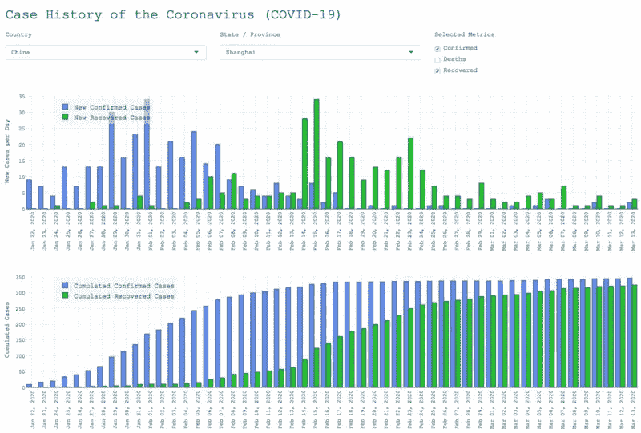
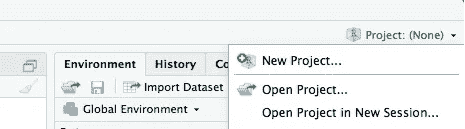
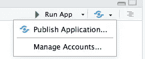
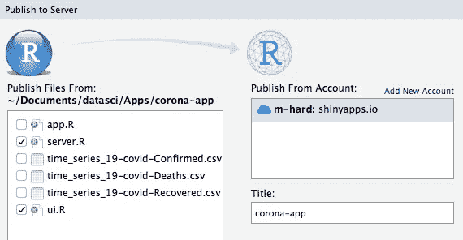

# 使用 R，Shiny & Plotly，一眨眼的功夫就能看到新冠肺炎案例数据

> 原文：<https://towardsdatascience.com/create-a-coronavirus-app-using-r-shiny-and-plotly-6a6abf66091d?source=collection_archive---------3----------------------->

## 创建并发布一个 web 应用程序来可视化冠状病毒的数据



自冠状病毒新冠肺炎成为疫情以来，世界上至少有一半人在关注这一病例统计数据。我也是。作为一名数据科学家，我很好奇，所以我访问了案例统计数据并创建了一些可视化。通过这篇报道，我将告诉你如何自己做同样的事情。没有魔法！

> 测试一下:【https://go.aws/3aoYsIW 

本演练解释如何创建 web 应用程序和交互式绘图。基于 **R & Shiny** 的**开源技术**栈非常单薄。大约 120 行代码就足够了。

**代码也可以从 GitHub** 下载。链接可以在本文的底部找到。

## 目标

本文的目标是能够创建一个运行 web 应用程序的**，它每 30 分钟更新一次数据，并在仪表板上显示这些数据。该应用程序的特点是:**

*   冠状病毒官方可用数据的下载和解析。
*   下拉菜单选择国家和州。
*   显示所选国家新的和累积的病例统计数据的两个图。可以显示确诊病例、痊愈病例和死亡病例。

## 任务

1.  设置 R & RStudio。
2.  设置 R 项目及其文件夹结构。
3.  使用 Shiny 创建用户界面。
4.  添加加载和预处理数据的逻辑。
5.  添加服务器逻辑。
6.  [可选]将应用程序上传到云。

# 设置 R & RStudio

首先从[https://rstudio.com/products/rstudio/download/#download](https://rstudio.com/products/rstudio/download/#download)下载 **R** 的 **base** 版本，启动安装程序并通过。

然后，从[https://rstudio.com/products/rstudio/download/#download](https://rstudio.com/products/rstudio/download/#download)下载 **RStudio 桌面**的**免费**版本。再次启动安装程序并完成步骤。

现在安装我们需要的包。启动 RStudio 应用程序并进入控制台(通常位于左下方的窗口)。通过键入以下命令安装软件包:

```
> install.packages("shiny")
> install.packages("dplyr")
> install.packages("tidyr")
> install.packages("plotly")
```

# 设置 R 项目及其文件夹结构

在 RStudio 中，单击右上方的下拉菜单“项目:(无)”，然后选择“新建项目…”。



点击“新目录”，然后点击“闪亮的网络应用”。现在为您的项目选择一个任意的新目录名，例如“ *corona-app* ”。此外，选择您希望应用程序所在的子目录。点击“创建项目”按钮，创建包含 2 个文件的文件夹:

*   项目文件: *corona-app。Rproj* (可能有另一个名字)
*   一个我们不需要的 app 模板文件: *app。R*

# 使用 Shiny 创建用户界面

闪亮的框架允许 R 用户用最少的编码工作创建反应式 web 应用程序。小 app 只需要 2 个文件: *ui。R* 为用户界面布局，而*为服务器。R* 用于服务器和渲染逻辑。

转到 *RStudio* 。在用户界面的左上方，有一个创建新文件的加号按钮。点击它，并选择“R 脚本”。创建一个文件，并将其命名为" *ui。R* "通过保存它，并开始编辑。

首先加载我们需要的包:

```
library(shiny)
library(plotly)
```

然后，使用 bootstrap 方案建立一个空白页面(每行 12 列)，并使用元素 *titlePanel* 创建标题:

```
shinyUI(fluidPage(
  titlePanel("Case History of the Coronavirus (COVID-19)"),
))
```

总之，屏幕被分成不同的行(*fluid row*s)。带控件的*流体行*由三个宽度为 4 的*列*组成，加起来又是 12。地块占据整个宽度(12):


现在添加控件的代码。在定义*标题面板*的行之后立即插入以下代码(在两个右括号之前！):

```
 fluidRow(
    column(
      width=4, 
      selectizeInput(
        "country", label=h5("Country"), choices=NULL, width="100%")
    ),
    column(
      width=4, 
      selectizeInput(
        "state", label=h5("State"), choices=NULL, width="100%")
    ),
    column(
      width=4, 
      checkboxGroupInput(
        "metrics", label=h5("Selected Metrics"), 
        choices=c("Confirmed", "Deaths", "Recovered"), 
        selected=c("Confirmed", "Deaths", "Recovered"), 
        width="100%")
    )
  ), 
```

如您所见，有一个*流体行*有 3 个*列*元素，每个元素的宽度为 4。前两列包含下拉菜单元素( *selectizeInput* )，让用户选择国家和州。

第三列包含一组复选框元素( *checkboxGroupInput* )。这允许用户选择在两个图中显示哪些指标。

对于这两个图，我们使用 *R* 包 *plotly* ( [文档](https://plot.ly/r/))。以下代码行在接下来的两个*流体行*中各添加一个 *plotly* 样式的绘图:

```
 fluidRow(
    plotlyOutput("dailyMetrics")
  ),
  fluidRow(
    plotlyOutput("cumulatedMetrics")
  )
```

# 添加加载和预处理数据的逻辑

该应用程序需要一些逻辑来下载和解析数据。这发生在服务器上。再次创建一个新文件，并将其命名为" *server。R* 并添加这些行来加载各自的 *R* 包:

```
library(dplyr)
library(tidyr)
```

然后定义一个 *baseURL* ，我们从其中按国家和地区下载冠状病毒的病例数据。**数据**位于**约翰霍普金斯系统科学与工程中心(JHU/CSSE)** 的服务器上。此外，定义一个稍后使用的字体( *f1* )，加上一个测量文件有多长时间的速记函数(以避免过多的重新加载):

```
baseURL = "[https://raw.githubusercontent.com/CSSEGISandData/COVID-19/master/csse_covid_19_data/csse_covid_19_time_series](https://raw.githubusercontent.com/CSSEGISandData/COVID-19/master/csse_covid_19_data/csse_covid_19_time_series)"f1 = list(family="Courier New, monospace", size=12, 
       color="rgb(30,30,30)")minutesSinceLastUpdate = function(fileName) {
  (as.numeric(as.POSIXlt(Sys.time())) -  
   as.numeric(file.info(fileName)$ctime)) / 60
}
```

现在，定义主函数来加载特定数据集(例如，按日期和国家列出的确诊病例数)。

```
loadData = function(fileName, columnName) {
  if(!file.exists(fileName) || 
     minutesSinceLastUpdate(fileName) > 10) {
    data = read.csv(file.path(baseURL, fileName), 
      check.names=FALSE, stringsAsFactors=FALSE) %>%
      select(-Lat, -Long) %>% 
      pivot_longer(-(1:2), names_to="date", values_to=columnName)%>%
      mutate(
        date=as.Date(date, format="%m/%d/%y"),
        `Province/State`=
          if_else(`Province/State` == "", "<all>", `Province/State`)
      )
    save(data, file=fileName)  
  } else {
    load(file=fileName)
  }
  return(data)
}
```

该函数首先检查数据是否已经可用，并且不超过 10 分钟。如果不是这样， *read.csv* 从网络上下载文件。地理坐标被省略，然后 *pivot_longer* (来自包 *tidyr* )将 *data.frame* 从宽格式转换为长格式。方法 *mutate* 解析日期并插入文本 *< all >* 如果没有可用的地区(适用于美国、加拿大、中国和澳大利亚以外的国家)。

下一个块在应用程序启动时立即被调用。如上所述，它从 web 或缓存加载数据:

```
allData = 
  loadData(
    "time_series_covid19_confirmed_global.csv", "CumConfirmed") %>%
  inner_join(loadData(
    "time_series_covid19_deaths_global.csv", "CumDeaths")) %>%
  inner_join(loadData(
    "time_series_covid19_recovered_global.csv","CumRecovered"))
```

代码块加载确诊病例、恢复病例和死亡病例，并连接这 3 个数据集以获得一个大数据集。

更新[2020-3-27]:文件名已更改，以反映约翰霍普金斯大学的新数据结构(见[链接](https://github.com/CSSEGISandData/COVID-19/tree/master/csse_covid_19_data/csse_covid_19_time_series))。

# 添加服务器逻辑

最后一节介绍了服务器上的静态代码。现在开始主要部分，即反应式服务器代码。本节中添加的所有代码都位于*服务器*函数的括号内:

```
server = function(input, output, session) {
  ## ...
}
```

## 数据

首先让我们添加一个[反应函数](https://shiny.rstudio.com/articles/reactivity-overview.html)，它返回全部数据的一个子集，即只返回一个指定的国家和地区。每当用户更改选择时，都会调用该函数并更新过滤器:

```
 data = reactive({
    d = allData %>%
      filter(`Country/Region` == input$country)
    if(input$state != "<all>") {
      d = d %>% 
        filter(`Province/State` == input$state) 
    } else {
      d = d %>% 
        group_by(date) %>% 
        summarise_if(is.numeric, sum, na.rm=TRUE)
    }
    d %>%
      mutate(
        dateStr = format(date, format="%b %d, %Y"),
        NewConfirmed=CumConfirmed - lag(CumConfirmed, default=0),
        NewRecovered=CumRecovered - lag(CumRecovered, default=0),
        NewDeaths=CumDeaths - lag(CumDeaths, default=0)
      )
  })
```

此外，如果用户为有州的国家(如美国)选择 *<【所有>* ，则该函数会汇总数据(使用*summary _ if*)。此外，根据累积的统计数据，计算差异并保存到新列中，以“*New”*为前缀。

## 下拉菜单

接下来，服务器观察国家选择的变化。如果发生这种情况，服务器必须更新可选状态。另外，*<>*全部作为选项添加到状态下拉菜单中:

```
 observeEvent(input$country, {
    states = allData %>%
      filter(`Country/Region` == input$country) %>% 
      pull(`Province/State`)
    states = c("<all>", sort(unique(states)))
    updateSelectInput(session, "state", choices=states, 
      selected=states[1])
  })
```

接下来的两行没有反应。相反，它们在应用程序启动时被调用。第一行按字典顺序提取所有国家。另一行在下拉菜单中选择意大利( *selectizeInput* ):

```
 countries = sort(unique(allData$`Country/Region`))

  updateSelectInput(session, "country", choices=countries, 
    selected="Italy")
```

## 情节

对于情节，我们使用了 R 包*的[条形图。以下代码定义了用于两个图(新的和累积的情况)的函数。该函数的第一部分定义了条形图的基础(样式、轴、图例)。第二部分遍历选定的指标(如恢复的指标等)并添加条形。使用*var prefix*(“*New*”或“ *Cum* ”)和 *metric* )的列名的组成有点复杂。](https://plot.ly/r/bar-charts/)*

```
 *renderBarPlot = function(varPrefix, legendPrefix, yaxisTitle) {
    renderPlotly({
      data = data()
      plt = data %>% 
        plot_ly() %>%
        config(displayModeBar=FALSE) %>%
        layout(
          barmode='group', 
          xaxis=list(
            title="", tickangle=-90, type='category', 
            ticktext=as.list(data$dateStr), 
            tickvals=as.list(data$date)), 
          yaxis=list(title=yaxisTitle),
          legend=list(x=0.1, y=0.9,bgcolor='rgba(240,240,240,0.5)'),
          font=f1
        )
      for(metric in input$metrics) 
        plt = plt %>%
          add_trace(
            x=~date, y=data[[paste0(varPrefix, metric)]],type='bar', 
            name=paste(legendPrefix, metric, "Cases"),
            marker=list(
              color=switch(metric, 
                Deaths='rgb(200,30,30)', 
                Recovered='rgb(30,200,30)', 
                Confirmed='rgb(100,140,240)'),
              line=list(color='rgb(8,48,107)', width=1.0)
            )
          )
      plt
    })
  }*
```

*最后几行代码使用前面定义的函数。这两个图通过以下方式分配给用户界面元素:*

```
 *output$dailyMetrics = renderBarPlot(
    "New", legendPrefix="New", yaxisTitle="New Cases per Day") output$cumulatedMetrics = renderBarPlot(
    "Cum", legendPrefix="Cumulated", yaxisTitle="Cumulated Cases")*
```

*瞧啊。*

*这就是全部，你可以通过点击编辑器窗口右上角的“运行应用”按钮来运行代码。*

# *GITHUB 代码*

*以上所有代码都可以在 *GitHub* 上找到。毕竟，它只有两个文件，加上项目文件:*

*[https://github.com/ploner/coronavirus-r](https://github.com/ploner/coronavirus-r)*

# *[可选]将应用程序上传到云*

*将闪亮的应用程序发布到 web 服务器的最简单方法是使用 [shinyapps](https://www.shinyapps.io) 。在 *shinyapps* 上创建账户后，进入 RStudio，点击右上角的发布图标，然后点击“发布应用程序…”:*

**

*用你的账号连接，然后选择你需要的文件(仅限 *ui。R* 和*服务器。R* ！):*

**

*就是这样！你的应用程序**运行在网络服务器**上，你可以通过互联网访问它。*

> *[2020 年 3 月 19 日更新]有一篇**后续文章**是关于同一个用例的。相反，如果 R + Shiny + Plotly，它会通过基于 Python 的堆栈:*
> 
> ***Python + Dash + Plotly***
> 
> *链接:[用 Python 可视化新冠肺炎数据，破折号& Plotly](https://medium.com/@meinhard.ploner/visualise-covid-19-case-data-using-python-dash-and-plotly-e58feb34f70f)*

*我叫梅哈德·普洛纳。我对统计学和数据科学并不陌生，但这是我第一篇关于媒体的文章。我希望你喜欢阅读它，并欢迎任何反馈。*

**更多 R 在行动的例子，查看*[*R-bloggers*](http://www.r-bloggers.com)*。**