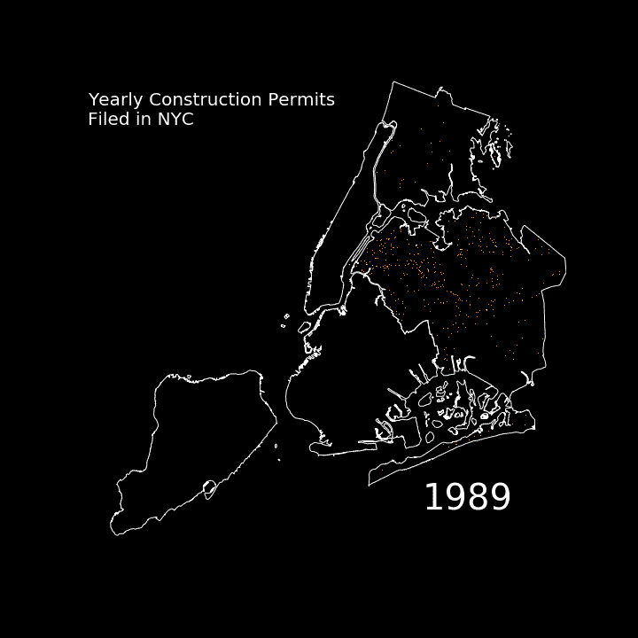
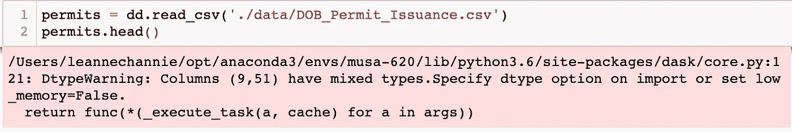
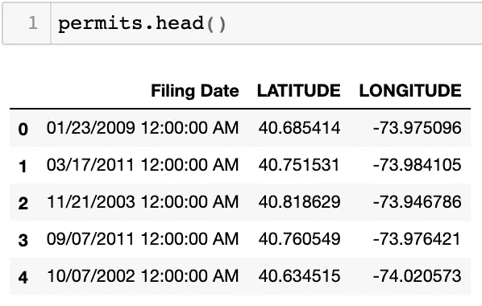
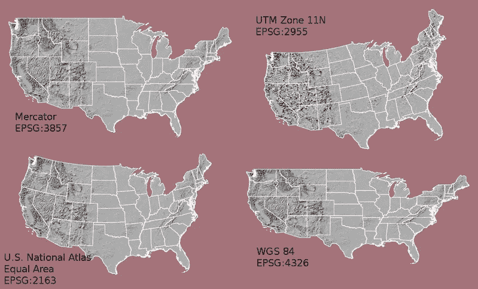
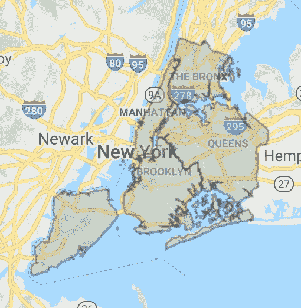

# 360 万个点，1 个 GIF —用 Python 可视化大数据

> 原文：<https://towardsdatascience.com/create-a-gif-with-3-million-points-using-dask-caf7dcd0667e?source=collection_archive---------29----------------------->

## 使用 Dask 和 Datashader 库用 Python 创建大数据 GIF 的详细分步指南。



纽约市从 1989 年到 2019 年每年提交的建筑许可证。图片作者。

你好！本文将带您一步一步地创建 GIF 来可视化 Python 中的大数据。gif 是显示随时间变化的好方法，尤其是对于大型数据集。本文使用了过去 30 年纽约市建筑许可证，由建筑部门发布，摘自纽约市开放数据。这张 GIF 是我和我的好朋友雅普·云起于 2019 年秋天在纽约市进行的[项目](https://leannechan.github.io/Gentrification-Trends-In-NYC/)的一部分。

IPython 笔记本和环境文件可以在这里找到:【https://github.com/LeanneChan/create-a-GIF】T4。要下载笔记本并用 Jupyter Notebook 打开，可以关注我的另一篇文章[这里](https://medium.com/swlh/installing-jupyter-notebook-and-using-your-own-environment-on-mac-fa41efd4639d)。您也可以在 GoogleColab 中运行代码，但是根据过去的经验，在 GoogleColab 中加载 geopandas 库需要额外的步骤。

# 方法

GIF 是拼接在一起的图像集合。因此，我们创建 GIF 的方法是为每个不同的时间框架(在本例中为几年)创建单独的图，然后将它们拼接在一起。如果我们的数据集足够小，我们可以使用 matplotlib 来绘制这些点。但是，对于更大的数据集，我们将使用 [**Datashader**](https://datashader.org/) ，一个用于可视化大数据集的库。为了处理大型数据集，我们将使用 [**Dask**](https://docs.dask.org/en/latest/) ，这是一个 Python 中灵活的并行计算库。

## 数据着色器

Datashader 是 HoloViz 家族的一部分(其他包包括 HoloViews、hvPlot)，用于创建大型数据集的表示。它能够通过*光栅化*(将一个图分成像素)绘图区域并聚集落在每个像素中的点的值来可视化大型数据集。然后根据该聚合值对像素进行着色。

## 达斯克

Dask 允许我们存储比笔记本电脑内存还大的数据。此外，Dask 使用起来不会太吓人，因为 Dask 数据帧镜像 Pandas，Dask 数组镜像 NumPy。Dask 将作为 Pandas DataFrame 对象的分区分开，只在必要时将数据加载到我们的计算机内存中。

## 所需的库

dask、datashader、colorcet、matplotlib、numpy、imageio、geopandas

# 我们开始吧！

## 步骤 1:加载施工许可数据

数据集具有 shape (3616003，60)，这意味着有 60 个列/要素和 360 万行/点。这是一个地理空间数据集和可视化，所以每一行代表纽约市的一个点，这是我们想要绘制的。由于有 3.6M 行，我们将需要 dask.dataframe 库。`import`用于将库中的库加载到你当前的工作区/会话中，这允许我们使用库中的方法。

```
import dask.dataframe as dd
```

如果你以前用过 pandas，语法真的很类似，调用`read_csv`读入 dataframe，我从 NYC open data 下载的，保存在我 Jupyter 笔记本的同一个文件夹里，名为‘DOB _ permit _ issuement . CSV’。

```
permits = dd.read_csv(‘./data/DOB_Permit_Issuance.csv’) permits.head()
```

然而，如果**您得到下面的错误，**您也将需要寻址具有混合类型的列。



未指定某些列的数据类型时的错误。图片作者。

在这个例子中，我必须为某些列指定`dtype`,因为它们具有混合类型，这在尝试调用 dataframe 时会引发错误。dtype 指定了列中数据的格式，因此当 pandas/dask 不得不猜测太多的列类型时会出现错误。我还使用`usecols`只选择了三列，而不是 60 列，以使未来的过程更快。这些栏显示了许可证提交的日期(以便以后提取年份)和许可证的 lat/lng。解决“混合数据类型”问题的另一种方法是只选择有用的、没有混合数据类型的列。事后看来，这是我本可以做的事，以节省自己很多时间！

```
permits = dd.read_csv('./data/DOB_Permit_Issuance.csv',
                     dtype={
                         'Lot': 'int64',
                         'Block': 'int64',
                         "Owner's Phone # ": 'float64',
                         "Owner’s House Zip Code": 'float64',
                         "Permittee's License #": 'float64',
                         "Zip Code":'int64' 
                     },
                     usecols=['Filing Date', 'LATITUDE', 'LONGITUDE'])
```

显示我们数据帧的前 5 行。(仅供参考，调用`dataframe.head(x)`，其中 x 是任意整数，将打印出数据帧的前 x 行！)



这是我们将使用的数据帧的前 5 行。图片作者。

## 第二步:数据准备

**首先是**，我们要提取每个许可证的年份。我使用了熊猫函数`to_datetime()`，将“提交日期”列转换为日期-时间对象。由于该列现在是一个 datetime 对象，我可以使用另一个函数`.dt.strftime(“%Y”)`来访问每个点的年份以创建一个新列。

```
# change the column type
permits['Filing Date'] = dd.to_datetime(permits['Filing Date'])# create new column for the year
permits=permits.assign(year= permits['Filing Date'].dt.strftime("%Y"))
```

**其次**，我们需要为我们的坐标决定一个标准化的投影。这是地理空间数据科学中非常重要的一点，因为如果你的底图和你的点在不同的投影和坐标系中，混乱就会随之而来。一个[坐标参考系统(CRS)](https://www.earthdatascience.org/courses/earth-analytics/spatial-data-r/intro-to-coordinate-reference-systems/) ，是一个代码(epsg 代码)，指的是空间数据(本来就是圆的，因为扁平的地球是一个*骗局*)如何被投影到一个扁平的 2D 屏幕上。它还指定了测量单位，通常是英尺、米或十进制度。



来源:earth data science . org:[https://www . earth data science . org/courses/earth-analytics/spatial-data-r/intro-to-coordinate-reference-systems/](https://www.earthdatascience.org/courses/earth-analytics/spatial-data-r/intro-to-coordinate-reference-systems/)

对于这个例子，我使用了 **Web-Mercator 投影(epsg: 3857)，**基于米的投影。虽然在本例中没有这样做，但如果您想使用 OpenStreetMap 或 GoogleMaps 中的底图，这种投影特别有用，因为它们采用 epsg:3857 投影。Datashader 有一个很有用的函数`lnglat_to_meters`，可以将经度和纬度(epsg:4326，十进制度数)转换为 web-mercator(米)。**确保您知道转换后哪个是您的 lat 和 lng，并按照每个函数中要求的正确顺序对它们进行编码，这一点非常重要。**

```
# conversion to web mercator 
from datashader.utils import lnglat_to_meters# create new columns 'x' (longitude) and 'y' (latitude)
permits['x'], permits['y'] = lnglat_to_meters(permits['LONGITUDE'], permits['LATITUDE'])# keep a clean dataframe 
permits = permits.drop(['LONGITUDE', 'LATITUDE'], axis=1)
```

## 步骤 3:实施 Dask 最佳实践

我们遵循一些 Dask 最佳实践，将索引设置为我们想要按年份分组的列。尽管使用`set_index`需要大约 8 分钟，这使得稍后的子集设置*快了 100 倍*(0.001 秒！).

```
# set index so that it is arranged by year 
# drop na, if not will not be able to set index 
permits = permits.dropna() # dataframe will be arranged by year
permits_indexed = permits.set_index('year')
#  set_index takes about 8-9 minutes 
```

**分区:** Dask 通过将大型数据集分割成分区来运行。提到的最佳实践之一是根据您感兴趣的子集(在我们的例子中是年)来设置您的分区。

```
# create list of strings of years
dateRange = list(range(1989,2020))
years = []for year in dateRange: 
    str_year = str(year)
    years.append(str_year)# repartition the data - takes 0.001 seconds
permits_repartitioned = permits_indexed.repartition(divisions=years)
```

**Compute:** `.compute()`在我们的 Dask 数据帧上执行所有上述过程，并返回一个普通的数据帧。这样做会大大增加创建 GIF 所需的时间。如果此处没有调用`compute()`，上述所有数据争论将在 dataframe 的每次调用中重新计算，每帧耗时 10 分钟。那就是 30 帧的 *300 分钟*！

```
permits_computed = permits_repartitioned.compute()
```

这需要 *9 分钟*，但是如上所述，为我们节省了更多的时间。

## 步骤 4:设置绘图边界

从一开始的示例 GIF 开始，这些地块包括纽约市各区的轮廓——曼哈顿、布鲁克林、皇后区、布朗克斯和斯塔滕岛。我从纽约开放数据下载了[形状文件](https://data.cityofnewyork.us/City-Government/Borough-Boundaries/tqmj-j8zm)‘行政区边界’。我们将需要`geopandas`库来读取 shapefile。不要忘记将 CRS 设置为与您在步骤 2 中用于数据点的 CRS 相同。

```
# add NYC borough boundaries (coords must be in 3857)import geopandas as gpd
NYCBoroughs= gpd.read_file("./data/borough boundaries")
NYCBoroughs = NYCBoroughs.to_crs({'init': 'epsg:3857'})
```



纽约市行政区的形状。截图自 NYC 公开资料:[https://Data . cityofnewyork . us/City-Government/Borough-Boundaries/tqmj-j8zm](https://data.cityofnewyork.us/City-Government/Borough-Boundaries/tqmj-j8zm)。

由于我们希望地块也能完美地围绕城市，我们需要将地块上 x 和 y 坐标的范围设置为纽约市的界限，这是我从 GoogleMaps 中的拖放点获得的。再一次，不忘把坐标转换成 epsg: 3857。至于绘图尺寸，我建议你先摆弄那些图形，然后在画布上绘图(见下一节),看看什么最适合你。

```
# NYC limits - lng(east/west) and lat(north/south)
NYC        = (( -74.25,  -73.7), (40.50, 40.92)) 
x_range, y_range = [list(r) for r in lnglat_to_meters(NYC[0], NYC[1])]# plot dimensions
plot_width  = int(750)
plot_height = int(plot_width//1.2)
```

## 步骤 5:创建图像

至此，我们已经拥有了制作 GIF 所需的所有部分，我们只需要把它们放在一起！首先，我们需要导入一些库来帮助我们绘图。正如在“方法”中提到的，我们将在绘图前使用 datashader 来聚合点。我们不只是想要地图上的点，而是让地图告诉我们哪里有更高频率的点。Datashader 将在此基础上帮助我们给点着色。

```
# plotting functions
from colorcet import fire 
import datashader as ds
import datashader.transfer_functions as tf
```

让我们创建一个助手函数来绘制施工许可证，我们可以在以后绘制每年的不同点时使用它。

**该函数接受参数:** df —数据，
x_range，y_range—底座上 x/y 坐标的范围(见步骤 3)，
w/h —绘图的宽度和高度(见步骤 3)，
cmap —用于给点着色的彩色地图。

```
def create_image(df, x_range, y_range, w=plot_width, h=plot_height, cmap=fire):

    # create the canvas
    cvs = ds.Canvas(plot_width=w, plot_height=h, x_range=x_range, y_range=y_range)

    # the construction permits, aggregated by their count
    agg = cvs.points(df, 'x', 'y')

    # shade the pixels 
    img = tf.shade(agg, cmap=cmap, how='eq_hist')

    # return a PIL image
    return tf.set_background(img, "black").to_pil()
```

该函数使用 **datashader 的 canvas 函数**来表示我们要在其中绘制点的空间。首先，我们创建画布，指定尺寸。接下来，我们使用`cvs.points()`输入数据，它接收数据，‘x’—转换后的经度，和‘y’—转换后的纬度。`cvs`是在第一行创建的画布对象。

**聚合数据** 您可以在`cvs.points()`中指定的另一个参数是`agg`，它将通知 datashader 如何聚合您的数据。假设你有一个名为“z”的第三列，如果你想在这个聚合空间中绘制 z 的平均值，你可以包括`agg=ds.mean('z')`。如果没有指定，`agg`的缺省值是‘count ’,这是我们在这个例子中想要的，因此没有指定。

最后，`datashader.transfer_functions.shade`指定如何给每个像素着色。我们使用的色图是火，来自`colorcet`库。`how`指定颜色图的比例。一些选项包括:' eq _ hist '[默认值]，' cbrt '(立方根)，' log '(对数)和'线性'。有关更多信息，请参见结尾链接的 datashader 文档。然后，我们将背景指定为黑色，并将图像转换为 Python 图像库(PIL)格式。

## 步骤 6:每年绘图的函数

我们快完成了！我们不想为每个时间帧手动创建新图像，所以我们将其打包在另一个函数中。对于这个函数，我们将需要 matplotlib 的 pyplot 来设置轴，并需要 numpy 来将图形值转换到范围 0–255(dtype = uint 8)以创建最终的图像。

```
from matplotlib import pyplot as plt
import numpy as np 
```

**该函数接受参数:** fig—来自 pyplot，
all_data —我们的数据框架，
year —要绘制的具体年份，
city_limits —要绘制的边界的 shapefile，
x_range，y_range —基底上 x/y 坐标的范围(见步骤 3)。

```
def plot_permits_by_year(fig, all_data, year, city_limits, x_range, y_range): # trim to the specific year
    df_this_year = all_data.loc[year] # create the datashaded image
    img = create_image(df_this_year, x_range, y_range) # plot the image on a matplotlib axes
    plt.clf() # this clears current figure
    ax = fig.gca() # this gets the axes from fig
    ax.imshow(img, extent=[x_range[0], x_range[1], y_range[0], y_range[1]]) # show the image on the axes
    ax.set_axis_off() 

    # plot the city limits (NYC borough boundaries)
    city_limits.plot(ax=ax, facecolor="none", edgecolor="white") # add a text label for the year
    ax.text(
        0.0,
        0.9,
        "Yearly Construction Permits\nFiled in NYC",
        color="white",
        fontsize=20,
        ha="left",
        transform=ax.transAxes,
    ) ax.text(
        0.7,
        0.1,
        year,
        color="white",
        fontsize=40,
        ha="left",
        transform=ax.transAxes,
    ) # draw the figure and return the image
    fig.canvas.draw()
    image = np.frombuffer(fig.canvas.tostring_rgb(), dtype="uint8")
    image = image.reshape(fig.canvas.get_width_height()[::-1] + (3,)) return image
```

使用`loc`对我们的数据进行子集划分只需要 0.001 秒。

该函数还指定要在每一帧上显示的文本，这是使用 matplotlib 函数`ax.text()`完成的，其中`ax`指的是图像的轴。

## 第七步:把图片做成 GIF！

**我们就在最后，**我们只需要使用`imageio`库将图像数组转换成 gif。为了创建 GIF，我们使用步骤 5 中的函数创建图像，将它们附加到一个数组中，然后使用`image.io`将它们拼接成一个 GIF。

```
# library to create GIF 
import imageio
```

运行下面的块代码来创建完整的 GIF！如果您对设计不满意，请在步骤 5 的功能中更改参数(如标签的位置/颜色/尺寸)。*(参见 matplotlib 文档)*
*注*:‘years’数组是在第 3 步分区过程中创建的。

```
# create a figure
fig, ax = plt.subplots(figsize=(10,10), facecolor='black')# Create an image for each hour
imgs = []
for year in years:
    print('processing ' + year + ' ...')
    img = plot_permits_by_year(fig, permits_computed, year, NYCBoroughs, x_range=x_range, y_range=y_range)
    imgs.append(img)

# Combining the images for each hour into a single GIF
imageio.mimsave('1989_2019_permits.gif', imgs, fps=1)
```

这段创建 30 帧的代码块仅用了 *9.56463 秒*运行！

**就是这样！**谢谢你的关注，如果我能澄清什么，请告诉我！

*过去的编辑和关于时间复杂性的附加信息* **2020 年 5 月 30 日** —更改流程以加快子集设置，并调用`.compute()`以减少 Dask 操作。(当前文章反映了正确的代码。)

在初始过程中(代码不再显示)，我跳过了第 3 步，在 plot_by_year 函数中设置了数据帧的子集。因此，打印每年的框架大约需要 10 分钟。这也是因为由于 Dask 的性质，每次调用 dataframe 时，数据集上的数据争论都会重复。我的直觉是，在每次调用 plot_by_year 函数时，必须再次执行将坐标转换为墨卡托坐标、转换“归档日期”列和设置数据框子集的过程。在 Dask 数据帧上调用`compute()`解决了这个重复问题。

为了检查花费的时间，我使用了`time`图书馆。

*子集花费的时间:旧方法*

```
start=time.time()
df_this_year = permits.loc[permits["Filing Date"].dt.strftime("%Y") == '2009'].compute()
print(time.time()-start)# 616.4123058319092 seconds
```

*子集花费的时间:新方法*

```
start = time.time()
permits_2009 = computed_repartitioned.loc['2009']
print(time.time()-start)# 0.0010952949523925781 seconds
```

这个新过程是对我花了几个小时创建 GIF 的原始代码的巨大改进！感谢 [@james.a.bednar](https://medium.com/@james.a.bednar) 为改进原代码所做的小小额外推动！

**致谢:** Nicholas Hand，MUSA 620 教授，他教会了我大部分的 python 数据可视化技巧！

**数据来源:** 建筑许可证，纽约市公开数据，建筑署[https://Data . cityofnewyork . us/Housing-Development/DOB-Permit-issued/IPU 4-2q9a](https://data.cityofnewyork.us/Housing-Development/DOB-Permit-Issuance/ipu4-2q9a)

纽约市行政区边界，纽约市公开数据，城市规划部[https://Data . cityofnewyork . us/City-Government/Borough-Boundaries/tqmj-j8zm](https://data.cityofnewyork.us/City-Government/Borough-Boundaries/tqmj-j8zm)

**Datashader 文档:**[https://readthedocs . org/projects/data shader/downloads/pdf/stable/](https://readthedocs.org/projects/datashader/downloads/pdf/stable/)