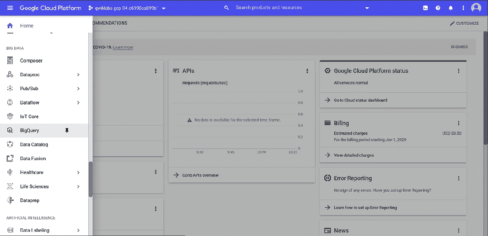
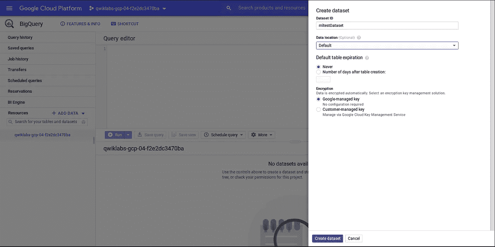
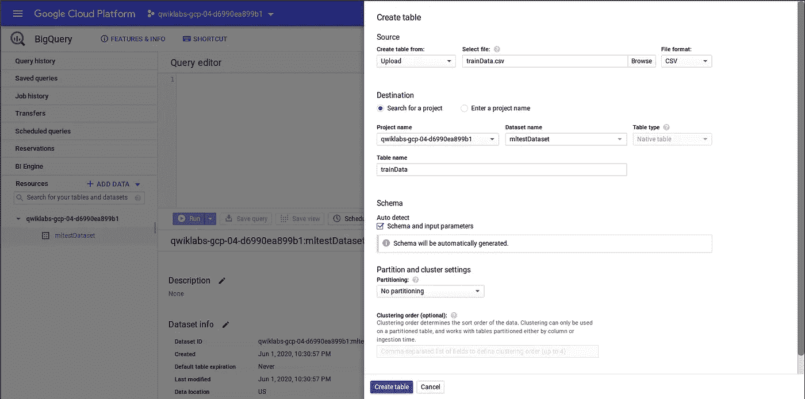
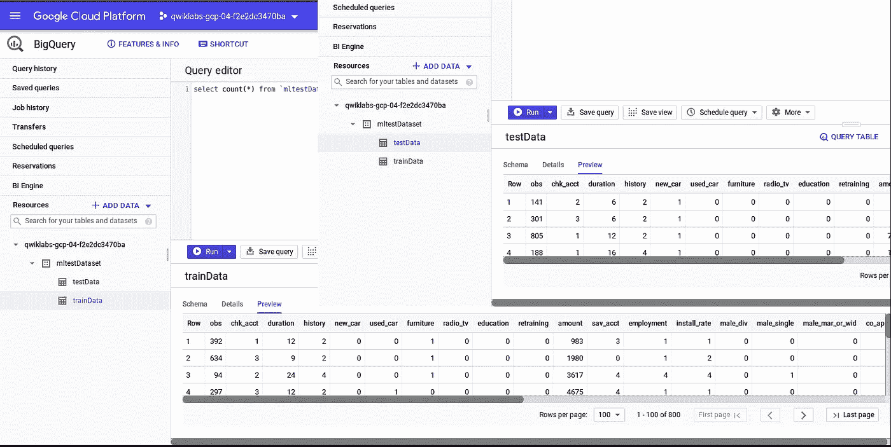
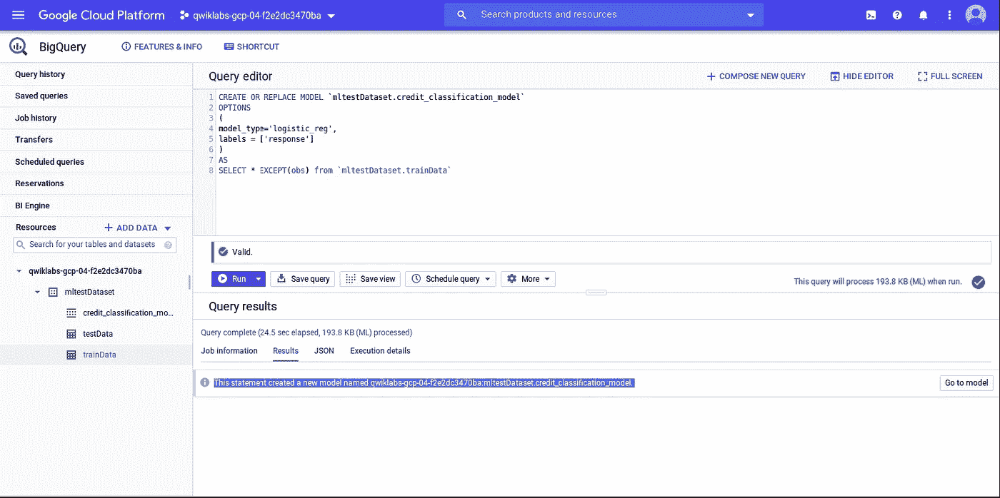
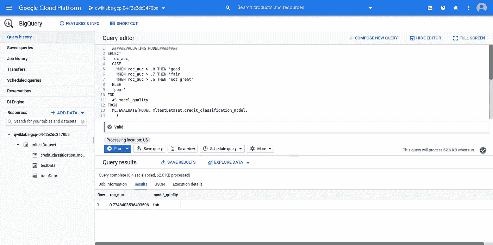
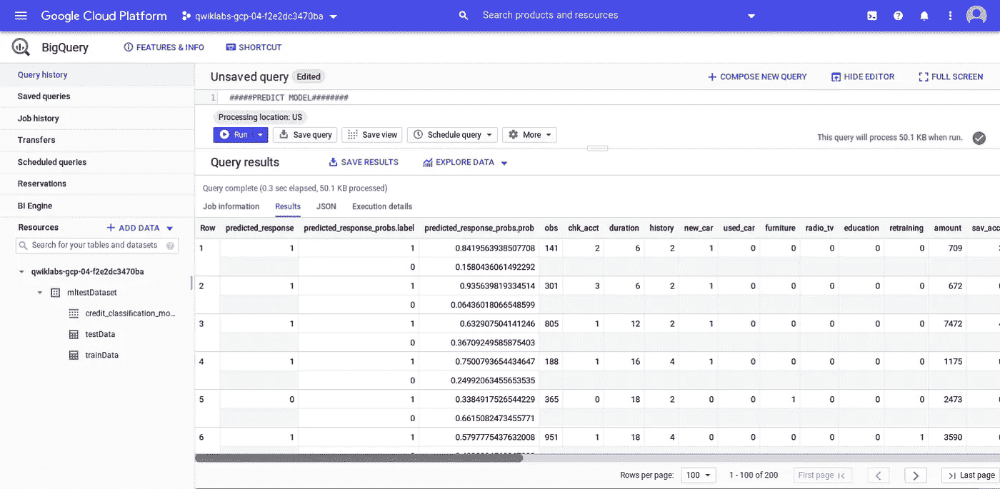

# 使用 SQL 通过 Google Cloud BigQuery ML 创建机器学习模型

> 原文：<https://towardsdatascience.com/create-a-machine-learning-model-with-google-cloud-bigquery-ml-using-sql-9e2c0ce7fd2d?source=collection_archive---------48----------------------->


我的简单白板

随着机器学习模型在不同领域的应用，以及技术的进步(更好的硬件和高级编程语言)，建立一个适合您需求的工作机器学习模型变得越来越容易。制作机器学习模型的过程越来越简单，代码行数越来越少。

在本文中，我将向您展示如何使用 Google BigQuery ML 构建一个只包含 SQL 的定制 ML 模型。

> ***但是首先，Google BigQuery 是什么？***

Google BigQuery 是一个无服务器、低成本、高可伸缩的数据仓库系统，由 Google Cloud Platform 提供，具有许多业务敏捷性特性。BigQuery ML 就是这样一个特性，它帮助数据科学家、数据分析师和数据工程师(比如我)构建可操作的生产级 ML 模型。我们可以在结构化和非结构化数据上创建模型。最重要的是，只需在短时间内使用 SQL 环境进行查询。

在本文中，我们将完成以下任务:

1.  使用“德国信用数据”作为样本数据集来预测贷款申请的好坏。
2.  将样本数据分为训练集和测试集。
3.  创建并加载 Google BigQuery 表中的数据。
4.  只需使用 SQL 创建一个“逻辑回归”模型。
5.  最后，我们将评估和预测贷款类型的好坏。

> ***我们将使用的样本数据:***

我们将使用一个样本结构化数据集“德国信贷数据”。您也可以从下面的 git 资源库下载这些文件:

[https://github . com/aa kash-ra thore/BigQueryML/tree/master/data](https://github.com/aakash-rathore/BigQueryML/tree/master/data)

```
├── data
│   ├── germanCredit.csv
│   ├── GermanCredit.xls
│   ├── testData.csv
│   └── trainData.csv
├── README.md
└── test_train.py
```

在存储库“GermanCredit.xls”的原始数据文件中，该文件提供了所有列数据的详细信息。我已经对所有分类数据进行了编码，并创建了一个文件“german credit . CSV”,“test _ train . py”是一个 python 脚本，用于将数据划分到测试和训练数据集中(testData.csv 和 trainData.csv)

> ***在 BigQuery 中加载数据:***

登录到 Google 云平台控制台，使用左侧选项面板导航到 BigQuery 选项卡。



在 GCP 控制台中选择 Bigquery 工具

使用 BigQuery 控制台中的选项创建数据集。



创建数据集

从先前创建的数据集中的 trainData.csv 和 testData.csv 创建表格。



创建包含列车数据的表创建包含测试数据的表

在选择相应的表后，我们可以使用“预览”选项预览创建的表中的样本数据。



预览表格数据

现在，我们可以开始创建一个 ML 模型，在我们的样本数据中,“响应”列是结果标签(1 =好，0 =坏),其他列是输入特征。令人惊奇的是，我们将只使用 SQL 查询来创建和评估我们的 ML 模型。

> ***创建 ML 模型:***

我们将创建一个逻辑回归模型，这是一个分类模型，在我们的案例中，我们将使用它来根据以前的信用报告数据对贷款申请进行分类。

**SQL 查询创建一个 ML 模型**:

```
# Creating logistic regression model using data from trainData tableCREATE OR REPLACE MODEL
  `mltestDataset.credit_classification_model` OPTIONS ( model_type='logistic_reg' labels=['response'] ) AS
SELECT
  * EXCEPT(obs)
FROM
  `mltestDataset.trainData`
```



从包含训练数据的表中创建模式

> ***评估创建的 ML 模型:***

评估 ML 模型有不同性能参数，在我们创建的 ML 模型中，当评估我们训练的 ML 模型时，roc_auc 是这样一个简单的可查询字段。

**评估 ML 模型的 SQL 查询:**

```
# Evaluating logistic regression model using data from testData tableSELECT
  roc_auc,
  CASE
    WHEN roc_auc > .8 THEN 'good'
    WHEN roc_auc > .7 THEN 'fair'
    WHEN roc_auc > .6 THEN 'not great'
  ELSE
  'poor'
END
  AS model_quality
FROM
  ML.EVALUATE(MODEL mltestDataset.credit_classification_model,
    (
    SELECT
      * EXCEPT(obs)
    FROM
      `mltestDataset.testData` ) )
```

**输出**:



使用曲线下的 ROC 面积评估模型性能

正如您可以看到的性能相当不错，我们可以通过使用特征工程调整模型来提高性能。但是为了简单起见，我们将使用这个模型来分析预测。

> ***预测使用创建的 ML 模型:***

现在我们将使用这个模型来预测贷款类型(1 =好，0 =坏)。下面给出了从模型中获取预测的查询:

```
# Getting prediction for our ML model using data from testData tableSELECT
  *
FROM
  ml.PREDICT(MODEL `mltestDataset.credit_classification_model`,
    (
    SELECT
      * EXCEPT(obs)
    FROM
      `mltestDataset.testData` ) );
```

**输出:**

我们将检查前 5 个预测:



检查预测

我们可以看到前 5 个预测的结果:
1。对于第一条记录，我们的模型以 84%的置信度预测贷款是好的(响应=1)，实际上，它是好的(响应=1)。
2。对于第二条记录，模型以 93%的置信度预测贷款是好的(响应=1)，实际上，它是好的(响应=1)。
3。对于第三条记录，模型以 63%的置信度预测贷款是好的(响应=1)，实际上，它是好的(响应=1)。
4。对于第 4 条记录，模型以 74%的置信度预测贷款是好的(响应=1)，实际上，它是好的(响应=1)。
5。对于第 5 条记录，模型以 66%的置信度预测贷款为不良贷款(响应=0)，实际上，它是不良贷款(响应=0)。

> **结论:**

在本文中，我解释了如何使用 SQL 在 Google BigQuery 中创建和评估 ML 模型。后来我们分析了这个模型的预测。

请在下面留下您对本文的评论，如果您在上面指定的任何步骤中遇到问题，您可以通过[**insta gram**](https://www.instagram.com/_aakash.rathore/)**和 [**LinkedIn**](https://www.linkedin.com/in/aakash-data-engineer) **联系我。****