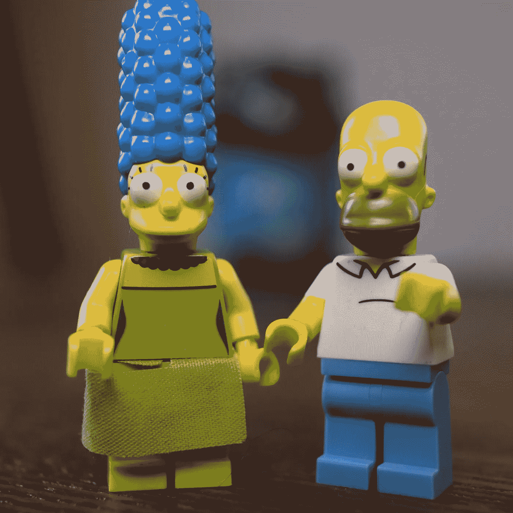

# 使用 Azure 自定义视觉和 Python 创建模型

> 原文：<https://towardsdatascience.com/create-a-model-with-azure-custom-vision-and-python-7bc5caed82c4?source=collection_archive---------30----------------------->

## 在这篇文章中，我想和你分享如何使用 [Azure Custom Vision](https://docs.microsoft.com/en-us/azure/cognitive-services/custom-vision-service/?WT.mc_id=AI4DEV01-blog-heboelma) 和 [Python SDK](https://docs.microsoft.com/en-us/python/api/overview/azure/cognitiveservices/customvision?view=azure-python&WT.mc_id=AI4DEV01-blog-heboelma) 创建一个分类模型。

# 为什么是 Python 而不是可视化界面？

答案很简单，如果你用代码构建训练过程，你可以在 Github 上对它进行版本化。让你的代码版本化意味着你可以回读你所做的，在一个团队中工作，如果你需要的话再运行一次。

让我们深入研究代码！在我们开始之前，我假设你已经安装了 [Python 3.6](https://www.python.org/downloads/) 。

# 在 Azure 中创建资源

您需要做的第一件事是创建一个 Azure 自定义视觉服务。如果你没有 Azure 套餐，你可以在第一个月获得 200 美元的点数。

您可以通过门户轻松创建 Azure 自定义 Vision 端点，但您也可以为此使用 [Azure CLI](https://docs.microsoft.com/en-us/cli/azure/install-azure-cli?WT.mc_id=AI4DEV01-blog-heboelma) 。如果你没有安装 Azure cli，你可以使用 pip 来安装。

```
pip install azure-cli
```

第一步是登录到您的 Azure 订阅，选择正确的订阅并为自定义 Vision 端点创建资源组。

```
az login az account set -s <SUBSCRIPTION_ID> az group create --name CustomVision_Demo-RG --location westeurope
```

自定义视觉服务有两种类型的端点。一个用于训练模型，另一个用于针对模型运行预测。

让我们创建两个端点。

```
az cognitiveservices account create --name CustomVisionDemo-Prediction --resource-group CustomVision_Demo-RG --kind CustomVision.Prediction --sku S0 --location westeurope –yes az cognitiveservices account create --name CustomVisionDemo-Training --resource-group CustomVision_Demo-RG --kind CustomVision.Training --sku S0 --location westeurope –yes
```

现在我们已经创建了端点，我们可以开始训练模型了。

# 一切都从一个问题开始



> 每一次机器学习之旅都是从一个你希望得到答案的问题开始的。在这个例子中，你要回答这个问题:它是一个荷马还是一个玛吉·乐高玩具？

既然我们知道了要问模型什么，我们可以继续下一个需求；那就是数据。我们的模型将是一个分类模型，这意味着模型将查看图片，并根据不同的类别对图片进行评分。因此，输出将是我 70%确信这是荷马，1%确信这是玛吉。通过选择得分最高的班级，并为置信度设置一个最低阈值，我们就知道图片上是什么了。

我已经为你创建了一个数据集，其中有 50 张荷马·辛普森乐高玩具的图片和 50 张玛吉·辛普森乐高玩具的图片。我拍摄这些照片时考虑了一些事情，使用了很多不同的背景，从不同的角度拍摄了这些照片。我确保照片中唯一的物体是荷马或玛吉，并且照片的质量在某种程度上是一致的。

[**在这里下载数据集**](https://www.henkboelman.com/media/45lkxosc/ai4dev01-dataset.zip)

# 训练模型

对于培训，我们将使用[定制视觉服务 Python SDK](https://docs.microsoft.com/en-us/python/api/overview/azure/cognitiveservices/customvision?view=azure-python&WT.mc_id=AI4DEV01-blog-heboelma) ，您可以使用 pip 安装这个包。

```
pip install azure-cognitiveservices-vision-customvision
```

创建一个名为“train.py”的新 Python 文件，并开始添加代码。

从导入所需的包开始。

```
from azure.cognitiveservices.vision.customvision.training import CustomVisionTrainingClient 
from azure.cognitiveservices.vision.customvision.training.models import ImageFileCreateEntry
```

接下来，为自定义视觉端点、自定义视觉训练密钥和存储训练图像的位置创建变量。

```
cv_endpoint = "https://westeurope.api.cognitive.microsoft.com" training_key = "<INSERT TRAINING KEY>" 
training_images = "LegoSimpsons/TrainingImages"
```

从培训开始，我们需要创建一个培训客户端。该方法将端点和训练密钥作为输入。

```
trainer = CustomVisionTrainingClient(training_key, endpoint= cv_endpoint)
```

现在您已经准备好创建您的第一个项目了。该项目以名称和域作为输入，名称可以是任何东西。领域是一个不同的故事。你可以要求列出所有可能的领域，并选择最接近你要完成的领域。例如，如果你试图对食物进行分类，你可以选择“食物”或“地标”作为地标。使用下面的代码显示所有域。

```
for domain in trainer.get_domains():   
   print(domain.id, "\t", domain.name)
```

您可能会注意到，一些域旁边有单词“Compact”。如果是这种情况，这意味着 Azure Custom Vision 服务将创建一个较小的模型，您可以导出该模型并在您的手机或桌面上本地运行。

让我们创建一个域设置为“General Compact”的新项目。

```
project = trainer.create_project("Lego - Simpsons - v1","0732100f-1a38-4e49-a514-c9b44c697ab5")
```

接下来你需要创建标签，这些标签和上面提到的类是一样的。当您创建了一些标签后，我们可以用它们来标记图像，并将图像上传到 Azure Custom Vision 服务。

我们的图像在文件夹中按标签/类别分类。玛吉的所有照片都在名为“玛吉”的文件夹中，荷马的所有照片都在名为“荷马”的文件夹中。

在下面的代码中，我们执行以下步骤:

*   我们打开包含训练图像文件夹的目录。
*   遍历在该文件夹中找到的所有目录
*   用文件夹名称创建一个新标签
*   打开包含图像的文件夹
*   为该文件夹中的每个图像创建一个包含文件名、文件内容和标签的 ImageFileEntry。
*   将此 ImageFileEntry 添加到列表中。

```
image_list = []
directories = os.listdir(training_images)for tagName in directories:
  tag = trainer.create_tag(project.id, tagName)
  images = os.listdir(os.path.join(training_images,tagName))
  for img in images:
   with open(os.path.join(training_images,tagName,img), "rb") as image_contents:
    image_list.append(ImageFileCreateEntry(name=img, contents=image_contents.read(), tag_ids=[tag.id]))
```

现在您有了一个包含所有标记图像的列表。到目前为止，Azure Custom Vision 服务中还没有添加任何图像，只创建了标签。

上传图片分批进行，每批最多 64 张图片。我们的数据集有 100 张图片，所以首先我们需要将列表分成 64 张图片。

```
def chunks(l, n):
  for i in range(0, len(l), n):
   yield l[i:i + n]
batchedImages = chunks(image_list, 64)
```

现在，我们已经将图像分成 64 个一批，我们可以将它们一批一批地上传到 Azure Custom Vision 服务。*注意:这可能需要一段时间！*

```
for batchOfImages in batchedImages:
  upload_result = trainer.create_images_from_files(project.id, images=batchOfImages)
```

现在您已经到达了最后一步，我们可以发布模型了。然后，它在预测 API 中可用，并准备好供应用程序使用。

每次训练你的模型都被称为一次迭代。当你有了新的数据，或者当你发现在现实世界中你的模型与预期的有所不同时，你通常需要重新训练你的模型。

Custom Vision 服务的概念是，您可以在特定的名称下发布模型的迭代。这意味着您可以有多个版本的模型供您的应用程序使用，例如，您可以用它非常快速地对您的模型进行 a-b 测试。

要发布模型的迭代，您需要调用 publish_iteration 方法，该方法需要几个参数。

项目 ID 和迭代 ID，这些是来自前面步骤的值。您可以为模型的发布选择一个名称，例如“最新”或“版本 1”。您需要的最后一个参数是您要将它发布到的资源的“资源标识符”。这是我们在开始时用 AZ 命令创建的 Azure 自定义视觉预测资源的资源标识符。

您可以使用此命令检索您创建的预测资源的所有详细信息:

```
az cognitiveservices account show --name CustomVisionDemo-Prediction --resource-group CustomVision_Demo-RG
```

您可以复制字段 ID 后面的值，如下所示:

```
/subscriptions/<SUBSCRIPTION-ID>/resourceGroups/<RESOURCE_GROUP_NAME>/providers/Microsoft.CognitiveServices/accounts/<RESOURCE_NAME>")
```

获得资源 ID 后，将其粘贴到下面的变量中，并调用“publish_iteration”方法。

```
publish_iteration_name = '' resource_identifier = '' trainer.publish_iteration(project.id, iteration.id, publish_iteration_name, resource_identifier)
```

现在您已经成功地训练并发布了您的模型！

简单回顾一下我们所做的工作:

*   您创建了一个包含 Azure 自定义视觉服务培训和预测端点的 Azure 资源组
*   您已经创建了一个新项目
*   在该项目中，您已经创建了标记
*   您分批上传了 64 张图片，并对其进行了标记
*   您已经训练了模型的迭代
*   您已经将迭代发布到预测端点

[**查看完整代码这里**](https://github.com/hnky/AI4DEV01-CustomVision/blob/master/train.py)

# 我们来测试一下模型！

在应用程序中使用模型就像调用 API 一样简单。您可以只对端点进行 json post，但也可以使用自定义 Vision Python SDK 中的方法，这将使事情变得容易得多。

创建一个名为“predict.py”的新文件

从导入预测所需的依赖项开始。

```
from azure.cognitiveservices.vision.customvision.prediction import CustomVisionPredictionClient
```

接下来你需要的是预测键。这是您将模型发布到的资源的键。您可以使用这个 az 命令来列出这些键。

```
az cognitiveservices account keys list --name CustomVisionDemo-Prediction --resource-group CustomVision_Demo-RG
```

当您拥有预测键时，您可以创建一个预测客户端。对于这个客户端，您还需要端点。您可以运行下面的 az 命令并复制字段“endpoint”后面的 url。

```
az cognitiveservices account show --name CustomVisionDemo-Prediction --resource-group CustomVision_Demo-RG
```

现在您有了预测键和端点，可以创建 PredictionClient 了。

```
predictor = CustomVisionPredictionClient(prediction_key, endpoint=ENDPOINT)
```

您有多种选择来对图像进行分类。您可以发送 URL，也可以将二进制图像发送到端点。默认情况下，Azure Custom Vision 服务会保存发布到端点的所有图像的历史记录。可以在门户中查看图像及其预测，并用于重新训练您的模型。但是，有时你不希望图像保留在历史中，因此可以禁用此功能。

我已经上传了两张图片，你可以用来测试，但是你也可以使用搜索引擎找到其他的图片，比如玛吉的图片和 T2 的图片。

要使用 URL 对图像进行分类并保留历史记录，您需要调用“classify_image_url”方法。您可以根据上面的几个步骤为它提供项目 id 和迭代名称，并提供图像的 URL。

```
results = predictor.classify_image_url(project.id,publish_iteration_name,url="https://missedprints.com/wp-content/uploads/2014/03/marge-simpson-lego-minifig.jpg")
```

要在屏幕上显示不同类别的分数，您可以使用下面的代码循环显示结果，并显示图像的标签名称和置信度分数。

```
for prediction in results.predictions:
  print("\t" + prediction.tag_name + ": {0:.2f}%".format(prediction.probability * 100))
```

现在，您已经完成了所有工作，并且拥有了自己的运行在云中的分类模型！以下是您所取得成就的回顾:

*   我们问了一个问题
*   收集的数据
*   创建了 Azure 自定义视觉服务端点
*   创建了新项目
*   标记和上传的内容
*   训练模型
*   发布迭代，以便它可以在 API 中使用
*   使用 API 对模型运行预测

在这一系列文章的其余部分，我们将把这个模型用于不同的解决方案！敬请期待！

[**查看完整代码这里**](https://github.com/hnky/AI4DEV01-CustomVision/blob/master/predict.py)

# 资源:

*   [如何安装 Azure CLI](https://docs.microsoft.com/en-us/cli/azure/install-azure-cli?WT.mc_id=AI4DEV01-blog-heboelma)
*   [通过 CLI 创建认知服务](https://docs.microsoft.com/en-us/azure/cognitive-services/cognitive-services-apis-create-account-cli?WT.mc_id=AI4DEV01-blog-heboelma)
*   [Python SDK](https://docs.microsoft.com/en-us/python/api/overview/azure/cognitiveservices/customvision?view=azure-python&WT.mc_id=AI4DEV01-blog-heboelma)
*   [定制视觉文档](https://docs.microsoft.com/en-us/azure/cognitive-services/custom-vision-service?WT.mc_id=AI4DEV01-blog-heboelma)