# 在 Power BI 中创建网络图

> 原文：<https://towardsdatascience.com/create-a-network-graph-in-power-bi-be232991ee06?source=collection_archive---------9----------------------->

## 数据科学/电力 BI 可视化

## 点击几下鼠标就能构建网络图的快速入门指南。

艾莉娜·格鲁布尼亚克在 [Unsplash](https://unsplash.com/s/photos/network?utm_source=unsplash&utm_medium=referral&utm_content=creditCopyText) 上的照片

*在上一篇* [*的文章*](/from-dataframe-to-network-graph-bbb35c8ab675) *中，我写了一个使用 networkx 和 matplotlib 可视化熊猫数据帧的快速入门指南。虽然学习和探索 Python 中的网络图很有趣，但我开始思考如何向那些机器上没有安装 Python 或 Jupyter Notebook 的人展示结果。在*[*task us*](https://www.taskus.com/)*，我们在大部分报告中使用 Power BI，因此我开始寻找一种定制的 Power BI 可视化技术，它可以获取数据并将其转换为有意义的网络图。*

进入网络导航器。

Network Navigator 是微软创建的 Power BI 中的一个自定义可视化工具。它允许您“通过平移和放大受力控制的节点布局(可以预先计算或实时制作动画)来浏览节点链接数据。”在本帖中，我们将通过使用自定义可视化工具创建网络图所需的步骤。

首先，让我们得到我们的数据。你可以在这里下载样本数据集[。然后，我们可以将数据加载到 Power BI Desktop 中，如下所示:](https://github.com/ecdedios/networkx-quick-start)

选择文本/CSV 并点击“连接”。

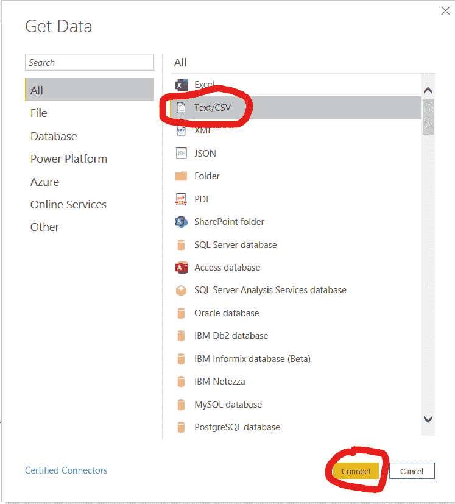

在 Windows 资源管理器文件夹中选择文件，然后单击打开:

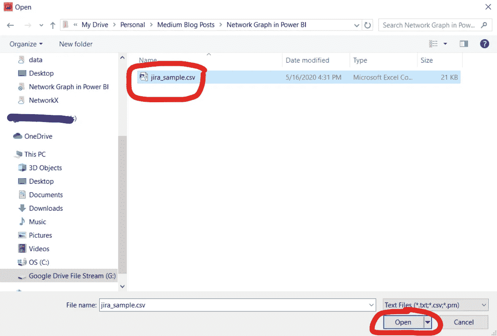

点击“转换数据”。

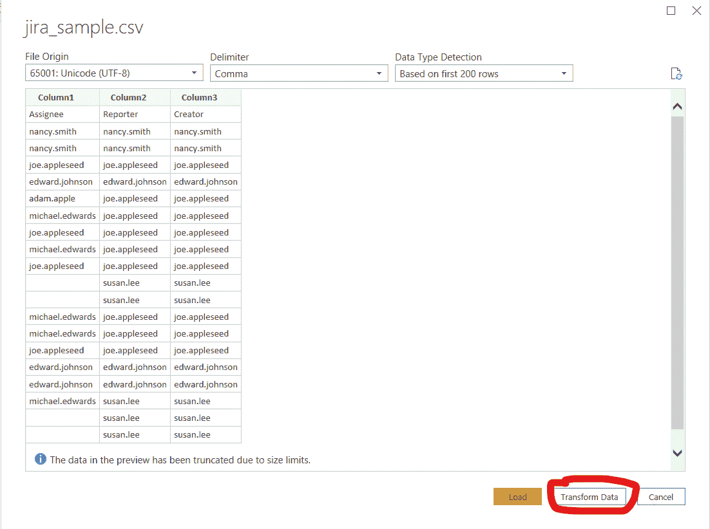

点击“使用第一行作为标题”。

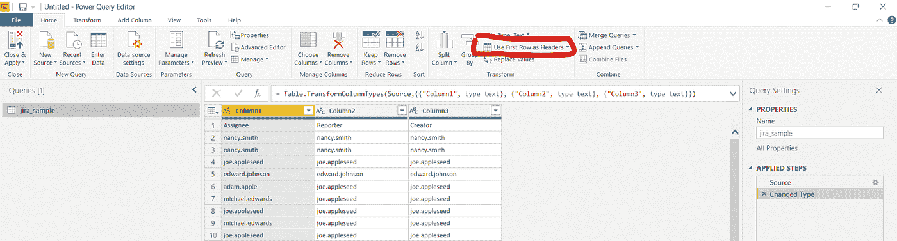

点击“关闭并应用”。

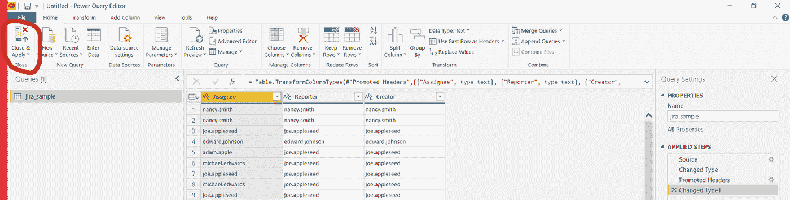

接下来，找到“可视化”面板末端的三个点。

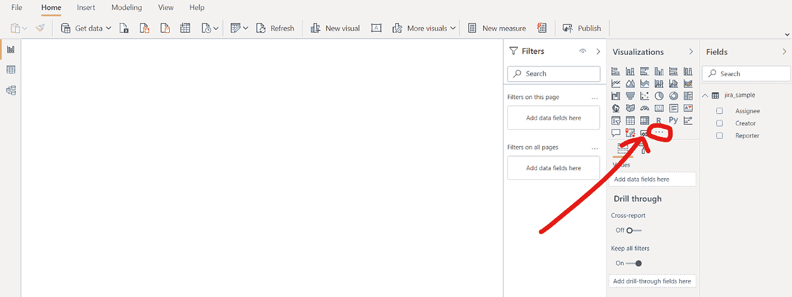

并选择“获得更多视觉效果”。

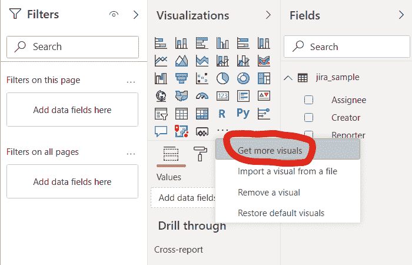

将鼠标光标指向搜索文本框，输入“网络”，按“回车”键，然后单击“添加”按钮。

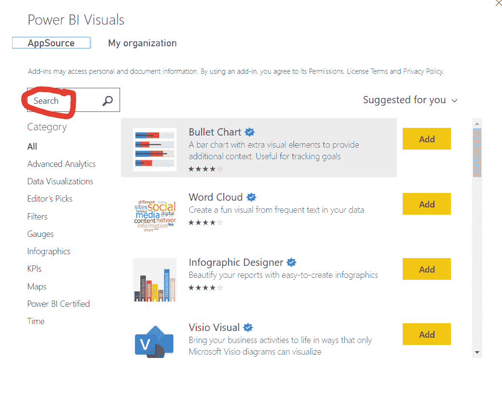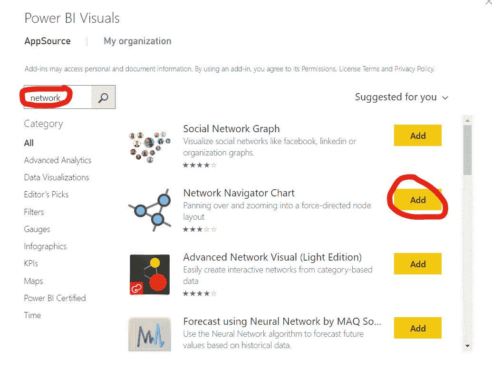

稍等片刻，您将看到下面的通知。单击“确定”按钮关闭通知。

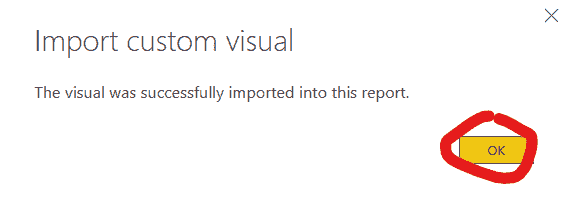

你会看到一个新的图标出现在“可视化”面板的底部，如下所示。

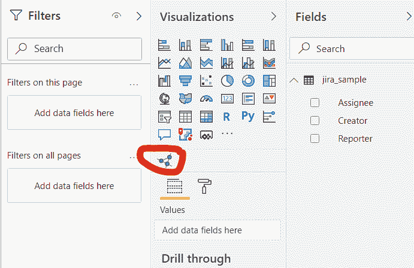

点击新图标，你会看到类似下图的东西。

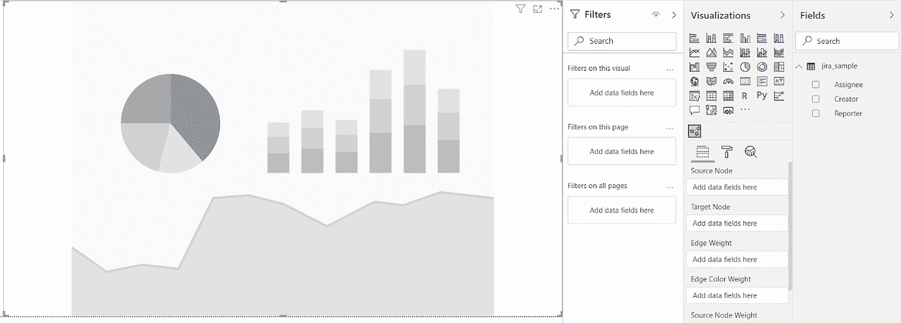

选择新的可视占位符后，单击“Fields”面板中的“Reporter”和“Assignee ”,它会自动将列分配为源节点和目标节点。

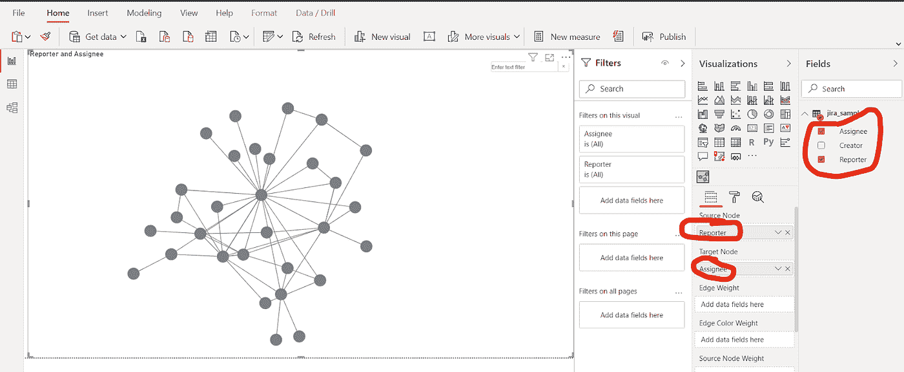

让我们通过点击画笔图标来添加标签。

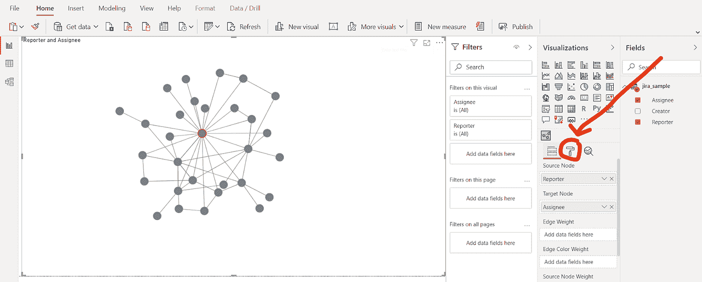

单击“布局”展开该部分，并向下滚动，直到看到“标签”部分。

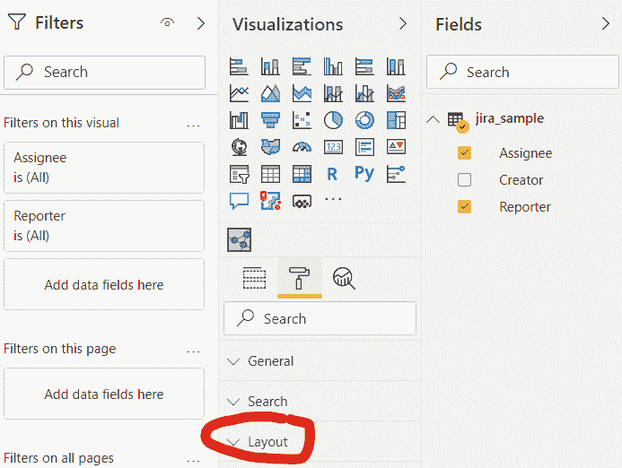

点击“标签”下的切换开关将其打开

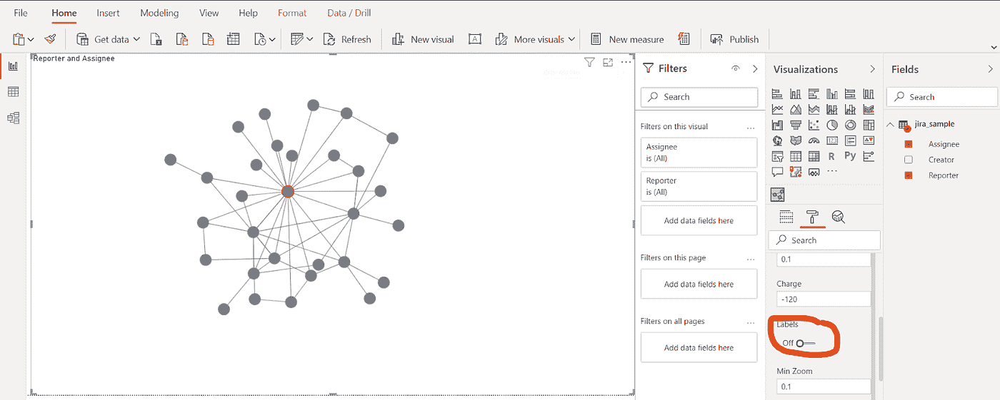

瞧啊。

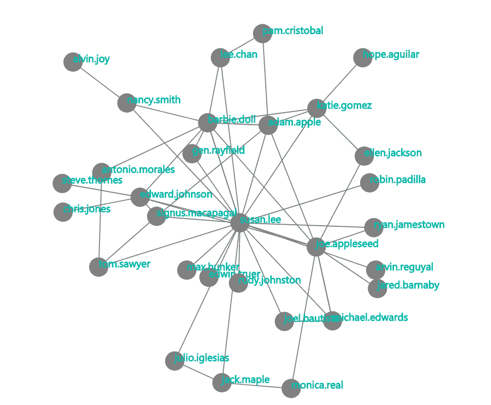

就是这样！只需点击几下鼠标，我们就能从 csv 文件创建网络图。

我希望你喜欢今天关于 Power BI 最酷的视觉效果之一的帖子。网络图分析是一个大话题，但我希望这个温和的介绍将鼓励你探索更多，扩大你的曲目。

在下一篇文章中，我将分享我从懒鬼到数据科学家的旅程，我希望它能激励其他人，而不是被仇恨者劝阻。

*敬请期待！*

你可以通过[推特](https://twitter.com/ecdedios)或 [LinkedIn](https://www.linkedin.com/in/ednalyn-de-dios/) 联系我。

[1]:商业应用程序—微软应用程序源。(2020 年 5 月 16 日)。*网络领航员图表*[https://app source . Microsoft . com/en-us/product/power-bi-visual s/wa 104380795？src = office&tab = Overview](https://appsource.microsoft.com/en-us/product/power-bi-visuals/WA104380795?src=office&tab=Overview)