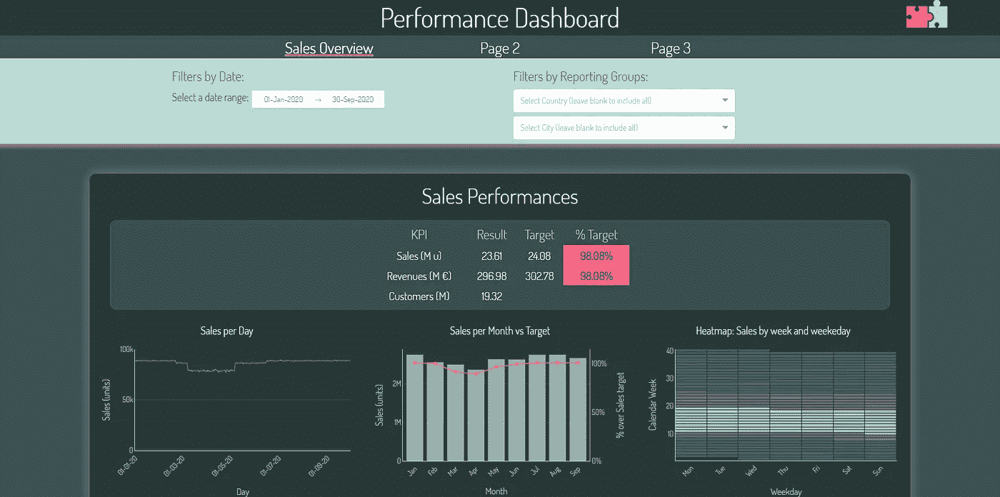
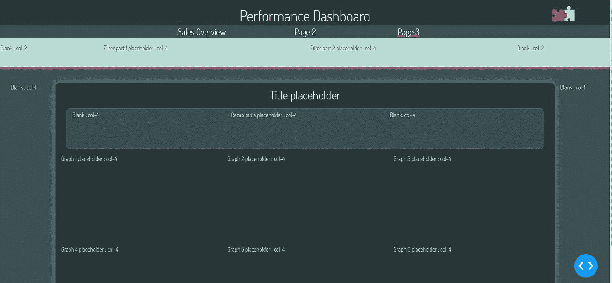
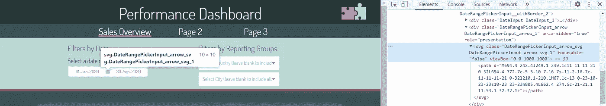
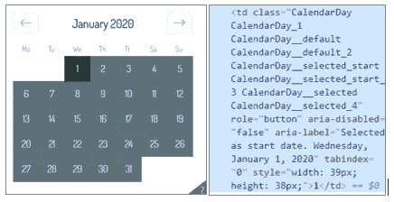
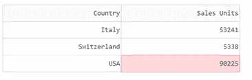
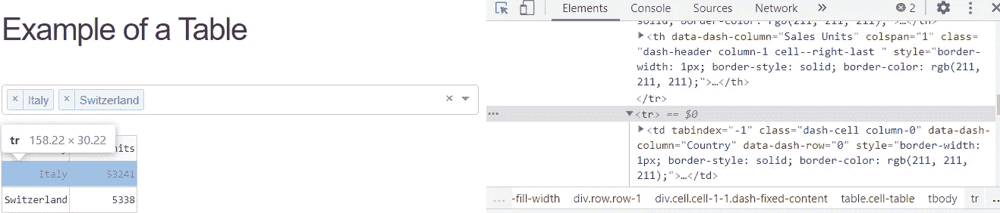
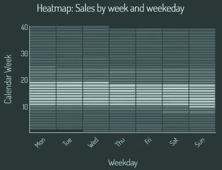
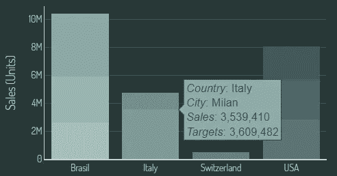

# 使用 Dash 和 CSS 引导创建专业仪表板

> 原文：<https://towardsdatascience.com/create-a-professional-dasbhoard-with-dash-and-css-bootstrap-e1829e238fc5?source=collection_archive---------1----------------------->

## [实践教程](https://towardsdatascience.com/tagged/hands-on-tutorials)

## 在 [Git](https://github.com/gabri-al/corporate-dashboard) 和 [Heroku](https://corporate-dash.herokuapp.com/) 上有一个逐步解释的例子

# 介绍

在本文中，我将按照我的步骤创建一个交互式仪表板，使用 PlotlyDash，一个 Python 和 R 的库，并使用 CSS Bootstrap 增强布局。

> D ash 库基于 Flask、Plotly.js 和 React.js 编写，允许用纯 Python 构建数据可视化应用程序，通过 web 浏览器呈现。

我产生的最终结果可以显示在这里:[https://corporate-dash.herokuapp.com/](https://corporate-dash.herokuapp.com/)

作者图片

这是一个多页仪表板，模拟一个业务场景，其中通常有一些布局指南要遵守(公司颜色方案、预定义的字体、可以激励我们的公司网站等)和一些与销售相关的 KPI 要监控。

第一页充满了不同类型的图表(散点图、条形图、气泡图、热图)和一个摘要表，带有随机数据；其他页面是空白的，但是对于展示如何构建多页面结构很有用。

在本文中，我将介绍:

[**1。仪表板目标**](http://medium.com/gabri-albini/create-a-professional-dasbhoard-with-dash-and-css-bootstrap-e1829e238fc5#ab91)

[②**。破折号**入门](http://medium.com/gabri-albini/create-a-professional-dasbhoard-with-dash-and-css-bootstrap-e1829e238fc5#b13a)

[**3。为多页仪表板配置文件夹结构**](http://medium.com/gabri-albini/create-a-professional-dasbhoard-with-dash-and-css-bootstrap-e1829e238fc5#059c)

[**4。用 CSS 引导网格系统概念化布局**](http://medium.com/gabri-albini/create-a-professional-dasbhoard-with-dash-and-css-bootstrap-e1829e238fc5#4adb)

[*4.1 用 CSS Bootstrap 构建布局框架*](http://medium.com/gabri-albini/create-a-professional-dasbhoard-with-dash-and-css-bootstrap-e1829e238fc5#469c)

[*4.2 样式破折号组件访问它们的 CSS 类*](http://medium.com/gabri-albini/create-a-professional-dasbhoard-with-dash-and-css-bootstrap-e1829e238fc5#0767)

[5。**回调&组件**](http://medium.com/gabri-albini/create-a-professional-dasbhoard-with-dash-and-css-bootstrap-e1829e238fc5#f8c5)

[*5.1 多下拉筛选:如何拥有“全选”选项*](http://medium.com/gabri-albini/create-a-professional-dasbhoard-with-dash-and-css-bootstrap-e1829e238fc5#b179)

[*5.2 用热图揭示季节性模式*](http://medium.com/gabri-albini/create-a-professional-dasbhoard-with-dash-and-css-bootstrap-e1829e238fc5#a4a9)

[*5.3 悬停在数据点上时提供附加信息*](http://medium.com/gabri-albini/create-a-professional-dasbhoard-with-dash-and-css-bootstrap-e1829e238fc5#0d77)

[⑥**⑥。如何部署和共享仪表板**](http://medium.com/gabri-albini/create-a-professional-dasbhoard-with-dash-and-css-bootstrap-e1829e238fc5#fd73)

[**7。结论**](http://medium.com/gabri-albini/create-a-professional-dasbhoard-with-dash-and-css-bootstrap-e1829e238fc5#9a04)

# 1.仪表板目标

仪表板旨在提供一些与业务相关的 KPI 的清晰而准确的视图，使最终用户能够理解所呈现的内容，找到所需的信息，应用一些过滤器，并有希望得出一些结论。

这个仪表板设计得像一个网站，由不同的页面组成，顶部有一个导航条。

每个页面内容分为三个部分:

*   可以应用于页面中显示的所有图表的一些顶级过滤器
*   摘要表也显示在顶部，使用户能够快速浏览主要 KPI。理想情况下，目的是让用户避免浏览页面上的每一个图表，而是通过查看摘要表就能立即发现应该关注的地方。这个摘要表有一些条件颜色格式，就像交通灯一样，突出显示正/负值。
*   最后是一个图表网格，显示了主要 KPI 的不同视图

我有意避免为用户提供任何导出底层数据的方法:由于对数据隐私和数据丢失的担忧日益增加，仪表板只打算使用聚合数据。最终用户无法获得原始数据点。

# 2.Dash 入门

plotly Dash 有大量的用户指南和介绍。

我个人发现浏览这些资料非常有用，这解释了大量的例子:

*   Dash 官方网站[https://dash.plotly.com/](https://dash.plotly.com/)非常有用，易于阅读和导航，显示所有可用的组件及其主要属性
*   本文从里到外解释了一个非常完整详细的例子:[https://towardsdatascience . com/how-to-build-a-complex-reporting-dashboard-using-dash-and-plotl-4f 4257 c 18 a 7 f](/how-to-build-a-complex-reporting-dashboard-using-dash-and-plotl-4f4257c18a7f)
*   我还寻找了大量 Youtube 视频，展示如何创建和定制基本的 Dash 布局和回调

尽管查阅了所有这些有用的资料，我不得不面对许多挑战，尤其是为了理解如何按照我想要的方式定制 Dash 组件。

出于这个原因，我也将在下面的步骤中关注这一方面:增强的功能和布局，最终结果的视觉识别是一个非常重要的方面，可以产生影响。

# 3.为多页仪表板配置文件夹结构

应按照 Dash 指南(【https://dash.plotly.com/urls】T2)的建议构建应用程序源代码文件，以实现多页面导航。基于这个指南，我使用了以下方法来最小化任何代码更改或改编。

我的根文件夹包含:

*   *app.py* :这个文件很基础，只会定义 Flask 需要的 app 变量。我只是简单地遵循 Plotly Dash 指南来创建这个文件。
*   index.py :这是一种导航文件，帮助应用程序管理不同页面的 URL。此外，这个文件是非常标准的:我建议遵循 Plotly Dash 指南，因为我们只需要自定义路径名就可以了。
*   *layouts.py* :所有页面 html 布局都将存储在这个文件中。考虑到一些组件(如页眉或导航条)必须在每个页面上重复，我创建了一些函数来返回它们，避免了代码中的重复
*   *callbacks.py* :所有回调(Dash 组件背后的函数，定义用户与图形的交互)都将存储在这个文件中

在根文件夹中，Dash 将查找:

*   “*数据*子文件夹:包含仪表板的底层数据
*   一个“*资产*”子文件夹:包含附加文件，如:图像；收藏夹图标，供浏览器使用；。css 文件

如果 assets 子文件夹遵循这种结构，应用程序将自动检测并使用 favico.ico 文件或。css 文件，不需要任何代码！只需将图像命名为“favicon.ico ”,并将其放在 root/assets 中，Dash 就会自动使用它。

根文件夹中还有一些附加文件(例如。gitgnore，README.md，Procfile，requirements.txt):在 Heroku 上部署 app 或者在 Git Hub 上存储代码都需要这些文件。

# 4.用 CSS 引导网格系统概念化布局

有了应用程序文件夹结构，接下来要配置的是页面的整体布局。谈一个 web 应用布局不能不提。css 文件，集中了几乎所有的布局属性，可以被浏览器读取。

用很少的话来说。css 文件定义 html 组件的属性(字体属性、大小、颜色、背景等)，Dash 也使用这些属性。

应用程序将开始应用布局属性到相应的 html 组件，从。存储在应用程序的“资产”文件夹中的 css 文件。

需要注意的是:如果同一个 html 组件的属性(例如 H2 html 标题字体系列)在多个。css 文件，应用程序读取的最后一个文件(让我们忽略！重要的 css 后缀)。

CSS 属性也可以通过创建一些自定义的“类”来定义，然后分配给我们想要样式的 html 组件(如 div)。

在我的例子中，我用了 3。css 文件，我用一些前导数字来命名，以确保应用程序以特定的顺序读取它们:

*   自定义字体，定义应用程序使用的新字体系列(你可以从谷歌下载字体系列，复制它们。css 内容。请注意，在字体文件中，有一些应用程序将下载的 URL。如果您的应用程序将在离线环境中运行，您应该下载这些 url 的内容，并将其放在一个子文件夹中:root/assets/fonts，在字体中根据该路径名调整 URL。css 文件)
*   自举。css 标准文件，我将在下面描述(我基本上是从 Bootstrap [网站](https://getbootstrap.com/docs/3.4/getting-started/)下载的官方 CSS 文件)
*   一个“corporate-style.css”包含了我在布局中引入的所有定制

我已经看到许多精彩的破折号例子使用了基本的。css 模板(【https://codepen.io/chriddyp/pen/bWLwgP.css】T2):这不是应用程序的要求，我选择不在我的仪表板上使用它(我已经使用了官方的。而是 css 引导文件)。

## 4.1 使用 CSS Bootstrap 构建布局框架

CSS Boostrap 提供了很多预定义的。我们可以重用的 css 属性、类和布局功能。CSS Bootstrap 以著名的“网格系统”而闻名，它可以根据所用设备的大小来帮助缩放网站页面。

简而言之，我们可以将我们的网页想象成一个由 12 行和 12 列组成的表格:我们的 html 组件可以放在这个网格中，它将根据显示它的设备的屏幕而具有动态的大小。

我认为这对我获得我心目中的布局帮助很大，如下所示:

作者图片

我已经开始从不同的部分(我的页面的“行”)考虑布局，然后在脑海中描绘仪表板的不同列。

我假设，就像在商业场景中一样，一些颜色已经是企业视觉识别的一部分(在这种情况下，是一种带有一些粉色元素的绿色调色板),我选择了一个很好的字体系列，名为 Dosis。

之后，我一直在创建图片中的方案，用不同的占位符和引导列。我用过的 css 类。

在 CSS 引导网格系统中，不同的。div 元素是嵌套的，每个元素都有自己的类，从一行开始，然后是一列或多列。CSS Bootstrap 有不同的列类，从 col-1 到 col-12，这意味着我们可以拥有我们希望的动态列宽，从最大宽度的 1/12 开始，直到使用全部可用宽度(12/12)的列。在每一列中，可以嵌套另一个. Div 的行列序列。

所有这些类都可以分配给 html。Div([])元素，位于它们的 className 属性中。

该系统有助于保持仪表板的每个部分有序，每个仪表板组件都有一个指定的区域，该区域对所使用的屏幕也是动态的。

例如，下面的结构被用来设计标题、导航条和过滤器的样式。

**割台**包括:

*   外部 html。Div 组件，它有一个. CSS“row”类，用背景色进行样式化
*   三个 html。Div 组件，在行内；每个都代表一个“col”。css 类(记住这些列宽度的总和必须等于 12):一个 className="2-col" div(一个宽度为 2/12 的列)，它将保持为空，只是为了确保标题居中；一个 8 列的 div，包含主页标题，最后是另一个 2 列的 div，包含公司徽标图像

作者图片

**导航条**，包括:

*   在行的两侧有两个空的列 3 格
*   三个中央 col-2 div，每个都包含一个 dcc。链接破折号组件，可用于从一个页面切换到另一个页面。dcc。当前页面的链接页面采用不同的样式，突出显示用户所在的页面

作者图片

**过滤器**部分由以下部件组成:

在外部，我们有一个行和列 div:

*   外部 html。具有“行粘顶”类的 Div。这是一个 Bootstrap 类，和 row 一样，但是它会停留在页面的顶部，即使用户向下滚动。
*   在行内，有一个 12 列的 Div，带有一些样式属性

在 12 列 div 列中，我们有另一个“行”Div，包含以下一组列:

*   内部行两侧的两个空 col-2 div
*   两个 col-4 div，在内部，每个都包含滤波器组件:一个 dcc。DatePickerRange 和两个 dcc。下拉组件

作者图片

## 4.2 样式化 Dash 组件访问它们的 CSS 类

一旦定义了布局，从用户界面的角度来看，下一个挑战是正确地设计每个 Dash 组件的样式，比如日期范围(dcc。DatePickerRange)、下拉筛选器(dcc。下拉)等。

所有这些组件都有一个“样式”属性，在这里我们可以定义想要样式化的 css 属性，比如字体大小、颜色、空白等等。我们想要实现的大多数布局增强，都可以通过在 Dash 组件的“样式”中定义正确的 css 属性来实现。然而，我在对这些组件的一些特性进行样式化时面临着不同的挑战，这似乎无法从它们的“样式”属性中获得。我在网上看过许多不同用户的类似挑战，想知道如何设计这些组件的某些功能或细节。

我认为这里的主要挑战是识别 Dash 使用的 CSS 属性。事实上，有一种方法可以指向并单击，或者“检查”页面上的每个元素，并揭示定义它的 CSS 属性。

事实上，我们可以在浏览器中运行应用程序，右键单击页面并选择“Inspect”:这将在页面右侧弹出一个窗口，我们可以在其中浏览页面的 html 和 css 代码。在页面顶部，我们可以点击这个工具

作者图片

我们最终可以将鼠标悬停在想要设置样式的元素上，并获取其所有 CSS 类和属性，以了解要更改/重定义什么。

## 4.2.1 示例:设置 DatePickerRange 元素的样式

默认情况下，DatePickerRange 如下所示:

作者图片

我们可以从“样式”属性中改变组件布局，定义字体大小，添加一些颜色的边框，等等。但是如何修改分隔开始日期和结束日期箭头呢？如何更改突出显示所选日期或助手图标周围的绿色？

这些元素似乎无法从“样式”属性中获得，我们必须使用不同的方法来更改它们的布局属性。在浏览器中，如果我们检查并选择箭头，我们会看到类似这样的内容:

作者图片

该组件使用了一些 CSS 类，我们可以通过在自定义 CSS 文件中添加一些代码来修改这些类，从而将箭头强制调整为新的大小:

作者图片

同样，我们可以通过检查日历选择来揭示如何更改日历样式:

作者图片

通过分析这一因素，似乎”。CalendarDay__selected”是所选日期极值的 CSS 类，而“CalendarDay__selected_span "是用于两个极端之间的所有日子的 CSS 类。可以使用这些类来改变日历的背景颜色(并在鼠标悬停在不同日期时定义一些布局修改)。我已经将下面的代码添加到自定义 CSS 文件中:

作者图片

("!“important”覆盖同一 CSS 元素或类的任何其他布局定义)。

## 4.2.2 示例:样式 a dash_table。数据表元素

我发现另一个难以设计的元素是我在仪表板顶部的摘要部分使用的数据表。

默认情况下，数据表有一个功能，可以选择一个单元格，使它以粉红色/红色背景出现。此外，通过使用默认的 CSS 引导文件，默认设置会将我们悬停的所有表格行的背景颜色更改为白色。

作者图片

我想真正改变这两个与我的整体布局相冲突的默认属性。

首先，可选单元格实际上不是一个 CSS 属性，而是一个可以被禁用的组件属性:在创建 DataTable 时添加“cell_selectable = False”会删除此功能。

为了改变行悬停的颜色，用之前解释过的方法我们可以看到，DataTable 行实际上是 html 元素，与特定的 CSS 类没有关联。

作者图片

为了自定义当鼠标悬停在行上时的背景颜色，我在自定义 CSS 文件中添加了以下内容:

作者图片

# 5.回调和组件

一旦定义了仪表板布局，并且图表和过滤器组件已经放置在页面上，让我们转到回调。

我将介绍一些回调的例子，重点是我用过的最麻烦的例子。

## 5.1 多下拉过滤器:如何拥有“全选”选项

仪表板通常包括一个或多个下拉过滤器，允许用户同时选择一个或多个值。

在非常简单的情况下，下拉组件“背后”不应该有任何回调:用户选择一个或多个下拉选项；所选的值通常是其他回调函数的“输入”，这些回调函数调整图表上显示的内容。

然而，在更复杂的情况下，我们可能希望有一个多下拉选择，其中第二个下拉的选项取决于第一个下拉的选择。在我创建的例子中，我有一个国家下拉列表和一个城市下拉列表:城市下拉列表选项，当然取决于已经选择的国家。

更复杂的是，我注意到 Dash 中没有“全选”的现成功能。特别是在下拉选项是长列表的情况下，强烈建议添加一个“全选”的方法，否则我们每次想要分析所有值时都需要逐个输入所有选项。此外，我还想以一种“无选择”(即将下拉列表留空)意味着考虑所有选项。

为了实现这里描述的所有特性，我遵循了下面列出的步骤。

## 创建选项列表

首先，我为每个下拉组件创建了一个选项列表。我随机创建的数据在一列中包含“国家”信息，在另一列中包含“城市”信息。我简单地创建了两个唯一的列表，一个用于所有可能的城市，另一个用于所有可能的国家，我添加了一个“(全选)”条目，我希望它位于选项列表的顶部。

接下来，我在页面布局中包含了 Dropdown 组件，只需指定“multi”属性:

作者图片

## 5.1.2 动态管理选项列表

然后，我定义了一个回调，它将第一个下拉列表中的值(选择)列表作为输入，将第二个下拉列表中的选项列表作为输出返回。

鉴于选项列表取决于值，我生成了一个字典，其中每个键都是第一个下拉列表的可能值，每个值都是第二个下拉列表的所有可能选项的列表。结果如下所示:

*{巴西:[福塔莱萨，里约热内卢，圣保罗]，*

*【米兰、威尼斯】，… }*

为了完成回拨，一些关键的考虑事项是:

*   第一个下拉列表中的“值”将是一个 python 列表
*   该列表可能包含也可能不包含“全部”选项
*   将值列表留空意味着我们将把['']作为回调的输入

作为第一步，我创建了一个变量(isselect_all)，用于确定用户是否将第一个下拉列表留空，或者用户是否选择了“全选”，或者这两种可能性都没有。

在前两种情况下，回调只是返回所有可能城市的排序列表。否则，用户将分别选择一个或多个国家，因此我将使用之前创建的字典(我将其命名为 repo_groups_l1_l2)来计算所有可能城市的排序列表。

作者图片

## 5.2 通过热图揭示季节性模式

在所有可能的图表中，当我们想要绘制三维图并显示数据的季节性或模式时，热图是理想的。例如，我包含了一个热图来显示全年(在我的例子中是周数)和一周中的某一天的销售趋势，以查看这两个维度上是否有任何季节性。

x 轴表示工作日，y 轴表示日历周数；每个单元格将根据销售量进行着色。热图还需要响应过滤器(基于日期和城市和国家下拉)。

## 5.2.1 热图:布局

首先，让我们在 dash 布局中包含一个热图占位符。在下面的代码中，headtmap 将位于 id 为“sales-weekly-heatmap”的最后一列:

作者图片

## 5.2.2 热图:回拨概述

然后，让我们转到回调，它将有:

*   输入:不同的过滤器——在我的例子中，这些是日期选择器中的开始和结束日期，以及“国家”和“城市”下拉选择
*   输出:上面的 dcc。图形“数字”元素
*   第一部分:数据准备。回调将使用 datasource(由单个 dataframe 组成),并按周 nr 过滤和聚集数据。和工作日
*   第二部分:图形准备(使用 Plotly: go。热图)。该图表将使用预定义的色标，我通过一个函数自定义创建

## 热图:数据准备

在数据准备部分，我必须包含一些语句来处理两个下拉选择的“全选”。如果用户已经从下拉列表中选择了该选项，则数据框架不需要按照国家/城市进行过滤；否则，仅考虑用户从初始完整数据帧中选择的值:

作者图片

然后，我按开始日期和结束日期过滤数据框架，最后按周数和工作日汇总:

作者图片

## 热图:图形配置

为了在仪表板上绘制一些漂亮且一致的图表，我创建了一个 go。回调文件顶部的 Layout()变量(名为 corporate_layout)。此布局变量包括许多属性，这些属性在所有仪表板图表中几乎都是相同的(图表透明背景、字体系列、标题字体大小、网格线、零线、总高度、图例、边距等等)。

在每个图表回调中，一个新的 fig = go。图(data=data，layout=corporate_layout)已定义。这允许更新 fig 布局(通过这个命令:fig.update_layout())以适应 corporate_layout 并包括图表标题和轴标题。

使用这种方法，图表的主要布局只定义一次:这有助于保持代码的整洁，同时也很灵活；也就是说，为了改变所有图表的高度，我们只需要调整整个代码中的一个变量。

关于 go 的“数据”部分。我用了一个 go。Heatmap()，包括一个色标，我将在下面描述它。

作者图片

## 5.2.5 热图:添加自定义色阶

Plotly 热图包括一些标准色阶，我们可以从中选择，或者我们可以指定一个自定义创建的色阶。

Plotly 提供了一些指令([此处可用](https://plotly.com/python/reference/heatmap/#heatmap-colorscale))来创建自定义色标。我使用的色阶是这样的:根据每个数据点的百分比，热图使用的 11 种颜色的列表。

作者图片

为了以某种渐变顺序生成颜色，我创建了一个函数，它将我们需要生成的颜色数量和两种颜色的 RGB 值作为输入:一种是“起点”，另一种是“目标点”。对于每种颜色，该函数以相同的量递增 RGB 值，直至达到目标值。这是一个非常简单的方法，但是这个函数可以满足目的:

作者图片

我们最终可以将色阶添加到热图中，以揭示一些季节性:正如我们所见，销售额似乎在第 10 周和第 20 周之间下降；然后他们开始增加，在第 25 周达到同样的水平。在一周的几天里，我们没有明显的季节性。

作者图片

## 5.3 悬停在数据点上时提供附加信息

在 Dash 中，可以定义 hovertemplates 来指定当用户将鼠标悬停在数据点上时，什么数据以什么格式显示。

除了图表已经使用的数据(例如，x 和 y 值)之外，在 hovertemplate 中包含附加信息可能很有用。官方文件提供了有用的选择:我将展示我发现最有效的一个。

在下面的图表中，我创建了一个堆积条形图，其中每个国家由每个竖条表示，将销售额显示为每个城市个人销售额的总和。悬停时，我还想显示关于总目标而非销售额的信息:

作者图片

城市的“目标”是数据源中存在的信息，但它并没有显示在图表中:悬停模板从哪里获取这些信息？

我采用的方法是在图表使用的 dataframe 中创建一个新列，包含我想在 hovertemplate 中显示的所有信息:

作者图片

Plotly hovertemplate 需要一些 html 格式:“T2””例如，意味着内容将是斜体； <extra></extra> 用于清除数据点的痕迹名称。值使用 d3 格式的语法进行格式化(如 Plotly [这里的](https://plotly.com/python/reference/scatter/#scatter-hovertemplate)所解释的):“{:，d}”用于包含千位分隔符(如果您想知道这对于其他值类型如何工作:具有两位小数的百分比可以这样格式化:“{:. 2% }”；日期的格式可以是:“{x|%a，%d-%b-%Y}”。

一旦数据中有了 hovertext，我们就可以在图表中使用它，只需将 dataframe 列分配给图表 hovertemplate。

# 6.如何部署和共享仪表板

通过 Dash 创建的仪表板可以部署为 Flask 应用程序。Heroku 无疑是让应用程序在线可用的最有效的方法之一(而且是免费的)。

我用来部署这个应用程序的指南通过[这个视频](https://www.youtube.com/watch?v=b-M2KQ6_bM4)得到了很好的解释，包括一个大约。让这款应用上线的 15 个步骤。

# 7.结论

Plotly Dash 绝对是一个有趣且非常强大的 Python 库:我一直在寻找一种快速的方法来自动进行可重复的分析，并且非常好地呈现出来，这绝对达到了目的！

凭借 Python 知识、一些 html 和 css 经验，我能够在几周的空闲时间里实现这个仪表板:我必须说，将 CSS Bootstrap 体现到布局中产生了变化，并且肯定允许构建一个底层“网格”,允许以我想要的方式非常容易地控制仪表板的每个部分。