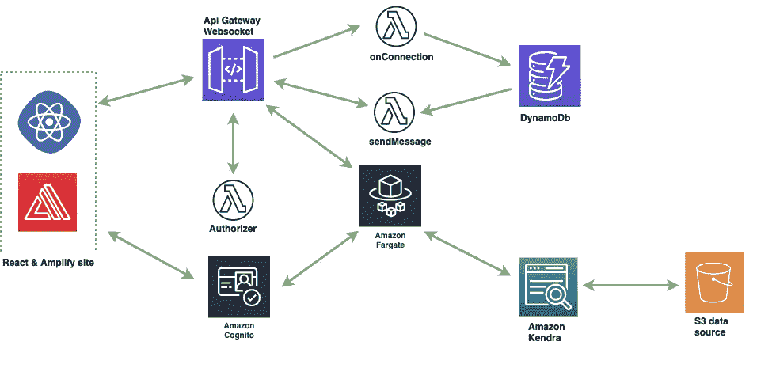
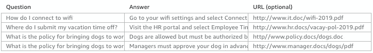
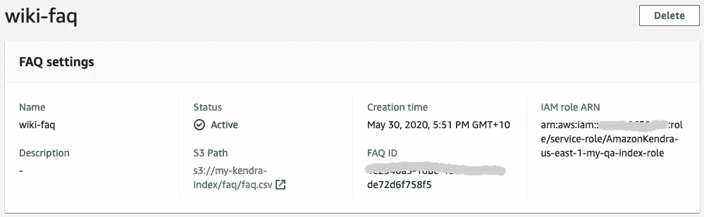
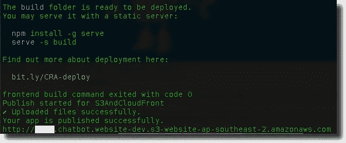
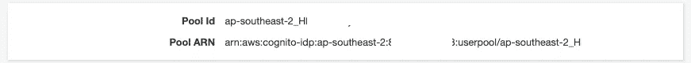
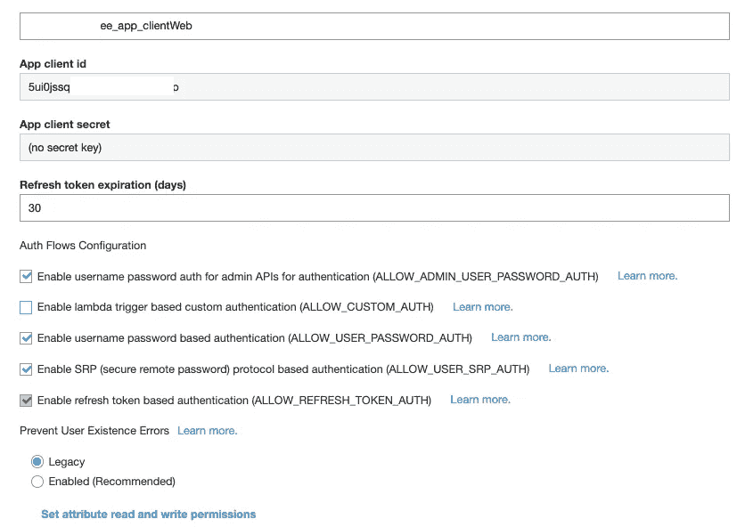
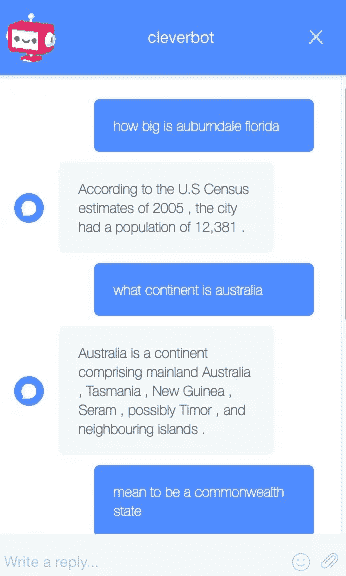
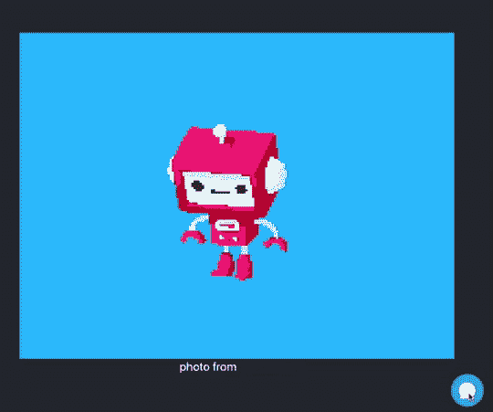

# 用 Amazon Kendra 和 AWS Fargate 构建一个问答聊天机器人

> 原文：<https://towardsdatascience.com/create-a-question-and-answer-bot-with-amazon-kendra-and-aws-fargate-79c537d68e45?source=collection_archive---------41----------------------->

## 构建快速问答聊天机器人的分步指南


在 [pixabay](https://pixabay.com/vectors/pixel-cells-techbot-teach-o-bot-3947912/) 上由 [manfredsteger](https://pixabay.com/users/manfredsteger-1848497/) 拍摄的照片

亚马逊宣布**亚马逊 Kendra** 几周前，Kendra 是一个高度准确且易于使用的企业搜索服务，由机器学习提供支持。

在这篇文章中，我将使用 **React** 和 **Amplify** 、**web socket**API in**AWS API Gateway**、 **AWS Fargate** 和 **Amazon Kendra 构建一个问答聊天机器人解决方案。**

解决方案提供了问答的对话界面。这个聊天机器人允许用户提出他们的问题，并迅速得到相关的答案。

# 我们将在这篇文章中讨论的内容:

*   创建一个亚马逊 Kendra 索引，从半结构化文档中提取问题和答案到 Kendra FAQ。
*   在 API Gateway 中部署一个 WebSocket API 来处理问题和回答消息。
*   创建一个 React 应用程序，并使用 AWS Amplify 通过 WebSocket 与这个聊天机器人进行连接和交互。
*   在 AWS Fargate 中创建一个服务，让我们的 bot 调用 Kendra 的 API 来提供答案并将其发送回用户。

*下图显示了上述步骤的架构:*



## 为什么 AWS Fargate 如此重要？

构建聊天机器人的一个更简单的方法是使用一个 [lambda 函数](https://aws.amazon.com/lambda/features/#:~:text=AWS%20Lambda%20is%20a%20serverless,scale%2C%20performance%2C%20and%20security.)来查询 Amazon Kendra，而不使用 Fargate。然而，通过 AWS Fargate 或 EC2，我们可以用定制的人工智能模型来扩展聊天机器人，使我们的机器人更加人性化，例如，我们可以基于**拥抱脸** **最先进的** **对话式人工智能**模型来构建聊天机器人，并仅查询 Kendra 的特定数据。

如果你的程序是一个长时间的计算任务，需要更多的内存和更高的性能， **Fargate** 可能是更好的选择。

# 先决条件

*   设置 AWS 帐户
*   安装最新的 [aws-cli](https://docs.aws.amazon.com/cli/latest/userguide/installing.html)
*   安装[放大器 cli](https://github.com/aws-amplify/amplify-cli)
*   对 React 的基本了解
*   对 Docker 的基本了解
*   对云形成的基本了解
*   将[无服务器框架](https://www.serverless.com/)安装或更新至最新版本
*   [jq](https://stedolan.github.io/jq/) 安装(可选)

# 现在，让我们开始吧！

# 创建亚马逊肯德拉指数

让我们创建一个肯德拉指数。亚马逊 Kendra 是一个高度准确且易于使用的企业搜索服务，由机器学习提供支持。Kendra 支持非结构化和半结构化文档，如存储在 S3 的 FAQ，我们将在我们的案例中使用 FAQ。

首先，让我们下载一个 QnA 数据集并上传到 S3。我们可以为聊天机器人使用
[*微软研究 WikiQA 语料库*](https://www.microsoft.com/en-us/download/details.aspx?id=52419) 。

下载数据集后，让我们转换为 Kendra 支持的 csv 格式，如下所示:



使用以下脚本转换数据集，并将转换后的 csv 文件上传到现有的 S3 存储桶`my-kendra-index`:

现在，我们准备创建一个肯德拉指数。要创建 Kendra 索引，请完成以下步骤:

1.  在 Amazon Kendra 控制台上，选择启动 Amazon Kendra。
2.  创建索引并输入索引名，如`my-aq-index`。
3.  对于 IAM 角色，选择`Create a new role`来创建一个允许 Amazon Kendra 访问 CloudWatch 日志的角色。
4.  创建索引。

创建 Kendra 索引后，我们可以添加常见问题文档:

1.  从亚马逊 Kendra 控制台添加常见问题。
2.  对于 S3，浏览 S3 找到您的桶，并选择常见问题 csv 文件。这里我们用`s3://my-kendra-index/faq/faq.csv`。
3.  对于 IAM 角色，选择`Create a new role`以允许 Amazon Kendra 访问 S3 存储桶中的 FAQ 内容对象。
4.  添加常见问题。



现在我们有了一个有效的 Kendra 指数，让我们进入下一步。

# 在 API 网关中部署 WebSocket API 来处理 QnA 消息

在本节中，我们将在 AWS API Gateway 中构建一个 **1)** WebSockets API， **2)** 创建 lambda 函数来管理 WebSockets 路由( **$connect，$disconnect，sendMessage** )和 **3)** 创建 DynamoDb 来存储 WebSockets 连接 id 和用户名。

我们将使用**无服务器框架**来构建和部署所有需要的资源。让我们创建一个新的无服务器项目，并将以下配置添加到`serverless.yml`:

请注意，`serverless.yml` 中的 Cognito App 客户端 Id ( `/chatbot/dev/app_client_id`)和 Cognito 用户池 Id ( `/chatbot/dev/user_pool_id`)尚未创建，我们在此仅引用 Cognito 详细信息为`SSM Parameters`，在下一步中，我们将使用`Amplify Cli`创建 Cognito 用户池，然后我们可以从`System Storage Manager`控制台修改相关的 SSM 参数。

一旦`serviceless.yml` 被修改，更新`handler.js` 为 WebSockets 路由创建 lambda 函数:`$connect` with `custom authorizer`， `$disconnect`，`sendMessage`:

运行以下命令来部署 WebSocket API:

```
$sls deploy --stage dev --region YOUR_REGION
```

# 使用 AWS Amplify 构建 React 应用程序

在本节中，我们将使用 React 和 AWS Amplify 构建一个具有身份验证功能的 web 应用程序。

完整的项目在我的 Github [repo](https://github.com/yai333/QuestionAnswerChatbot/tree/master/frontend) 中，你可以在项目目录中找到以下文件夹:

1.  `amplify/.config/`和`amplify/backend/`。
2.  `project-config.json`在`.config/`文件夹中。
3.  `backend-config.json` 在`backend/`文件夹中。
4.  `backend/`文件夹中的云信息文件。

让我们下载源代码，并通过运行以下命令重新初始化现有的 Amplify 项目:

```
$amplify init
```

然后推送更改:

```
$amplify push 
```

并部署:

```
$amplify publish
```

我们将在项目部署后获得 web 应用程序 URL:



现在，登录 AWS Cognito 服务控制台，您可以看到 AWS Cognito 用户池已经创建。复制用户池 Id 和应用程序客户端 Id，并将它们用作我们在上一步中已经创建的 SSM 参数。



# 在 AWS Fargate 中创建聊天机器人服务

在本节中，我们将创建一个 bot 任务，在 AWS Fargate 中运行我们的 chatbot 服务。首先，一个聊天机器人任务连接到一个 websocket API，然后，当用户提问时，机器人可以查询 Kendra 索引，Kendra 将显示相关答案，并将其发送回提问的用户。

要部署 Fargate 服务，请执行以下步骤:

1.  点击 下载聊天机器人脚本和 Dockerfile [**。**](https://github.com/yai333/QuestionAnswerChatbot/tree/master/service)
2.  构建 Docker，标记一个 Amazon ECR 存储库，并将映像推送到 ECR。更多详情请参考 AWS [官方教程](https://docs.aws.amazon.com/AmazonECR/latest/userguide/docker-push-ecr-image.html)。
3.  点击 下载 CloudFormation 模板和 bash 脚本 [**。**](https://github.com/yai333/QuestionAnswerChatbot/tree/master/service/cf-templates)
4.  如果使用 Fargate 发射类型，则需要`awsvpc network`模式。我们需要部署`VPC`和`Security Groups`:

```
$bash create-infra.sh -d dev
```

5.创建任务定义。

```
$bash create-task.sh -d dev
```

6.在 AWS Fargate 中部署聊天机器人服务。

```
$bash deploy-service.sh -d dev
```

主要逻辑可以在这里找到[:](https://github.com/yai333/QuestionAnswerChatbot/blob/master/service/robot.py)

## **(可选)用 ConvAI 模型扩展聊天机器人**

要使用 **ConvAI** 模型扩展聊天机器人，您可以尝试下面的示例脚本，注意，您需要投入更多精力来训练模型，并将其放入 docker 或**亚马逊** **EFS** 。

一旦服务被部署，我们应该能够问机器人问题。让我们访问 React 应用程序并进行现场测试吧！



如上所述，仅使用关键字就足以让系统给出正确的答案。



如果你想了解更多关于**亚马逊 Kendra** 的信息，这里 有一个关于如何使用 Lex 和 Kendra [构建聊天机器人的官方教程。](https://aws.amazon.com/blogs/machine-learning/smarter-faq-bots-with-amazon-kendra/?ref=Welcome.AI)

希望你觉得这篇文章有用，这篇文章的源代码可以在我的 [**GitHub repo**](https://github.com/yai333/QuestionAnswerChatbot) 中找到。