# 使用潜在狄利克雷分配创建基于时间序列数据的推荐系统

> 原文：<https://towardsdatascience.com/create-a-recommendation-system-based-on-time-series-data-using-latent-dirichlet-allocation-2aa141b99e19?source=collection_archive---------18----------------------->

## 使用经典的 NLP 主题建模技术，根据用户的习惯和偏好对他们进行聚类


卢西恩·阿利克夏在 [Unsplash](https://unsplash.com?utm_source=medium&utm_medium=referral) 上的照片

# 介绍

许多人认为，用户细分和推荐系统的主要目标是预测或更好地理解客户想要或可能购买的东西。然而，有时重要的问题不是*顾客可能会买什么*，而是*什么时候*他们可能会买。

考虑下面的例子:(1)一个在线商店想给它最忠实的顾客发送一个符合他们喜好的商品的优惠券。然而，他们也知道顾客通常在一天中的不同时间购物，例如，一些人喜欢在清晨购物，而另一些人喜欢在深夜购物。因此，他们想要确切地知道*每个客户(或客户群)何时更有可能购物并在适当的时间发送优惠券。(2)网络代理服务的提供商需要有效地将网络带宽分配给他们的用户。理想情况下，他们会根据用户的活动时间对他们进行分组，并相应地为他们分配带宽。*

这些“商业问题”已经假定用户或顾客想要某种产品。他们提出的问题是*何时*他们最有可能购买或使用它。在这篇文章中，我想分享一个非常简单的方法，它可以添加另一个工具来帮助你回答这样的问题。

我将假设您有一个简单的时间序列数据集，其形式为:

```
Time ('2020-01-05 10:30')
Entity (user, product, game)
Count (views, orders, downloads)
```

我将展示 LDA 如何使我们能够(1)根据用户更有可能“活跃”的时间，以一种颇有见地的方式将用户划分成组或簇，以及(2)让我们根据数据预测每个用户与每个组的关联程度。(同样的分析也可以应用于产品，并根据它们更有可能被购买的时间将它们分组，等等)。

在接下来的部分中，我将非常简要地介绍 LDA 及其运行方式，然后深入代码。

# 潜在狄利克雷分配(LDA)聚类——一个(非常)简短的介绍

LDA 最常用于 NLP 环境中的主题建模，这确实是一个很好的用例来理解它的价值。主题建模算法通常从一个“语料库”或一组由“单词”组成的“文档”开始，并尝试使用观察到的单词混合以及它们一起出现的频率，以便找到文档中的潜在模式或主题。

例如，假设我有 3 个文档:(1)“我的狗吃了我的午餐”；(2)“我就是爱吃水果”；(3)“我对狗过敏”。一个主题建模算法应该能够在这个“语料库”中识别至少两个潜在的主题:一个涉及*狗*的主题和一个涉及*食物或者吃*的主题。一些主题建模算法(如 LDA)也能够将一个文档与多个主题相关联，并告诉我们哪个主题在文档中更占主导地位。例如，这些算法将能够告诉我们，句子 1(“我的狗吃了我的午餐”)是*既关于*狗*又关于*食物或吃*，并且它更多地是关于狗而不是食物。*

## 那么 LDA 是如何做到这一点的呢？

LDA 至少做出两个重要的工作假设:

(1) *每个题目都是一个单词的概率分布。*简单来说，每个主题都与处理该主题的文档中以一定概率出现的某些单词相关联。LDA 模型的主要输出之一是术语-主题矩阵，它显示了每个单词在某个主题中出现的概率。这个矩阵允许我们在每个主题中找到语义主题。例如，如果下面矩阵中的单词 0 和单词 1 与动物有关，那么我们可以说主题 3(或其主题)是动物，因为与动物有关的单词很可能出现在其中。

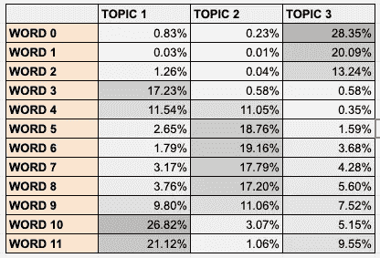

术语-主题矩阵(或特征-聚类矩阵)

(2) *每个文档都有一个“主题食谱”或主题的概率分布。*这意味着，例如，在模型中运行句子 1(“我的狗吃了我的午餐”)将告诉我们，基于它包含的单词，该文档 80%关于食物和饮食，20%关于狗。

**话题菜谱** `sentence | topic-1 | topic-2 | topic-3 |
s1 ____| 80% _____| 20% ____| 0% ____ |
s2 ____| 50% _____| 30% ____| 20% ____ |
s3 ____| 10% _____| 20% ____| 70% ____ |`

当我们在某个语料库或某组文档上拟合 LDA 时，它本质上学习每个主题的哪个单词概率分布能够最好地解释(或生成)我们语料库中每个文档中的单词分布。更准确地说，在给定主题配方的情况下，经过训练的 LDA 模型可以再现它被训练的语料库(或者至少在语义上与之相似的东西)。更重要的是，经过训练或拟合的 LDA 模型可以预测模型在训练时看不到的文档的“主题食谱”。


照片由 [Ugur Akdemir](https://unsplash.com/@ugur?utm_source=medium&utm_medium=referral) 在 [Unsplash](https://unsplash.com?utm_source=medium&utm_medium=referral) 拍摄

## 时间序列数据呢？

经过训练的 LDA 模型允许我们估计任何矢量化文档的“主题配方”。在 NLP 的上下文中,“文档”是文本块或单词的弓形向量，文档的主题食谱可以帮助我们找出文档的主导主题，或者哪个主题比其他主题更具主导性。

然而，归根结底，LDA 是一种聚类算法，也就是说，它估计一组具有 N 个特征的向量，并在每个向量中分配给这些特征的值中找到潜在模式。换句话说，如果我们把主题看作集群，把文档的主题配方看作向量的*集群配方*，告诉我们向量与每个集群的“关联”有多强，那么很明显，我们可以让 LDA 为 NLP 上下文之外的许多业务问题工作。

这似乎与时间序列分析的领域并不完全相关，所以让我直接进入一个例子，我将在这篇文章中使用这个例子来更清楚地说明这一点。

## 一个例子:用户和电视节目

假设您有一个“客户”数据集，它记录了每个客户在 24 小时内每小时观看的电视节目数量。因此，我们数据集中的每个向量看起来都像这样:

`[customer, # of shows watched on 1AM, # of shows watched on 2AM….]`

我们的任务是找到一种有效的方法来预测何时是向给定客户提供观看新电视节目的选项的最佳时间。显然，解决这个问题的方法不止一种。我在这里采用的方法是，尝试根据客户看电视的时间将他们分成不同的组，并根据他们最相关的组的偏好或活动来预测向客户提供新电视节目的最佳时间。

艾达能帮我们什么？
如果我们将一天中的每个小时视为一个特征，其值等于客户平均观看的电视节目数量，那么根据该数据估计 LDA 将使我们能够根据客户观看电视节目的时间将他们分成不同的组。

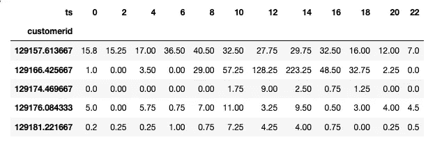

顾客与时间(价值=电视节目数量)

更重要的是，我们将能够生成一个特征聚类矩阵(或小时组矩阵),它将告诉我们哪个小时在哪个聚类中更重要(以及其重要性如何),此外，它还将为我们提供每个客户的聚类方法，它将告诉我们客户与每个组的“关联”有多强。请注意，虽然这项任务也可以使用其他聚类算法(如 KMeans)来完成，但是能够轻松地生成一个特征-聚类矩阵，该矩阵可以量化每个特征与一个聚类的关联的显著性，这是使用 LDA 的一个明显优势(虽然还有更多，但这里的讨论超出了我的范围)。

# 让我们编码

我们从这个数据集开始:

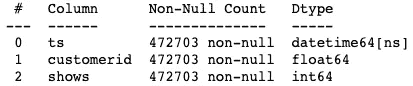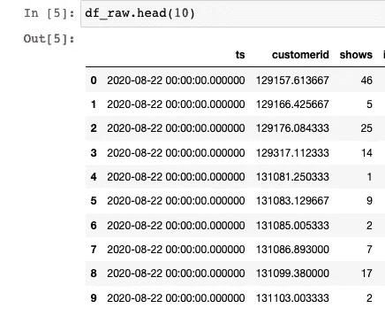

我们应该做的第一件事是将数据转换成我们想要处理的时间序列格式。

1.  我们将时间列固定在数据帧上

```
df_raw['ts'] = pd.to_datetime(df_raw['ts'])
```

2.我们使用 *pivot_table* 方法转置它，以便为每个客户获得一行，每个小时(或时间箱)作为一个特征/列

```
df_pivot = pd.pivot_table(
      df_raw,
      index='customerid',
      columns='ts',
      values='shows',
      fill_value=0)
```

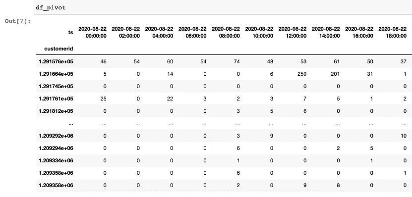

3.最后，我们使用 Panda 的 *GroupBy* 来获得每个小时的平均值

```
df_avg = df_pivot.T.groupby(df_pivot.T.index.hour).mean().T
```

现在，我们有了正确格式的数据


当我们查看整个数据集每小时的平均观看次数时，我们确实看到了某种程度上预期的曲线，其中在黄金时段观看更多的电视节目，而在深夜时段观看较少。然而，正如我们将很快看到的，使用该数据作为何时提供新电视节目的最佳时间的指标忽略了许多偏好偏离平均值的客户。

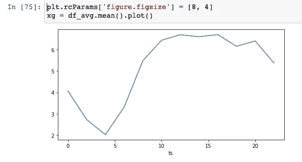

平均每小时观看的电视节目

简单的魔术发生在这三行代码中

```
from sklearn.decomposition import LatentDirichletAllocation as LDAlda = LDA(n_components=3, learning_method='batch')lda = lda.fit(df_avg)
```

我们假设我们的客户的观看偏好可以分为 3 组，并且*适合()*我们数据上的 LDA 对象。而且，就是这样。我们现在需要做的就是提取数据中潜在的洞察力。

## 提取洞察力

LDA 产生的第一个也是最重要的洞察是术语-主题矩阵，或时间-聚类矩阵，它将告诉我们每个聚类中哪个观看时间更占优势。这个矩阵通常有助于检查集群是否有意义，或者是否需要进一步调整。

**注意，第一行将生成这个矩阵，但规范化后可读性更好，这就是后面几行的作用。*

```
#Create the hour-cluster / term-topic matrix
df_comp = pd.DataFrame(lda.components_.T, index=df_avg.columns)#Normalize it norm_components = \
lda.components_ / lda.components_.sum(axis=1).reshape(-1, 1)df_comp_norm = pd.DataFrame(norm_components.T, index=df_avg.columns)df_comp_norm * 100
```

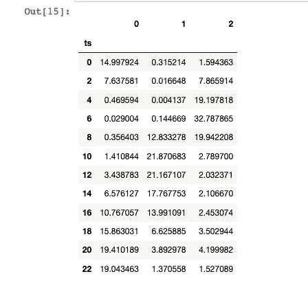

这是一个更精炼的版本:

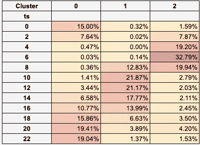

我们可以清楚地注意到偏好“有意义”的群体。例如，我们可以说 *cluster 0* 描述了主要在晚上/深夜观看电视节目的客户——他们每天观看电视节目的时间有 40%的可能性(20% + 20%)是在晚上 8 点到午夜之间。我们还看到一个似乎由“每日”观察者(*集群 1* )组成的群体，他们在黄金时段上午 8 点到下午 4 点看得最多。

我将很快回到这一点，但是一旦我们的聚类中的小时概率分布有意义，我们就可以使用 *transform()* 方法，该方法将产生向量-聚类(或客户-聚类)矩阵，该矩阵将显示每个客户与每个聚类的关联程度。

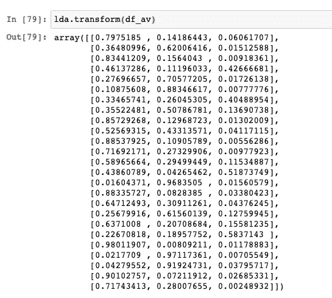

我们之前看到，与第 0 组第 T1 组第 T0 组相关联的主要时间是晚上，而与第 1 g 组第 T2 组相关联的主要时间是中午到下午。因此，我们可以说第一个顾客([0.79，0.14，0.06])主要在晚上看电视节目，而第二个顾客([0.36，0.62。0.01])白天大多看电视剧。如果我们可以选择一个时间段向我们的客户展示新节目，我们可能会选择晚上/夜间，因为尽管第二个客户主要在白天看电视，但他们仍有 36%的机会观看深夜节目。

我们可以通过将每个客户分配到其最主要的聚类，然后绘制每个聚类的平均值来说明这一点。

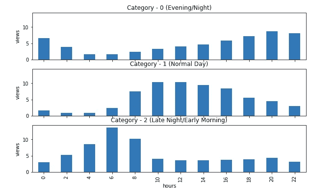

每个特征的平均值

我们也可以用这个来评估每个组的大小。这将向我们显示，例如，与有些异常的活动时间(集群 2)相关联的组是某种需要进一步探索的异常值(例如，它可能与来自不同时区的用户相关？)

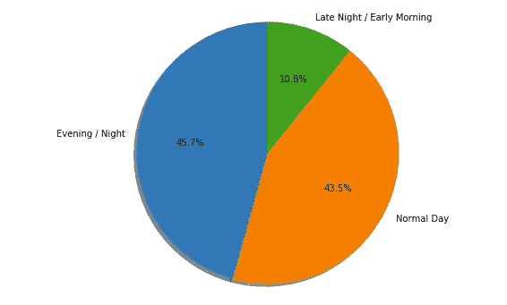

在帖子的开始，我提到了我们需要回答的两个主要问题，或者说我们希望 LDA 帮助我们的两个主要见解:(1)我们希望知道每个组的黄金时段(他们观看最多的时段)，以便向每个组的成员提供在他们更有可能观看新电视节目时观看该节目的选项。(2)给定客户的电视观看活动，我们想知道客户与哪个群体的关联有多强。

我们可以用一种相当简单的方法来实现第一个任务，那就是选择每个组或群的平均观看时间，然后找出值超过平均值的小时数。如下例所示，第一组人(守夜人)的黄金时段是下午 4 点到午夜。

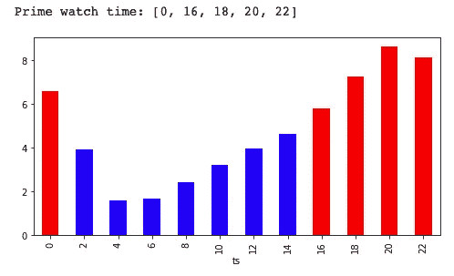

至于第二个任务(找到向特定客户呈现电视节目的最佳时间)，我们所要做的就是使用我们想要预测的客户的观看时间向量来调用 *transform()* 方法。

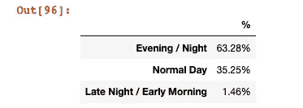

客户 120

我们的模型告诉我们，客户 120 最喜欢在晚上看电视，尽管他们在正常的白天也会花一些时间看电视。换句话说，虽然他们在晚上看更多的电视，但是给他们提供一个新的电视节目让他们在白天看也是值得的。我们可以通过检查他们的实际观看时间来证实这一点。

```
df_avg.iloc[customerid,:-1].plot.bar()
```

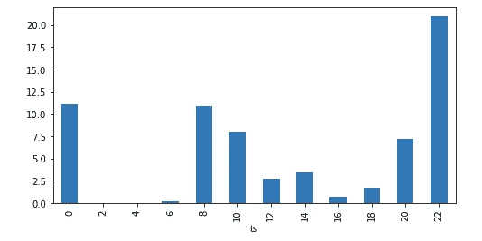

客户 120

事实上，我们可以看到向客户 120 展示新电视节目的最佳时间是晚上 10 点到凌晨 2 点，尽管他们在白天确实花了相当多的时间看电视。

# 摘要

总之，我们有相当多的工具可以根据用户的时间序列活动数据对他们进行聚类。我尝试展示了一个相当简单的方法，在分析此类问题时，它肯定可以扩展您的工具集，并轻松产生有价值的见解。

希望这是有帮助的！

你可以在这里找到完整的笔记本

关于 LDA 的一些不错的链接:

 [## 潜在狄利克雷分配简介

### 假设你有下面这组句子:我喜欢吃西兰花和香蕉。我吃了一根香蕉和菠菜…

blog.echen.me](https://blog.echen.me/2011/08/22/introduction-to-latent-dirichlet-allocation/) [](https://www.machinelearningplus.com/nlp/topic-modeling-python-sklearn-examples/) [## LDA -如何网格搜索最佳主题模型？(带有 python 中的示例)

### Python 的 Scikit Learn 提供了一个方便的接口，用于使用潜在的 Dirichlet 等算法进行主题建模。

www.machinelearningplus.com](https://www.machinelearningplus.com/nlp/topic-modeling-python-sklearn-examples/)