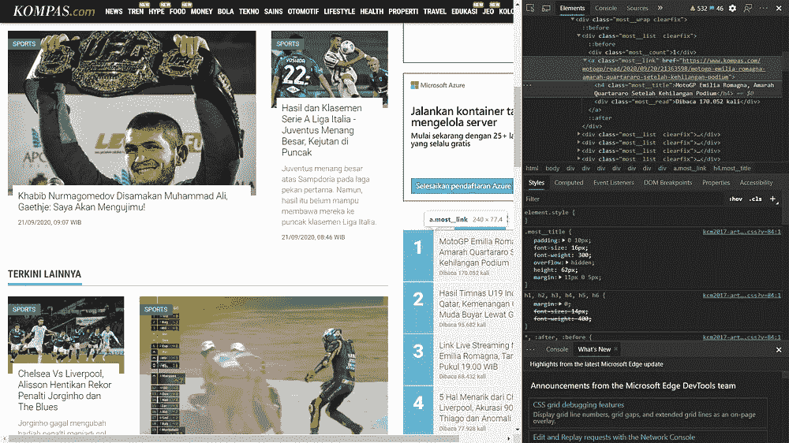
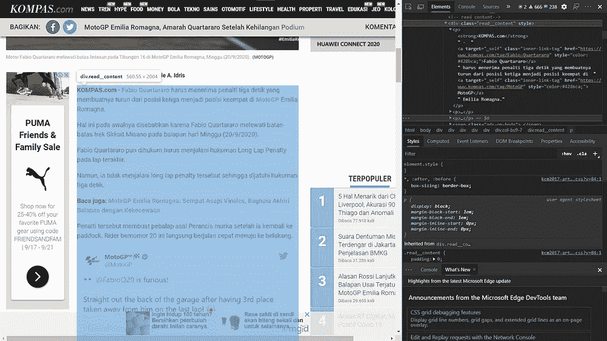
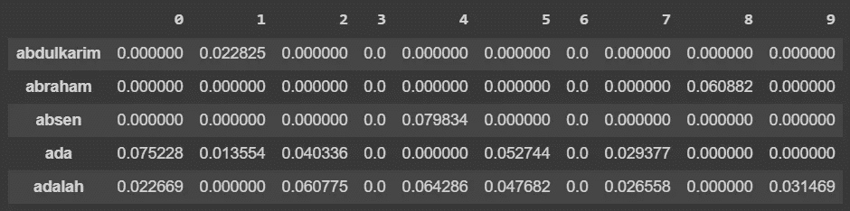
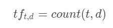
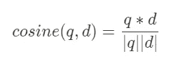

# 使用 Python 创建一个简单的搜索引擎

> 原文：<https://towardsdatascience.com/create-a-simple-search-engine-using-python-412587619ff5?source=collection_archive---------2----------------------->


由 [Unsplash](https://unsplash.com/s/photos/information?utm_source=unsplash&utm_medium=referral&utm_content=creditCopyText) 上的[absolute vision](https://unsplash.com/@freegraphictoday?utm_source=unsplash&utm_medium=referral&utm_content=creditCopyText)拍摄

## 基于余弦相似度和 TF-IDF 加权的术语-文档矩阵的信息检索。

我们所有人每天都在使用搜索引擎，例如谷歌，来搜索一切，甚至是简单的东西。但是你有没有想过，搜索引擎是如何根据我们想要搜索(查询)的内容来检索我们所有的文档的？

在本文中，我将向您展示如何使用 Python 及其支持库从头构建一个简单的搜索引擎。在你看完文章后，我希望你能明白如何根据自己的需要来构建自己的搜索引擎。没有进一步，我们走吧！

> **边注:**我还创建了一个代码的笔记本，所以如果你想跟着我，你可以点击这个链接[这里](https://colab.research.google.com/drive/1LNB053OAFBgK5xmMy9GwMxY77R9aqO-0#scrollTo=memATAT_6CtF)。此外，我将使用的文件是在印度尼西亚。但是不用担心，你可以使用任何语言的文档。

# 概述

在我们动手之前，让我告诉你如何实现它的步骤，在每一部分，我将解释如何构建它。他们是，

*   准备文件
*   使用 TF-IDF 权重创建术语-文档矩阵
*   使用余弦相似度计算查询和文档之间的相似度
*   检索相似度最高的文章。

# 该过程

## 取回文件

我们要做的第一件事是从网上检索文件。在这种情况下，我们可以使用 web 抓取从网站中提取文档。我会从[kompas.com](https://colab.research.google.com/drive/1LNB053OAFBgK5xmMy9GwMxY77R9aqO-0#scrollTo=memATAT_6CtF)搜集体育类的文件，尤其是关于流行的文章。由于文档使用的是 HTML 格式，我们初始化了一个 BeautifulSoup 对象来解析 HTML 文件，这样我们就可以更容易地提取我们想要的每个元素。

根据下图，我展示了带有 inspect 元素的网站截图。在图 1 中，我已经展示了我们想要检索的标签，这是带有类“most__link”的突出显示的标签的 href 属性。在图 2 中，我们将使用类“read__content”从

标签中检索

标签上的文本。 

图 1，图 2

下面是我用来提取文档的代码以及每行的解释，

```
import requests
from bs4 import BeautifulSoup**# Make a request to the website**
r = requests.get('[https://bola.kompas.com/'](https://bola.kompas.com/'))**# Create an object to parse the HTML format**
soup = BeautifulSoup(r.content, 'html.parser')**# Retrieve all popular news links (Fig. 1)**
link = []
for i in soup.find('div', {'class':'most__wrap'}).find_all('a'):
    i['href'] = i['href'] + '?page=all'
    link.append(i['href'])**# For each link, we retrieve paragraphs from it, combine each** paragraph as one string, and save it to documents (Fig. 2)
documents = []
for i in link:
 **# Make a request to the link**
    r = requests.get(i)

    **# Initialize BeautifulSoup object to parse the content** 
    soup = BeautifulSoup(r.content, 'html.parser')

    **# Retrieve all paragraphs and combine it as one**
    sen = []
    for i in soup.find('div', {'class':'read__content'}).find_all('p'):
        sen.append(i.text)

    **# Add the combined paragraphs to documents**
    documents.append(' '.join(sen))
```

## 清理文件

就在我们提取文档之后，我们必须清理它，这样我们的检索过程就变得容易多了。对于每个文档，我们必须删除所有不必要的单词、数字和标点符号，将单词小写，并删除加倍的空格。这是它的代码，

```
import redocuments_clean = []
for d in documents:
    **# Remove Unicode**
    document_test = re.sub(r'[^\x00-\x7F]+', ' ', d)
    **# Remove Mentions**
    document_test = re.sub(r'@\w+', '', document_test)
    **# Lowercase the document**
    document_test = document_test.lower()
    **# Remove punctuations**
    document_test = re.sub(r'[%s]' % re.escape(string.punctuation), ' ', document_test)
    **# Lowercase the numbers**
    document_test = re.sub(r'[0-9]', '', document_test)
    **# Remove the doubled space**
    document_test = re.sub(r'\s{2,}', ' ', document_test)
    documents_clean.append(document_test)
```

## 使用 TF-IDF 权重创建术语-文档矩阵

每个文档都清理干净后，就该创建一个矩阵了。谢天谢地，scikit-learn 库已经为我们准备了它的代码，所以我们不必从头开始实现它。代码看起来像这样，

```
from sklearn.feature_extraction.text import TfidfVectorizer**# Instantiate a TfidfVectorizer object** vectorizer = TfidfVectorizer()**# It fits the data and transform it as a vector** X = vectorizer.fit_transform(docs)**# Convert the X as transposed matrix** X = X.T.toarray()**# Create a DataFrame and set the vocabulary as the index** df = pd.DataFrame(X, index=vectorizer.get_feature_names())
```

结果(矩阵)将成为文档的表示。通过使用这个矩阵，我们可以找到不同文档之间的相似性。矩阵看起来像这样，



术语-文档矩阵

上面的矩阵被称为术语-文档矩阵。它由所有文档中每个标记(术语)代表的行组成，列由文档的标识符组成。单元格内是每个词的频率数，用某个数字加权。

我们将使用列向量，这是一个表示每个文档的向量，用于计算与给定查询的相似性。我们可以称这个向量为**嵌入**。

为了计算单元格值，代码使用 TF-IDF 方法来完成此操作。TF-IDF(术语频率-逆文档频率)是由 IDF 加权的词的频率。让我解释一下每一个，

**术语频率(TF)** 是术语(t)在文档(d)上的频率。公式看起来像这样，



除此之外，我们可以使用基数为 10 的对数来计算 TF，因此数字变得更小，计算过程变得更快。此外，请确保在它上面添加一个，因为我们不希望 log 0 存在。


然后，就是**逆文档频率(IDF)** 。此公式将用于计算该单词在所有文档中的稀有度。它将被用作 TF 的权重。如果一个词比较频繁，那么 IDF 就会小一些。相反，如果这个词用得不频繁，那么 IDF 就会更大。公式看起来像这样，


回想一下 TF-IDF，我们可以看到它是如何影响每个单元格上的值的。它将删除文档中频繁出现但同时并不重要的所有单词，如 and、or、even、actually 等。基于此，我们用它作为矩阵中每个单元格的值。

## 使用余弦相似度计算相似度。

创建矩阵后，我们可以准备查询，根据文档和查询之间的最高相似度来查找文章。要计算相似度，我们可以使用余弦相似度公式来完成。它看起来像这样，



该公式计算点积除以每个向量上长度的乘积。该值的范围是从[1，0]，但一般来说，余弦值的范围是从[-1，1]。因为上面没有负值，所以我们可以忽略负值，因为它从来没有发生过。

现在，我们将实现代码来基于查询查找文档的相似性。我们要做的第一件事是将查询转换成矩阵上的向量。然后，我们计算它们之间的相似度。最后，我们检索相似度值大于 0 的所有文档。代码看起来像这样，

```
def get_similar_articles(q, df):
  print("query:", q)
  print("Berikut artikel dengan nilai cosine similarity tertinggi: ") **# Convert the query become a vector**
  q = [q]
  q_vec = vectorizer.transform(q).toarray().reshape(df.shape[0],)
  sim = {} **# Calculate the similarity**
  for i in range(10):
    sim[i] = np.dot(df.loc[:, i].values, q_vec) / np.linalg.norm(df.loc[:, i]) * np.linalg.norm(q_vec)

  **# Sort the values** 
  sim_sorted = sorted(sim.items(), key=lambda x: x[1], reverse=True) **# Print the articles and their similarity values**
  for k, v in sim_sorted:
    if v != 0.0:
      print("Nilai Similaritas:", v)
      print(docs[k])
      print()**# Add The Query**
q1 = 'barcelona'**# Call the function**
get_similar_articles(q1, df)
```

假设我们想找到关于巴塞罗那的文章。如果我们基于此运行代码，我们会得到这样的结果，

```
query: barcelona
Berikut artikel dengan nilai cosine similarity tertinggi:
Nilai Similaritas: 0.4641990113096689
 kompas com perombakan skuad yang dilakukan pelatih anyar barcelona ronald koeman memakan korban baru terkini ronald koeman dikabarkan akan mendepak bintang muda barcelona yang baru berusia tahun riqui puig menurut media spanyol rac koeman sudah meminta riqui puig mencari tim baru karena tidak masuk dalam rencananya di barcelona rumor itu semakin kuat karena puig....Nilai Similaritas: 0.4254860197361395
kompas com pertandingan trofeo joan gamper mempertemukan barcelona dengan salah satu tim promosi liga spanyol elche laga barcelona vs elche usai digelar di camp nou pada minggu dini hari wib trofeo joan gamper merupakan laga tahunan yang diadakan oleh barca kali ini sudah memasuki edisi ke blaugrana julukan tuan rumah menang dengan skor gol kemenangan barcelona....
```

# 最后的想法

这就是我们如何使用 Python 及其依赖项创建一个简单的搜索引擎。它仍然非常基础，但我希望你能从这里学到一些东西，并能根据你的需要实现你自己的搜索引擎。谢谢你。

## 参考

[1] Jurafsky，D. & Martin，j . h .[](https://web.stanford.edu/~jurafsky/slp3/)**(2000)，普伦蒂斯霍尔。**