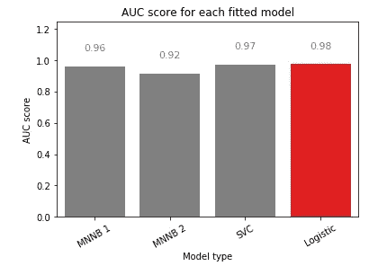
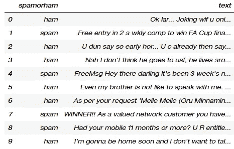
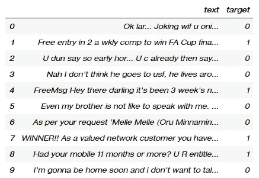
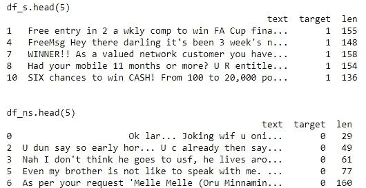
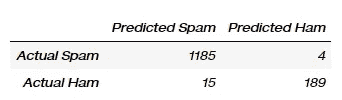
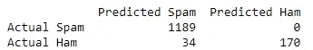
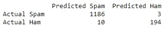

# 用 python 创建一个垃圾短信分类器

> 原文：<https://towardsdatascience.com/create-a-sms-spam-classifier-in-python-b4b015f7404b?source=collection_archive---------25----------------------->

## 使用 scikit 的自然语言处理基础-学习

# 介绍

我一直对谷歌的 gmail 垃圾邮件检测系统着迷，它似乎可以毫不费力地判断收到的电子邮件是否是垃圾邮件，因此不值得我们的关注。

在这篇文章中，我试图重建这样一个垃圾邮件检测系统，但是是在 sms 消息上。我将使用几种不同的型号，并比较它们的性能。

这些模型如下:

1.  多项式朴素贝叶斯模型(计数记号化器)
2.  多项式朴素贝叶斯模型(tfidf 记号化器)
3.  支持向量分类模型
4.  ngrams 参数的 Logistic 回归模型

使用训练测试分割，使 4 个模型经历 X 训练向量化、X 训练和 Y 训练上的模型拟合阶段，进行一些预测，并生成各自的混淆矩阵和接收器操作特性曲线下的面积，以进行评估。(AUC-ROC)

得到的表现最好的模型是**逻辑回归模型**，尽管应该注意的是，所有 4 个模型在检测垃圾邮件方面表现相当好(所有 AUC > 0.9)。

4 个模型之间的 AUC 得分比较

[汉尼斯·强森](https://unsplash.com/@hannes?utm_source=medium&utm_medium=referral)在 [Unsplash](https://unsplash.com?utm_source=medium&utm_medium=referral) 上拍照

# 数据

数据是从 [UCI 的机器学习库](https://archive.ics.uci.edu/ml/datasets/SMS+Spam+Collection)获得的，或者我也已经将使用的数据集上传到我的 [github repo](https://github.com/dehan97/spam_classifier) 上。该数据集总共有 5571 行和 2 列:spamorham 表示垃圾邮件状态和邮件文本。我发现这篇课文很有关联，这很有趣。

定义:垃圾邮件是指通常所知的垃圾邮件，ham 是指非垃圾邮件。

spam.head(10)

# 数据预处理

由于数据集相对简单，不需要太多预处理。垃圾邮件用 1 标记，而 ham 用 0 标记。

df.head(10)

# 探索性数据分析

现在，让我们详细看看数据集。取“目标”列的平均值，我们发现 **13.409%的邮件被标记为垃圾邮件。**

进一步说，也许消息长度与目标结果有某种关联？将垃圾邮件和 ham 消息分割成它们各自的数据帧，我们进一步添加消息的字符数作为第三列“len”。

分割的数据帧

EDA 代码

此外，取消息长度的平均值，我们可以发现 **spam 和 ham 消息的平均长度分别为 139.12 和 71.55 个字符。**

# 数据建模

现在是有趣的时候了。

## 列车测试分离

我们首先使用 75%训练测试分割的默认 sklearn 分割来创建训练测试分割。

## 计数矢量器

> 一个[计数矢量器](https://scikit-learn.org/stable/modules/generated/sklearn.feature_extraction.text.CountVectorizer.html)将把一个文本文档集合转换成一个[令牌计数稀疏矩阵](http://www.btechsmartclass.com/data_structures/sparse-matrix.html#:~:text=Sparse%20matrix%20is%20a%20matrix,only%2010%20non%2Dzero%20elements.)。这对于模型拟合是必要的。

我们将 CountVectorizer 拟合到 X_train 上，然后使用 transform 方法进一步转换它。

计数矢量器代码

## MNNB 模型拟合

我们先试着在 X_train 和 Y_train 上拟合一个经典的[**多项式朴素贝叶斯分类器模型**](https://scikit-learn.org/stable/modules/generated/sklearn.naive_bayes.MultinomialNB.html#:~:text=The%20multinomial%20Naive%20Bayes%20classifier,tf%2Didf%20may%20also%20work.) (MNNB)。

> 一个朴素贝叶斯模型假设**它使用的每一个特征在给定某个类的情况下都是条件独立的**。在实践中，朴素贝叶斯模型表现得令人惊讶地好，甚至在复杂的任务中，很明显强独立性假设是错误的。

## MNNB 模型评估

在评估模型的性能时，我们可以生成一些预测，然后查看混淆矩阵和 [AUC-ROC](/understanding-auc-roc-curve-68b2303cc9c5#:~:text=AUC%20%2D%20ROC%20curve%20is%20a,degree%20or%20measure%20of%20separability.&text=By%20analogy%2C%20Higher%20the%20AUC,with%20disease%20and%20no%20disease.) 分数来评估测试数据集的性能。

混淆矩阵生成如下:

MNNB 混淆矩阵

结果似乎很有希望，真阳性率(TPR)为 92.6% ，**特异性为 99.7%** ，假阳性率(FPR)为 0.3% 。这些结果表明，仅基于消息中的文本，该模型在预测消息是否是垃圾邮件方面表现得相当好。

> **受试者操作者特征(ROC)** 曲线是二元分类问题的评价尺度。这是一条概率曲线，描绘了在不同阈值下 **TPR** 与 **FPR** 的关系，并且基本上**将‘信号’与‘噪声’**分开。曲线下的**面积(AUC)** 是分类器区分类别的能力的量度，并用作 ROC 曲线的总结。

图片来自[本文](/understanding-auc-roc-curve-68b2303cc9c5#:~:text=AUC%20%2D%20ROC%20curve%20is%20a,degree%20or%20measure%20of%20separability.&text=By%20analogy%2C%20Higher%20the%20AUC,with%20disease%20and%20no%20disease.)

**该模型产生了 0.962 的 AUC 分数，这明显好于该模型对结果进行随机猜测的情况。**

虽然多项式朴素贝叶斯分类器似乎工作得很好，但我觉得通过不同的模型，结果可能会进一步改善

用于拟合和评估的 MNNB (count_vect)代码

## MNNB(Tfid-矢量器)模型拟合

然后，我尝试使用一个 [tfidf 矢量器](https://www.kaggle.com/adamschroeder/countvectorizer-tfidfvectorizer-predict-comments)来代替计数矢量器，看看它是否能改善结果。

> 使用 tfidf 的目标是按比例缩小在给定语料库中非常频繁出现的标记的影响，因此这些标记在经验上不如在一小部分训练语料库中出现的特征信息丰富。

## MNNB(Tfid-矢量器)模型评估

在评估模型的性能时，我们再次查看 AUC-ROC 数和混淆矩阵。它产生了 91.67%的 AUC 分数

结果似乎很有希望，真阳性率(TPR)为 83.3% ，**特异性为 100%** ，假阳性率(FPR)为 0.0%。

tfid 混淆矩阵

当基于 AUC 分数比较两个模型时，似乎 tfid 矢量器并没有提高模型的准确性，甚至在预测中引入了更多的噪声！然而，tfid 似乎大大提高了模型检测 ham 消息的能力，达到了 100%的准确率。

用于拟合和评估的 MNNB (tfid_vect)代码

作为一个固执的人，我仍然相信通过一些调整可以获得更好的性能。

## SVC 模型拟合

我现在尝试使用 Tfidf 矢量器来拟合和转换训练数据 X_train，同时**忽略文档频率严格低于 5 的术语。**进一步添加一个附加特征，文档的长度(字符数)，然后**拟合一个正则化 C=10000 的支持向量分类(SVC)模型。**

## SVC 模型评估

这将导致以下结果:

*   AUC 得分为 97.4%
*   TPR 为 95.1%
*   特异性为 99.7%
*   0.3%的 FPR

SVC 混淆矩阵

SVM 装配和评估规范

## 逻辑回归模型(n-grams)拟合

使用逻辑回归，我还包括使用 ngrams，它允许模型在考虑消息是否是垃圾邮件时考虑最大大小为 3 的单词组。

## 逻辑回归模型(n-grams)评估

这将导致以下结果:

*   AUC 得分为 97.7%
*   TPR 为 95.6%
*   特异性为 99.7%
*   0.3%的 FPR

## 模型比较

在对这 4 个模型进行训练和测试之后，是时候对它们进行比较了。我主要基于 AUC 分数比较它们，因为 TPR 和 TNR 比率都有些相似。

逻辑回归具有最高的 AUC 分数，SVC 模型和 MNNB 1 模型略微落后。相对而言，MNNB 2 型号的表现似乎不如其他型号。然而，我仍然认为，所有 4 个模型产生的 AUC 分数都远高于 0.5，表明所有 4 个模型的表现都足以击败仅随机猜测目标的模型。

4 个模型之间的 AUC 得分比较

# 感谢你的阅读！

请在此找到[代码](https://github.com/dehan97/spam_classifier)。

如果你有问题或者想讨论在后新冠肺炎时代应用数据科学技术的想法，请随时联系我。

 [## 韩德-研究助理-新加坡管理大学|领英

### 在世界上最大的职业社区 LinkedIn 上查看韩德·c 的个人资料。韩德有两个工作列在他们的…

www.linkedin.com](https://www.linkedin.com/in/dehan-c-948045177/) 

# 这里还有一篇文章给你！

 [## 选举前 Python 情绪分析

### 单词云和条形图中的新加坡#GE2020SG。

medium.com](https://medium.com/@thedehan/pre-elections-sentiment-analysis-880bc5ad1db0)