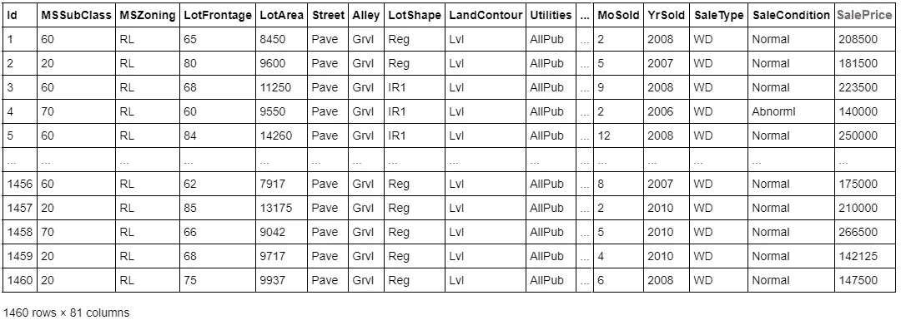
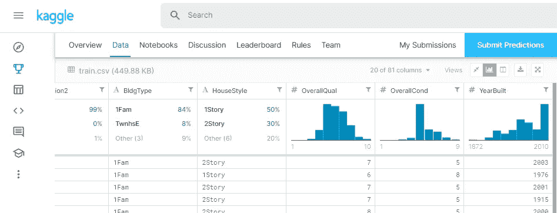
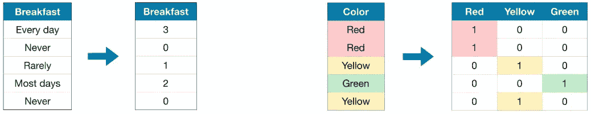
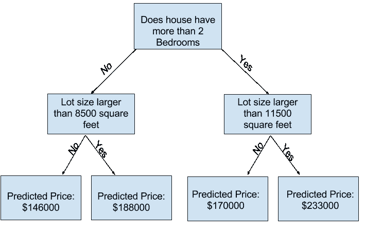

# 在 30 小时或更短时间内创建一个监督模型

> 原文：<https://towardsdatascience.com/create-a-supervised-model-in-30-hours-or-less-a0eb0ace0900?source=collection_archive---------24----------------------->

## 构建机器学习模型的 8 个步骤


[亚历山大·奈特](https://unsplash.com/@agkdesign?utm_source=unsplash&utm_medium=referral&utm_content=creditCopyText)在 [Unsplash](https://unsplash.com/s/photos/friendly-robot?utm_source=unsplash&utm_medium=referral&utm_content=creditCopyText) 上拍照

## TL；速度三角形定位法(dead reckoning)

1.  加载用于进行预测的数据
2.  调查数据
3.  选择模型的功能
4.  将数据拆分到*训练*和*验证*集合
5.  预处理数据
6.  训练模型
7.  使用验证集测试模型
8.  重复步骤 2 到 7，直到您对模型的准确性感到满意

这个帖子是在以色列最大的高级女性工程师和计算机科学家社区[](https://extend-tech.com/baot)**的 **#30_hours** 计划期间创建的。在 30 小时计划中，参与者投资 30 小时(超过 4 个月)在一个新的领域加深他们的知识，通过与专业导师一起建立一个个人或小组项目。**

# **加载数据**

**在现实世界的场景中，您可能需要从收集数据开始。我们将跳过这一步，在本文中使用 [Kaggle 房价数据集](https://www.kaggle.com/c/house-prices-advanced-regression-techniques/overview)。**

****

**房屋数据的部分数据框架**

**在这个数据集中，我们既有房子的数据——比如房子的状态、位置和出售时间的数据——也有房子的售价。**

**我们可以使用[监督学习](https://ml-cheatsheet.readthedocs.io/en/latest/glossary.html#glossary-supervised-learning)训练一个模型，将给定的输入(称为[特征](https://ml-cheatsheet.readthedocs.io/en/latest/glossary.html#glossary-feature)，如房屋状况和位置)映射到给定的输出(称为[标签](https://ml-cheatsheet.readthedocs.io/en/latest/glossary.html#glossary-label)，如销售价格)。**

**首先，让我们使用 pandas 来读取 csv 文件。标签由`y`表示:**

```
import pandas as pdhouses_df = pd.read_csv(PATH_TO_TRAIN_DATA)
LABEL = 'SalePrice'  # let's make this a constant for future usage
y = houses_df[LABEL]
```

**接下来，我们将了解哪些特征可以帮助我们预测房屋的价格。**

# **调查数据**

**那需要一段时间！**

**在选择特性之前，我们需要了解我们的数据是什么样的。让我们从数据列开始:**

```
print(houses_df.columns)"""
Output:
Index(['Id', 'MSSubClass', 'MSZoning', 'LotFrontage', 'LotArea', 'Street', …, 'YrSold', 'SaleType', 'SaleCondition', 'SalePrice'], 
 dtype='object')
"""
```

**我们有 80 列可以帮助我们预测销售价格。让我们仔细看看每一列。我们将使用两种方法来调查我们的数据:**

*   **[value counts()](https://pandas.pydata.org/pandas-docs/stable/reference/api/pandas.Series.value_counts.html) 获取唯一值的计数(包括`NA`值，因为我们想知道我们的列包含多少个空值)**
*   **[describe()](https://pandas.pydata.org/pandas-docs/stable/reference/api/pandas.Series.describe.html) 根据数据类型生成描述性统计**

**在下面的示例中，我们可以看到“Street”有两个唯一的值，并且几乎都是“Pave”。我们还可以看到大多数“小巷”值都不见了。由于这些数据列没有变化，我们无法了解不同街道或小巷的价格差异。**

```
for col in houses_df.columns:
  print(f'_____Column: {col}_____')
  # normalize=True - use relative frequencies of the unique values
  # dropna=False - include NA values
  print(houses_df[col].value_counts(normalize=True, dropna=False))
  print(houses_df[col].describe())"""
Output:
_____Column: Street_____
# value_counts:
Pave    **0.99589**
Grvl    0.00411
Name: Street, dtype: float64# describe:
count     1460
unique       2
top       Pave
freq      1454
Name: Street, dtype: object_____Column: Alley_____
# value_counts:
**NaN**     0.937671
Grvl    0.034247
Pave    0.028082
Name: Alley, dtype: float64# describe:
count       91
unique       2
top       Grvl
freq        50
Name: Alley, dtype: object
"""
```

**为了简化调查数据的过程，您可以使用 Kaggle 上为该数据集提供的[可视化来获得每个数据列的更多信息。你也可以在这里](https://www.kaggle.com/c/house-prices-advanced-regression-techniques/data)看看我的代码示例[。](https://github.com/MirYeh/learning-process/blob/master/ml/supervised%20learning/house_prices/data_investigation.py#LC18)**

****

**点击数据选项卡，向下滚动并选择 train.csv 查看可视化|来源:Kaggle**

# **选择模型的特征**

**我们希望只选择有助于预测房屋价格的特征，以便**降低计算成本并提高模型的性能**—这个过程称为[特征选择](https://ml-cheatsheet.readthedocs.io/en/latest/glossary.html#glossary-feature-selection)。**

**选择，选择..！**

**对于这个例子，我们将简化这个过程，但是你可以阅读更多关于[特征选择和如何识别相关特征](/feature-selection-identifying-the-best-input-features-2ba9c95b5cab)的内容。**

**下面是一个简化的特征选择示例。特征由`X`表示:**

```
include_features = ['MSSubClass', 'MSZoning', 'LotFrontage', ..., 'MoSold', 'YrSold']
X = houses_df[include_features]
```

# **拆分数据**

**模型的工作是**在数据**中寻找模式，以便预测标签——模式来自模型训练的数据。为了对模型的准确性进行公正的评估，我们需要根据它没有训练过的数据来验证它。**

**为此，我们将数据分成(至少)3 个部分:**

*   **训练集-用于训练模型的数据**
*   **验证集—在调整模型的[超参数](https://ml-cheatsheet.readthedocs.io/en/latest/glossary.html#glossary-hyperparameters)(模型的属性)并选择性能良好的模型时用于评估模型的数据—该集仅用于调整模型的超参数，其数据不应用于训练模型！**
*   **测试集——用于评估最终模型的数据——它在模型训练期间对模型没有影响，因此是无偏的**

**因为我们使用的是 Kaggle 竞争数据集，所以我们已经在一个不同的文件(test.csv)下提供了一个测试集。我们只需要将训练集分成训练和验证。
我们使用 [train_test_split](https://scikit-learn.org/stable/modules/generated/sklearn.model_selection.train_test_split.html) 将数据分成两部分。
稍后，我们将看到验证集如何帮助我们调整模型。**

```
from sklearn.model_selection import train_test_splitX_train, X_valid, y_train, y_valid = train_test_split(X, y, train_size=0.8, test_size=0.2, random_state=1)
```

****random_state** 值被设置为某个常数，以避免训练模型时的随机性。**

# **预处理数据**

**我们使用 Python 中的机器学习库 [scikit-learn](https://scikit-learn.org/) 来创建模型。Scikit-learn(或 sklearn)期望数据是**数字的和有意义的**。真实世界的数据可能有缺失值，或者可能包含非数字值(分类值、图像等)，因此与 scikit-learn 不兼容。**

**对对对。**

**在我们可以训练模型之前，我们需要准备数据，以便我们可以将它馈送给 scikit-learn。这一步叫做——你猜对了——预处理！**

****

## **我们如何处理丢失的值？**

*   **最简单的方法是删除缺少数据的要素/条目。这会导致可能对更准确的预测有价值的数据丢失，因此不建议这样做**
*   ****输入现有数据中的缺失值**，例如，输入特征的平均值。分类特征没有“平均值”——我们可以使用“最频繁”策略来填充缺失值(我们使用的是 [SimpleImputer](https://scikit-learn.org/stable/modules/generated/sklearn.impute.SimpleImputer.html) ):**

```
from sklearn.impute import SimpleImputer# allowed_strategies = ["mean", "median", "most_frequent", "constant"]
numerical_imputer = SimpleImputer(strategy='mean')
categorical_imputer = SimpleImputer(strategy='most_frequent')
```

## **我们如何处理分类数据？**

**我们希望**将分类数据编码成数字数据**。我们可以使用不同的编码器。例如，我们可以使用带有[标签编码](https://scikit-learn.org/stable/modules/generated/sklearn.preprocessing.LabelEncoder.html)的类别排序。如果类别没有排序，我们可以使用[一键编码](https://scikit-learn.org/stable/modules/generated/sklearn.preprocessing.OneHotEncoder.html)，它为每个类别创建一个新的特性，并用布尔值填充它。阅读更多关于[清洁和预处理数据](/the-complete-beginners-guide-to-data-cleaning-and-preprocessing-2070b7d4c6d)的信息。**

****

**标签编码(左)和一键编码(右)|来源:Kaggle**

**为分类值创建一个编码器—在本例中，我们将使用 OneHotEncoder，但选择可以而且应该根据您的数据而有所不同:**

```
from sklearn.preprocessing import OneHotEncoderone_hot_encoder = OneHotEncoder(handle_unknown='ignore')
```

**您可以更进一步，[预处理数字数据](https://medium.com/analytics-vidhya/feature-preprocessing-for-numerical-data-the-most-important-step-e9ed76151298)来创建**一个更加精确的模型！****

# **拟合模型**

**差不多到了适合模型的时候了！**

**我们看到了如何估算缺失值和编码分类值。让我们在一个[管道](https://scikit-learn.org/stable/modules/generated/sklearn.pipeline.Pipeline.html)中定义这些步骤，使我们的代码更干净，更容易调试。**

**我们为数据中的每个列类型定义了一个管道，在我们的例子中，我们需要处理数字和分类数据:**

```
from sklearn.pipeline import Pipeline

# impute and scale
numerical_transformer = Pipeline(steps=[
  ('imputer', numerical_imputer),
  ('scaler', StandardScaler())
])# impute and encode
categorical_transformer = Pipeline(steps=[
  ('imputer', categorical_imputer),
  ('onehot', one_hot_encoder)
])
```

**很好，我们现在为每种列类型都提供了一个管道。让我们为数据列捆绑这些预处理步骤:**

```
from sklearn.compose import ColumnTransformer# get columns from X_train
numerical_cols = get_numerical_columns(X_train)
categorical_cols = get_categorical_columns(X_train)preprocessor = ColumnTransformer(
  transformers=[
    ('num', numerical_transformer, numerical_cols),
    ('cat', categorical_transformer, categorical_cols),
])
```

**注意，在这个例子中，我们通过数字/分类数据捆绑了预处理步骤——实际上，您可能希望使用与数据列最匹配的步骤。在研究数据时，您应该看到**哪些预处理步骤最适合不同的列**，而不是使用“一刀切”的方法。**

**现在我们已经为训练集定义了预处理，我们可以用它来训练我们的模型了！**

## **但是等等…**

**您可能会问自己——我们不应该预处理所有的数据，而不仅仅是训练集吗？**

**答案肯定是否定的！如果我们基于所有数据进行预处理，我们将深入了解我们正在验证的数据，从而导致**假阳性评估！**包括来自列车组外部的信息被称为[数据泄漏](https://machinelearningmastery.com/data-leakage-machine-learning/)。**

**现在让我们使用管道来拟合模型！**

**受监督的模型可以是[分类](https://ml-cheatsheet.readthedocs.io/en/latest/glossary.html#glossary-classification)模型，它输出一个离散的结果，如预测一封电子邮件是否是垃圾邮件，也可以是[回归](https://ml-cheatsheet.readthedocs.io/en/latest/glossary.html#glossary-regression)模型，它输出一个连续的结果，如预测房价。阅读更多关于[常见 ML 型号](/all-machine-learning-models-explained-in-6-minutes-9fe30ff6776a)的信息。**

**我们将使用[随机森林回归模型](https://scikit-learn.org/stable/modules/generated/sklearn.ensemble.RandomForestRegressor.html)——决策树的集合。**

****

**决策树示例|来源:Kaggle**

**定义预处理和拟合随机森林回归模型的管道:**

```
from sklearn.ensemble import RandomForestRegressormodel = RandomForestRegressor(n_estimators=ESTIMATORS_VALUE, random_state=1)pipeline = Pipeline(steps=[
  ('preprocessor', preprocessor),
  ('model', model)
])
```

## **还记得验证集吗？**

**这是我们最终使用验证集的地方。
`n_estimators` 是 RandomForestRegressor 模型的数值型**超参数**。我们可以使用不同的`n_estimators`值根据验证集创建和评估我们的模型，最终选择最接近验证数据上实际标签的预测值——这样做会导致我们的模型被验证集调整，这就是为什么我们需要一个测试集，**一个模型没有见过或已经被**调整过的数据集。`n_estimators`也用于控制示例模型中的[欠拟合和过拟合](https://machinelearningmastery.com/overfitting-and-underfitting-with-machine-learning-algorithms/)。**

**现在，我们可以使用之前定义的所有步骤，使用该管道来拟合我们的模型:**

```
pipeline.fit(X_train, y_train)
```

**啊啊啊……我们终于有一个合身的模型了！**

**啊哈。**

# **测试模型**

**模型能在没见过的数据上成功预测房价吗？让我们使用[损失函数](https://deepai.org/machine-learning-glossary-and-terms/loss-function)来测试这个模型——这个函数可以帮助我们计算原始标签和预测标签之间差异的“成本”，从而帮助我们估计这个模型有多精确。**

**我们可以使用的一个[常见损失函数](/common-loss-functions-in-machine-learning-46af0ffc4d23)是 **MAE** ( [平均绝对误差](https://scikit-learn.org/stable/modules/generated/sklearn.metrics.mean_absolute_error.html))，它计算原始标签和预测标签之间的绝对差异——较低的 MAE 分数意味着对验证数据的预测更好。**

```
from sklearn.metrics import mean_absolute_errorpredictions = pipeline.predict(X_valid)
mae_score = mean_absolute_error(y_valid, predictions)
```

**你可以玩不同的超参数值，特征，模型和预处理步骤，看看模型的分数如何变化。**

# **下一步是什么？**

**现在你已经有了一个满意的模型，你可以将预测保存到一个. csv 文件，上传到 Kaggle，然后**继续下一个挑战！****

```
output = pd.DataFrame({'Id': house_df.Id, label: LABEL})
default_filename = f'submission-{mae_score}'
output.to_csv(f'{filename}.csv', index=False)
```

**你可以在这篇文章的末尾找到完整代码的链接。**

**你做到了！**

# **总结我们所学的内容**

*   **基本术语(参见[备忘单](https://ml-cheatsheet.readthedocs.io/en/latest/glossary.html))**
*   **如何用熊猫调查数据(见 [100 个熊猫小窍门](https://www.dataschool.io/python-pandas-tips-and-tricks/amp/)**
*   **为什么我们需要至少 3 组数据**
*   **如何用 skicit-learn 对数据进行预处理**
*   ***分类模型*与*回归模型*有何不同**
*   **如何使用 skicit-learn 创建*管道***
*   **什么是*平均绝对误差*以及我们如何使用它来测试模型**

**如果这篇博文对你有帮助，请随意与你的朋友分享！**

**完整代码见[此处](https://github.com/MirYeh/learning-process/tree/master/ml/supervised%20learning/house_prices)。**