# 创建一个合成图像数据集——“什么”、“为什么”和“如何”

> 原文：<https://towardsdatascience.com/create-a-synthetic-image-dataset-the-what-the-why-and-the-how-f820e6b6f718?source=collection_archive---------14----------------------->

## 缺少图像来训练你的模型？以下是如何使用图像合成技术通过合成图像将数据集的大小增加数倍。

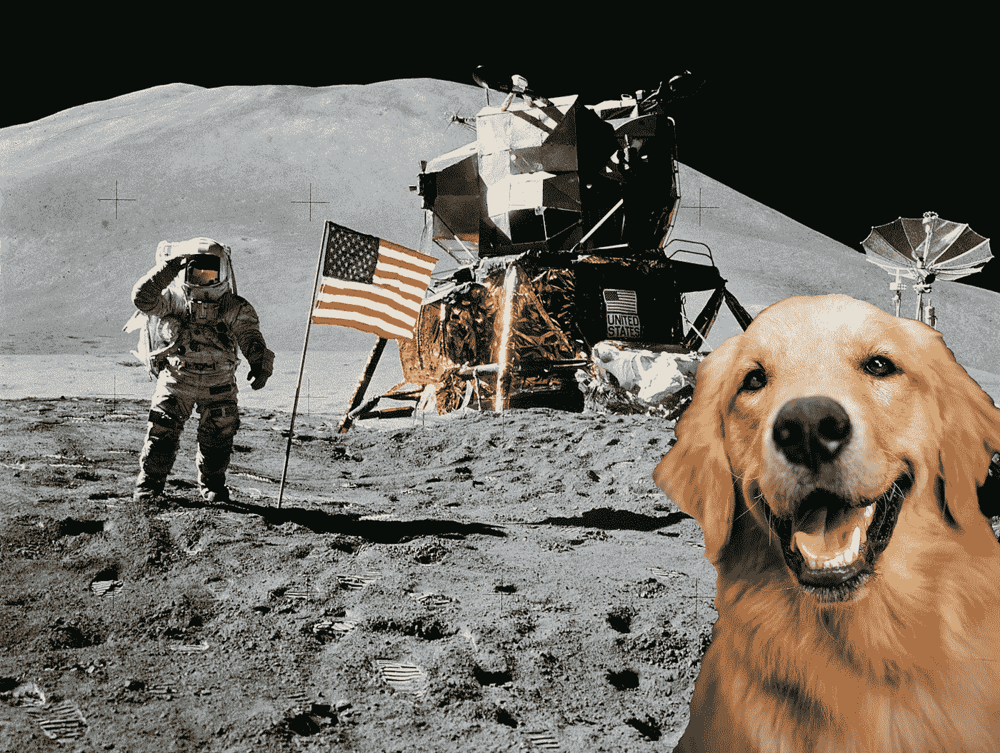

把你的狗送上月球！图像合成技术的一个例子(来自 [Pexels](https://www.pexels.com/photo/astronaut-standing-beside-american-flag-on-the-moon-39896/?utm_content=attributionCopyText&utm_medium=referral&utm_source=pexels) 的[海伦娜·洛佩斯](https://www.pexels.com/@wildlittlethingsphoto?utm_content=attributionCopyText&utm_medium=referral&utm_source=pexels)和[皮克斯拜](https://www.pexels.com/@pixabay?utm_content=attributionCopyText&utm_medium=referral&utm_source=pexels)的原始照片)

众所周知，用于训练模型的数据集的质量和数量将直接影响模型的性能。一个广泛、通用的数据集的可用性可以达成协议，你可以跳到你的机器学习/深度学习管道的下一步。但是，您可能经常会遇到这样的情况:您需要的数据集并不容易获得。或者你所拥有的数据不足以训练一个重型模型。现在你做什么？

> 有许多资源可以帮助您创建任何所需对象类的新自定义数据集。但是如果我必须用一个词来描述构建数据集的过程，我会称之为“**繁琐**”、“耗时”和“令人沮丧”——我知道我用了不止一个词，但是你明白我的意思了！

尤其是在画分割蒙版的时候，我就是懒得去注释超过几张图片的东西！不要误解我，我知道数据集创建是一个非常非常非常重要的步骤，但是难道没有解决的办法吗？

*数据扩充*是增加你的模型看到的数据集的多样性的一个很好的方法，但是同样，它的帮助是有限的。不如我们更进一步？

## 什么是合成数据集？

创建任何类型的数据(图像、音频、文本等。)“人工地”或“程序地”产生我们所说的合成数据集。这些数据不是自然或正常收集的，也不是手动标记的，所以用它来训练你的模型安全吗？会有好的结果吗？

虽然有许多论文声称精心创建的合成数据可以提供与自然数据不相上下的性能，但我建议将两者健康地结合起来。设计良好的合成数据集可以将数据扩充的概念提升到下一个级别，并为模型提供更多种类的训练数据。越多越好，对吗？

创建合成影像数据集有多种方法，在本教程中，我们来看看最基本的方法之一——影像合成。我们将通过将目标图像作为前景合成在多个背景图像上来生成新的图像。

在本教程中，我将为输出类“dog”创建合成图像。事实上，网上有许多现有的数据集包括狗类(例如，[可可](/master-the-coco-dataset-for-semantic-image-segmentation-part-1-of-2-732712631047))，但创建更多这些大自然可爱礼物的图片有什么坏处呢？:P

## 1.进口

看看下面的导入语句。安装任何你可能还没有的模块。

```
import os
import numpy as np
import skimage.io as io
import skimage.transform as transform
import matplotlib.pyplot as plt
from matplotlib.patches import Rectangle
%matplotlib inline
```

## 2.对象—前景

有两种方法可以解决这个问题—

**(A)创建自己的数据集**

首先，让我们拍一张网上可以买到的狗的照片。有几个网站允许你免费使用这些图片，比如 [pexels](https://www.pexels.com/) 、 [flickr](http://flickr.com) 、[unsplash](http://unsplash.com)——随你挑。我要用下面这个。

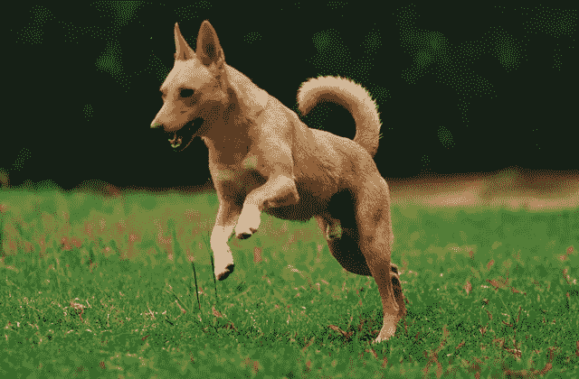

照片由 [Matheus Bertelli](https://www.pexels.com/@bertellifotografia?utm_content=attributionCopyText&utm_medium=referral&utm_source=pexels) 从 [Pexels](https://www.pexels.com/photo/brown-dog-running-on-grassy-field-1906153/?utm_content=attributionCopyText&utm_medium=referral&utm_source=pexels) 拍摄

下一步，你将不得不投入一点体力，把狗从背景中分离出来。是的，很抱歉——没有免费的午餐。但最终这肯定比创建一个完整的数据集要简单，我保证。

我所知道的完成这项工作的几个工具是 [Photoshop](https://www.adobe.com/in/products/photoshop.html?promoid=PC1PQQ5T&mv=other) (付费)或 [GIMP](https://www.gimp.org/) (免费)。或者你甚至可以使用永远可靠的微软油漆！最终输出如下所示。

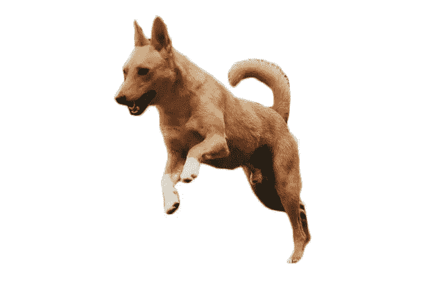

狗的分段图像

阅读图像。接下来，从这个图像中剪切出前景层，并将剩余的像素设置为零。编码这一步的另一种方法是在分割图像本身时，用你使用的工具(GIMP/Paint/Photoshop)添加一个黑色背景。但尽管如此，下面是如何在 python 中提取前景对象——简单的像素阈值处理。

```
# Read the image
I = io.imread('./dogSeg.jpg')/255.0# Cut out the foreground layer
foreground = I.copy()
foreground[foreground>=0.9]=0 # Setting surrounding pixels to zeroplt.axis('off')
plt.imshow(foreground)
plt.show()
```

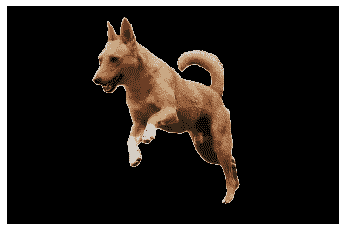

周围像素设置为零，前景层保持不变

**(B)使用现有数据集**

如果您不想从头开始，另一种选择是利用现有数据集中的图像。

我将在这里使用 [COCO](http://cocodataset.org) 数据集来演示。既然 COCO 已经有了对象类别“狗”，那么检索图像和它的遮罩就很容易了。COCO 数据集对于“狗”类别具有 4385 个(训练)和 177 个(val)图像。

对于本教程，你可以参考我的 [GitHub 库](https://github.com/virafpatrawala/Synthetic-Image-Datasets)中这个过程的全部代码。在这篇文章中，我将不再赘述这一步的代码。

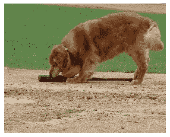

可可图片(左)及其标注(右)

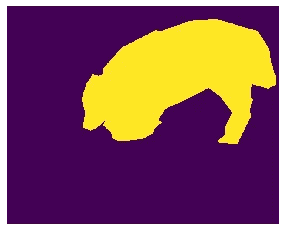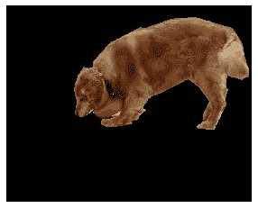

分割蒙版(左)和剪切出的前景层(右)

*如果你对操作 COCO 图像数据集和创建一个数据生成器来训练你的图像分割模型感兴趣，我这里有一个广泛的教程*[](/master-the-coco-dataset-for-semantic-image-segmentation-part-1-of-2-732712631047)**。**

## ***3。增强前景***

*让我们和狗玩一会儿(双关语)。我在代码中使用了随机旋转、随机缩放、随机平移和随机水平翻转，但是你也可以使用其他方法。*

*代码的输出如下所示。看它和原图有多不一样！*

*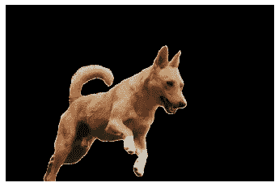*

*增强前景图像*

*将所有这些变化应用到前景后，让我们从图像中提取分割蒙版。*

*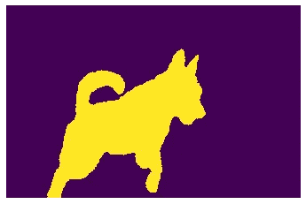*

*增强前景的分段遮罩*

## *4.背景*

*现在你需要一个新的背景图片。使用我前面提到的免费网站来获得各种各样的背景。你可以选择世界上的任何图像(见本文展示图片中我是如何把我的狗送上月球的)，但我建议尽量保持逼真。*

*我将使用这 4 张图片作为本教程的背景。*

********

*来自 [Pexels](https://www.pexels.com/photo/garden-7283/?utm_content=attributionCopyText&utm_medium=referral&utm_source=pexels) 的[创意 Vix](https://www.pexels.com/@creative-vix?utm_content=attributionCopyText&utm_medium=referral&utm_source=pexels) 、[皮克斯拜](https://www.pexels.com/@pixabay?utm_content=attributionCopyText&utm_medium=referral&utm_source=pexels)和[内森考利](https://www.pexels.com/@mastercowley?utm_content=attributionCopyText&utm_medium=referral&utm_source=pexels)的照片*

*让我们随机选择一个背景。*

```
*# Random selection of background from the backgrounds folderbackground_fileName = np.random.choice(os.listdir("./backgrounds/"))
background = io.imread('./backgrounds/'+background_fileName)/255.0*
```

## *5.最后:合成前景和背景*

*是时候把你的狗图像添加到背景中了！*

*该函数给出以下输出。现在，我知道它并不完美，但它相当不错！*

*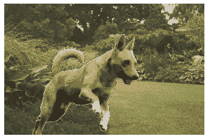*

*最终合成的图像*

*对于对象定位任务，您也可以从我们开发的新分割遮罩中轻松获得框坐标。*

*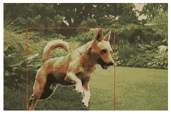*

*图像上标记的对象框*

*在所有背景下循环执行这些功能，我们得到了一组漂亮的图像！*

*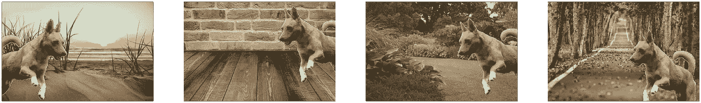*

*一只狗在多种背景下的合成图像*

*在本教程中，我使用了 1 个前景和 4 个背景。如果你随机使用多种背景和多种前景，你可以创造出很多很多的图像！也许你也可以在一个背景上合并两个或更多的前景。*发挥创意——根据您的需求，调整大小、角度、前景和背景，构建一个令人惊叹的合成数据集。这里也有很多设计上的考虑，但是只需一点点努力，你就可以做得更多，创建更精确的数据集。**

> ***最后，你可以在我的** [**GitHub 资源库**](https://github.com/virafpatrawala/Synthetic-Image-Datasets) **中找到本教程的完整代码。***

*作为这个主题的下一步，看看这个关于用 Unity 3D 创建合成图像数据集的漂亮的[教程](https://blog.stratospark.com/generating-synthetic-data-image-segmentation-unity-pytorch-fastai.html)。*

*好了，现在就到这里——谢谢你一直阅读这篇文章。我希望会有好的结果。有什么想法，问题，评论吗？请在下面的回复中告诉我！*

**如果你对语义分割的图像数据集感兴趣，可以看看我下面的帖子:**

*[](/master-the-coco-dataset-for-semantic-image-segmentation-part-1-of-2-732712631047) [## 掌握用于语义图像分割的 COCO 数据集

### 使用 PyCoco、Tensorflow Keras Python…探索和操作 COCO 图像数据集进行语义图像分割

towardsdatascience.com](/master-the-coco-dataset-for-semantic-image-segmentation-part-1-of-2-732712631047) 

*还是想在股票上用 ML 一夜暴富？这篇文章(不)适合你！*

[](/how-not-to-predict-stock-prices-with-lstms-a51f564ccbca) [## 如何(不)用 LSTMs 预测股票价格

### 股票和机器学习——天作之合。但是事情真的像看起来那么简单吗？

towardsdatascience.com](/how-not-to-predict-stock-prices-with-lstms-a51f564ccbca) 

*ML 模型真的能读懂股价图吗？*

[](/can-an-ml-model-read-stock-charts-and-predict-prices-fb73c551c7a4) [## 机器学习模型可以阅读股票图表并预测价格吗？

### 股票和机器学习——天作之合。如果你的 ML 模型可以从字面上阅读价格图表…

towardsdatascience.com](/can-an-ml-model-read-stock-charts-and-predict-prices-fb73c551c7a4)*