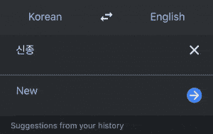
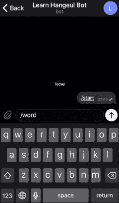
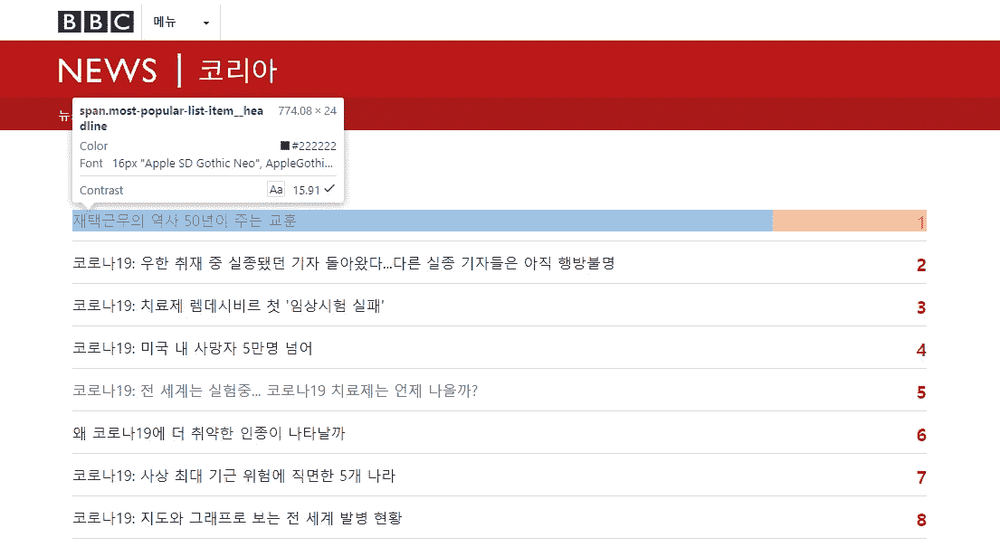

# 创建一个电报机器人来帮助你学习一门新的语言

> 原文：<https://towardsdatascience.com/create-a-telegram-bot-to-help-you-learn-a-new-language-aef10607b5f9?source=collection_archive---------38----------------------->

## 网络抓取和谷歌文本到语音的 API 来拯救


莱昂纳多·大久保俊郎在 [Unsplash](https://unsplash.com/s/photos/learning-language?utm_source=unsplash&utm_medium=referral&utm_content=creditCopyText) 上的照片

# 介绍

由于新冠肺炎疫情爆发，我在家有很多空闲时间，所以我试着学习一项新技能。上周我决定开始学习韩文(韩文字母)。

为了阅读和说韩语，你首先需要理解韩文，但有时韩文的书写方式与我们的发音不同。

学习如何发音某个韩国语单词的一种方法是通过在谷歌翻译中复制这些单词并听如何发音。



GIF 1:利用谷歌翻译功能(音频)学习韩文发音

但这似乎很累人，因为我们需要不断地从一个应用程序转移到另一个，并做一些复制粘贴。

在本教程中，我们将构建一个电报机器人，它将帮助我们以一种简单的方式实现我们的目标(学习如何发音韩语单词)。

我们将抓取一个韩语网站(在本例中是 [BBC 韩国](https://www.bbc.com/korean) ) →获取一些单词→使用谷歌文本到语音转换 API 创建关于如何发音的音频文件→保存它。然后，机器人会发送单词和音频文件来帮助我们学习如何阅读韩文和发音。

这是我们将要创建的一个机器人的例子。



GIF 2:机器人的例子

看起来很酷吧？我们开始吧！

> PS:如果你正在学习其他语言，你也可以修改脚本来学习如何用你的首选语言发音某些单词。

# 入门指南

## 1.安装库

我们将使用 [Requests](https://requests.readthedocs.io/en/master/) 和 [BeautifulSoup](https://www.crummy.com/software/BeautifulSoup/bs4/doc/) 来抓取网站，使用[Google Text-to-Speech API](https://cloud.google.com/text-to-speech)来创建关于如何发音韩文的音频，使用 [Pandas](https://pandas.pydata.org/docs/) 来帮助我们处理数据，使用 [python-telegram-bot](https://github.com/python-telegram-bot/python-telegram-bot) 来创建机器人。

```
pip install requests beautifulsoup4 google-cloud-texttospeech pandas python-telegram-bot
```

## 2.启用 Google 文本到语音转换 API 并设置凭证

转到[谷歌文本到语音转换 API 指南](https://cloud.google.com/text-to-speech/docs/quickstart-client-libraries)。在开始部分之前的**中，遵循指南，直到在步骤 5 中完成环境变量的设置。**

在这一步之后，您应该有一个格式为`.json`的凭证(在本教程中，我们将其命名为`creds.json`)，并且您应该有一个指向您的`creds.json`路径的环境变量`GOOGLE_APPLICATION_CREDENTIALS`。

## 3.在 BotFather 中创建新的机器人

如果你想在 Telegram 中制作一个机器人，你必须在使用它之前先注册你的机器人。当我们注册我们的 bot 时，我们将获得令牌来访问 Telegram API。

转到[机器人父亲](https://telegram.me/BotFather)，然后通过发送`/newbot`命令创建一个新机器人。遵循这些步骤，直到您获得您的 bot 的用户名和令牌。您可以通过访问这个 URL: `[https://telegram.me/YOUR_BOT_USERNAME](https://telegram.me/YOUR_BOT_USERNAMEa)` 来访问您的 bot，您的令牌应该如下所示。

```
704418931:AAEtcZ*************
```

# 写程序

我们将为本教程创建两个脚本。第一个用于准备数据集(抓取网站、创建音频和保存数据)，第二个用于运行机器人。

## 1.准备数据集

让我们为这个任务导入必要的依赖项。

```
from google.cloud import texttospeech
from bs4 import BeautifulSoupimport pandas as pd
import requests
import re
```

我们将从 **BBC 韩国**抓取特定页面，即[头条新闻页面](https://www.bbc.com/korean/popular/read)并获取新闻标题。



图 1: BBC 韩国-头条新闻

如果我们看看 Google Chrome inspect 元素，每个标题都被包装在 **span** 元素和**most-popular-list-item _ _ headline**类中。这是使用 BeautifulSoup 抓取特定元素的代码。

```
url = '[https://www.bbc.com/korean/popular/read](https://www.bbc.com/korean/popular/read')'
page = requests.get(url)
soup = BeautifulSoup(page.content, 'html.parser')
titles = soup.findAll('span', 
                     {'class': 'most-popular-list-item__headline'})
```

现在我们迭代`titles`，获取新闻标题，拆分成文字，追加到一个列表中。我们使用正则表达式删除标题中的任何标点符号。

```
result = []for title in titles:
  title = re.sub(r'[^\w\s]', '', title.text)
  words = title.split()
  result += words
```

将上面的代码包装到一个名为`get_hangeul`的函数中，这样您的代码看起来就像这样。

请注意，我们使用`return set(result)`是因为我们希望列表具有惟一的值，我们可以使用[*Python Set*](https://docs.python.org/3/library/stdtypes.html#set-types-set-frozenset)*来实现这一点。*

在我们获得 Hangeul 之后，我们将使用 Google 文本到语音 API 为每个单词创建音频文件，并将其保存在一个名为`audio`的文件夹中。

我在**创建音频数据**部分使用了谷歌文本到语音快速入门指南[中的代码。我们稍微修改一下，把代码包装成带`text`(韩语单词)和`language`(默认为 ko-KR，是韩语)的`create_audio`函数，将音频保存在`audio`文件夹中。](https://cloud.google.com/text-to-speech/docs/quickstart-client-libraries)

现在创建调用`get_hangeul`的主函数，遍历其结果并保存音频文件，同时保存名为`dictionary.csv`的`.csv`格式的韩语单词列表。

```
words = get_hangeul()for word in words:
  create_audio(word)dictionary = pd.DataFrame(words, columns=['word'])
dictionary.to_csv('dictionary.csv', index=False)
```

使用这些主函数，包装上面的所有代码，并将其保存为`dataset.py`。您的文件应该如下所示。

酷！从终端运行脚本(不要忘记首先在与`dataset.py`相同的路径中创建文件夹`audio`)。

```
python dataset.py
```

运行脚本后，您将会看到，我们在`audio`文件夹和`dictionary.csv`中有`.mp3`文件。

太好了！数据集准备好了，让我们创建机器人。

## 2.创建电报机器人

我们的机器人如何工作非常简单。每次用户发送`/word`命令时，我们将从`dictionary.csv`中随机抽取一个字，并与相应的`.mp3`文件一起发送。

首先，导入库并设置日志功能(这是为了在遇到错误时调试 bot)。

```
from telegram.ext import Updater, CommandHandlerimport pandas as pd
import logging logging.basicConfig(level=logging.DEBUG,
                    format='%(levelname)s - %(message)s')
logger = logging.getLogger()
logger.setLevel(logging.ERROR)
```

让我们为机器人的主要任务创建一个函数。在这个函数中，机器人将读取`dictionary.csv`文件，随机选取一个单词，然后将这个单词和音频文件发送回用户，并将其包装在一个名为`send_word`的函数中。

现在创建一个主函数来运行机器人。

当我们写`CommandHandler('word', send_word))`时，这意味着每次用户发送命令`/word`给机器人，它将运行`send_word`功能。

将所有这些代码合并到一个名为`main.py`的文件中。您的文件应该如下所示。

现在您可以在终端中运行`main.py`文件。

```
python main.py
```

如果一切运行正常，您应该看到您的机器人在您向机器人发送了`/word` 命令后发回了单词及其音频。

恭喜你！不难吧？现在你有了一个帮助你学习新语言的电报机器人，酷！

# 进一步发展

我知道这远非完美，所以如果你想进一步开发这个机器人，让它变得更酷，这里有一些建议。

1.  使用 cron job 或 python-telegram-bot [作业队列](https://github.com/python-telegram-bot/python-telegram-bot/wiki/Extensions-%E2%80%93-JobQueue)自动抓取网站，这样字典就会扩展。
2.  添加功能，机器人将发送这个词，我们必须发送我们的声音(使用语音笔记)发音，然后使用[谷歌语音到文本 API](https://cloud.google.com/speech-to-text) 我们将验证我们是否发音正确或错误。
3.  更多…

你可以访问我的 [GitHub](https://github.com/dzakyputra/hangeulbot) 个人资料获取代码或者在[这里](https://t.me/learnhangeulbot)查看工作机器人。

如果您有任何问题，请随时联系我，并在我的 Linkedin 个人资料中留言。

如果你对数据科学或机器学习感兴趣，你可能想看看我关于[构建情感分析器](https://medium.com/free-code-camp/how-to-make-your-own-sentiment-analyzer-using-python-and-googles-natural-language-api-9e91e1c493e)和[使用 Python 自动化任务](https://medium.com/free-code-camp/how-to-build-a-bot-to-automate-your-mindless-tasks-using-python-and-google-bigquery-a34faf7fb74)的帖子。

再次感谢你，祝你好运！:)