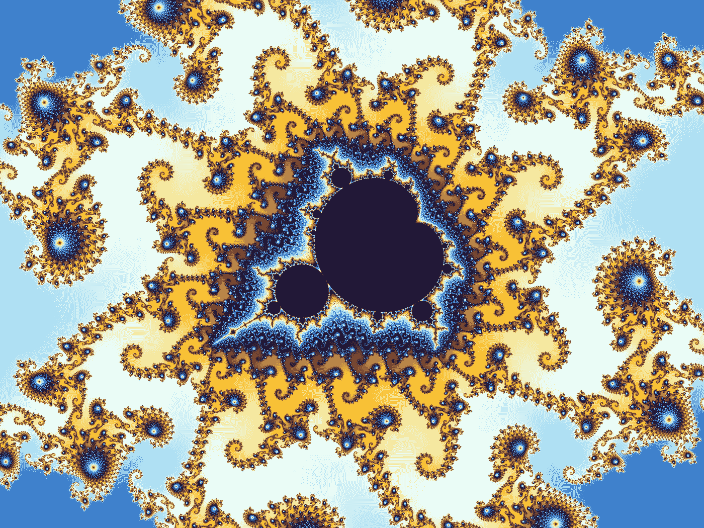

# 从代码创建一个 YouTube 视频

> 原文：<https://towardsdatascience.com/create-a-youtube-video-from-code-c9b433485d72?source=collection_archive---------24----------------------->

## 用 C++演示创建分形缩放

由沃尔夫冈·拜尔用超分形 3 程序创建。( [CC BY-SA 3.0](https://creativecommons.org/licenses/by-sa/3.0/deed.en)

如果你是一名计算机程序员，曾经想过创建一个包含计算机生成动画的视频，那么这篇文章就是为你准备的。在这里，我假设您已经有代码，或者可以编写代码，将某种图像创建为二维像素数组。它是什么样的图像并不重要，只要它适合内存中的数组。

如果你能做到这一点，这篇文章将带你走完剩下的路。您将了解如何创建 MP4 视频文件的详细步骤。当我们完成后，你将有一个适合上传到 YouTube 的视频文件，就像这样:

Mandelbrot 设置缩放视频由作者生成。

## 计划概述

以下是创建计算机生成视频的步骤概要。

*   将生成图像的 C++代码写入内存数组。我将使用一个简单的 Mandelbrot 集合图像生成器，但同样，这可以是你想要的任何东西。
*   使用开源库 [LodePNG](https://lodev.org/lodepng/) 将该图像保存到磁盘上的 PNG 文件中。
*   这段代码重复前两步数百次，一次生成一个视频帧。每个 PNG 输出文件为您的电影保存一个静态帧图像。
*   在 Windows 或 Linux 上，使用 [ffmpeg](https://www.ffmpeg.org/) 将一系列 PNG 图像转换为 MP4 视频格式文件。

## Mandelbrot 集合图像

Mandelbrot 集合是最著名的分形物体之一。上面的视频将曼德布洛特集合的放大倍数从 1 倍逐渐增加到 1 亿倍。该视频以每秒 30 帧的速率持续 30 秒，总共快速连续播放了 900 幅图像。

值得注意的是，如此多的视觉复杂性从迭代微小的公式中显现出来

源文件 [mandelzoom.cpp](https://github.com/cosinekitty/mandelzoom/blob/master/mandelzoom.cpp) 中的`Mandelbrot`函数迭代该公式，直到复值 *z* 超出原点半径为 2 的圆，或者 *n* (迭代次数)达到最大限制。 *n* 的结果值决定了屏幕上给定像素的颜色。

看一下函数`Palette`,看看迭代计数是如何转换成红色、绿色和蓝色值的。

## 在内存中生成图像

函数`GenerateZoomFrames`产生一系列 PNG 输出文件。每个 PNG 文件都包含一个以不同放大率渲染的 Mandelbrot Set 图像。帧图像的分辨率为 1280 像素宽 720 像素高，这是标准的 HD 720p 视频尺寸。

## 将图像保存到 PNG 文件

对于您自己的视频生成器应用程序，类`VideoFrame`可能会有所帮助。它表示视频的单个帧，并知道如何将该帧保存为 PNG 文件。函数`GenerateZoomFrames`使用`VideoFrame`生成分形缩放电影的每一帧。

您的应用程序必须为每一帧的每一个像素调用成员函数`VideoFrame::SetPixel`。您传入一个定义像素的红色、绿色和蓝色分量的`PixelColor`结构。这些值都是 0 范围内的整数..255.

`PixelColor`还包含范围为 0 的 alpha 值..255 表示像素的透明度。对于视频应用程序，您应该始终将此设置为 255，这意味着像素完全不透明。为了通用性，我包括了 alpha 值，以防您希望生成具有透明区域的 PNG 文件。

## 使用 ffmpeg 创建电影

我包含了一个 bash 脚本`run`，它自动化了从源代码构建 mandelzoom 程序、运行它，以及将生成的 900 个 PNG 文件转换为名为`zoom.mp4`的电影文件的整个过程。这最后一步是通过运行 ffmpeg 程序来完成的。下面是`run`脚本。它包括一些有用的注释，解释 ffmpeg 的命令行参数。

这就是全部了！您可以使用本文末尾“参考资料”一节中的链接下载整个源代码库`mandelzoom`。

## 另一个例子

我提到过，这种技术可以用于创建你能想象的任何类型的视频，只要你能编写代码来创建每一帧。只是为了好玩，我以我创建的另一个 YouTube 视频样本作为结束。它是基于一个简单的[光线追踪](https://github.com/cosinekitty/raytrace)我为我的书 [*光线追踪*](http://cosinekitty.com/raytrace/) 的基础创建的。创建这个视频的代码与上面的 Mandelbrot zoomer 工作方式相同:它生成一系列 PNG 文件，然后 ffmpeg 将其转换为 MP4 文件。

## 参考

1.  曼德尔布罗变焦源代码:[https://github.com/cosinekitty/mandelzoom](https://github.com/cosinekitty/mandelzoom)
2.  LodePNG 首页:[https://lodev.org/lodepng](https://lodev.org/lodepng/)
3.  ffmpeg 项目页面:[https://www.ffmpeg.org](https://www.ffmpeg.org/)