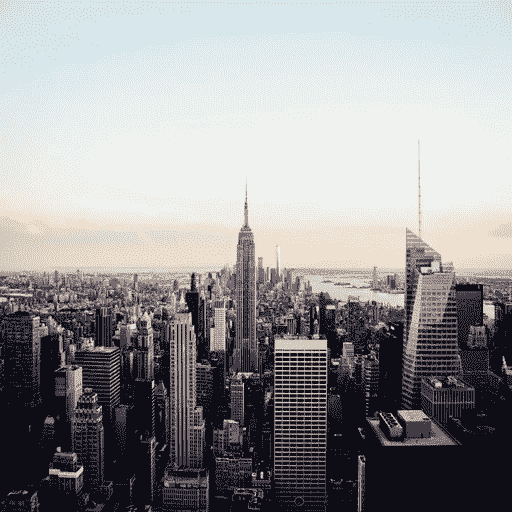
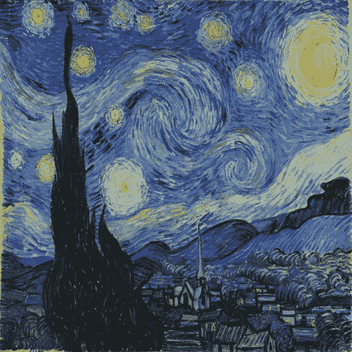
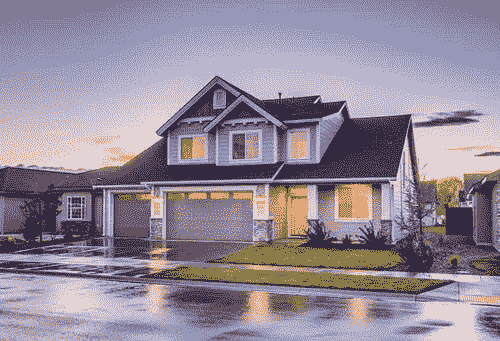
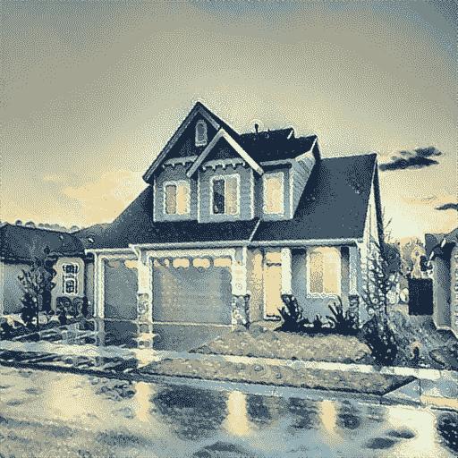
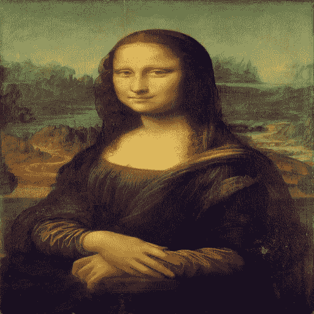
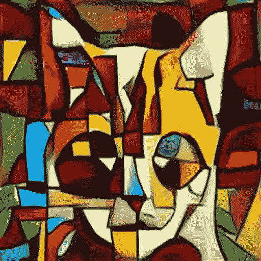
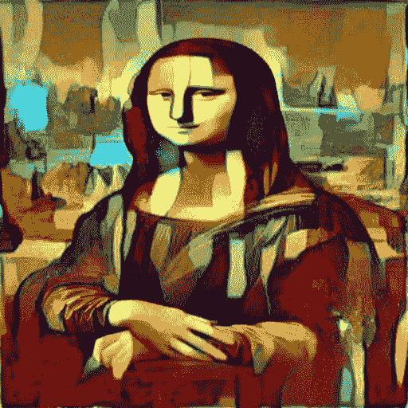
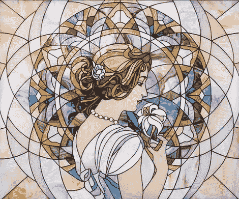
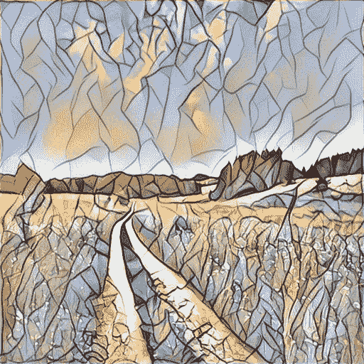

# 在深度学习中只用几行代码就能创造出惊人的图像风格效果！

> 原文：<https://towardsdatascience.com/create-amazing-image-style-effects-with-only-a-few-lines-of-code-in-deep-learning-b3869f24145c?source=collection_archive---------50----------------------->

## 学习使用 CNN 实现神经类型转移

神经风格转移是一种优化技术，其中将 ***原始图像*** 和 ***风格图像*** (如著名画家的艺术品或图案)混合在一起，以获得样式图像的设计或图案中的 ***输出图像*** 。换句话说，它也可以被称为图像风格转移。

在本文中，我们将应用 ***卷积神经网络*** (CNN)的深度学习方法来创建一个图像效果，其中一个图像的设计或风格可以应用到另一个图像上，以查看创意效果。



主图像、风格图像和输出图像

上面分享的图片是使用 CNN 实现图像的风格转换的图片。

## 概述—

对于我们的实验，我们将使用下面的' ***原始图像*** '和' ***风格图像*** '分享如下。



原象


风格图像

从上面分享的图片来看，‘***原始图片***’是我们将应用“ ***风格图片*** ”的设计得到最终主输出的图片。整个程序的详细代码可以在本文末尾找到。

## 初始步骤—

在程序代码的初始步骤中，我们将*原始图像*和*样式图像*的大小调整为 ***512X512*** 。输出大小会是***【512，512，3】***。其中 3 表示图像是 RGB 或彩色图像。

```
main_image=main_image.resize((512,512))
style_image=style_image.resize((512,512))main_array=np.asarray(main_image,dtype='float32')
main_array=np.expand_dims(main_array,axis=0)
style_array=np.asarray(style_image,dtype='float32')
style_array=np.expand_dims(style_array,axis=0)
```

下一步是通过使用`expand_dims` *将图像整形为形状 ***(1，512，512，3)*** 的 4D 张量。然后我们创建一个新的变量' ***final_image*** '，这将是我们最终的输出图像。*

```
height=512
width=512
main_image=backend.variable(main_array)
style_image=backend.variable(style_array)
final_image=backend.placeholder((1,height,width,3))input_tensor=backend.concatenate([main_image,style_image,final_image],axis=0)
```

## CNN 架构—

在这种方法中，我们将利用 ***迁移学习*** 的概念，应用预先训练好的 ***VGG16*** CNN 模型。

```
model=VGG16(input_tensor=input_tensor,weights='imagenet', include_top=**False**)
```


VGG16 架构([来源](/step-by-step-vgg16-implementation-in-keras-for-beginners-a833c686ae6c))

据消息来源[强生等人](https://arxiv.org/abs/1603.08155)。，为了提取**主图像内容层**的特征，我们应该选择`block1_conv2` ，对于**样式层**，我们需要选择`block1_conv2, block2_conv2, block3_conv3, block4_conv3, block5_conv3`。这些层可以准确地从两幅图像中提取特征。

```
layer_features=layers['block2_conv2']feature_layers = ['block1_conv2', 'block2_conv2',
                  'block3_conv3', 'block4_conv3',
                  'block5_conv3']
```

正如论文中所给出的，所选择的层的组合正确地工作，以获得所需的风格转换。但是，你可以尝试不同的组合，以获得更准确的风格转移。

## 主要损失—

一旦我们最终确定了 CNN 模型，我们现在可以定义一个**主损失**函数。这是**主图像**和我们的**输出图像**之间的距离。

```
**def** main_loss(content, combination):     
    **return** backend.sum(backend.square(content-combination))
```

## 风格丧失—

**风格损失**类似于主损失，因为它是**风格图像**和我们的**输出图像**之间的距离。

```
**def** style_loss(style,combination):
    S=gram_matrix(style)
    C=gram_matrix(combination)
    channels=3
    size=height * width
    st=backend.sum(backend.square(S - C)) / (4\. * (channels ** 2) * (size ** 2))
    **return** st
```

## 最终损失—

最后，我们将定义另一个损失，称为**最终损失**，这将调整最终图像。

```
**def** final_loss(x):
    a=backend.square(x[:,:height-1,:width-1,:]-x[:,1:,:width-1,:])
    b = backend.square(x[:, :height-1, :width-1, :] - x[:, :height-1, 1:, :])
    **return** backend.sum(backend.pow(a + b, 1.25))
```

## 优化—

一旦我们定义了这三种损失，我们可以将风格转换表述为一个优化问题，其中我们的目标是最小化上面定义的所有三种损失，这统称为**全局损失**。

```
**def** eval_loss_and_grads(x):     
    x = x.reshape((1, height, width, 3))     
    outs = f_outputs([x])     
    loss_value = outs[0]     
    grad_values = outs[1].flatten().astype('float64')     
    **return** loss_value, grad_values
```

## 评估员—

在这之后，我们定义了一个类`Evaluator()`,在这个类中，我们共同组合了上面定义的所有函数，并在主迭代中使用它进行样式转换。

```
**class** **Evaluator**(object):
    **def** __init__(self):
        self.loss_value=**None**
        self.grads_values=**None**

    **def** loss(self, x):
        **assert** self.loss_value **is** **None**
        loss_value, grad_values = eval_loss_and_grads(x)
        self.loss_value = loss_value
        self.grad_values = grad_values
        **return** self.loss_value **def** grads(self, x):
        **assert** self.loss_value **is** **not** **None**
        grad_values = np.copy(self.grad_values)
        self.loss_value = **None**
        self.grad_values = **None**
        **return** grad_values
```

## 结果—

在这种情况下，我们将使用有限内存 BFGS，这是一种优化算法来执行 10 次迭代的风格转移。

```
evaluator=Evaluator()
iterations = 10
**for** i **in** range(iterations):
    print('Start of iteration -', i)
    ta = time.time()
    x, min_val, info = fmin_l_bfgs_b(evaluator.loss, x.flatten(),
                           fprime=evaluator.grads, maxfun=20)
    print(min_val)
    tb = time.time()
    print('Iteration **%d** done in **%d** seconds' % (i, tb - ta))
```

对可视化结果用*[***L-BFGS***](https://en.wikipedia.org/wiki/Limited-memory_BFGS)***算法*** 我们得到如下图像。*

**

*最终图像*

*从上图中，我们可以看到' ***样式图像*** '的样式已经成功的被施加到' ***原始图像*** '上。因此，我们成功地实现了使用 CNN 的图像风格转换。*

*我分享了我的 github 库的链接，在那里你可以找到完整的代码供你参考。*

*[](https://github.com/mk-gurucharan/Image-Style-Transfer) [## MK-gurucharan/图像-风格-转移

### 这是一个由代码组成的库，用于执行图像风格转换，以动画的形式显示真实的图像…

github.com](https://github.com/mk-gurucharan/Image-Style-Transfer) 

## 其他例子—

这里有更多的图像风格转换的例子，已经用这个程序实现了。



图像风格转移的示例

## 结论—

从这篇文章中，我们已经能够利用深度学习，特别是 CNN，来创建惊人的风格转移效果。尝试调整超参数，优化器和其他 CNN 架构，以获得新的和不同的结果。到那时，快乐的机器学习！*