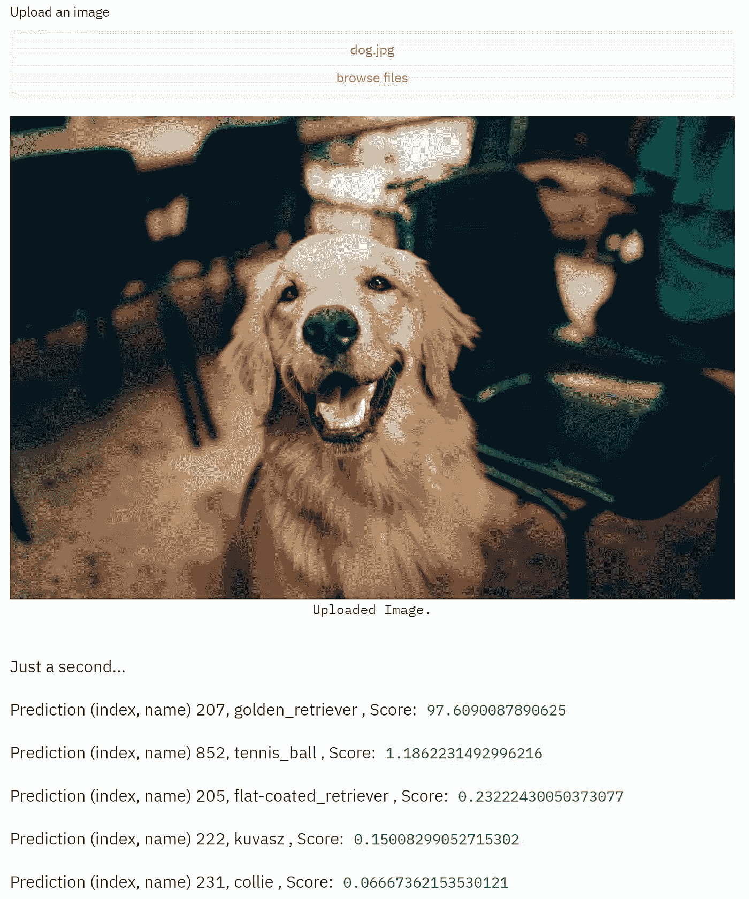
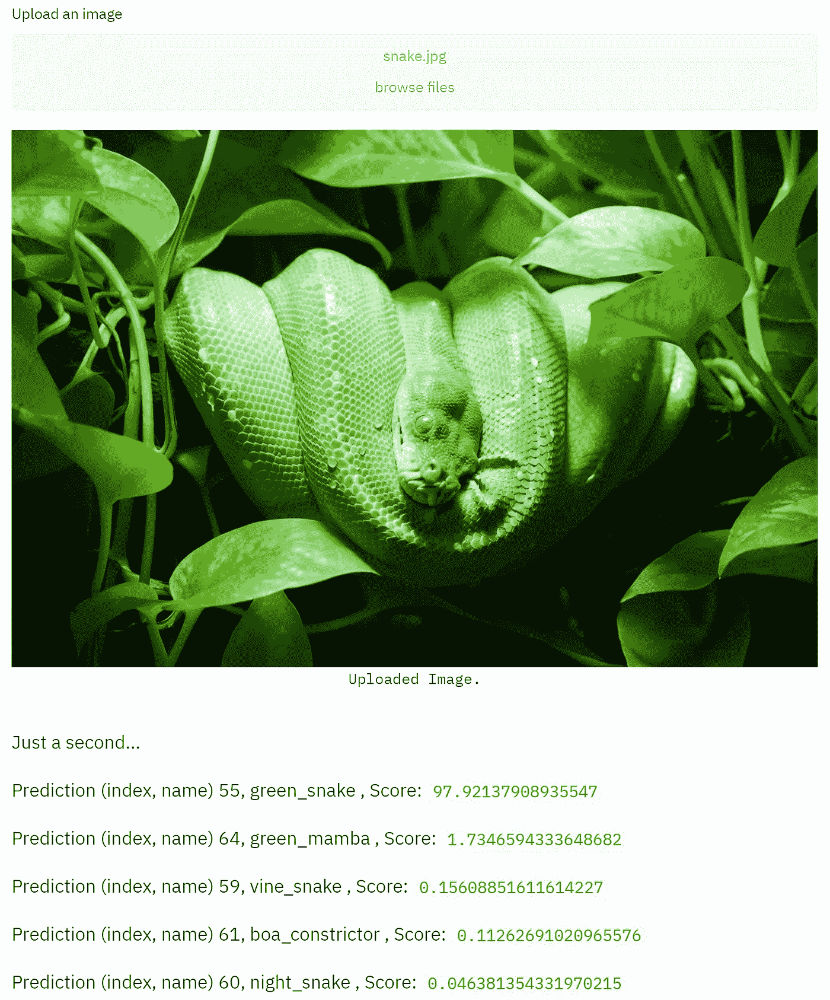

# 使用 PyTorch 和 Streamlit 创建影像分类 Web 应用程序

> 原文：<https://towardsdatascience.com/create-an-image-classification-web-app-using-pytorch-and-streamlit-f043ddf00c24?source=collection_archive---------22----------------------->


[LinkedIn 销售导航员](https://unsplash.com/@linkedinsalesnavigator?utm_source=medium&utm_medium=referral)在 [Unsplash](https://unsplash.com?utm_source=medium&utm_medium=referral) 上的照片

你刚刚开发了一个很酷的 ML 模型。

你以此为荣。您希望通过 web 演示向您的朋友展示它，以便他们可以与您的模型进行交互并提供反馈。

然而，你并不熟悉常见的框架，如 [Django 和 Flask](https://ddi-dev.com/blog/programming/django-vs-flask-which-better-your-web-app/) 。

你开始问自己:有没有一种方法可以用最少的框架构建一个快速的 web 演示？

# 古玩目录

1.  [什么是细流？](#b382)
2.  [如何制作 UI？](#68e1)
3.  [如何创建图像分类模型？](#1d5c)
4.  [结果是什么样的？](#2b4c)
5.  [接下来我们能做什么？](#3e3d)

# 概观

在这篇文章中，我将通过一个简单的例子来展示如何使用 **Streamlit** 来构建一个简单的 web 应用程序。

[Streamlit](https://streamlit.io/) 是一个开源的 Python 库，可以轻松构建用于机器学习和数据科学的定制 web 应用[1]。点击查看它的图库[来看看其他人创建的一些应用程序。](https://www.streamlit.io/gallery)

我在这里选择图像分类作为一个例子，因为计算机视觉(CV)是目前人工智能中最受欢迎的领域之一，由深度学习算法驱动。它还有广泛的应用，比如对医学图像进行分类，帮助医生进行疾病诊断[2]。在这里了解更多关于深度学习模型[的图像分类。](https://www.researchgate.net/publication/325116934_Image_classification_using_Deep_learning)

出于演示的目的，我将使用 PyTorch 的预训练 ResNet 模型，对于相同的任务，您可以随时使用其他库(TensorFlow、Keras 等)。)，其他架构，甚至定制自己的模型。

要查看我的完整 Python 代码，请查看我的 [Github 页面](https://github.com/terryz1/Image_Classification_App)。

现在事不宜迟，让我们开始吧！

# **安装 Streamlit**

第一步是安装 Streamlit 库，您可以使用 pip 命令来完成。我建议您使用 Python 虚拟环境来分别保存每个项目的依赖关系。

```
$ pip install streamlit
```

成功安装后，您可以使用一个简单的“Hello World”应用程序进行快速检查:

```
$ streamlit hello
```

# 用户界面

对于我们的应用程序，一个关键要素是使用户能够为模型上传图像以进行预测，这可以通过' **file_uploader** '函数来完成:

```
import streamlit as st
file_up = st.file_uploader("Upload an image", type="jpg")
```

请确保指定适当的文件类型，以便它能与分类模型一起正常工作。

然后我们可以显示这个图像:

```
from PIL import Image
image = Image.open(file_up)
st.image(image, caption='Uploaded Image.', use_column_width=True)
```

除此之外，我们还将使用“set_title”为应用程序创建一个标题，并使用“write”显示预测结果。

# 分类模型

要使用 PyTorch 的预训练模型，请确保安装了“Torch”和“torchvision”库。现在我们可以创建一个 ResNet 模型:

```
from torchvision import models, transforms
import torch
resnet = models.resnet101(pretrained=True)
```

简单来说，残差网络(ResNet)是一种改进的卷积神经元网络(CNN)，在知名的 [ImageNet](https://en.wikipedia.org/wiki/ImageNet) 数据库中训练，在图像分类、物体检测等 CV 任务中取得了[的优异性能](/review-resnet-winner-of-ilsvrc-2015-image-classification-localization-detection-e39402bfa5d8)。这个特殊的模型“resnet101”意味着它有 101 层(深！).点击阅读更多关于 ResNet 及其变种[的信息。](/an-overview-of-resnet-and-its-variants-5281e2f56035)

在我们创建这个模型之后，我们需要通过调整大小、标准化等来转换输入图像。这里我们利用了“火炬视觉”中的“变换”模块:

```
transform = transforms.Compose([
    transforms.Resize(256),
    transforms.CenterCrop(224),
    transforms.ToTensor(),
    transforms.Normalize(
    mean=[0.485, 0.456, 0.406],
    std=[0.229, 0.224, 0.225]
    )])
```

注意，图像根据其平均值和标准偏差进行归一化。详见[文档](https://pytorch.org/docs/stable/torchvision/models.html)。

现在，我们能够加载图像、预处理图像并进行预测:

```
img = Image.open(image_path)
batch_t = torch.unsqueeze(transform(img), 0)resnet.eval()
out = resnet(batch_t)
```

接下来，我们可以返回按最高概率排序的前 5 个预测。确保 ImageNet 中 1000 个类别的名称可用，以便我们可以通过索引输出预测:

```
prob = torch.nn.functional.softmax(out, dim=1)[0] * 100
_, indices = torch.sort(out, descending=True)
return [(classes[idx], prob[idx].item()) for idx in indices[0][:5]]
```

# 结果

现在，我们可以通过在命令提示符/终端中键入“streamlit run <the python="" file="" containing="" ui="">”来运行应用程序。让我们尝试两个例子，看看结果是什么样的。</the>

第一个例子:



图片来源:[海伦娜在](https://unsplash.com/@wildlittlethingsphoto?utm_source=medium&utm_medium=referral) [Unsplash](https://unsplash.com?utm_source=medium&utm_medium=referral) 上修剪

太好了！金毛位居榜首，置信度很高(~97)。

让我们试试另一个例子:



图片来源:[兹德内克·罗森塔尔](https://www.pexels.com/@zdenek-rosenthaler-1395581)上[像素](https://www.pexels.com/?utm_source=medium&utm_medium=referral)

青蛇高居榜首！再次，它的置信度得分相当高。

这里需要注意的一点是，由于该模型是在 ImageNet 上训练的，因此对于 1000 个类别之外的图像，它的性能可能没有那么好。

# 后续步骤

创建 web 应用程序后，下一步自然是部署和托管它。例如，我通过 Heroku 部署了一个虹膜分类应用程序，你可以通过这个 [Github 页面](https://github.com/terryz1/Iris_Classification)查看。

此外，如果你对其他神经网络模型感兴趣(VGG，Densenet 等。)，你可以尝试上传不同的图像，然后比较它们的性能。

# 摘要

让我们快速回顾一下。

我们通过 Streamlit 构建了一个简单的 web 应用程序，在这个应用程序中，用户可以上传图像来查看模型的顶级预测以及置信度得分。我们还介绍了如何通过 PyTorch 构建预训练 ResNet 模型。

我希望你喜欢这篇博文，并请分享你的任何想法:)

看看我的另一篇关于使用逻辑回归对 Yelp 评论进行情感分类的文章:

[](/sentiment-classification-with-logistic-regression-analyzing-yelp-reviews-3981678c3b44) [## 基于逻辑回归的情感分类 Yelp 评论分析

### 情感分析:特征提取、N-gram、过采样/欠采样、TF-IDF 等等…

towardsdatascience.com](/sentiment-classification-with-logistic-regression-analyzing-yelp-reviews-3981678c3b44) 

# 参考

【1】[https://docs.streamlit.io/en/stable/](https://docs.streamlit.io/en/stable/)
【2】[https://www.hindawi.com/journals/cin/2018/2061516/](https://www.hindawi.com/journals/cin/2018/2061516/)