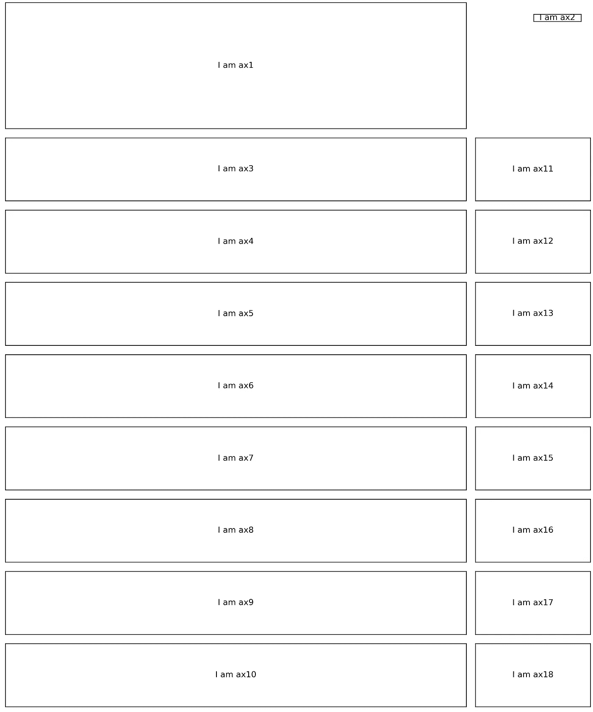

# 使用 Matplotlib 创建信息图

> 原文：<https://towardsdatascience.com/create-an-infographic-using-matplotlib-3fbb546c1628?source=collection_archive---------9----------------------->


君提供的信息图

## 2019 年澳大利亚城市的温度模式

从我之前关于 `[matplotlib](/plt-xxx-or-ax-xxx-that-is-the-question-in-matplotlib-8580acf42f44)` [绘制](/plt-xxx-or-ax-xxx-that-is-the-question-in-matplotlib-8580acf42f44)的[层次结构和](/plt-xxx-or-ax-xxx-that-is-the-question-in-matplotlib-8580acf42f44)[实例化](/the-many-ways-to-call-axes-in-matplotlib-2667a7b06e06) `[axes](/the-many-ways-to-call-axes-in-matplotlib-2667a7b06e06)`的多种方式的帖子中，我们可以看到这些特性赋予了`matplotlib`创造高度复杂和可定制可视化的巨大潜力。为了证明这一点，也为了提高我自己对`matplotlib`的理解，本周我开始用`matplotlib`制作一个**信息图**。

一个[信息图](https://venngage.com/blog/what-is-an-infographic/)通常将视觉图像、数据图表和最少的文本结合在一起。它旨在说明一个主题的易于理解的概述。由于这种性质，与常规静态数据图相比，其布局和内容更加复杂多样，常规静态数据图通常在一种类型的图中显示一种类型的数据(*如条形图、散点图、折线图和盒图或* [*及其变体*](https://datavizproject.com/) )。此外，信息图可以是一个独立的图，而常规的静态数据图主要作为补充材料，应该在一定的背景下阅读。

你可能已经从标题图中看到了完整的信息图，它显示了 2019 年澳大利亚八个主要城市的每日最高温度和降水量的年度模式(*)，我真的希望你在阅读这一段之前能了解它的主题。这让我对继续前进充满信心。我的信息图的灵感来自《南华早报》的这张信息图。*

我个人非常喜欢将大量数据可视化为网格状结构。当颜色和形状设置得当时(*高温时为砖红色，低温时为北极冰蓝色，我的例子是*)，它开始传达错综复杂背后的图案(*如纬度降低时北极冰蓝色减少*)，同时也传递了一种艺术感(*如一串红色条的外观看起来像燃烧的木头*)。

好了，事不宜迟，现在让我们深入代码，向您展示我是如何使用`matplotlib`创建这个信息图的。像往常一样，你可以从 [my Github](https://github.com/Perishleaf/data-visualisation-scripts/tree/master/matplotlib_2019_temp) 访问所有需要的数据和 jupyter 笔记本。

## 定义目标并收集数据

尽管这不在本文的讨论范围之内，我还是列出了这一部分来强调这是制作有效信息图的基础部分。只有你知道要讲什么故事，你才有收集数据和思考设计、布局、图表和美学的方向。至于我们的例子，天气数据是从澳大利亚气象局网站下载的。我们只需要日最高气温、城市名称和日期值(*即****max _ tmp _ day****、* ***城市*** *、* ***日期*** *如图 1* )。


图 1 |数据处理

## 布局

正如我在之前的[帖子](/the-many-ways-to-call-axes-in-matplotlib-2667a7b06e06)中所说，`fig.add_axes([left, bottom, width, height])`是手动将`axes`放置在`fig`上的好方法。然而，当我们有许多`axes` ( *我们总共有 18 个* `*axes*` *)并且需要对齐(*我们的眼睛非常挑剔，即使轻微的错位也会使事情失去平衡*)时，精确计算`fig`上每个`axes`的坐标是繁琐的。我于是采用了**普通布局**和**任意布局`axes`的`fig`的混合。使用`fig.add_gridspec()`和`fig.add_axes()`。这里，`fig.add_gridspec()`是一个函数，它使我们能够指定将放置`axes`的网格的几何形状。例如，想象一个 2 行 2 列的网格在一个`fig`上，通常如果我们使用`fig.subplots(nrows=2, ncols=2)`，这将产生 4 个`axes`均匀分布在 2×2 的网格上。如果在 2 乘 2 的网格上，我们只需要 3 个`axes`，第一个`axes`占据整个第一行，而剩余的 2 个`axes`平均占据第二行，会怎么样？这里有了`fig.add_gridspec()`的力量，它使我们能够根据需要创建`axes`跨越的行和列。我们可以实现上述布局如下:***

```
fig = plt.figure()# Use GridSpec for customising layout
gs = fig.add_gridspec(nrows=2, ncols=2)# Add an empty axes that occupied the whole first row
ax1 = fig.add_subplot(gs[0, 0:2])# Add two empty axes that occupied the remaining grid
ax2 = fig.add_subplot(gs[1, 0])
ax3 = fig.add_subplot(gs[1, 1])
```

正如你所看到的，一旦一个网格空间对象(*即* `*gs*`)被创建，我们可以利用它的网格几何，就像从一个 2D `numpy.ndarray`中访问值一样，来相应地放置`axes`。例如，`fig.add_subplot(gs[0, 0:2])`表示添加一个`axes`占据 2×2 网格中的整个第一行。

信息图表布局的代码

回到信息图，如上面的代码所示，除了`ax2` ( *色条的轴*)外，其他的`axes`都是由`fig.add_gridspec(nrows=10, ncols=10)`添加的。具体来说，在一个 10 行 10 列的网格上(图 2)，`ax1`，也就是标题、文本和注释的`axes`，占据了前 2 行 8 列。从`ax3`到`ax10`的每一个`axes`都是绘制温度条的`axes`，占据 1 行 8 列。最后，从`ax11`到`ax18`的每一个`axes`，也就是雨量数据的`axes`，只占 1 行 2 列。



图 2 |信息图布局

如你所见，当同时需要多个`axes`的灵活性和一致性时，`fig.add_gridspec()`是一个强大的功能。

## 内容和配色方案

布局确认后，我们可以添加数据图。这里以温度条为例(图 3)。


图 3 |条形图示例

考虑到信息和美观，每个条形代表这八个主要城市的日最高温度和年平均温度(24.43 摄氏度)之间的差值。这样，观众可以清楚地识别出高于平均气温的日子(*条向上*)和低于平均气温的日子(*条向下*)。否则，由于温度值是正的，所有的条形图将在零度以上朝向相同的方向，这使得条形图很无聊。此外，与常规的条形图不同，我删除了所有的网格、x 轴和 y 轴，只留下了必要的部分。

另一个附加功能是带有弯曲箭头的文本注释，分别指出最高和最低温度的日期。从美学的角度来看，这给整个信息图增加了灵活性。这是由`ax.annotate()`交付的。关于`ax.annotate()`的[官方文档](https://matplotlib.org/tutorials/text/annotations.html)已经给出了非常详细的例子，所以本帖不再重复该功能的介绍。

由于这八个城市的温度柱状图的样式需要保持一致，我们只需要为一个柱状图生成代码，并通过`for loop`添加其他柱状图(*见*下面的代码)。

条形图的代码

虽然配色方案是一个非常主观的决定，但我可以在这里分享我遵循的原则:**创造对比**、**分组元素**、**编码数量**。在这张信息图中，我使用了深色背景来突出温度柱状图和降雨圈。黑色的背景也表达了一种阴郁的气氛，以反映极端天气的紧急情况。此外，条形图和雨量圈分别使用一致的颜色，有助于将信息组织在一起。最后，不同温度值的色谱应用(*从北极冰蓝色到砖红色*)突出了图案。

## 标题、文本和注释

信息图可以是一个独立的图的原因是必要的文字有助于加强其主题。这里我们可以使用`ax.text()`将任何文本放在`fig`上我们想要的任何地方。我发现的唯一缺陷是给`matplotlib`添加一个自定义字体家族有点麻烦([一解此处](https://scentellegher.github.io/visualization/2018/05/02/custom-fonts-matplotlib.html))。另一种方法是在信息图主体完成后通过 Illustrator 添加文本，并导出为`svg`文件。

和往常一样，我欢迎反馈、建设性的批评以及听到关于您的数据科学项目的信息。可以通过 [Linkedin](https://www.linkedin.com/in/jun-ye-29aaa769/) 和[我的网站](https://junye0798.com/)找到我。