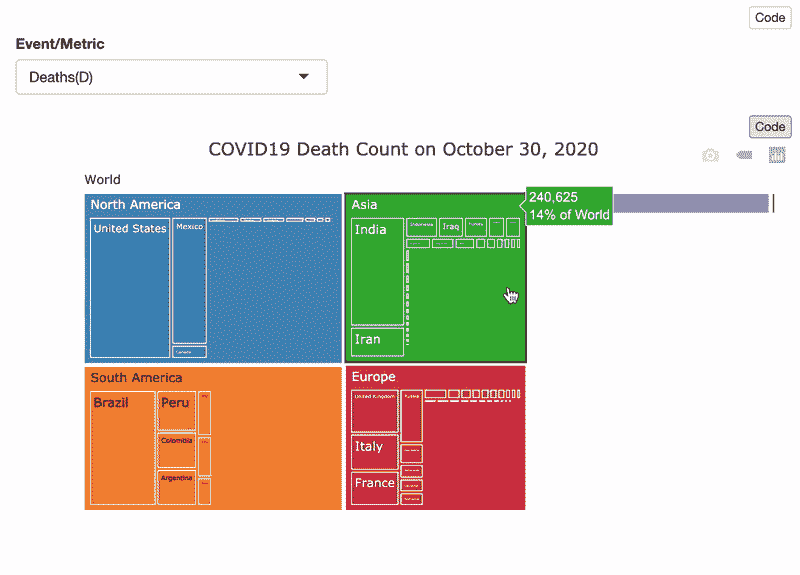
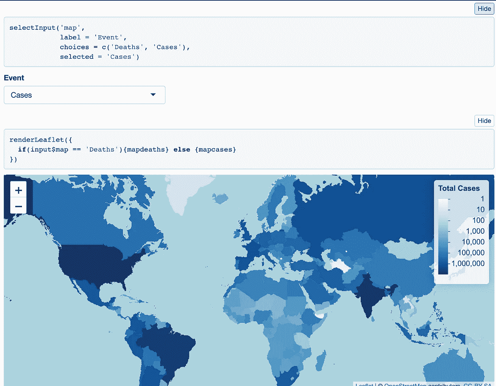

# 使用 R 创建一个交互式的新冠肺炎报告，免费托管并自动更新

> 原文：<https://towardsdatascience.com/create-an-interactive-covid-19-report-using-r-host-it-for-free-and-automate-its-update-41a5bdd46e9d?source=collection_archive---------44----------------------->

## 引人入胜的可视化，闪亮的用户界面和 GitHub 操作，创造完美的报告！

*本帖是* ***第一部分*** *一系列* ***4 期刊物*** *。请参考* ***第 1 部分*** *了解系列概述，* [***第 2 部分***](https://rpubs.com/lucha6/covid-cleaning-owid-data) *了解数据源和次要数据清理，* [***第 3 部分***](/interactive-covid19-report-with-rmarkdown-plotly-leaflet-and-shiny-c6a716af7d9b) *了解可视化的创建，构建报告以及将文档部署到 ShinyApps.io 和* *[【项目回购】](https://github.com/lc5415/COVID19)*

***每篇文章都是独立的，**意思是你真的不需要阅读其他部分来充分利用它。*

**

*交互式报告的导航*

*自 2020 年 3 月以来，所有新闻媒体和政府机构一直在用新冠肺炎的统计数据和图表轰炸民众。[这篇由](https://medium.com/@tomaspueyo/coronavirus-act-today-or-people-will-die-f4d3d9cd99ca) [Tomas Pueyo](https://medium.com/u/a361390dbcf1?source=post_page-----41a5bdd46e9d--------------------------------) 撰写的中型文章于 3 月初发表，是首批深度探索 COVID 数据的文章之一，揭示了许多见解，并在短短几天内获得了数千万次浏览。美国约翰·霍普斯金大学也提供了一个[非常有用的仪表板](https://coronavirus.jhu.edu/map.html)以及[他们的数据](https://github.com/CSSEGISandData/COVID-19)每天更新。他们的数据结合了多个来源，如世卫组织、美国疾病传播中心(CDC)和欧盟 CDC 等。*

*早期，互联网上充斥着大量来自大学的报告。我意识到我无法制作世界级的仪表板或报告，但至少我想制作自己的仪表板或报告，并学习如何制作。*

# *目录*

*[导语](#ac4b)
[ggplot，Plotly and Shiny](#f448)
[数据来源](#4bcf)
[计划](#c138)
[后会有期！](#a84e)*

# *戏弄者*

*在我们开始之前，我想让你看看最终产品会是什么样子。我们将最终得到一个交互式的基于云的 HTML 报告(有一个闪亮的后端),显示不同的 COVID19 相关图。您可以通过以下链接与最终报告互动→[https://lucha6.shinyapps.io/covideda/](https://lucha6.shinyapps.io/covideda/)*

*我们将制作以下(互动)情节，并将它们烘焙成一个漂亮的互动 RMarkdown 文档，每天更新，无需我们做任何额外的工作。*

*按国家、洲和全球 COVID 显示死亡人数的树形图*

*显示一段时间内各大洲累计病例数的折线图*

**

*样本 R(闪亮)代码和显示单张地图的输出，其中国家由确诊病例数着色*

# *`ggplot`、神秘而闪亮*

*在我看来是最好的绘图库。这个库基于 Leland Wilkinson 的 Grammar of Graphics(GoG),作为一个 R 包来实现和发布。我推荐阅读[原文](https://byrneslab.net/classes/biol607/readings/wickham_layered-grammar.pdf) `[ggplot](https://byrneslab.net/classes/biol607/readings/wickham_layered-grammar.pdf)` [2010 年论文](https://byrneslab.net/classes/biol607/readings/wickham_layered-grammar.pdf)由全能的 [Hadley Wickham](https://medium.com/u/2f166aac6770?source=post_page-----41a5bdd46e9d--------------------------------) 关于`ggplot`的第一次实现和[由](/a-comprehensive-guide-to-the-grammar-of-graphics-for-effective-visualization-of-multi-dimensional-1f92b4ed4149) [Dipanjan (DJ) Sarkar](https://medium.com/u/6278d12b0682?source=post_page-----41a5bdd46e9d--------------------------------) 关于 GoG 背后理论的全面而简明的指南。*

*Plotly 是一个很棒的跨语言库(最初是用 JavaScript 编写的),允许制作交互式图形。在 R 语言中，也就是我们今天要用的语言，他们有一个叫做`ggplotly()`的函数，可以让你把任何`ggplot`的情节变成一个没有开销的情节。*

*[闪亮的](https://shiny.rstudio.com/)让 R 用户无需了解一点 JavaScript 或 HTML 就能制作出漂亮的仪表板和交互式报告，所有这些都只需要 R。 **RStudio 还为每位用户提供多达 5 个免费仪表盘网站**，这是一种无摩擦的方式来构建您的第一个仪表盘、网络应用或交互式 R 笔记本。*

# *数据源*

*当我在三月份开始这个项目时，我开始使用的数据源来自 Kaggle:由用户 SKR 上传和维护的[新型冠状病毒数据集](https://www.kaggle.com/sudalairajkumar/novel-corona-virus-2019-dataset)。如数据集描述中所述，这只是 JHU 数据集的镜像，GitHub 中也有[数据集。不幸的是，在项目后期，我发现这个数据源中有几个工件。例如，在西班牙，4 月 24 日报告了-10000 例确诊病例，5 月 25 日记录了-2000 例死亡，正如本期 GitHub](https://github.com/CSSEGISandData/COVID-19)中讨论的[(在 JHU 资料库的 1300 多个未决问题中)。数据中还出现了类似的其他问题，而事实上，存储库维护者并没有站出来对此做出解释，这让我对这些数据的使用产生了怀疑。此外，来自谷歌或我们的数据世界(OWiD)的 COVID 每日案例没有显示这些人工制品。](https://github.com/CSSEGISandData/COVID-19/issues/2572#issuecomment-634159985)*

*我决定**将我的数据源从 JHU 中切换出来，改用 OWiD**。令我非常满意的是，OWiD 数据非常干净，充满了预先计算的特性和统计数据(比如测试统计数据、人口统计数据、每个国家的预期寿命……)。*

# *计划*

*我认为这个项目对于一篇文章来说太大了，因此我决定写一个 4 部分的系列(包括这个介绍)。接下来的三篇文章如下:*

*   *我们将首先涵盖数据清理，这是一个必要的步骤，使我们的每个后续情节。**我们主要关注每日和累计的死亡和确诊病例数。**这并不令人兴奋或有足够的洞察力来写一篇关于它的中型文章，因此我为那些对 **RPubs** 感兴趣的人发布了这个步骤(在这里阅读)。你也可以在另一个 RPubs 笔记本中探索我清理和争论 JHU 数据的努力。出于学习的目的，我在第二个笔记本上的努力要有用得多。**数据清理是极其重要的一步，但由于它并不花哨，所以经常被忽视。尽管如此，所有的数据科学家都应该熟悉它。***
*   *接下来，我们将使用`ggplot2,` `plotly`和`leaflet`制作每个图，并学习如何制作和部署一个闪亮的 RMarkdown 文档。我们还将看到如何将`plotly`图存储为常规文件，以加速我们闪亮文档的加载。*
*   *最后，我们将编写自动化工具(bash 脚本和 Github 动作),这样我们的报告就可以每天更新，而不需要我们做任何额外的工作。*

# *回头见！*