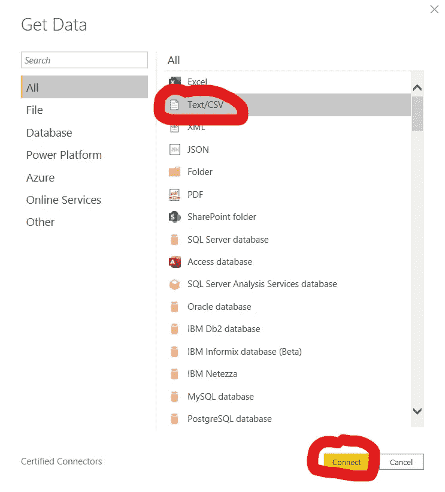
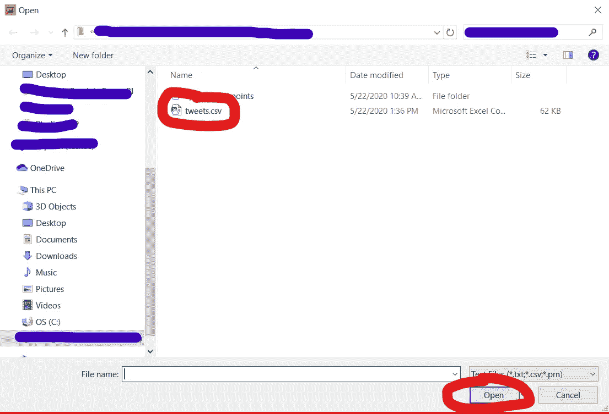
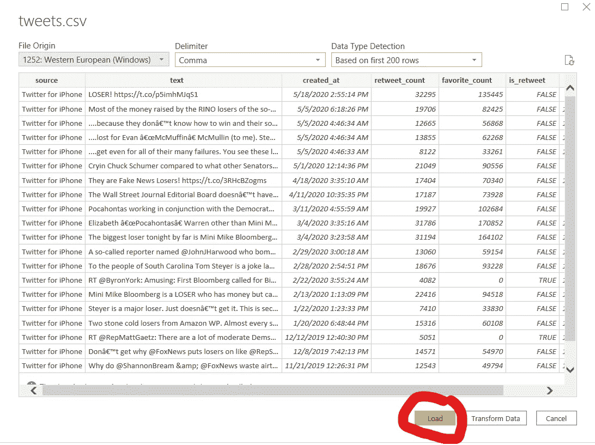
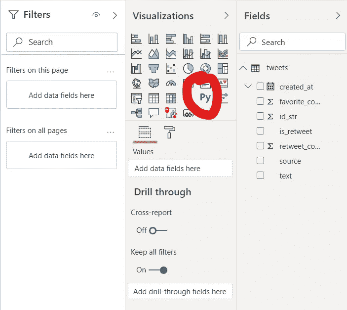
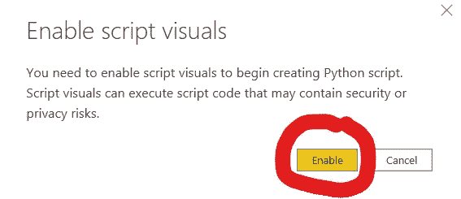
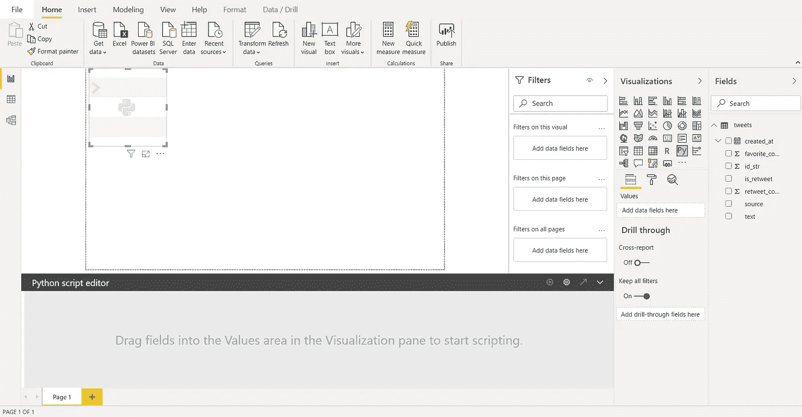
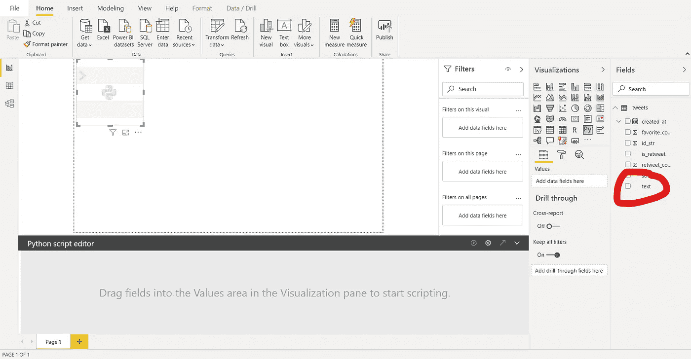
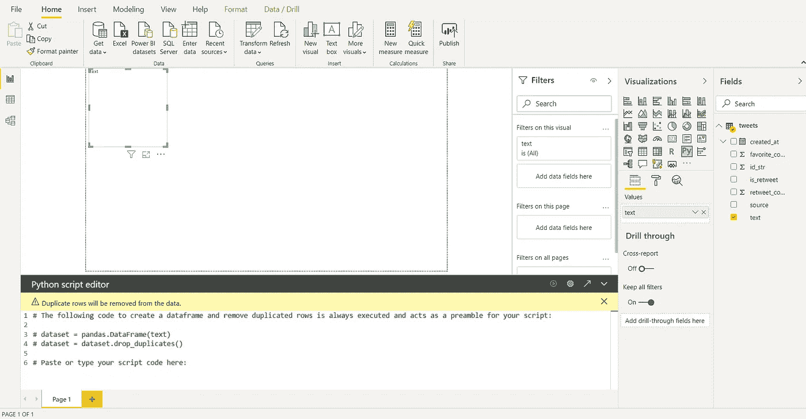
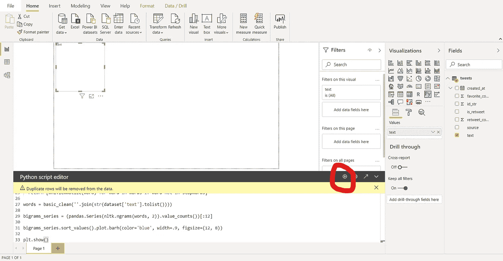
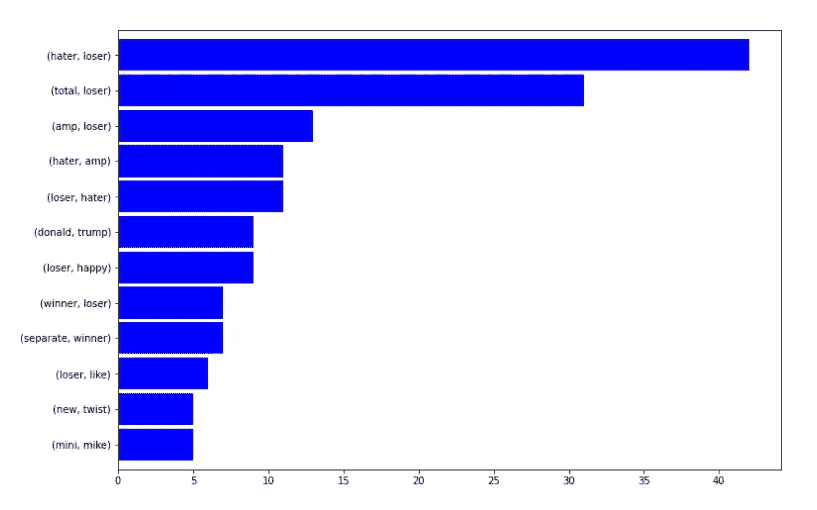

# 在 Power BI 中创建 N 元排序

> 原文：<https://towardsdatascience.com/create-an-n-gram-ranking-in-power-bi-b27ba076366?source=collection_archive---------26----------------------->

## 数据科学/电力 BI 可视化

## 关于构建 Python 可视化的快速入门指南，只需点击几下鼠标和少量代码。


图为[塔达斯·萨](https://unsplash.com/@stadsa?utm_source=unsplash&utm_medium=referral&utm_content=creditCopyText)在 [Unsplash](https://unsplash.com/s/photos/microsoft?utm_source=unsplash&utm_medium=referral&utm_content=creditCopyText)

*在之前的一篇* [*文章*](/from-dataframe-to-n-grams-e34e29df3460) *中，我写了一篇关于使用 nltk 进行自然语言处理来创建和可视化 n-gram 排序的快速入门指南。然而，我需要一种方法来与那些机器上没有安装 Python 或 Jupyter Notebook 的人分享我的发现。我需要使用我们组织的 BI 报告工具:Power BI。*

进入 *Python 可视化*。

Python 可视化允许您创建通过运行 Python 代码生成的可视化。在本帖中，我们将使用这种视觉效果来展示我们的 n-gram 排序结果所需的步骤。

首先，让我们得到我们的数据。你可以在这里下载样本数据集[。然后，我们可以将数据加载到 Power BI Desktop 中，如下所示:](https://github.com/ecdedios/ngram-quick-start)


选择文本/CSV 并点击“连接”。



在 Windows 资源管理器文件夹中选择文件，然后单击打开:



点击“加载”。



接下来，在“可视化”面板上找到 Py 图标。



然后，在出现启用脚本视觉效果的提示时，单击“启用”。



您将看到一个占位符出现在主区域，一个 Python 脚本编辑器面板出现在仪表盘的底部。



选择“字段”面板上的“文本”栏。



您将看到一个预定义的脚本，它是我们将要编写的脚本的序言。



在 Python 脚本编辑器面板中，将光标放在第 6 行的末尾，然后按两次 enter 键。

然后，复制并粘贴以下代码:

```
import re
import unicodedata
import nltk
from nltk.corpus import stopwordsADDITIONAL_STOPWORDS = ['covfefe']import matplotlib.pyplot as pltdef basic_clean(text):
  wnl = nltk.stem.WordNetLemmatizer()
  stopwords = nltk.corpus.stopwords.words('english') + ADDITIONAL_STOPWORDS
  text = (unicodedata.normalize('NFKD', text)
    .encode('ascii', 'ignore')
    .decode('utf-8', 'ignore')
    .lower())
  words = re.sub(r'[^\w\s]', '', text).split()
  return [wnl.lemmatize(word) for word in words if word not in stopwords]words = basic_clean(''.join(str(dataset['text'].tolist())))bigrams_series = (pandas.Series(nltk.ngrams(words, 2)).value_counts())[:12]bigrams_series.sort_values().plot.barh(color='blue', width=.9, figsize=(12, 8))plt.show()
```

简而言之，上面转换的代码从`dataset`数据帧的`'text'`列中提取 n-grams，并使用 matplotlib 创建一个水平条形图。`plt.show()`的结果就是 Power BI 在 Python 可视界面上显示的内容。

关于这段代码的更多信息，请访问我的[以前的教程](/from-dataframe-to-n-grams-e34e29df3460)。

[](/from-dataframe-to-n-grams-e34e29df3460) [## 从数据框架到 N 元语法

### 使用 nltk 为自然语言处理创建和可视化 n 元语法排序的快速入门指南。

towardsdatascience.com](/from-dataframe-to-n-grams-e34e29df3460) 

粘贴完代码后，单击 Python 脚本编辑器面板右上角的“播放”图标。



几分钟后，您应该能够看到如下所示的水平条形图:



就是这样！

只需简单地点击几下鼠标，在 Python 脚本的帮助下，我们就能够可视化 n 元语法排序的结果。

我希望你喜欢今天关于 Power BI 最强特性之一的帖子。Power BI 已经有了一些有用和漂亮的内置视觉效果，但有时，你只需要多一点灵活性。运行 Python 代码对此有所帮助。我希望这个温和的介绍将鼓励你探索更多，扩大你的剧目。

在下一篇文章中，我将分享一个使用 spaCy *从熊猫数据帧中提取命名实体的快速入门指南* [*。*](/from-dataframe-to-named-entities-4cfaa7251fc0)

*敬请期待！*

你可以通过 [Twitter](https://twitter.com/ecdedios) 或 [LinkedIn](https://www.linkedin.com/in/ednalyn-de-dios/) 联系我。