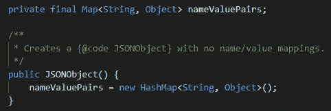

# 用 Java 创建一个有序的 JSONObject

> 原文：<https://towardsdatascience.com/create-an-ordered-jsonobject-in-java-fb9629247d76?source=collection_archive---------9----------------------->

## 为什么创建有序 JSONObject 这么复杂？

米歇尔·亨德森在 Unsplash 上的照片

在 Java 中使用 JSONObject 时，您可能会注意到，当您打印出对象时，顺序并不完全是您所期望的。

我们要做的就是把它改成订购的，对吗？

嗯，事情比这要复杂一点，幸运的是，我已经找到了这个常见问题的迷人解决方案。

在这种情况下，我们进入幕后，操纵底层的数据结构，使之成为我们所需要的。

我将首先解释这个问题，然后给你提供一个解决方案。然后，我们将讨论您处理此问题的其他方式。

我们开始吧！

# 问题是

JSONObject 的底层数据结构是 HashMap。为什么？HashMap 允许快速检索键值对，使它们成为 JSON 对象的完美数据结构。

但是，正如我们在数据结构和算法课程中所记得的，默认情况下，HashMaps 是无序的，这意味着您的数据是随机分布在内存中的。

这意味着，如果我们想在日志、浏览器或电子邮件中打印 JSONObject，顺序可能会显得不规则。

这里有一个例子，我们用四个元素创建了一个 JSONObject。请注意我们向 JSONObject 添加对象的顺序:

现在看看这些对象在我们的日志中是如何显示的:

顺序应该是“一”、“二”、“三”、“四”。

如果我们以特定的顺序期待我们的结果，这是不好的。

# 解决方案

有几种方法可以处理这个问题，但是我将挖掘一个我非常感兴趣的解决方案。

我们将利用我以前只在单元测试中使用过的 API:反射。

反射是一个运行时 API，用于修改方法、接口和类的行为。这是一个很好的工具，我们可以用它来改变“幕后”的代码。

如果你看一下`JSONObject.class`，你会看到这个构造函数:

这是创建 JSONObject 的默认构造函数。我们必须将底层数据结构(HashMap)改为有序的。对此的完美解决方案是 LinkedHashMap。

现在，让我们一行一行地检查这段代码:

*   第 14 行:我们仍然在创建之前使用过的 JSONObject。
*   第 15 行:我们需要处理这些方法抛出的异常(`IllegalAccessException` 和`NoSuchFieldException`)。因此，我们使用一个 try-catch 块。
*   第 16 行:Field 是我前面提到的反射 API 中的一个类。这有助于我们访问 JSONObject 类中声明的“map”字段。我们创造了一个“反射物体”
*   第 17 行:在上面 JSONObject.class 的截图中你可能已经注意到了，`nameValuePairs`变量是私有的。我们需要让它变得容易接近。
*   第 18 行:既然变量是可访问的，我们可以将`HashMap<>()`改为`LinkedHashMap<>()`。
*   第 19 行:出于安全考虑，我们将把该变量的可访问性设置回 false。

将这个 JSONObject 记录到控制台后，您会看到输出现在是有序的:

大获成功！

# 替代解决方案

这肯定不是解决这个问题的唯一办法。这只是我感兴趣的一个解决方案，并且被证明是有效的。

还有其他库可以用来构建 JSON 对象，它们很可能提供对有序 JSON 的支持；然而，这是我使用`org.json.JSONObject`的一个要求，所以我决定为这个 JSON 对象找到一个解决方案。

JSONArrays 可能会提供您正在寻找的解决方案，因为订单遵循一个索引。

一个可能的解决方案是实现您自己的 JSONObject。您可以使用 LinkedHashMap <>()或其他有序的数据结构，而不是使用 HashMap <>()来实现。

如何解决这个问题的机会是无限的，但是使用反射 API 是一个很棒的选择。

如果您有任何问题、意见或顾虑，请告诉我！