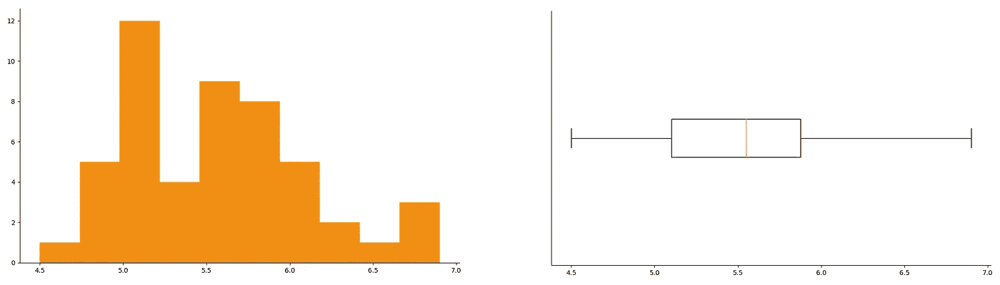
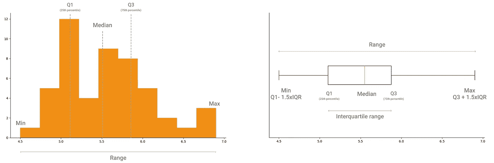
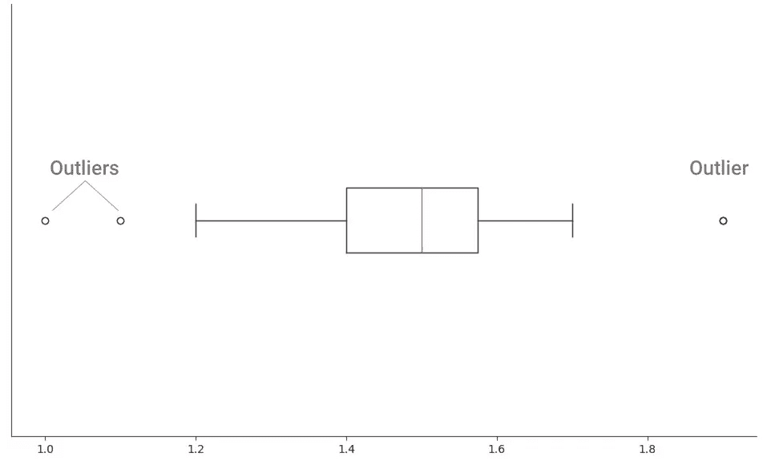
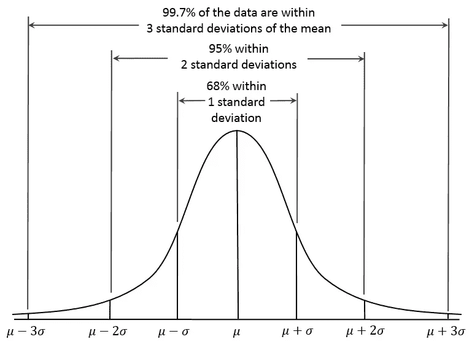
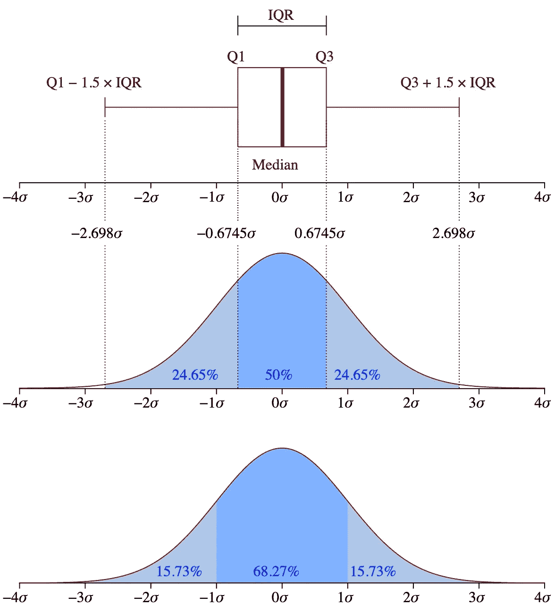
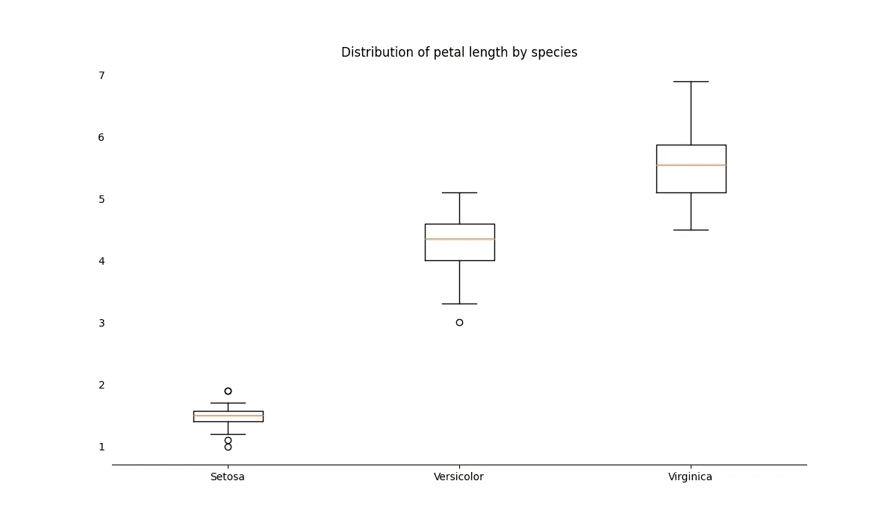
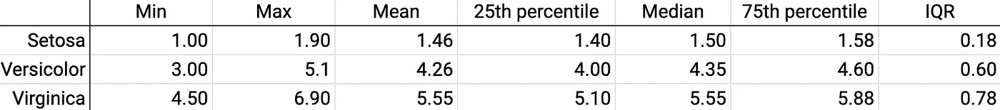
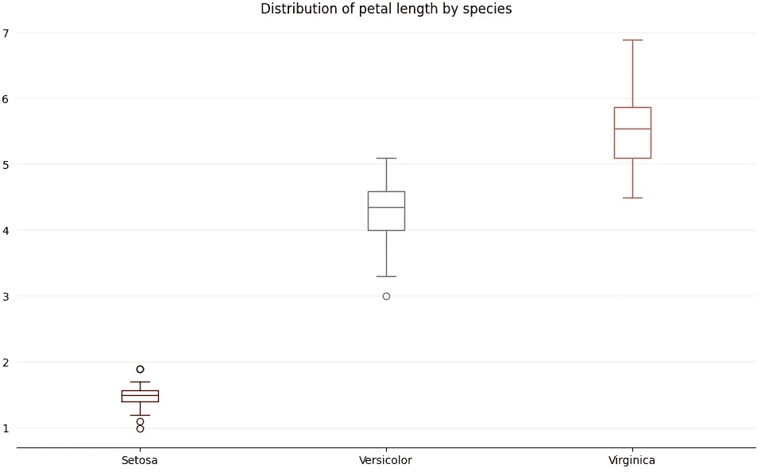

# 使用 Python 的 Matplotlib 创建和定制箱线图，以从数据中获得大量见解

> 原文：<https://towardsdatascience.com/create-and-customize-boxplots-with-pythons-matplotlib-to-get-lots-of-insights-from-your-data-d561c9883643?source=collection_archive---------0----------------------->


箱线图被低估了。它们塞满了关于底层分布的见解，因为它们将大量关于数据的信息浓缩到一个小的可视化中。

在本文中，您将看到箱线图如何成为实现以下目标的强大工具:

*   了解数据的分布。
*   发现异常值。
*   比较分布，以及箱线图可视化中的小调整如何更容易发现分布之间的差异。

# 了解数据的分布

在探索性数据分析过程中，箱线图是直方图的一个很好的补充。

使用直方图，很容易看到分布的形状和趋势。因为直方图突出了每个数据点在分布中出现的频率。

> 箱线图不直接关注频率，而是关注分布中的值的范围。



*直方图突出显示频率，而箱线图突出显示数据的范围。*

我们习惯用频率和比较比例来思考。这就是为什么我们如此轻松地解释直方图的洞察力，在直方图中，我们可以发现大多数数据集中的值，我们可以看到分布的形状。

使用箱线图，我们可以获得与直方图相同的洞察力。虽然我们可以用直方图来显示分布的形状，但箱线图突出显示了给出分布形状的汇总指标。我们可以从箱线图中提取的汇总指标有:

*   *分位数*，特别是第一和第三分位数，对应于第 25 和第 75 个百分点。
*   *中位数*，分布的中间点，也对应于第 50 个百分位数。
*   *四分位数范围(IQR)* ，第三个和第一个分位数之间的宽度。用数学表达，我们有 IQR = Q3 — Q1。
*   *最小值，*数据集中排除异常值的最小值，对应于 Q1-1.5 倍质量分数
*   *Max* ，数据集中的最大值，不包括异常值，对应 Q3+ 1.5xIQR。



*您可以从直方图和箱线图中提取的汇总指标。*

# 斑点异常值



*突出异常值的箱线图。*

在方框图中显示异常值通常显示为圆圈。但是正如您将在下一节看到的，您可以定制离群值的表示方式😀

如果你的数据集有异常值，用箱线图很容易发现它们。有不同的方法来确定数据点是异常值。最广为人知的是 *1.5xIQR 规则。*

# 1.5xIQR 规则

异常值是数据集中的极端观察值。因此，判断一个数据点是否极端的经验法则是将其与四分位间距进行比较。

使用四分位距(IQR)来发现异常值是有意义的。IQR 是第一个和第三个四分位数之间的值范围，即第 25 个和第 75 个百分位数，因此它将包括数据集中的大多数数据点。

但是为什么是 1.5 倍的四分位间距呢？这与被称为[68–95–99 规则](https://en.wikipedia.org/wiki/68%E2%80%9395%E2%80%9399.7_rule)的[正态分布](https://en.wikipedia.org/wiki/Normal_distribution)的一个重要特征有关。



68–95–99 法则，来源:【https://commons.wikimedia.org/wiki/File:Empirical_Rule.PNG 

根据 68–95–99 规则，我们知道:

*   68%的数据在平均值之上或之下的一个标准偏差内，
*   95%的数据在平均值的两个标准偏差内，
*   99.7%的数据在平均值的三个标准偏差之内。

只有很少的数据点会超过平均值的三个标准偏差，更准确地说，只有 0.3%的数据点。所以任何超过三个标准差的数据点都被认为是极端的。

为了检查一个数据点是否是异常值，并检查它是否超出三个标准差，我们计算:

*   Q1-1.5 倍
*   Q3 + 1.5xIQR。

这些代表分布中不被认为是极端的区域的下限和上限。其最终大约是平均值的 3 个标准偏差。

乘数是 1.5，因为任何大于 1.5 的数字都会导致大于 3 倍标准差的范围。因此，数学家们选定了一个中间数。



箱线图和概率密度函数，来源:[https://commons.wikimedia.org/wiki/File:Boxplot_vs_PDF.svg](https://commons.wikimedia.org/wiki/File:Boxplot_vs_PDF.svg)

任何低于下限或高于上限的数据点*都是异常值；*

*   (数据点值)< Q1–1.5xIQR, then it’s an outlier.
*   (data point value) > Q3 + 1.5xIQR，那么就是离群值。

# 自定义箱线图以比较分布

箱线图也是比较不同分布的好工具。

让我们比较一下[虹膜数据集](https://scikit-learn.org/stable/auto_examples/datasets/plot_iris_dataset.html)中花朵花瓣长度的分布。



*比较虹膜数据集的花瓣长度。*

以下是你如何创建这个情节。

```
import numpy as np
import pandas as pd
from sklearn import datasets
import matplotlib.pyplot as plt# Load Iris dataset
iris = datasets.load_iris()# Preparing Iris dataset
iris_data = pd.DataFrame(data=iris.data, columns=['sepal_length', 'sepal_width', 'petal_length', 'petal_width'])iris_target = pd.DataFrame(data=iris.target, columns=['species'])
iris_df = pd.concat([iris_data, iris_target], axis=1)# Add species name
iris_df['species_name'] = np.where(iris_df['species'] == 0, 'Setosa', None)iris_df['species_name'] = np.where(iris_df['species'] == 1, 'Versicolor', iris_df['species_name'])iris_df['species_name'] = np.where(iris_df['species'] == 2, 'Virginica', iris_df['species_name']) # Prepare petal length by species datasets
setosa_petal_length = iris_df[iris_df['species_name'] == 'Setosa']['petal_length']versicolor_petal_length = iris_df[iris_df['species_name'] == 'Versicolor']['petal_length']virginica_petal_length = iris_df[iris_df['species_name'] == 'Virginica']['petal_length'] # Visualize petal length distribution for all speciesfig, ax = plt.subplots(figsize=(12, 7))# Remove top and right border
ax.spines['top'].set_visible(False)
ax.spines['right'].set_visible(False)
ax.spines['left'].set_visible(False)# Remove y-axis tick marks
ax.yaxis.set_ticks_position('none')# Add major gridlines in the y-axis
ax.grid(color='grey', axis='y', linestyle='-', linewidth=0.25, alpha=0.5)# Set plot title
ax.set_title('Distribution of petal length by species')# Set species names as labels for the boxplot
dataset = [setosa_petal_length, versicolor_petal_length, virginica_petal_length]labels = iris_df['species_name'].unique()
ax.boxplot(dataset, labels=labels)plt.show()
```


*(再次)比较虹膜数据集的花瓣长度。*

我们可以从这个情节中获得一些启示:

*   刚毛鸢尾的花瓣长度远小于杂色鸢尾和海滨鸢尾。它的范围从大约 1 到 2 厘米。
*   海滨鸢尾的花瓣长度范围大于刚毛鸢尾和杂色鸢尾的花瓣长度范围。我们可以从**的高度看出，与其他两个相比，海滨鸢尾的盒子是*的。*
*   *鸢尾和 Veriscolor 都有异常值。*

*我们还可以通过查看每个分布的汇总指标来确认这些见解。*

**

**鸢尾属植物花瓣长度的综合度量。**

*下面是计算这些指标的方法。*

```
*def get_summary_statistics(dataset):

    mean = np.round(np.mean(dataset), 2)
    median = np.round(np.median(dataset), 2)
    min_value = np.round(dataset.min(), 2)
    max_value = np.round(dataset.max(), 2) quartile_1 = np.round(dataset.quantile(0.25), 2)
    quartile_3 = np.round(dataset.quantile(0.75), 2) # Interquartile range
    iqr = np.round(quartile_3 - quartile_1, 2) print('Min: %s' % min_value)
    print('Mean: %s' % mean)
    print('Max: %s' % max_value)
    print('25th percentile: %s' % quartile_1)
    print('Median: %s' % median)
    print('75th percentile: %s' % quartile_3)
    print('Interquartile range (IQR): %s' % iqr)
    print('Setosa summary statistics')print('\n\nSetosa summary statistics')
get_summary_statistics(setosa_petal_length)print('\n\nVersicolor summary statistics')
get_summary_statistics(versicolor_petal_length)print('\n\nVirginica summary statistics')
get_summary_statistics(virginica_petal_length)*
```

## *定制您的箱线图*

*乍一看，很难区分不同物种的箱线图。底部的标签是我们比较分布的唯一视觉线索。*

*我们可以使用 boxplot 的属性来定制每个*框*。由于属性应用于所有数据，这些数据是给定 boxplot 方法的*,我们不能采用最后一个绘图的方法，并使用每个物种花瓣长度的数组作为输入。**

*我们必须绘制每个物种的花瓣长度，并对每个物种应用属性。*

*我们将使用以下参数:*

*   **位置*:箱线图在绘图区的位置。我们不想将每个物种的箱线图绘制在彼此之上，所以我们用它来设置每个箱线图在 x 轴上的位置。*
*   **medianprops* :应用于箱线图内中线的属性字典。*
*   **whiskerprops* :应用于胡须的属性字典。*
*   **capprops* :应用于胡须上帽子的属性字典。*
*   **flierprops* :应用于离群值的属性字典。*

*我们还可以自定义其他几个属性。在本例中，我将为每个箱线图添加不同的颜色，这样更容易看到我们在可视化不同的分布。*

**

**比较虹膜数据集的花瓣长度，为每个物种定制颜色。**

```
*fig, ax = plt.subplots(figsize=(12, 7))# Remove top and right border
ax.spines['top'].set_visible(False)
ax.spines['right'].set_visible(False)
ax.spines['left'].set_visible(False)# Remove y-axis tick marks
ax.yaxis.set_ticks_position('none') # Set plot title
ax.set_title('Distribution of petal length by species')# Add major gridlines in the y-axis
ax.grid(color='grey', axis='y', linestyle='-', linewidth=0.25, alpha=0.5)# Set species names as labels for the boxplot
dataset = [setosa_petal_length, versicolor_petal_length, virginica_petal_length]
labels = iris_df['species_name'].unique() # Set the colors for each distribution
colors = ['#73020C', '#426A8C', '#D94D1A']
colors_setosa = dict(color=colors[0])
colors_versicolor = dict(color=colors[1])
colors_virginica = dict(color=colors[2])# We want to apply different properties to each species, so we're going to plot one boxplot
# for each species and set their properties individually
# positions: position of the boxplot in the plot area
# medianprops: dictionary of properties applied to median line
# whiskerprops: dictionary of properties applied to the whiskers
# capprops: dictionary of properties applied to the caps on the whiskers
# flierprops: dictionary of properties applied to outliersax.boxplot(dataset[0], positions=[1], labels=[labels[0]], boxprops=colors_setosa, medianprops=colors_setosa, whiskerprops=colors_setosa, capprops=colors_setosa, flierprops=dict(markeredgecolor=colors[0]))ax.boxplot(dataset[1], positions=[2], labels=[labels[1]], boxprops=colors_versicolor, medianprops=colors_versicolor, whiskerprops=colors_versicolor, capprops=colors_versicolor, flierprops=dict(markeredgecolor=colors[1]))ax.boxplot(dataset[2], positions=[3], labels=[labels[2]], boxprops=colors_virginica, medianprops=colors_virginica, whiskerprops=colors_virginica, capprops=colors_virginica, flierprops=dict(markeredgecolor=colors[2]))plt.show()*
```

*就是这样！您可以使用箱线图来探索您的数据和自定义您的可视化，以便更容易提取见解。*

**感谢阅读！**