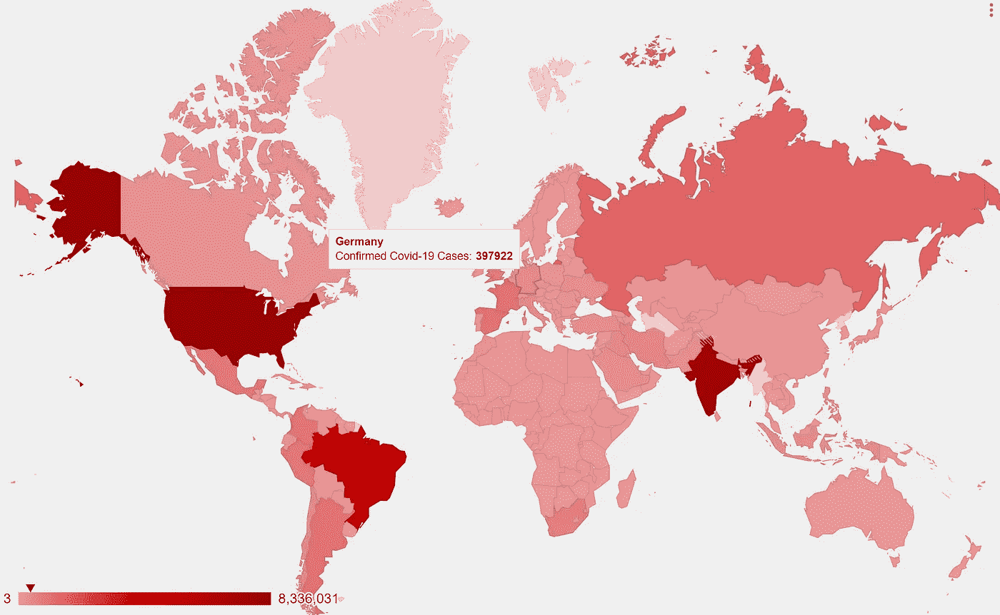
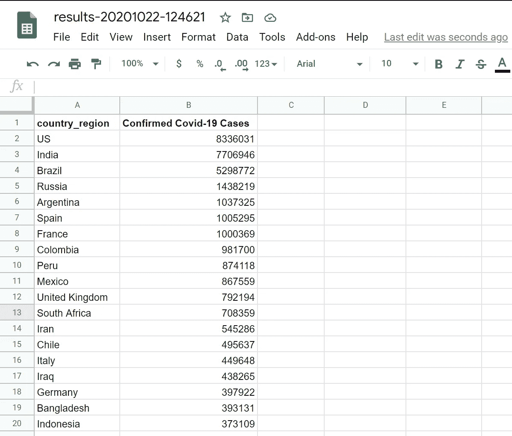
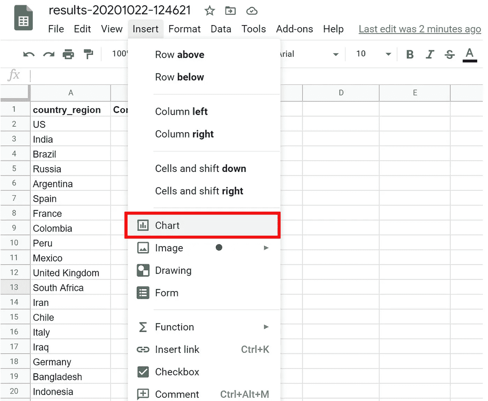
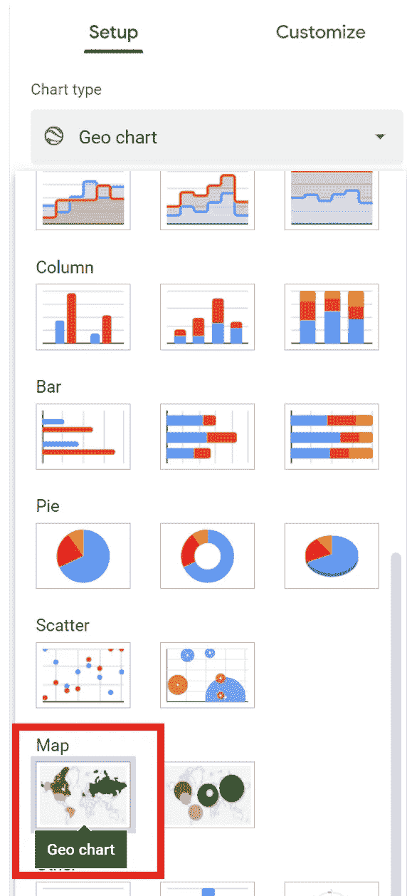
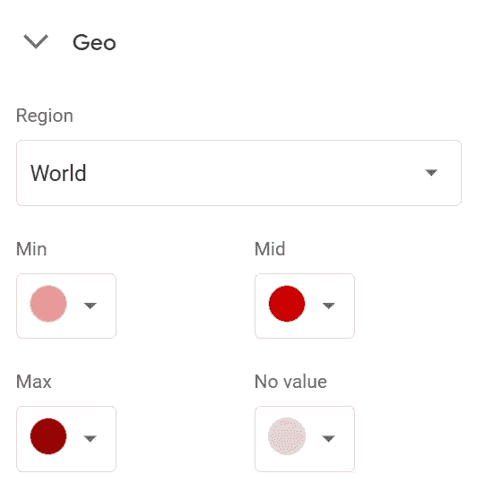
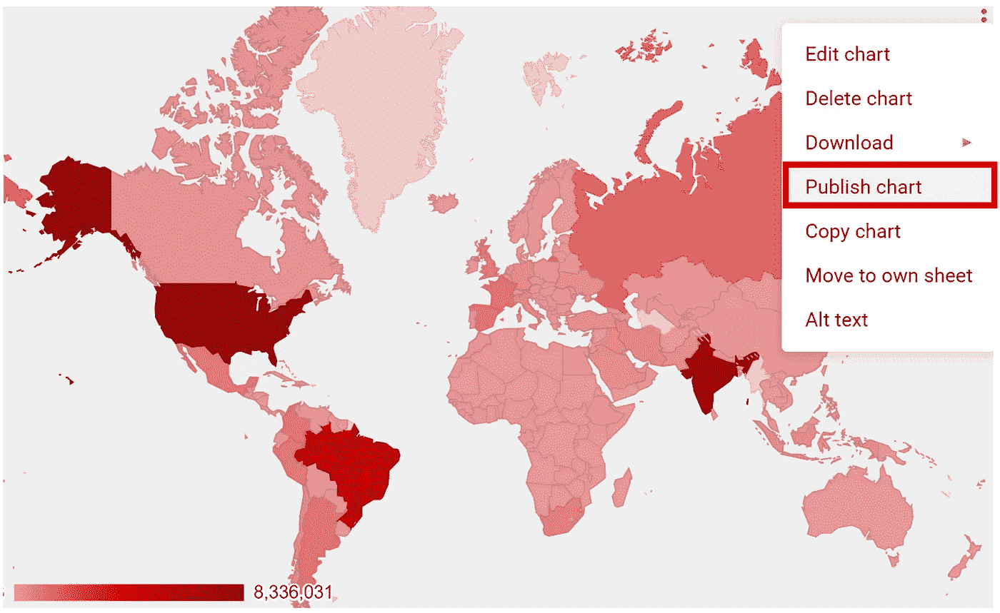

# 在 1 分钟内创建并共享交互式地图

> 原文：<https://towardsdatascience.com/create-and-share-an-interactive-map-in-1-minute-d9b48fed2bda?source=collection_archive---------27----------------------->

## 使用 Google Sheet 创建交互式 Choropleth 地图的简单方法。

由 [Puk Patrick](https://unsplash.com/@macpukpro?utm_source=medium&utm_medium=referral) 在 [Unsplash](https://unsplash.com?utm_source=medium&utm_medium=referral) 上拍摄的照片

在数据科学中，在你完成数据分析后，你可能需要用一些漂亮的交互式数据可视化工具来探索或展示结果。当然，这些工具中的一个将包括交互式地图，您可以将鼠标放在该区域并探索数据值。但是，这个过程需要花费很多时间去学习和实践。

本文将向您展示一种替代方法，让您在 1 分钟内使用 Google Sheets 从数据集创建交互式地图。作为一个例子，本文通过创建一个交互式地图来探索每个国家的新冠肺炎数据集，用户可以悬停在该地图上并查看已确认的新冠肺炎病例数。

**互动地图显示截至 2020 年 10 月 21 日确诊的新冠肺炎病例。**(作者)

## 我们开始吧！

# 第一步:把你的数据集放在谷歌表上。

在这第一步，你只需要打开谷歌表单([https://docs.google.com/spreadsheets](https://docs.google.com/spreadsheets/u/0/))。然后，从 CSV、Excel、Html 等格式导入您的数据。或者你甚至可以将你的数据复制粘贴到谷歌工作表中。作为下面的例子，我使用了已确认的新冠肺炎案例数据集**。

**使用 Google Sheet 创建地理图。**(作者)

> ***该数据集是使用 Google Big Query 从 JHU-CSSE 查询和汇总的新冠肺炎数据。如果你想知道它是如何做到的，请查看我的教程* [*这里*](/explore-public-dataset-with-google-bigquery-and-datastudio-30f9279b8d42) *。***

# 第二步:创建一个交互式地图。

要创建交互式地图，只需点击插入>图表。

使用 Google Sheet 创建地理图。(作者)

将图表导入工作表后，只需找到“地图”类别并选择“地理图表”图表类型。

**使用 Google Sheet 创建地理图。**(作者)

然后，您可以进行一些最终设置，如自定义地图风格，背景颜色，字体等。

**在 Google Sheet 上定制地图样式。**(作者)

祝贺你，现在你在谷歌工作表中有了一个漂亮的交互式地图！

# 第三步:分享地图。

地图制作完成后，您可以轻松地与同事分享 Google Sheet。或者，您也可以通过单击地图右上角的菜单，然后单击“发布图表”，将最终地图嵌入到您的网站中。

从 Google Sheet 发布图表。(作者)

差不多就是这样！我希望你喜欢这篇文章，并能够使用 Google Sheet 以有效的方式用地图可视化数据。 **平安健康！**
**感谢阅读。👋😄**