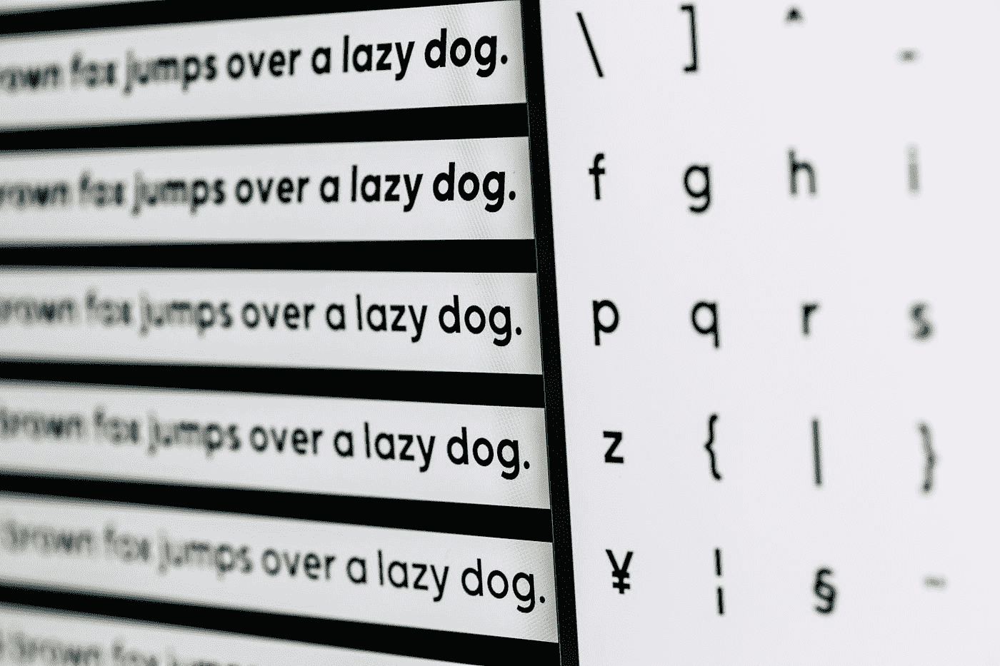
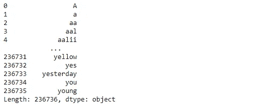
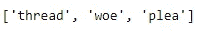
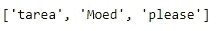

# 用 Python 创建自动更正！

> 原文：<https://towardsdatascience.com/create-autocorrect-in-python-d1d87679b1?source=collection_archive---------18----------------------->

## nltk 包装笼简介

马库斯·斯皮斯克在 [Unsplash](https://unsplash.com?utm_source=medium&utm_medium=referral) 上的照片

T 他的文章将指导你用 python 创建一个简单的自动更正程序。这个项目是创建两个不同的拼写推荐器，它将能够接受用户的输入，并推荐一个正确拼写的单词。非常酷！

注意:测试输入:['cormulent '，' incendenece '，' validrate']。

# 包装

这项工作将主要集中在 nltk 库的使用上。nltk 代表自然语言工具包，关于它能做什么的更多信息可以在这里找到[。](https://www.nltk.org/)

具体来说，我们将使用*单词、edit_distance、jaccard_distance 和 ngrams* 对象。

**edit_distance，jaccard_distance** 指的是用于确定与用户输入最相似的单词的度量

一个 **n-gram 是来自给定文本或语音样本的 n 个项目的连续序列。例如:“白宫”是一个二元结构，与“白宫”有着不同的含义。**

此外，我们还将使用 pandas 来创建正确单词列表的索引系列。

*words.words()* 给出了一个拼写正确的单词列表，这些单词已经作为 word 对象包含在 nltk 库中。 *spellings_series* 是这些单词的索引序列，输出显示在代码块下面。

拼写 _ 系列输出

# 推荐者 1

**度量:Jaccard 距离**

这是一种衡量两组有多么不同的方法，我试图用简单的英语解释如下:

正在讨论的字符串将与 spellings_series 中的每个单词进行迭代比较。

> 对于每个比较实例，我们计算非唯一字母的总数以及两个集合之间共享字母的数量，作为*总数*和*非唯一。*然后，我们将*非唯一*除以*总计*，并乘以 100%以获得相似度百分比。这是 **Jaccard 指数。**
> 
> **Jaccard 距离**是对**不同的两个集合如何**的度量，并且可以作为 Jaccard 索引(即 Jaccard 距离= 100% - Jaccard 指数)

# 定义一个 Jaccard 函数来遍历可能的单词:

我们将使用一个**空列表**和一个 **for 循环**来迭代遍历 *spellings_series* 。

*jaccard* 函数将接受参数*条目和 gram_number* ，其中*条目*指的是有问题的单词，而 *gram_number* 设置要使用的 n-gram 的数量(为使用属于同一个 ngram 的单词列表的情况做准备)在这里可以找到关于 ngrams [的更多信息，我花了一些时间来完全理解它！](https://www.kaggle.com/rtatman/tutorial-getting-n-grams)

*拼写*将根据输入字符串的首字母创建一个可能的单词列表。**这里假设第一个字母没有打错。**

接下来，*距离*将使用内置的 *jaccard_distance* 函数迭代计算*拼写*中单词各自的 jaccard 距离。

最后，*最接近的*将通过*距离*上的*最小*函数给出最终的最佳匹配单词。这可以被附加到*结果*空列表中，该列表将被返回。

现在，通过我们令人惊叹的新 jaccard 函数，我们可以创建单词 recommender， *JDreco* 。默认情况下，该函数将接受字符串列表“cormulent”、“incidence”、“validrate”，并返回建议的单词列表。

**恭喜，第一个推荐模型完成了！**

照片由[雅各布·欧文斯](https://unsplash.com/@jakobowens1?utm_source=medium&utm_medium=referral)在 [Unsplash](https://unsplash.com?utm_source=medium&utm_medium=referral) 拍摄

# 推荐者 2

**公制:** [**编辑距离**](https://en.wikipedia.org/wiki/Edit_distance) **，又名** [**Levenshtein 距离**](https://en.wikipedia.org/wiki/Levenshtein_distance) **。**

这是一种基于将一个字符串转换成另一个字符串所需的最少操作数来评估两个字符串的不同程度的方法。类似于之前，该功能将默认地接受与推荐器 1 中相同的单词列表。

该函数将反复比较条目与正确单词列表，并获得它们各自的编辑距离。然后，具有最低距离的单词将被视为最佳匹配单词，附加到*结果*，并由函数返回。

**第二款推荐车型完成！**

# 用户输入

现在让我们把我们的模型投入工作。我们将尝试一个由三个单词组成的列表:一个拼错的“请说三个单词”——**“threa woeds pleese”**，让我们看看效果如何。下面的代码提示用户输入三个单词来创建一个列表 *userinput* 。

## 推荐人 1:

> 结果是“线程”，“悲哀”，“恳求”。

JDreco 输出

## 推荐者 2:

> 结果是“tarea”、“Moed”、“please”

editreco 输出

# 进一步的改进

结果和我预想的相差太远了！与 JDreco 相比，editreco 通过正确建议“请”似乎表现得更好。

这在很大程度上应该是因为算法目前过于“机械”,只根据单个字母判断单词。我相信这表明创建一个谷歌级别的自动更正肯定会花费大量的时间和精力。

我能看到的一些未来的改进将会是**通过流行的机器学习使能器 Pytorch 考虑语法和词汇化。**

# 感谢你的阅读！

请在这里找到代码。

通过这篇文章，我希望您已经**了解了 nltk 的基础知识，**尽管这个库非常庞大，我不可能在一篇文章中涵盖所有内容。我想说，如果付出适当的时间和努力，这将是一个对大多数人来说都很容易理解和编码的数据科学项目。

我通过由 Coursera 主办的密歇根大学 MOOC“Python 中的应用文本挖掘”学到了这一点。推荐！

如果你有问题或者想讨论在后新冠肺炎时代应用数据科学技术的想法，请随时联系我。

我希望我能够以这样或那样的方式帮助您学习数据科学方法！

这是另一篇数据科学文章！

 [## 简易模式下的岭回归

### 了解岭回归模型背后的理论，如何通过 python 和 scikit-learn 对其进行编码和调优。

medium.com](https://medium.com/python-in-plain-english/ridge-regressions-on-easy-mode-9e7353a0e3f9)