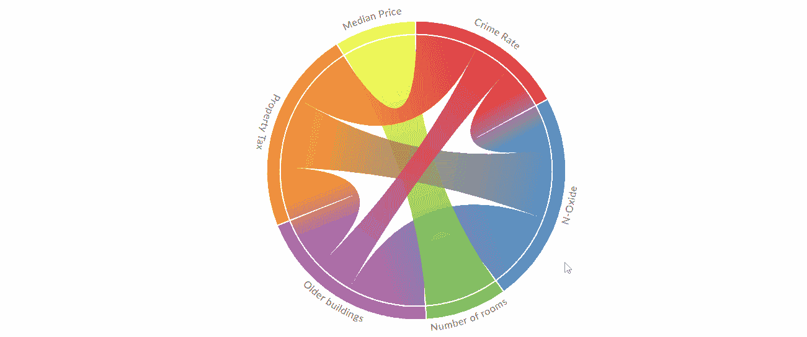
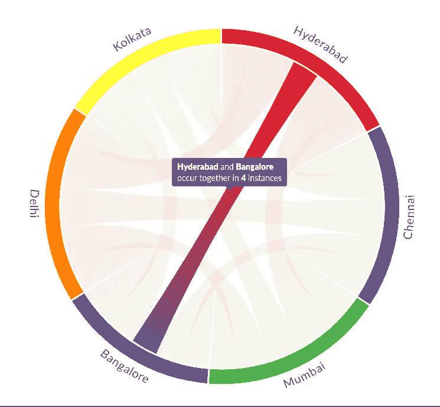
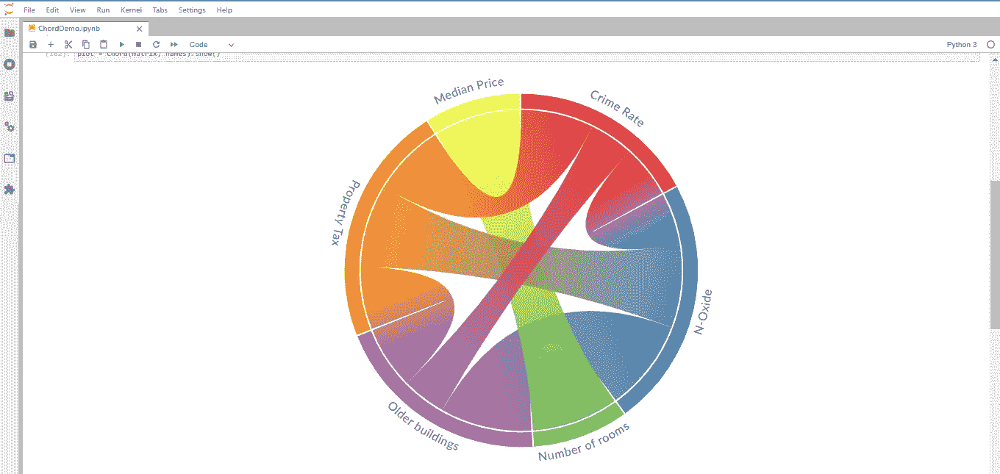
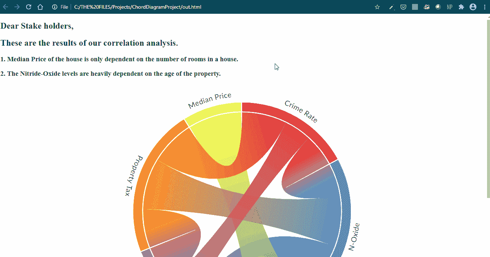
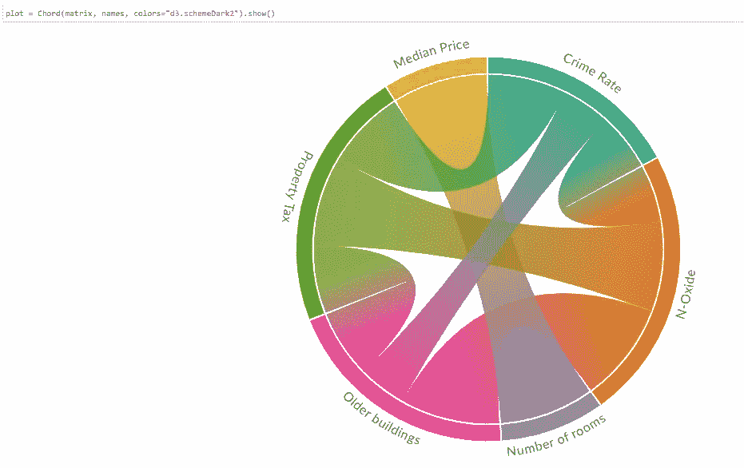
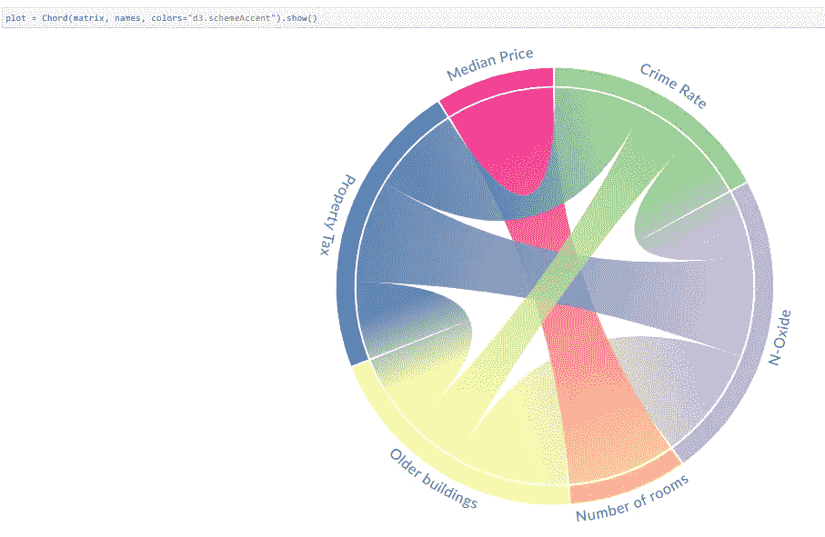
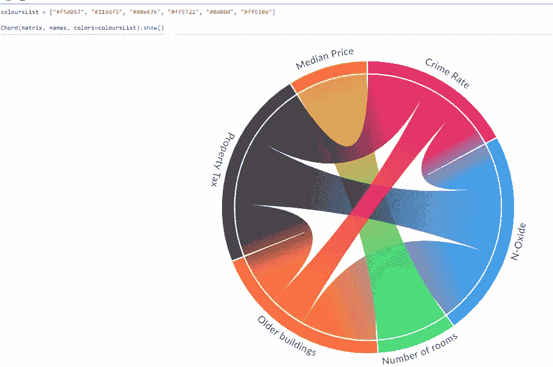

# 使用 Python 创建漂亮的交互式和弦图

> 原文：<https://towardsdatascience.com/create-beautiful-and-interactive-chord-diagrams-using-python-cb5ecb092a7c?source=collection_archive---------10----------------------->

## Python 中的数据可视化

## 一个简单的指南，使用一个简单的函数调用来创建一个令人敬畏的和弦图。



根据数据科学家的说法，当谈到什么是最好的语言时，R vs Python 是一场持续的争论。虽然每种语言都有它的长处，但在我看来，R 有一个难以超越的尖端技巧——R 拥有通过可视化交流结果的神奇工具。

本周，当我试图寻找一种吸引人的方式来可视化数据中各特征之间的相关性时，这一点引起了我的注意。我偶然发现了和弦图！(我们一会儿就会谈到这个)我见过几个使用 *Circlize* 生成和弦图的 R 示例，在这些示例中，您只需将形状合适的数据传递给 chordDiagram()函数和 ta-da！

你应该看到当我发现和弦图的 [Python Plotly](https://plotly.com/python/v3/filled-chord-diagram/) 实现时我脸上的表情。即使要得到一个基本的数字，也要付出很多努力。最终结果似乎根本不值得努力。当我在 pypi 上偶然发现[和弦时，我几乎放弃了使用和弦图的想法。](https://pypi.org/project/chord/)

# 好吧，什么是和弦图？

弦图表示一组不同项目之间的流程。这些被称为节点的项目显示在一个圆的周围，流显示为节点之间的连接，显示为弧。

如果这还没有解释清楚，让我们来看一个例子:



作者图片

上面的弦图直观地显示了两个实体(本例中为城市)在旅行者的旅程中同时出现的次数，它允许我们研究它们之间的流动。

# 如何用最少的努力创造出漂亮的和弦图？

让我带您了解数据准备的过程，然后创建和弦图。

## **安装:**

假设已经安装了 Pandas，您需要从 pypi 安装 chord 包，使用—

```
pip install chord
```

## **数据准备:**

我用的是波士顿房价数据集，可以从[这里](https://www.kaggle.com/vikrishnan/boston-house-prices)下载。

```
# importing Pandas libary
import pandas as pd# reading data from csv
df = pd.read_csv("housing.csv")
```

我的目标是可视化数据集中要素之间的相关性。因此，为了简洁起见，我将删除一些列。我将只剩下 6 个特征。(如果您愿意，可以跳过这一步)

```
# List of columns to delete and then dropping them.
delete = ['ZN', 'INDUS', 'CHAS', 'DIS','RAD','PTRATIO','B','LSTAT']df.drop(delete, axis=1, inplace=True)
```

现在让我们使用 Pandas corr()函数创建相关矩阵。

```
# Now, matrix contains a 6x6 matrix of the values.
matrix = df.corr()# Replacing negative values with 0’s, as features can be negatively correlated.
matrix[matrix < 0] = 0# Multiplying all values by 100 for clarity, since correlation values lie b/w 0 and 1.
matrix = matrix.multiply(100).astype(int)# Converting the DataFrame to a 2D List, as it is the required input format.
matrix = matrix.values.tolist()
```

这些数据现在非常适合我们的绘图！

## **绘制图表图:**

绘制之前剩下的唯一一步是将实体的名称存储为一个列表。在我的例子中，这些是特性的名称。

```
# Names of the features.
names = ["Crime Rate","N-Oxide","Number of rooms","Older buildings","Property Tax","Median Price"]
```

现在，我们要做的就是导入这个包—

```
from chord import Chord
```

然后将矩阵和名称传递给 Chord()函数。

```
Chord(matrix, names).show()#Note: The show() function works only with Jupyter Labs.
# (Not Jupyter notebook)
```

这将是您的输出:


朱庇特实验室的输出。图片作者。

在我们进一步探索和弦库中可用的其他风格和输出设置之前，让我们看看输出代表什么。

如你所见，当你在犯罪率上徘徊时，你可以看到它与财产税、旧建筑和氮氧化物水平有关，但与中间价格或房间数量无关。现在，您可以将鼠标悬停在连接上，您将看到这些要素之间的相关值。

您可能会注意到，中间价格与其自身 100%相关，所有特性都是如此。这是因为当我们将一个特征与其自身进行比较时，我们得到了一个完美的相关值。如果您愿意，我们可以用一行代码来解决这个问题。

```
# Operate on the data before converting it into a 2D List# We are just converting all Perfect correlation 100's(Basically the 1’s) to 0 as well.
matrix[matrix == 100] = 0
matrix = matrix.values.tolist()
```

这是你的输出，一个更清晰的和弦图:



作者图片

## **将和弦图导出为 HTML:**

因为这个包的核心使用了 d3-chord，所以它也给了我们一个选项来输出 ChordDiagram 作为一个完全可编辑的 HTML 文件！多酷啊。

同样，一个简单的方法调用就能帮你做到—

```
Chord(matrix, names).to_html()# This will create a file 'out.html' in your current directory.
```

您可以在浏览器中打开 HTML 来查找相同的交互式和弦图，也可以打开。html 并自定义页面的其余部分！

这是我的输出，



以 HTML 的形式输出。图片作者。

我所做的是极其基本的。关键是，HTML 格式的输出为使用和弦图提供了无数的可能性。

# **造型定制:**

## **颜色:**

您可以通过从 [d3 分类调色板](https://github.com/d3/d3-scale-chromatic#categorical)中传递任何颜色来更改和弦图的颜色。您可以在[官方指南](https://shahinrostami.com/posts/statistics/data-is-beautiful/chord-diagrams/)中找到输出样本。但这里有几个例子:

```
# Just add the colors parameter and pass the value.
Chord(matrix, names, colors="d3.schemeDark2").show()
```



作者图片

```
# Just add the colors parameter and pass the value.
Chord(matrix, names, colors="d3.schemeAccent").show()
```



作者图片

```
# Add all the colors to a list.
coloursList = ["#f50057", "#2196f3", "#00e676", "#ff5722", "#00000", "#ff9100"]# Pass the list to the colors parameter.
Chord(matrix, names, colors=coloursList).show()
```



作者图片

其他定制:

你也可以自定义标签和不透明度，查看官方指南。

# 结论:

创建可视化几乎总是数据科学家工作的一部分。*部分*是这里的关键词，因为这意味着你不能花太多时间来使它们成形，这就是为什么我们寻找提供简单但功能实现的选项。这就是我在本文中试图探索的，用最少的努力创建一个有效的和弦图。

*这是我的第一部技术写作作品，我试图将我多年来从这个社区阅读优秀内容时遇到的最佳实践融入其中。我很感激对我工作的任何方面的反馈。*

# **其他资源:**

[1] [官方指南](https://shahinrostami.com/posts/statistics/data-is-beautiful/chord-diagrams/) —沙欣·罗斯塔米的博客(图书馆作者)

PyPi 上的[2] [和弦](https://pypi.org/project/chord/)——你可以在这里下载这个包。