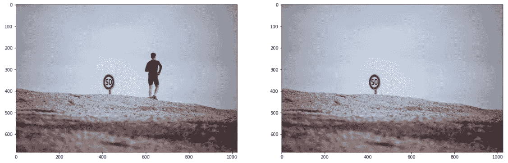
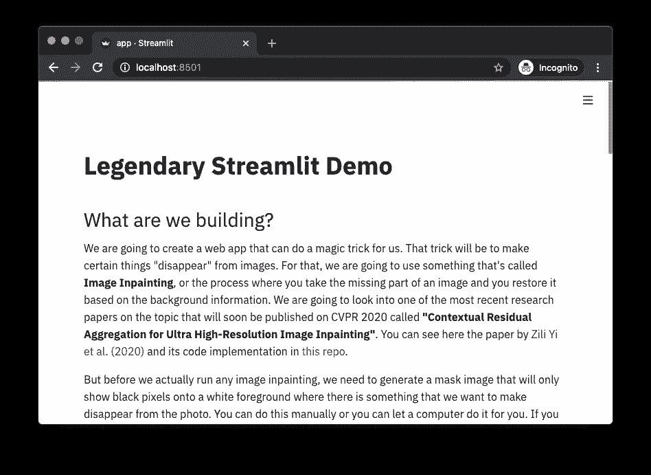
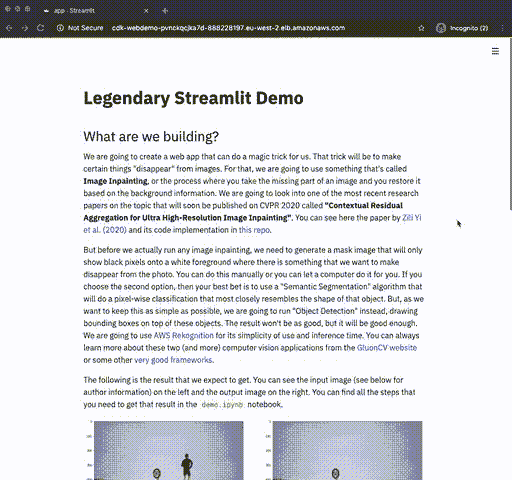

# 创建美观简单的 ML web 应用程序，只需几个步骤就可以大规模部署

> 原文：<https://towardsdatascience.com/create-beautiful-and-simple-ml-web-apps-that-you-can-deploy-at-scale-in-a-few-steps-2d7d62cf8601?source=collection_archive---------51----------------------->

本文将教你如何使用 [Streamlit](https://www.streamlit.io/) 和 [AWS CDK](https://docs.aws.amazon.com/cdk/latest/guide/home.html) 从头开始构建一个 ML 驱动的 web 应用，并从头到尾大规模部署到 AWS Fargate。

你可以看看[这个回购](https://github.com/nicolasmetallo/legendary-streamlit-demo)的代码。

# 我们要建造什么？

我们将创建一个 web 应用程序，它可以为我们变魔术。这个技巧就是让某些东西从图像中“消失”。为此，我们将使用一种叫做**图像修复**的东西，或者说是一种处理过程，在这种过程中，你获取图像中丢失的部分，然后根据背景信息对其进行恢复。我们将研究关于该主题的最新研究论文之一，该论文将于 2020 年 CVPR 上发表，名为**“超高分辨率图像修复的上下文残差聚合”**。你可以阅读[易等人【2020】](https://arxiv.org/abs/2005.09704)在 arXiv 中的论文，并在[本回购](https://github.com/Atlas200dk/sample-imageinpainting-HiFill)中看到其代码实现。

但在我们实际运行任何图像内画之前，我们需要生成一个遮罩图像，该图像将只在白色前景上显示黑色像素，而我们希望从照片中消失一些东西。您可以手动完成，也可以让计算机为您完成。如果您选择第二个选项，那么您的最佳选择是使用“语义分割”算法，该算法将进行最接近该对象形状的像素级分类。但是，因为我们想尽可能简单，我们将运行“对象检测”，在这些对象的顶部绘制边界框。结果不会那么好，但也足够好了。我们将使用 [AWS Rekognition](https://aws.amazon.com/rekognition/) ，因为它使用简单，推理时间短。你总是可以从 [GluonCV 网站](https://gluon-cv.mxnet.io/contents.html)或者其他一些[非常好的框架](https://github.com/facebookresearch/detectron2)中了解到关于这两个(以及更多)计算机视觉应用的更多信息。

以下是我们期望得到的结果。您可以在左边看到输入图像(见下面的作者信息),在右边看到输出图像。您可以在`demo.ipynb`笔记本中找到获得该结果所需的所有步骤。



但是，如果我们想要构建一个更具交互性、动态性、易于调试、非常适合与非技术人员共享模型和结果的东西，该怎么办呢？有一些选项可以帮助你做到这一点，比如 Jupyter Voila 和 Plotly Dash，但它们都不能同时做到所有这些。就在那时，我开始关注 [Streamlit](https://www.streamlit.io/) ，这是一个开源应用程序框架，它运行在 Python 中，让你用很少的开发工作就能创建看起来很棒的 web 应用程序。我不会详细介绍什么是 Streamlit 以及它是如何工作的，但是您可以在这里看到许多示例和演示[，在这里](https://awesome-streamlit.org/)看到一些最佳实践[。](https://pmbaumgartner.github.io/streamlitopedia/front/introduction.html)

# 入门指南

每个人都有自己处理这类项目的方式，但对我来说最有效的方式是遵循一种精益方法，在这种方法中，我可以快速设计/构建、度量和学习。这些是我通常会做的步骤:

*   创建一个演示笔记本，证明我可以做我希望做的事情，例如，拍摄一个输入图像并生成一个内画图像输出
*   创建一个 Streamlit 应用程序，它将包含与演示笔记本相同的步骤。
*   将所有东西安装到 AWS CDK 项目中，为部署做好准备。

我不会详细介绍第一步，但我会深入探讨如何构建一个 Streamlit 应用程序，以及一旦您知道它可以工作，如何让您的项目适合大规模部署。

## 要求

*   AWS 帐户
*   [AWS CDK](https://docs.aws.amazon.com/cdk/latest/guide/getting_started.html)
*   [AWS CLI](https://docs.aws.amazon.com/cli/latest/userguide/install-cliv2.html)
*   码头工人

# 1)创建演示笔记本

转到您的终端并克隆这个存储库

```
$ git clone [https://github.com/nicolasmetallo/legendary-streamlit-demo](https://github.com/nicolasmetallo/legendary-streamlit-demo)
```

现在，`cd`进入`cdk/app`，你会发现`demo.ipynb`。安装所有依赖项并在笔记本中运行代码。

```
$ cd cdk/app
$ pip install -r requirements.txt
```

# 2)创建您的 Streamlit 应用程序

## 项目结构

```
.
├── LICENSE
├── README.md
└── cdk
    ├── README.md
    ├── app
    │   ├── Dockerfile
    │   ├── app.py
    │   ├── demo.ipynb
    │   ├── helpers.py
    │   ├── requirements.txt
    │   ├── src
    │   │   ├── input_img.png
    │   │   ├── local_container.png
    │   │   └── magic_trick.png
    │   └── test_images
    │       ├── image_1.jpg
    │       ├── image_2.jpg
    │       ├── image_3.jpg
    │       ├── image_4.jpg
    │       ├── image_5.jpg
    │       └── image_6.jpg
    ├── app.py
    ├── cdk
    │   ├── __init__.py
    │   └── cdk_stack.py
    ├── cdk.json
    ├── requirements.txt
    └── setup.py
```

## 您的 Streamlit 应用的主要部分

我们的应用程序将从不同的来源(URL、示例库、用户上传)读取一个输入图像，生成一个内画图像，最后将两者并排绘制在一起。

我们要做的第一件事是导入依赖项和帮助函数。彼得·鲍姆加特纳写了一篇关于重构和编写模块化代码的好文章,应该可以帮助你更好地组织你的代码。

## 助手函数(作为导入)

```
from helpers import InPainting
magic_trick = InPainting()
```

## 助手功能(在 app.py 中)

```
def show_images(input_img, output_img):
    f = plt.figure(figsize=(20,20))
    f.add_subplot(1,2,1)
    plt.imshow(input_img)
    f.add_subplot(1,2,2)
    plt.imshow(output_img)
    plt.show(block=True)
    st.pyplot(bbox_inches='tight')
```

## 阅读您的输入图像

```
st.header('Read image')
    st.image(
        'src/input_img.png',
        caption='Illustration by [https://blush.design/artists/vijay-verma'](https://blush.design/artists/vijay-verma'),
        use_column_width=True,
    )
    options = st.radio('Please choose any of the following options',
        (
            'Choose example from library',
            'Download image from URL',
            'Upload your own image',
        )
    )input_image = None
    if options == 'Choose example from library':
        image_files = list(sorted([x for x in Path('test_images').rglob('*.jpg')]))
        selected_file = st.selectbox(
            'Select an image file from the list', image_files
        )
        st.write(f'You have selected `{selected_file}`')
        input_image = Image.open(selected_file)
    elif options == 'Download image from URL':
        image_url = st.text_input('Image URL')
        try:
            r = requests.get(image_url)
            input_image = Image.open(io.BytesIO(r.content))
        except Exception:
            st.error('There was an error downloading the image. Please check the URL again.')
    elif options == 'Upload your own image':
        uploaded_file = st.file_uploader("Choose file to upload")
        if uploaded_file:
            input_image = Image.open(io.BytesIO(uploaded_file.read()))
            st.success('Image was successfully uploaded')if input_image:
        st.image(input_image, use_column_width=True)
        st.info('''
        Image will be resized to fit within `(1024,1024)`
        pixels for easier processing.
        ''')
    else:
        st.warning('There is no image loaded.')
```

## 在图像上运行您的模型推理

```
st.header('Run prediction')
    st.write('')
    prediction_checkbox = st.checkbox('Do a magic trick!')
    if input_image and prediction_checkbox:
        try:
            with st.spinner():
                output_image = magic_trick.run_main(input_image)
                show_images(input_image, output_image)
        except Exception as e:
            st.error(e)
            st.error('There was an error processing the input image')
```

## 帮助者. py

为了生成内画图像，我们需要输入图像和遮罩图像，其中除了我们的目标以外，每个像素都是白色的。如前所述，我们将使用 AWS Rekognition 来检测一个对象和一个自定义类，以根据该检测创建一个遮罩图像。

```
class Rekognition:
    def __init__(self):
        self.client = boto3.client(
            'rekognition',
            region_name = 'eu-west-2', # not needed
            )def predict_labels(self, image_bytes, max_labels=10, min_conf=90):
        response = self.client.detect_labels(
            Image = {'Bytes': image_bytes},
            MaxLabels = max_labels,
            MinConfidence = min_conf,
            )
        return response['Labels']

    def return_mask_img(self, image_bytes):
        image = Image.open(io.BytesIO(image_bytes))
        imgWidth, imgHeight = image.size
        blank = Image.new('RGB', image.size, (255, 255, 255))
        draw = ImageDraw.Draw(blank)
        response = self.predict_labels(image_bytes)

        for idx, label in enumerate(response):
            name = label['Name']
            instances = label['Instances']if len(instances) == 0: continue
            for instance in instances:
                confidence = instance['Confidence']
                box = instance['BoundingBox']
                left = imgWidth * box['Left']
                top = imgHeight * box['Top']
                width = imgWidth * box['Width']
                height = imgHeight * box['Height']points = (
                    (left, top),
                    (left + width, top),
                    (left + width, top + height),
                    (left , top + height),
                    (left, top),
                )# draw bounding box
                draw.rectangle([left, top, left + width, top + height], fill='black')

        return blank
```

一旦我们有了这两个图像，我们应该能够运行图像在绘画模型预测。

```
class InPainting:
    def __init__(self):
        self.rekognition = Rekognition() 
        self.multiple = 6
        self.INPUT_SIZE = 512  # input image size for Generator
        self.ATTENTION_SIZE = 32 # size of contextual attention

    def PIL_to_cv2(self, pil_img):
        np_img = np.array(pil_img.convert('RGB'))
        return cv2.cvtColor(np_img, cv2.COLOR_RGB2BGR)

    def PIL_to_image_bytes(self, img):
        buffer = io.BytesIO()
        img.save(buffer, format='JPEG')
        return buffer.getvalue()

    def cv2_to_PIL(self, cv2_im):
        cv2_im = cv2.cvtColor(cv2_im, cv2.COLOR_BGR2RGB)
        return Image.fromarray(cv2_im)

    def run_main(self, input_image, max_size = (1024,1024)):
        with tf.Graph().as_default():
            with open('sample-imageinpainting-HiFill/GPU_CPU/pb/hifill.pb', "rb") as f:
                output_graph_def = tf.GraphDef()
                output_graph_def.ParseFromString(f.read())
                tf.import_graph_def(output_graph_def, name="")with tf.Session() as sess:
                init = tf.global_variables_initializer()
                sess.run(init)
                image_ph = sess.graph.get_tensor_by_name('img:0')
                mask_ph = sess.graph.get_tensor_by_name('mask:0')
                inpainted_512_node = sess.graph.get_tensor_by_name('inpainted:0')
                attention_node = sess.graph.get_tensor_by_name('attention:0')
                mask_512_node = sess.graph.get_tensor_by_name('mask_processed:0')

                input_image.thumbnail(max_size)
                image_bytes = self.PIL_to_image_bytes(input_image)
                raw_mask = self.PIL_to_cv2(self.rekognition.return_mask_img(image_bytes))
                raw_img = self.PIL_to_cv2(input_image)
                inpainted = self.inpaint(
                            raw_img, raw_mask, sess, inpainted_512_node, 
                            attention_node, mask_512_node, image_ph, mask_ph, self.multiple)
                return self.cv2_to_PIL(inpainted)
```

## 创建 Dockerfile 文件

```
FROM python:3.7
EXPOSE 8501
WORKDIR /app
COPY requirements.txt ./requirements.txt
RUN pip3 install -r requirements.txt
RUN git clone [https://github.com/Atlas200dk/sample-imageinpainting-HiFill.git](https://github.com/Atlas200dk/sample-imageinpainting-HiFill.git) && \
        cd sample-imageinpainting-HiFill && \
        git checkout 1f7f769bd1ea225d4d5c8b094dd261ca9172927b
COPY . .
CMD streamlit run app.py \
    --server.headless true \
    --browser.serverAddress="0.0.0.0" \
    --server.enableCORS false \
    --browser.gatherUsageStats false
```

## 构建映像并在本地运行以进行调试

在您的终端中运行下面的命令来构建您的容器映像

```
$ docker build -t demo/magic-trick .
```

现在运行容器

```
$ docker run -it — rm -p ‘8501:8501’ demo/magic-trick
```

如果你打开浏览器，进入 [http://localhost:8501](http://localhost:8501/`) ，你应该能看到下面的… **成功！😃**



# 3)使用 AWS CDK 将您的 Streamlit 应用程序部署到 AWS Fargate

## 快速介绍

**AWS CDK** 是一个软件开发框架，用于在代码中定义云基础设施，并通过 **AWS CloudFormation** 进行配置，使您能够:

*   可预测地重复创建和配置 AWS 基础设施部署。
*   利用 AWS 产品，如 Amazon EC2、Amazon Elastic Block Store、Amazon SNS、Elastic Load Balancing 和 Auto Scaling。
*   在云中构建高度可靠、高度可伸缩、经济高效的应用程序，而无需担心创建和配置底层 AWS 基础架构。
*   使用模板文件将资源集合作为一个单元(堆栈)一起创建和删除。

**AWS Fargate** 是亚马逊 ECS 和 EKS 的计算引擎，允许你运行容器，而不必管理服务器或集群。我们将使用这两种服务来轻松地大规模部署我们的容器。

如果你不理解所有这些，不要太担心，因为有一个很好的[入门指南](https://docs.aws.amazon.com/cdk/latest/guide/getting_started.html)供你参考，还有[官方 Python 参考文档](https://docs.aws.amazon.com/cdk/api/latest/python/index.html)供你查阅。我将按照官方的 [ECS 示例](https://docs.aws.amazon.com/de_de/cdk/latest/guide/ecs_example.html)列出您需要完成的每个步骤，但是因为这些步骤中的大部分已经在此 repo 中完成(例如，创建项目目录)，所以在跳到下面的**部署您的堆栈**之前，请随意初始化 AWS CDK 并安装所有依赖项。

## 配置您的 AWS 凭据

如果您打算从本地机器部署您的栈，您应该确保您的 AWS 凭证在您的环境中被正确设置。你可以在[文档](https://docs.aws.amazon.com/cli/latest/userguide/cli-configure-files.html)中了解更多信息。

打开您的终端并运行以下命令。当询问时，添加您的访问密钥和密钥。

```
$ aws configure
```

另一方面，如果您打算从 AWS 实例(例如 EC2、SageMaker 等)部署您的堆栈。)然后，您的环境将采用您分配给该实例的凭证和角色，您不需要进行任何配置。你只需要仔细检查你的角色能不能做你想做的一切。

## 安装自动气象站 CDK

转到您的终端，使用以下命令安装 AWS CDK。

```
$ npm install -g aws-cdk
```

(可选)如果您需要更新 AWS CDK 版本，请运行

```
$ npm update -g aws-cdk
```

运行以下命令验证安装是否正确，并打印 AWS CDK 的版本号。

```
$ cdk — version
```

## 更新您的语言依赖

如果您收到一条错误消息，提示您的语言框架已过期，请使用以下命令之一来更新 AWS CDK 支持该语言所需的组件。

```
$ pip install — upgrade aws-cdk.core
```

## 创建您的项目目录并初始化 AWS CDK

让我们首先创建一个保存 AWS CDK 代码的目录，然后在该目录中创建一个 AWS CDK 应用程序。

```
$ mkdir cdk
$ cd cdk
$ cdk init — language python
$ source .env/bin/activate
$ pip install -r requirements.txt
```

您生成的`cdk/cdk_stack.py`应该是这样的。

```
from aws_cdk import coreclass CdkStack(core.Stack):def __init__(self, scope: core.Construct, id: str, **kwargs) -> None:
        super().__init__(scope, id, **kwargs)# The code that defines your stack goes here
```

构建并运行应用程序，并确认它创建了一个空堆栈。

```
$ cdk synth
```

您应该看到如下所示的堆栈，其中`CDK-VERSION`是`CDK`的版本，`NODE-VERSION`是 Node.js 的版本。)

```
Resources:
  CDKMetadata:
    Type: AWS::CDK::Metadata
    Properties:
      Modules: aws-cdk=CDK-VERSION,[@aws](http://twitter.com/aws)-cdk/core=CDK-VERSION,[@aws](http://twitter.com/aws)-cdk/cx-api=CDK-VERSION,jsii-runtime=node.js/NODE-VERSION
```

## 添加 Amazon EC2 和 Amazon ECS 包

为 Amazon EC2 和 Amazon ECS 安装 AWS 构造库模块。

```
$ pip install aws_cdk.aws_ec2 aws_cdk.aws_ecs aws_cdk.aws_ecs_patterns
```

## 创建一个 Fargate 服务

使用 Amazon ECS 运行容器任务有两种不同的方式:

*   使用`Fargate`启动类型，Amazon ECS 为您管理运行容器的物理机器。
*   使用`EC2`启动类型，在这里进行管理，比如指定自动缩放。

对于本例，我们将创建一个运行在 ECS 集群上的 Fargate 服务，它由一个面向互联网的应用程序负载平衡器提供支持。在此基础上，我们将向该集群添加自动伸缩功能，并将策略附加到任务角色，以便容器能够使用 AWS Rekognition。

将以下 AWS 构造库模块导入添加到指定的文件中。

文件:`cdk/cdk_stack.py`

```
from aws_cdk import (
    aws_ec2 as ec2,
    aws_ecs as ecs,
    aws_ecr as ecr,
    aws_iam as iam,
    aws_ecs_patterns as ecs_patterns,
    core,
)
```

用下面的代码替换构造函数末尾的注释。

```
# Create a VPC
        vpc = ec2.Vpc(
            self, "WebDemoVPC", 
            max_azs = 2,
            )     # default is all AZs in region, 
                  # but you can limit to avoid reaching resource quota# Create ECS cluster
        cluster = ecs.Cluster(self, "WebDemoCluster", vpc=vpc)# Add an AutoScalingGroup with spot instances to the existing cluster
        cluster.add_capacity("AsgSpot",
            max_capacity=2,
            min_capacity=1,
            desired_capacity=2,
            instance_type=ec2.InstanceType("c5.xlarge"),
            spot_price="0.0735",
            # Enable the Automated Spot Draining support for Amazon ECS
            spot_instance_draining=True
        )# Build Dockerfile from local folder and push to ECR
        image = ecs.ContainerImage.from_asset('app')# Create Fargate service
        fargate_service = ecs_patterns.ApplicationLoadBalancedFargateService(
            self, "WebDemoService",
            cluster=cluster,            # Required
            cpu=512,                    # Default is 256 (512 is 0.5 vCPU)
            desired_count=1,            # Default is 1
            task_image_options=ecs_patterns.ApplicationLoadBalancedTaskImageOptions(
                image=image, 
                container_port=8501,
                ),
            memory_limit_mib=2048,      # Default is 512
            public_load_balancer=True)  # Default is True# Add policies to task role
        fargate_service.task_definition.add_to_task_role_policy(iam.PolicyStatement(
            effect=iam.Effect.ALLOW,
            actions = ["rekognition:*"],
            resources = ["*"],
            )
        )# Setup task auto-scaling
        scaling = fargate_service.service.auto_scale_task_count(
            max_capacity=10
        )
        scaling.scale_on_cpu_utilization(
            "CpuScaling",
            target_utilization_percent=50,
            scale_in_cooldown=core.Duration.seconds(60),
            scale_out_cooldown=core.Duration.seconds(60),
        )
```

设置 AWS CDK Python 脚本时需要考虑的一些事项

*   CloudFormation 尚不支持 Fargate Spot 实例(截至 2020 年 5 月 31 日)
*   任务执行角色不同于任务角色。基本上，执行角色是执行 ECS 操作(如推和拉映像)的角色，任务角色是任务本身调用其他 AWS 服务(如 Rekognition、S3 等)所使用的角色。在 [StackOverflow 问题](https://stackoverflow.com/questions/48999472/difference-between-aws-elastic-container-services-ecs-executionrole-and-taskr)中了解更多信息。
*   我们已经建立了一个 ECS 集群，它具有一个包含 spot 实例的自动扩展组，并且当 cpu 利用率增加到 50%以上时，可以启动多达 10 个新任务。你可以在这里阅读更多关于任务自动缩放[的内容。](https://docs.aws.amazon.com/cdk/api/latest/python/aws_cdk.aws_ecs.README.html#task-auto-scaling)
*   不要在每次想要部署项目时构建容器映像并将其推送到 ECR，您还可以从 ECR 存储库中提取一个现有的映像。你可以用

```
repository = ecr.Repository.from_repository_arn(
        self, "{repository-name}",
        "arn:aws:ecr:{region-name}:{account-id}:repository/{repository-name}")
    image = ecs.ContainerImage.from_ecr_repository(repository=repository, tag="latest")
```

## 部署您的堆栈

当您的应用程序只有一个堆栈时，不需要指定堆栈名称，您可以运行

```
$ cdk deploy
```

如果您得到一个错误，如

```
This stack uses assets, so the toolkit stack must be deployed to the environment (Run “cdk bootstrap aws://unknown-account/unknown-region”)
```

然后，在运行`cdk deploy`之前，您需要引导您的默认概要文件所使用的帐户。

```
$ cdk bootstrap
…
✅ Environment aws://{your-account-id}/{your-region-name} bootstrapped.
```

整个过程大约需要 10 到 20 分钟，因为我们也在将我们的容器映像推送到 ECR。一旦该过程成功结束，您应该会看到类似这样的内容:

```
✅ cdkOutputs:
cdk.WebDemoServiceLoadBalancerDNS******A5 = cdk-WebDemo-PV******KA7D-******197.eu-west-2.elb.amazonaws.com
cdk.WebDemoServiceServiceURL******7B = [http://cdk-WebDemo-PV******KA7D-******197.eu-west-2.elb.amazonaws.com](http://cdk-WebDemo-PV******KA7D-******197.eu-west-2.elb.amazonaws.com)Stack ARN:
arn:aws:cloudformation:eu-west-2:************:stack/cdk/c7f457f0-a34d-11ea-a167-******e602c
```

现在，当你打开浏览器，进入`cdk.WebDemoServiceServiceURL`，你会看到你的应用程序。请注意，由于我们只为该任务分配了 0.5 个 vCPU，所以推断时间会很长，在 20 到 30 秒之间。但是您可以随时返回，更改这一点，并使用`cdk deploy`重新部署。



**恭喜你！您的应用程序现已上线**😃

## 删除您的 AWS CDK 项目

如果你不再希望你的应用程序存在，你可能需要清除 AWS CDK 设置的所有东西，以避免招致任何意想不到的成本。

```
$ cdk destroy
```

## 参考

*   易，张，唐，张，徐，(2020)。超高分辨率图像修复的上下文残差聚合。*arXiv 预印本 arXiv:2005.09704*

**图片包含在** `**test_images**` **文件夹中**

*   `image_1.jpg`，蒂姆·多弗勒，[链接](https://unsplash.com/photos/dQT6hKtRWRw)
*   `image_2.jpg`、巴特尔米·德·马泽诺德、[链接](https://unsplash.com/photos/iw0SowaRxeY)
*   `image_3.jpg`、唐纳德·詹纳蒂、[链接](https://unsplash.com/photos/E9AyOAQL2R4)
*   `image_4.jpg`、韩亚库米、[链接](https://unsplash.com/photos/vNVPAKf1GO4)
*   `image_5.jpg`、纪尧姆·德·热尔曼、[链接](https://unsplash.com/photos/h1itWfWeQM4)
*   `image_6.jpg`、帖木儿【罗马诺夫】、[链接](https://unsplash.com/photos/YgoLFkdrD8Q)