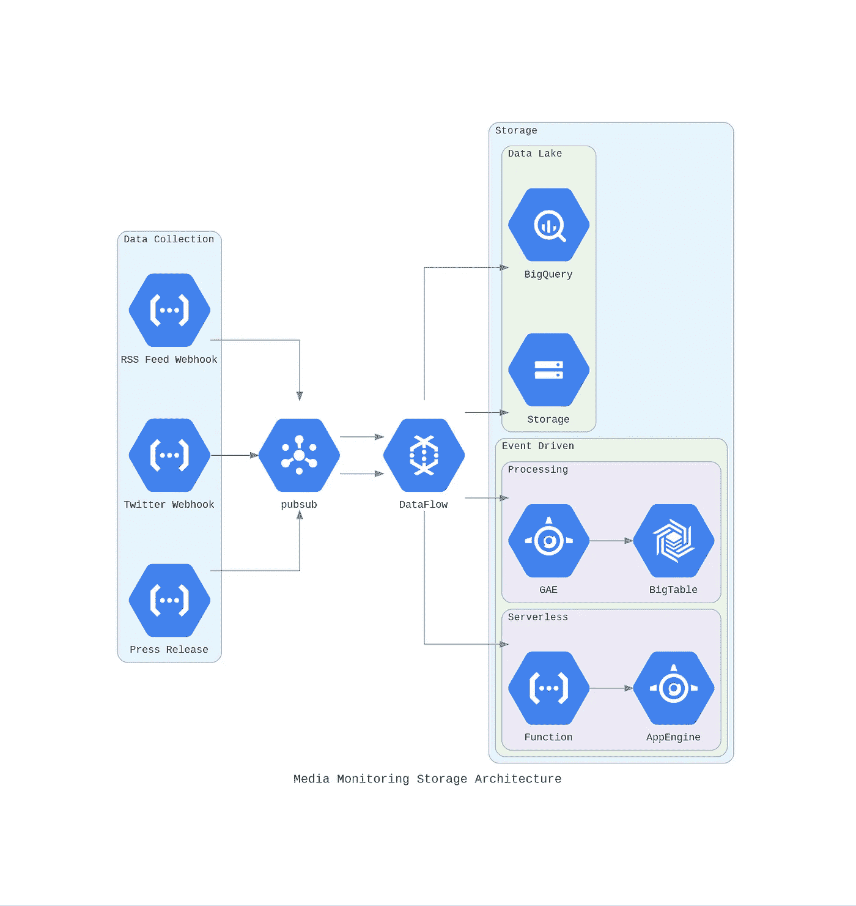
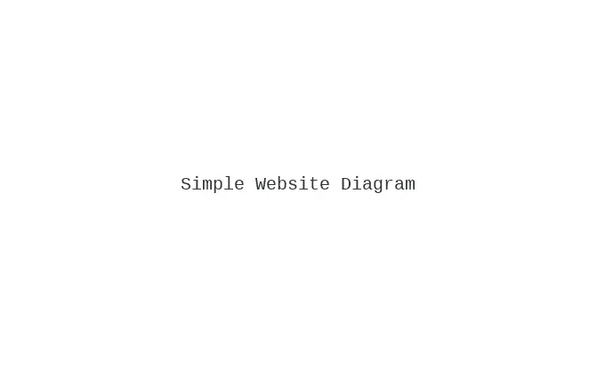
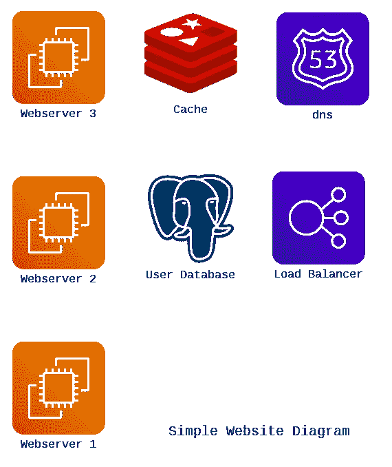
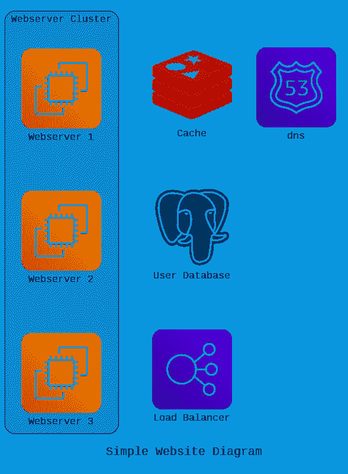
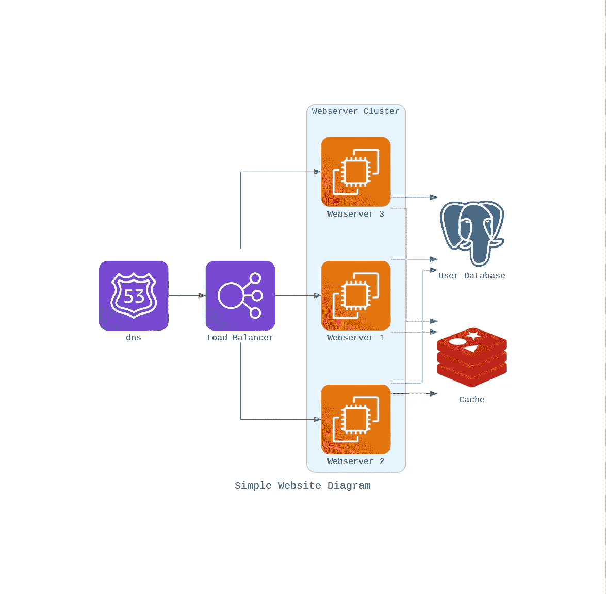

# 用 Python 创建漂亮的架构图

> 原文：<https://towardsdatascience.com/create-beautiful-architecture-diagrams-with-python-7792a1485f97?source=collection_archive---------3----------------------->

## [实践教程](https://towardsdatascience.com/tagged/hands-on-tutorials)

## 停止花费时间手动调整未对准的箭头

建立与代码从要点链接[这里](https://gist.github.com/dd48a8d3cb7dc581d976329208c1c422.git)。

# 一些背景故事

本周早些时候，我偶然发现了一个 Python 库，它有一个非常吸引人的价值主张。这个库叫做[图](https://diagrams.mingrammer.com/)，正如它的名字一样，它创建图。这些生成的图表通常是我通过笨拙地将图像粘贴到 draw.io 或 Google 图表中而创建的，之后我会浪费几个小时来正确地对齐一切。除了那个令人疲惫的过程之外，当我后来需要更新这些图时，仅仅为了对架构的一些改变，就需要提升和移动超过一半的组件。在进一步研究了 library 之后，我发现它能够减轻我的痛苦。

# 开始使用您自己的图表

开始构建这些图的第一个要求是安装 Python 3.6 或更高版本。一旦是这种情况，你将需要安装 GraphViz，因为这是什么呈现的图表。Github 库实际上也有一个相当不错的“入门”部分，所以如果你需要帮助安装任何东西，请随意参考这里的。一旦用您最喜欢的 Python 包管理器安装了库“图表”,您就可以开始创建了。

对我来说，开始就像下面的命令一样简单，因为我满足了最初的要求。

# 组件类型

图形库为许多不同的提供者提供组件。以下可能是 14 个可用用例中最相关的。

*   **AWS/GCP/Azure** —这些提供商公开了正式的云服务资产，您将在任何利用主要云提供商之一的图表中使用这些资产。我的团队主要在 GCP 工作，在偶然发现这个库之前，我会花几个小时手工构建这些图，所以当我发现这些节点资产唾手可得时，我有点兴奋。
*   **通用和本地** —如果您希望以云不可知的方式说明底层技术，这些节点可能会一起使用。例如，通过显示 Google 数据流为一个架构提供一个 Beam 组件。
*   **框架** —如果你想用编程语言说明一个节点，这些组件会很有用。
*   **SaaS**——甚至有一个 SaaS 节点的集合，当你想显示你的架构有通知在 Slack 之类的地方着陆时，它会派上用场。

# 图表概念

**图表** —图表是表示图表的主要对象。

**节点**——代表单个系统组件的抽象概念。

**集群** —允许您将节点组织成组(或集群)，而不是孤立的组件。

**边** —表示节点之间的链接。

# 你的第一张图

现在你已经知道了基本概念，让我们按照我们学习这些概念的顺序，用代码构建一个极其简单的图表。我们将构建的示例图将是一个简单的 AWS 负载平衡网站，它使用 PostgreSQL 数据库和 Redis 缓存，因此我们可以使用多个组件提供者。

## 步骤 1:创建图表工作空间

这将简单地呈现一个带有指定标签的空白图，如下所示。

用 gist 链接的代码[在这里](https://gist.github.com/dd48a8d3cb7dc581d976329208c1c422.git)构建。

## 步骤 2:添加节点

现在我们有了工作空间，是时候添加我们网站需要的节点了。我们要添加的节点来自两个不同的提供者。AWS 和 OnPrem 提供程序。如果你真的这样做，你可能会坚持使用 AWS，因为他们有 RDS 和 ElastiCache 等产品，你可能会与云提供商一起使用。

如您所见，我们不再有空白图表。我们的每一个节点都被描绘出来，这些是我们想要构建的架构的“成分”。接下来的步骤是将我们的一些节点组织成逻辑分组，然后用边连接每个节点。

用链接到这里的[要点中的代码构建。](https://gist.github.com/dd48a8d3cb7dc581d976329208c1c422.git)

## 步骤 3:对节点进行分组(可选)

在本例中，我们将只对负载平衡的 web 服务器进行分组。在我过去创建的许多图表中，这并不总是必要的，但是随着您的体系结构的增长，将这些节点分组到集群中通常会增强可读性。

下面您可以看到，要做到这一点，我们只需要将节点的实例化移动到我们正在创建的集群的范围内。

如您所见，该图仍然只是一个节点列表，但是我们现在已经将适当的节点聚集到逻辑分组中。

用链接到[这里](https://gist.github.com/dd48a8d3cb7dc581d976329208c1c422.git)的要点中的代码构建。

## 第四步:将所有内容联系在一起

在最后一步中，我们将不会链接我们刚刚安排在我们的体系结构中使用的节点。当我需要更新或者调整一个架构的时候，这个任务花费了我最长的时间。如果你看一下下面，它只是一个用双箭头定义流向每个节点的问题，你就完成了！在这个例子中，我们将只链接没有标签的节点，但是如果你看一下文档，将标签应用到你的链接是一个非常简单的任务。

生成的图像如下所示，您现在可以看到图中每个节点之间的逻辑流。通过更改定义节点的顺序，可以反转此流程。除了调整流程，你还可以改变很多东西，因为一个边缘对象包含三个属性:标签、颜色和样式。我们将不会涵盖如何在这里柚木这些。如果您有兴趣了解更多信息，本文末尾提供了文档链接，这些属性反映了相应的 graphviz edge 属性，如果您过去使用过该工具，这将使事情变得更容易。

用链接到[这里](https://gist.github.com/dd48a8d3cb7dc581d976329208c1c422.git)的要点中的代码构建。

# 结论

现在你已经开始用代码构建一个漂亮的图表，当涉及到自动化的可能性时，利用这个工作流有很大的潜力，并且节省了架构图的一般维护的时间。

使用这个工具节省的时间会让我在将来使用这个方法。我当然不会错过手动调整图表、小心地将组件和箭头与我的架构的每一次迭代对齐所付出的努力。

我希望我钻研用代码构建图的经历是有趣的，并且对您未来的绘图工作可能有用。感谢阅读！

# 资源

*   [图表文档](https://diagrams.mingrammer.com/)
*   [Github 资源库](https://github.com/mingrammer/diagrams)
*   [带有示例的 Google Colab】](https://colab.research.google.com/drive/10Nq0KmjbgvAzcaLiqQPwMeDVdkHBCy6y)