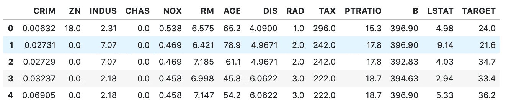
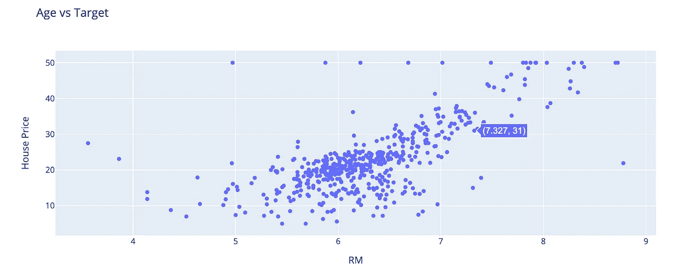
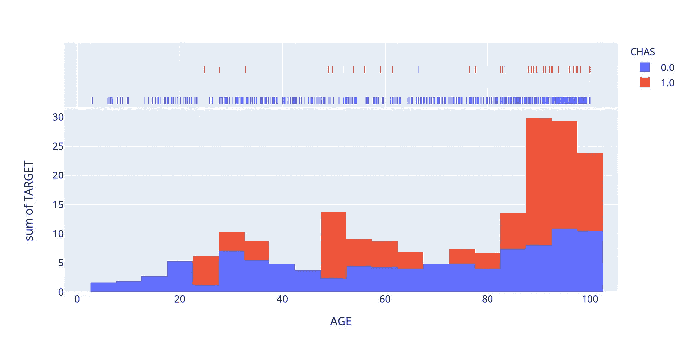
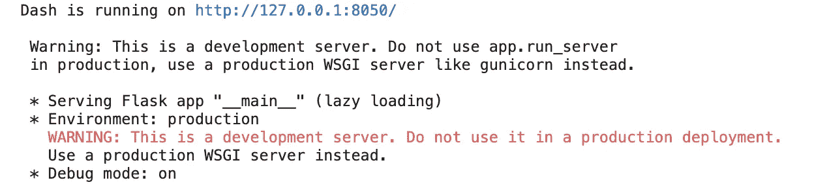
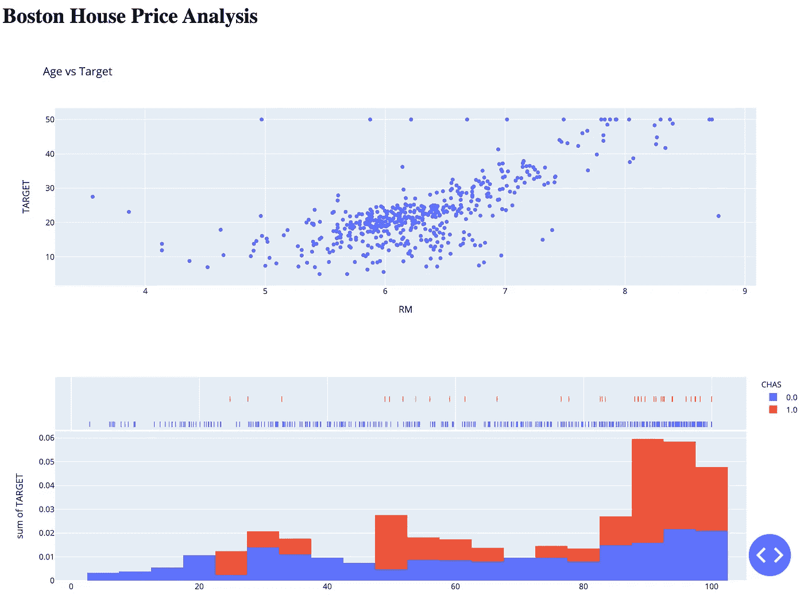
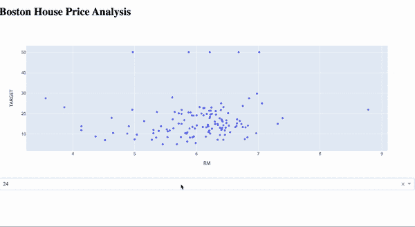

# 用 Python 创建漂亮的交互式可视化

> 原文：<https://towardsdatascience.com/create-beautiful-interactive-visualisations-in-python-f8517dc7ae5c?source=collection_archive---------21----------------------->

## Plotly 和 Dash 入门


照片由[丹尼斯·约翰逊](https://unsplash.com/@auntneecey?utm_source=unsplash&utm_medium=referral&utm_content=creditCopyText)在 [Unsplash](https://unsplash.com/s/photos/beautiful?utm_source=unsplash&utm_medium=referral&utm_content=creditCopyText) 拍摄

Plotly 是一个交互式的 Python 库，它提供了一个简单的界面，可以实现多种可视化。

Python 中有许多不同的可视化库。与 Matplotlib 相比，Plotly 与众不同的是其情节的交互性、可视化的丰富性和多样性、相对简单性，以及使用 Dash 模块将可视化部署为 web 应用的能力。

Plotly 工具套件有许多不同的部分，当我第一次开始使用它们时，我发现导航有点困难。在本文中，我想简单介绍一下 Plotly 的核心元素，包括标准绘图模块 Plotly express 和 Dash。除了一些简单的代码之外，还有让您快速使用这些工具的示例。

# 1.标准绘图

Plotly 可以 pip 安装。

```
pip install plotly
```

Plotly 可视化渲染为 HTML 文件。如果您在 Jupyter 笔记本上工作，并且想要直接渲染图像，您需要安装 ipywidgets 包。

```
pip install "notebook>=5.3" "ipywidgets>=7.2"
```

或者你用的是 JupyterLab。

```
pip install jupyterlab "ipywidgets>=7.5"
jupyter labextension install jupyterlab-plotly@4.9.0
```

Plotly 使用称为图形的数据结构，图形可以表示为字典，在这种情况下，您可以使用`plotly.io`模块。或者作为通过`plotly.graph_objects`模块呈现的图形对象。

图形对象通常被认为是比字典更好的选择，因为它们允许精确的数据验证，支持用于更新已经构建的图形的更高级的便利功能，并且图形对象的语法使得代码更紧凑。

让我们导入一个玩具数据集，并探索标准绘图的基本功能。下面的代码导入了波士顿房价数据集，这是一个流行的玩具数据集，用于 scikit-learn 库中的回归分析。

数据的前几行如下所示。



让我们使用图形对象模块来探索房价和房间数量之间的关系。你会注意到我正在使用我上面提到的助手功能来给可视化添加标题。



# 2.Plotly express

如果你需要创建一个定制的可视化，标准绘图模块是有用的。然而，如果你想创建一些非常标准的东西，比如上面显示的散点图，那么`plotly.express` API 是最好的选择。

这个模块允许你在一行代码中为最常见的可视化创建完整的图形。它还能让你轻松控制颜色、风格和标签。

使用这个模块，我们只用一行代码就可以创建上面的散点图。颜色、标签和样式控制均可通过`px.scatter`功能获得，轴标签会自动添加。

由`plotly.express`提供的‘开箱即用’图表有大量不同的选项和控件，您可以在这里探索所有选项[。](https://plotly.com/python/plotly-express/)

例如，下面的代码创建了一个直方图来显示 CHAS 变量的分布。我使用了`histnorm`选项来应用标准化以更好地可视化分布，使用`hover_data`选项来控制悬停时的交互。



# 3.破折号

Dash 也是 Plotly 工具套件的一部分，是一个用于开发数据分析仪表板的框架，所有 Plotly 可视化都可以轻松嵌入到应用程序中。

仪表板需要单独安装。

```
pip install dash
```

可以在 Jupyterlab 中显示 Dash 应用程序，但是您需要安装这个 [JupyterDash](https://github.com/plotly/jupyterlab-dash) 扩展。

```
pip install "jupyterlab>=1.0" jupyterlab-dash==0.1.0a3
jupyter labextension install jupyterlab-dash@0.1.0-alpha.3
```

或者，Dash 将在 localhost 上托管应用程序，当您运行代码时，该地址将显示在输出中。



无论何时`fig.show`被用于显示可视化，使用 Plotly express 或标准绘图，你都可以将相同的绘图传递给 Dash。

Dash 应用程序的布局由`app.layout`决定，它使用`dash_core_components`和`dash_html_components`的组合向仪表板添加图表、表格、交互性和文本。

下面显示的代码使用我们用`plotly.express`创建的图表创建了一个基本的 Dash 应用程序。生成的仪表板如下所示。



Dash 应用程序最有用的一个方面是，您可以通过使用`[callbacks](https://dash.plotly.com/basic-callbacks)`使您的仪表板具有交互性。核心组件模块包含各种不同的交互式组件，包括下拉菜单、滑块和文本框。

下面的代码向仪表板添加了一个下拉菜单，允许您过滤 RAD 特性以查看每个唯一值的分布。生成的仪表板显示在代码下方。



我最近发现自己开始使用 Plotly 作为我的首选可视化库，因为我发现你可以如此轻松地实现的分析质量是目前任何其他 Python 绘图库都无法比拟的。自从 Pandas 将 Plotly 添加为其绘图功能的可用后端后，情况就变得更加如此。

我以前写过这篇文章，概述了如何使用 Plotly 作为熊猫可视化的后端。如果您想将一些非常快速分析片段放在一起，这是非常有用的。

[](/plotting-in-pandas-just-got-prettier-289d0e0fe5c0) [## 熊猫里的情节越来越漂亮了

### 创建丰富的可视化和仪表板与熊猫绘图后端为 Plotly 和 Bokeh

towardsdatascience.com](/plotting-in-pandas-just-got-prettier-289d0e0fe5c0) 

感谢阅读！

我每月都会发一份简讯，如果你想加入，请点击此链接注册。期待成为您学习旅程的一部分！