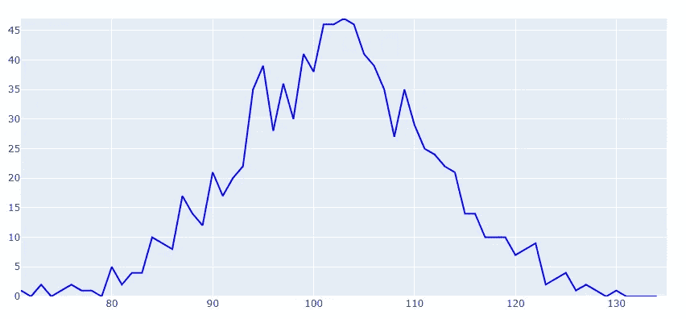

# 如何使用 Plotly、Python 创建二项式分布图

> 原文：<https://towardsdatascience.com/create-binomial-distribution-graph-using-plotly-python-18eb92c2c78?source=collection_archive---------41----------------------->


有时，Python 图表是您的论点或您试图构建的数据案例的必要元素。本教程是关于创建二项式或正态分布图。我们将从声明一个二项式分布的数字数组开始。我们只需从 scipy.stats 导入 binom 就可以做到这一点。

```
from scipy.stats import binom
n = 1024
size = 1000
prob = 0.1
y = binom.rvs(n, prob, size=size)
```

这段代码生成 1000 个数字，共 1024 次，成功概率为 0.1。一旦完成了这个，接下来我们要计算数组中数字的频率。我们可以通过将此作为数据帧并使用以下逻辑创建频率仓来实现这一点。

```
import numpy as np
import pandas as pd# Creating X array for numbers between the maximum and minimum values of y and making it a dataframe
x = np.arange(y.min(), y.max())
xx = pd.DataFrame(x)# Making y a dataframe and generating an empty array yy
d = pd.DataFrame(y, columns  = ['Data'])
yy = []# Calculating frequency of all numbers between maxiumum and minimum values
for k in range(len(x)):
        yy.append(d[d['Data'] == x[k]].count()[0])# Making frequency data frame and concatenating it with the xx 
freq = pd.DataFrame(yy, columns=['Frequency'])
data = pd.concat([xx, freq], axis=1)
data.columns = ['Score', 'Frequency']
```

现在我们有了分数和频率箱。我们可以使用 plotly.graph 使用这些数据生成一个二项式图。

```
import plotly.graph_objects as go
fig = go.Figure( # Loading the data into the figur
    data=[go.Scatter(x=data['Score'], y=data['Frequency'],
                     mode="lines",
                     line=dict(width=2, color="blue"))], # Setting the layout of the graph
    layout=go.Layout(
        xaxis=dict(range=[y.min(), y.max()], autorange=False),
        yaxis=dict(range=[data['Frequency'].min(), data['Frequency'].max()], autorange=False),
        title="Binomial Curve",
        updatemenus=[dict(
            type="buttons",
            buttons=[dict(label="Play",
                          method="animate",
                          args=[None])])]
    ))
fig.show()
```

下图是使用上面的代码生成的。



正如我们所看到的，曲线展示了一个基本的二项式行为，有很多噪声，随机徘徊在预期路径的上方和下方。但是通过重复这个过程很多次并平均结果，它可以很容易地变成一个完整的二项式图。在我的例子中，我执行了 1500 次上述步骤。请查看下面的代码:

```
n = 1024
size = 1000
prob = p / 10
x = np.arange(70, 135)
yy = []
tt = []# Repeating the step 1500 times, rest code is same as above
for a in range(1500): y = binom.rvs(n, prob, size=size)
    d = pd.DataFrame(y, columns  = ['Data'])

    for k in range(len(x)):
        yy.append(d[d['Data'] == x[k]].count()[0])

    tt.append(yy)
    yy = []
    y = []kk = pd.DataFrame(tt).T
y = kk.mean(axis=1)
N = len(y)
```

上面的代码生成了一个新的数组“y ”,它对数据中所有分数的频率进行了平均。我们可以使用下面的代码生成一个新的数据框并查看数据:

```
data = pd.DataFrame([x,y]).T
data.columns = ['Score', 'Frequency']
data.head()
```

使用 plotly 代码再次绘制这些数据，我们得到了一个好看的二项式图。


有了上面的图表，我们可以对数据做更多的处理，比如我们可以用 plotly 来制作图表的梯度或它在每一点的导数的动画。

任何一点的导数都可以用下面的公式进行数值计算。


我们可以使用 pandas 实现这个公式，计算所有相关点的梯度值。

```
# Declaring an empty array
deri = []# Setting first derivative to zero
fir = 0
deri.append(fir)# Calculating the derivative all points other than first and last points
for a in range(1,64):
    diff = (data['Frequency'][a+1] - data['Frequency'][a-1])/2
    deri.append(diff)# Setting last derivative to zero
end = 0
deri.append(end)der = pd.DataFrame(deri, columns = ['Derivatives'])
data = pd.concat([data, der], axis = 1)
```

请注意，我们特意将零作为数据中第一个和最后一个点的值。这样做是因为导数公式需要前值和后值。第一个值缺少前一个值，最后一个值缺少后一个值。此后，为了方便起见，两者都保持为零。

现在我们有了导数，我们需要计算我们需要在 plotly 上制作动画的渐变线的开始和结束坐标。

```
sx = []
sy = []
ex = []
ey = []
Gap = 3.5for b in range(0,65):
    #Computing Start Coordinates
    ssx =data['Score'][b] - Gap
    sx.append(ssx)
    ssy = data['Frequency'][b] - Gap * data['Derivatives'][b]
    sy.append(ssy)
    #Computing End Coordinates
    eex = data['Score'][b] + Gap
    ex.append(eex)
    eey = data['Frequency'][b] + Gap * data['Derivatives'][b]
    ey.append(eey)cord = pd.DataFrame([sx, sy, ex, ey]).T
cord.columns = ['XStart', 'YStart', 'XEnd', 'YEnd']
```

现在我们已经完成了，我们可以可视化产生的动画。


此外，如果我们想要在该图上标记区域并添加文本，我们可以使用下面的代码片段轻松完成。

```
fig.add_trace(go.Scatter(x=[70,85,85,70], y=[0,0,50,50], fill='toself', mode='lines', line_color='#FF5A5F', opacity = 0.3))
fig.add_trace(go.Scatter(x=[85,102,102,85], y=[0,0,50,50], fill='toself', mode='lines', line_color='#C81D25', opacity = 0.3))
fig.add_trace(go.Scatter(x=[102,119,119,102], y=[0,0,50,50], fill='toself', mode='lines', line_color='#0B3954', opacity = 0.3))
fig.add_trace(go.Scatter(x=[119,135,135,119], y=[0,0,50,50], fill='toself', mode='lines', line_color='#087E8B', opacity = 0.3))fig.add_trace(go.Scatter(
    x=[77.5, 93.5, 110.5, 127],
    y=[40, 40, 40, 40],
    mode="text",
    name="Regions",
    text=["Low Risk", "High Risk", "Stabilization", "Recovery"],
    textposition="top center",
    textfont=dict(
        family="sans serif",
        size=20,
        color="black"
    )
))fig.show()
```

我们最终得到下图。


如果你仍然对我在做什么感到好奇，请看看我的下一个博客，在这里，所有这些技术都被用来可视化“新冠肺炎的全球地位”。敬请期待，干杯。

二项式曲线的完整 Jupyter 笔记本实现可以在[这里](https://github.com/usamatrq94/BinomialCurve/blob/master/Binomial_Graphs.ipynb)找到。