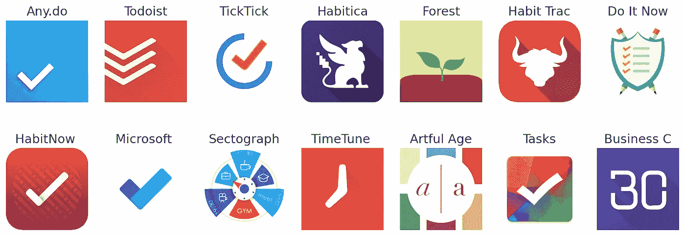

# 通过使用 Python 抓取 Google Play 应用评论来创建用于情感分析的数据集

> 原文：<https://towardsdatascience.com/create-dataset-for-sentiment-analysis-by-scraping-google-play-app-reviews-using-python-ceaaa0e41c1?source=collection_archive---------14----------------------->

## 了解如何收集 Android 应用的评论，并使用这些信息建立一个用于情感分析的数据集


马库斯·温克勒的照片

> *TL；DR 了解如何通过收集 Android 应用程序的用户评论来创建用于情感分析的数据集。您需要将应用程序和检查信息转换为数据框，并将其保存为 CSV 文件。*

*   [在你的浏览器(Google Colab)中运行笔记本](https://colab.research.google.com/drive/1GDJIpz7BXw55jl9wTOMQDool9m8DIOyp)
*   [在 GitHub 上完成项目](https://github.com/curiousily/Getting-Things-Done-with-Pytorch)

[](https://leanpub.com/getting-things-done-with-pytorch) [## 用 PyTorch 完成任务

### “成功创造人工智能将是人类历史上最大的事件。不幸的是，这也可能是最后一次，除非…

leanpub.com](https://leanpub.com/getting-things-done-with-pytorch) 

您将学习如何:

*   为数据集设置目标和包含标准
*   通过抓取 Google Play 获得真实世界的用户评论
*   使用 Pandas 将数据集转换并保存为 CSV 文件

# 设置

让我们安装所需的包并设置导入:

# 数据集的目标

你希望你的应用得到反馈。消极和积极都是好的。但是消极的一面可能会暴露出您的服务所缺少的关键特性或停机时间(当它更加频繁时)。

幸运的是，Google Play 有大量的应用程序、评论和分数。我们可以使用 [google-play-scraper](https://github.com/JoMingyu/google-play-scraper) 包收集应用信息和评论。

你可以选择大量的应用程序进行分析。但是不同的应用类别包含不同的受众、特定领域的怪癖等等。我们从简单的开始。

我们想要已经存在一段时间的应用程序，因此可以有机地收集意见。我们希望尽可能减少广告策略。应用程序不断更新，因此审查的时间是一个重要因素。

理想情况下，您会希望收集所有可能的评论并加以利用。然而，在现实世界中，数据通常是有限的(太大、不可访问等)。所以，我们会尽力而为。

让我们从*生产力*类别中选择一些符合标准的应用。我们将使用 [AppAnnie](https://www.appannie.com/apps/google-play/top-chart/?country=US&category=29&device=&date=2020-04-05&feed=All&rank_sorting_type=rank&page_number=1&page_size=100&table_selections=) 选择一些美国顶级应用:

# 抓取应用程序信息

让我们收集每个应用程序的信息:

我们得到了所有 15 个应用程序的信息。让我们编写一个助手函数，它可以更好地打印 JSON 对象:

以下是列表中的应用程序信息示例:

这包含了许多信息，包括评级数量，评论数量和每个分数的评级数量(1 到 5)。让我们忽略所有这些，看看它们美丽的图标:



我们数据集中的应用图标

我们将通过将 JSON 对象转换成 Pandas 数据帧并将结果保存到 CSV 文件中来存储应用程序信息，以备后用:

# 抓取应用评论

在一个理想的世界里，我们会得到所有的评论。但是有很多，我们正在搜集数据。那不太礼貌。我们做什么呢

我们想要:

*   平衡数据集—每个分数的评论数量大致相同(1-5)
*   每个应用的代表性评论样本

我们可以通过使用刮包选项过滤复习分数来满足第一个要求。对于第二个问题，我们将根据评论的有用性对其进行排序，这是 Google Play 认为最重要的评论。为了以防万一，我们还会从最新的数据中获取一个子集:

请注意，我们将应用 id 和排序顺序添加到每个评论中。这里有一个例子:

`repliedAt`和`replyContent`包含开发人员对评审的回应。当然，他们可能会失踪。

我们获得了多少应用评论？

```
15750
```

让我们将评论保存到 CSV 文件中:

# 摘要

干得好！您现在拥有一个数据集，其中包含来自 15 个生产力应用程序的超过 15k 条用户评论。当然，你可以疯狂地得到更多。

*   [在你的浏览器中运行笔记本(Google Colab)](https://colab.research.google.com/drive/1GDJIpz7BXw55jl9wTOMQDool9m8DIOyp)
*   [在 GitHub 上完成项目](https://github.com/curiousily/Getting-Things-Done-with-Pytorch)

[](https://leanpub.com/getting-things-done-with-pytorch) [## 用 PyTorch 完成任务

### “成功创造人工智能将是人类历史上最大的事件。不幸的是，这也可能是最后一次，除非…

leanpub.com](https://leanpub.com/getting-things-done-with-pytorch) 

您学习了如何:

*   为数据集设定目标和期望值
*   抓取 Google Play 应用程序信息
*   收集 Google Play 应用的用户评论
*   将数据集保存到 CSV 文件

接下来，我们将使用这些评论对 BERT 进行情感分析。但是首先，我们必须做一些文本预处理！

# 参考

*   [用于 Python 的 Google Play Scraper】](https://github.com/JoMingyu/google-play-scraper)

*最初发表于*[*https://www.curiousily.com*](https://www.curiousily.com/posts/create-dataset-for-sentiment-analysis-by-scraping-google-play-app-reviews-using-python/)*。*