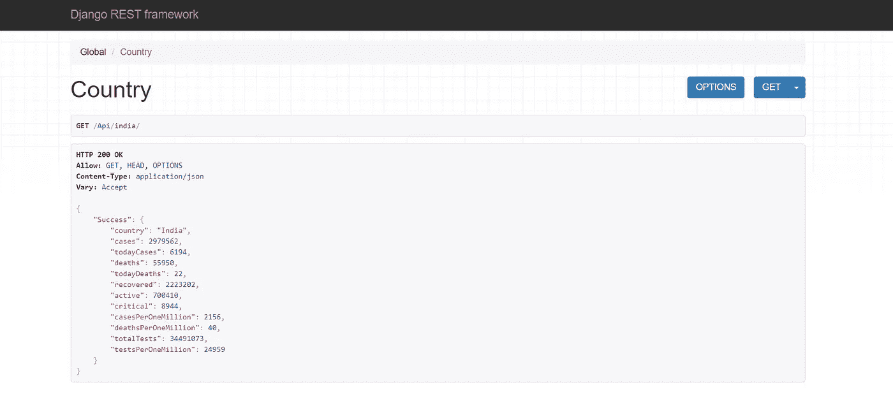
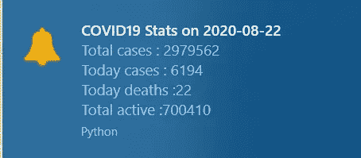
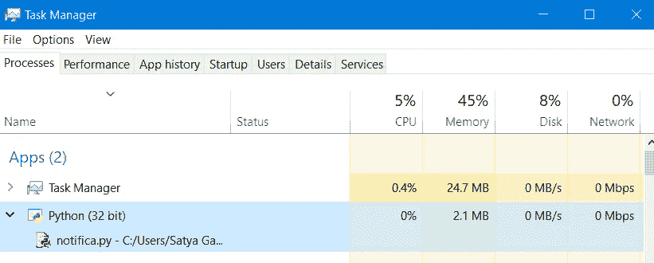

# 使用 Python 的桌面通知应用程序只需 5 分钟

> 原文：<https://towardsdatascience.com/create-desktop-notifier-application-using-python-fb3b7b2c3cf3?source=collection_archive---------1----------------------->

## 在本文中，您将学习使用 python 通过几个简单的步骤为您的 PC 创建一个定制的桌面通知程序。


照片由 [Cookie 在](https://unsplash.com/@cookiethepom?utm_source=medium&utm_medium=referral) [Unsplash](https://unsplash.com?utm_source=medium&utm_medium=referral) 上的 Pom 拍摄

# 介绍

你有没有尝试过根据自己的需求创建一个桌面通知应用程序？您知道使用 python 只需几个简单的步骤就可以做到这一点吗？

不要担心，让我们从头开始，在本文中，我们将创建一个桌面通知应用程序，用于获取可怕的冠状病毒的每日统计数据。

你从这篇文章中学到了什么

1.  安装所需的 python 包。
2.  从网上读取冠状病毒数据。
3.  创建桌面通知应用程序。
4.  让你的程序在后台运行。

# 我们开始吧

## ***安装需要的 python 包***

我们需要为这个应用程序下载两个重要的包。

> **注意:**如果您使用 Windows，您需要在命令提示符下键入这两个命令；如果您使用 Linux，您需要在终端上键入这两个命令

1.  请求(从 web 获取数据)

```
 **pip install requests**
```

2.plyer(用于在您的电脑上创建通知)

```
**pip install plyer**
```

## ***从网络上读取冠状病毒数据***

我们可以使用下面提供的 URL 获取冠状病毒数据，您可以自由地将国家名称替换为您自己的国家名称，对于此应用程序，我们将使用印度的冠状病毒数据。

```
**https://corona-rest-api.herokuapp.com/Api/india**
```

网站看起来像这样



图片由 Satya Ganesh 提供

## ***创建桌面通知程序***

到目前为止，我们已经获得了构建这个应用程序所需的所有工具，所以现在让我们编写这个应用程序的代码

> 注意:如果你在离线编译器中编写这个代码，会比在线编译器更容易，因为在本文的后面，我们会让这个应用程序在你的 PC 上作为后台进程运行，如果你在在线编译器中运行，那么你需要下载文件，而在离线编译器中这是不必要的。我会建议用 Visual Studio。

***part1(导入库)***

***第二部分(从 web 上检索数据)***

***part3(创建自定义通知)***

就这样，我们准备运行我们的应用程序，在实际运行我们的应用程序之前，您需要了解一些您可以进行的更改，以便根据您的需求定制您的应用程序。

> **超时—告知通知应该在桌面上显示多长时间**
> 
> **time.sleep ()—告知通知应在多长时间间隔后弹出**
> 
> 你可以在这里找到我用过的图标**[](https://iconarchive.com/show/small-n-flat-icons-by-paomedia/bell-icon.html)**

***下面是您在运行应用程序后看到的通知。***

******

***图片由 Satya Ganesh 提供***

## ******让你的应用在后台运行******

***因此，您最终创建了一个 python 应用程序，当您运行它时，它运行良好。但是你不觉得这是一项繁琐的工作吗，每次运行你的应用程序都要得到一个通知？***

***这里有一个解决方案，你可以通过在你的电脑上运行你的应用程序作为后台进程来实现自动化。***

## *****如何让一个 python 应用在后台运行？*****

***只需按照这个简单的命令让您的应用程序在后台运行，注意，如果您使用的是 Windows，您需要在命令提示符下键入这个命令；如果您使用的是 Linux，您需要在终端上键入这个命令。***

> ******注意:*** 用你的文件名替换<你的文件名***

```
*pythonw.exe .\<your-file-name-here>example pythonw.exe .\desktopNotifier.py*
```

***就这样，您的应用程序现在开始在后台运行***

## *****你如何确认你的应用在后台运行？*****

***在你的电脑中打开任务管理器，你可以看到在后台进程中你可以看到 python 正在运行***

******

***图片由 Satya Ganesh 提供***

## ***如何停止接收通知？***

***很简单，在任务管理器中杀死名为 python 的进程。如果你觉得停止通知有任何困难，请在这篇文章的评论部分发表你的困难。***

# *****其他可以使用这种方法的领域*****

1.  ***每日通知吃药。***
2.  ***每小时通知喝水。***

***更多的是，如何使用这个应用程序完全取决于你。***

# ***结论***

***我希望这篇文章引起了您创建自己的定制桌面通知应用程序的兴趣。这个应用程序适用于任何操作系统，无论是 Windows、Linux 还是 Mac。如果您想要一个更简单的桌面通知应用程序，请在本文的评论部分提问***

## ***感谢您的阅读😄过得愉快***