# 创建哑铃图以直观显示 R 中的组差异

> 原文：<https://towardsdatascience.com/create-dumbbell-plots-to-visualize-group-differences-in-r-3536b7d0a19a?source=collection_archive---------9----------------------->

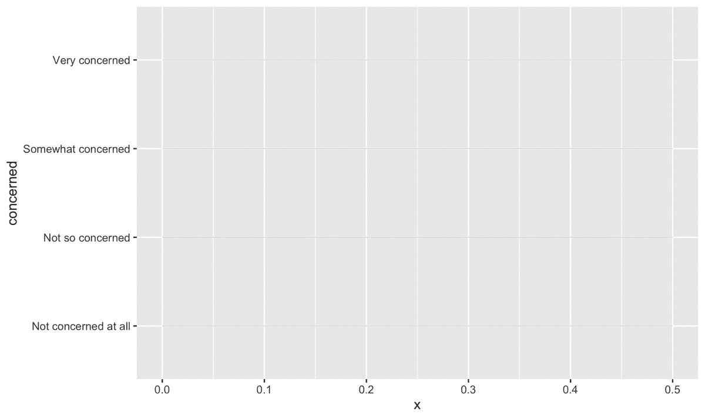

冠状病毒(也称为新冠肺炎)是一种疫情。截至本文撰写之时，已有近 6000 人死亡，另有 15 万人(T2)被感染。所有迹象似乎表明，病毒只是在增长。

但是一些团体不像其他团体那样担心新冠肺炎。昆尼皮亚克大学最近的[民调](https://poll.qu.edu/national/release-detail?ReleaseID=3657#.XmaSrM7okEs.twitter)显示，对冠状病毒的担忧与个人的党派身份、年龄和种族有关。

让我们想象一下，看看差异有多明显。我使用哑铃状点状图，因为它们是可视化两个群体(例如共和党和民主党)之间差异的一些最有力的工具。

# 政治派别

与民主党人相比，共和党人对冠状病毒的担忧要少得多。这在两个方面是正确的。首先，关于*被感染的担忧*:

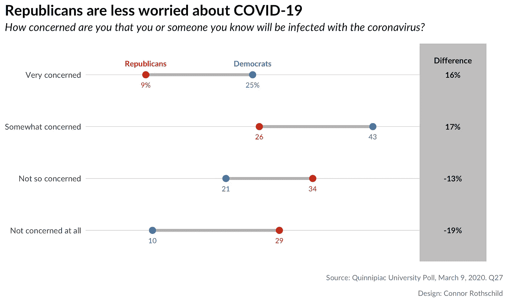

当我们关注新冠肺炎会不会*扰乱一个人的生活*时，情况也是如此:

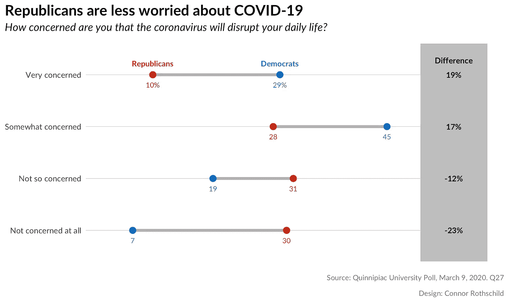

看第一个图，我们注意到共和党人说他们“根本不担心”冠状病毒感染他们或他们认识的人的可能性是民主党人的三倍。相比之下，民主党人说他们“非常担心”同样风险的可能性几乎是共和党人的三倍。

第二幅图向我们展示了对破坏的恐惧的类似趋势:四分之三的民主党人担心(非常或有点)新冠肺炎会破坏他们的日常生活，相比之下，只有 38%的共和党人担心。虽然 26%的民主党人不担心分裂，但 61%的共和党人也是如此。

# 年龄

年龄和对冠状病毒的恐惧也有关系。

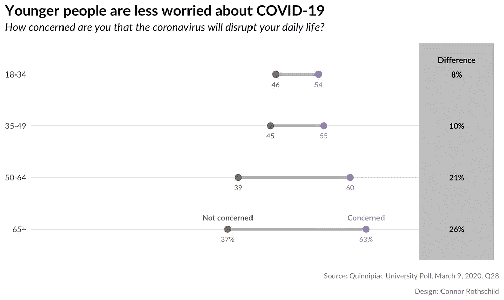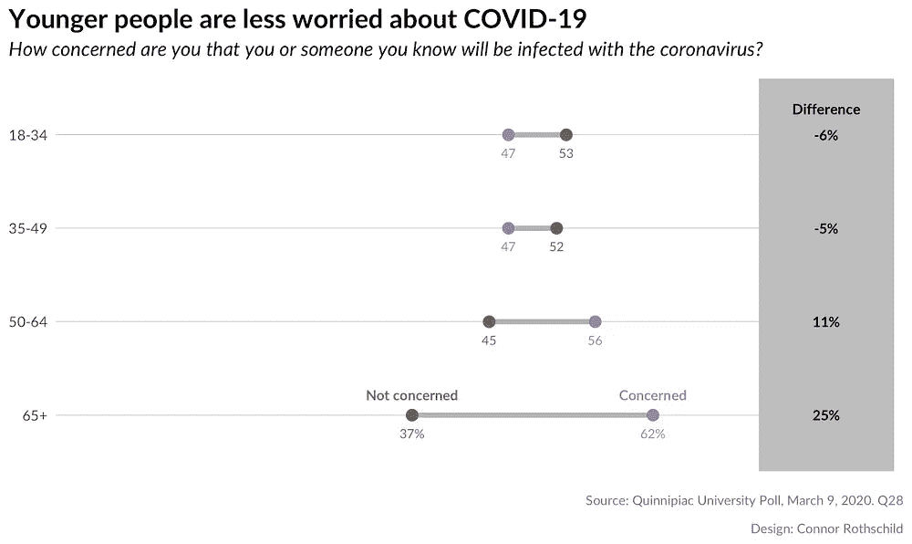

这些图表显示，不同年龄的人在担忧方面存在显著差异，但对分裂的恐惧比对感染的恐惧更普遍。第一个情节表明*每个年龄段的人*都害怕新冠肺炎会打乱他们的日常生活；尽管年轻人表达这种情绪的频率较低。第二个情节**大多数 50 岁以下的人并不担心新冠肺炎感染的可能性**。年龄较大的受访者则相反；65 岁及以上的人更有可能受到感染风险的影响(62%对 37%)。

# 为什么是哑铃情节？

哑铃图是分组条形图的替代方法。像条形图一样，它们显示了人群之间的差异，并且更有力地代表了两个群体之间的 T2 距离。他们经常被调查研究公司使用，如皮尤研究中心，如这个[例子](https://twitter.com/pewresearch/status/1238345807348334593/photo/1)所示:

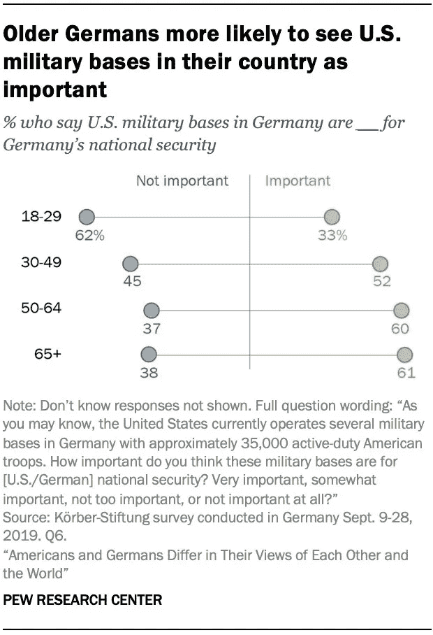

虽然条形图需要八个条来可视化上面的每个数据点，但哑铃点图在四条线上显示八个点*，减少混乱并强调组*之间的差异*。*

这里有另一个例子，这次来自 [Axios](https://www.axios.com/trumps-disapproval-rate-is-up-in-every-state-2495232720.html?utm_source=twitter&utm_medium=social&utm_campaign=organic&utm_content=infographic&utm_term=politics) (可视化 2017 年 1 月至 10 月总统不支持率的变化):

这个伪哑铃情节(端点怪异的哑铃；别捡那一边！)有 50 个‘组’(美国各州)，但只有两个*结果*(1 月和 10 月)。在这种情况下，哑铃图远远优于组合条形图，因为它强调两个时间段之间的差异，并且它使用的对象比条形图少(50 条线而不是 100 条线)。

从上面的例子中得到一个关键的教训:如果利益的*比较*是在两个群体之间(例如，共和党和民主党)，或者如果利益的*结果*是双重的(例如，“关注”和“不关注”)，点状图是可视化数据的一种更好的方式。

# 让我们在 R 中制造它！

现在是时候做自己的哑铃点状图了。我们将创建这个，即:


作为参考，我使用的数据如下所示:

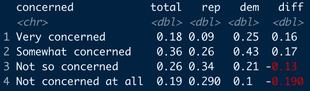

很简单，对吧？顺便说一下，它来自这里。

这个过程依赖于 Bob Rudis 的`ggalt`包和`geom_dumbbell`函数，它们完成了大部分繁重的工作。本教程主要是在这里找到的 Rudis 的代码[的一步一步的再创造](https://rud.is/b/2016/04/17/ggplot2-exercising-with-ggalt-dumbbells/)。

为了方便起见，在开始之前，让我们先定义一些东西:

```
blue <- "#0171CE"
red <- "#DE4433"
```

除了颜色，我们还创建了一个 hack-y 函数，允许我们有选择地标记点(再次感谢 Bob Rudis 的[这个](https://rud.is/b/2016/04/17/ggplot2-exercising-with-ggalt-dumbbells/)):

```
percent_first <- function(x) {
  x <- sprintf("%d%%", round(x*100))
  x[2:length(x)] <- sub("%$", "", x[2:length(x)])
  x
}
```

# 第一步:准系统

我们从一个基本的`ggplot`对象开始。在`geom_segment`中，我们定义了伪网格线(每个关注“级别”一条)。

```
library(ggplot2) 
library(ggalt)   
library(tidyverse)

ggplot() +
  geom_segment(data=infected, aes(y=concerned, yend=concerned, x=0, xend=.5), color="#b2b2b2", size=0.15)
```

这里，`geom_segment`创建了大小为 0.15 的灰色线条。线条的跨度从 0 到 0.5。这根据您的数据而变化；因为我们正在处理的最大数字是. 43(代表 43%的民主党人)，所以我们右侧的界限可以是 0.5；这也为我们稍后创建的差异列留出了空间。

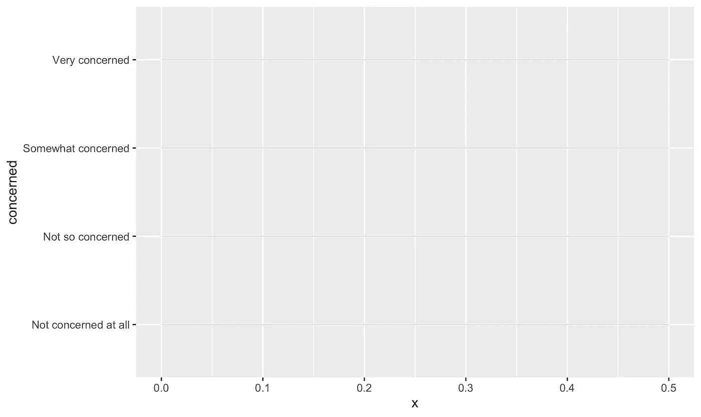

然后，`geom_dumbbell`读入我们的数据并创建哑铃:我们指定每个哑铃的*开头* ( `x`)代表共和党，而*结尾* ( `xend`)对应民主党。其他规格影响伴随的线和点。

```
geom_dumbbell(data=infected, aes(y=concerned, x=rep, xend=dem),
size=1.5, color="#b2b2b2", size_x=3, size_xend = 3, colour_x = red, colour_xend = blue)
```

该代码创建了以下情节:

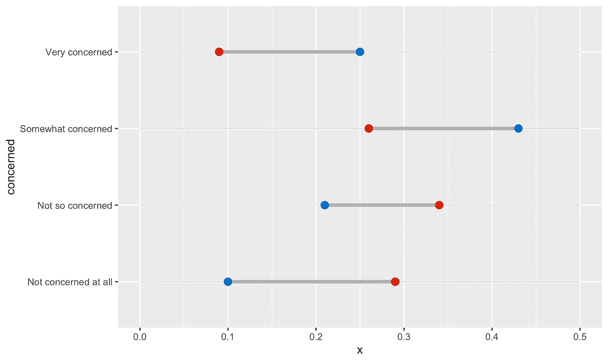

我们已经可以开始看到最终版本的框架:每个哑铃代表一个关注级别，并可视化共和党和民主党在该级别的比例。

# 第二步:标签

下一步是创建“共和党”和“民主党”标签(以防颜色不够，或者图像是黑白的！).

我们可以用下面的代码创建标签:

```
geom_text(data=filter(infected, concerned=="Very concerned"),
          aes(x=dem, y=concerned, label="Democrats"),
          color=blue, size=3, vjust=-1.5, fontface="bold", family="Lato") +
geom_text(data=filter(infected, concerned=="Very concerned"),
          aes(x=rep, y=concerned, label="Republicans"),
          color=red, size=3, vjust=-1.5, fontface="bold", family="Lato")
```

希望这段代码非常直观。因为我们只显示标签一次，所以我们在`geom_text`的`data`参数中指定一个过滤器。如果我们想只显示底层关注的标签，我们可以指定`data=filter(infected, concerned=="Not concerned at all")`。

我们将每个点标上各自的政治归属，并根据点的颜色指定颜色。剩下的只是对文字的小美化。

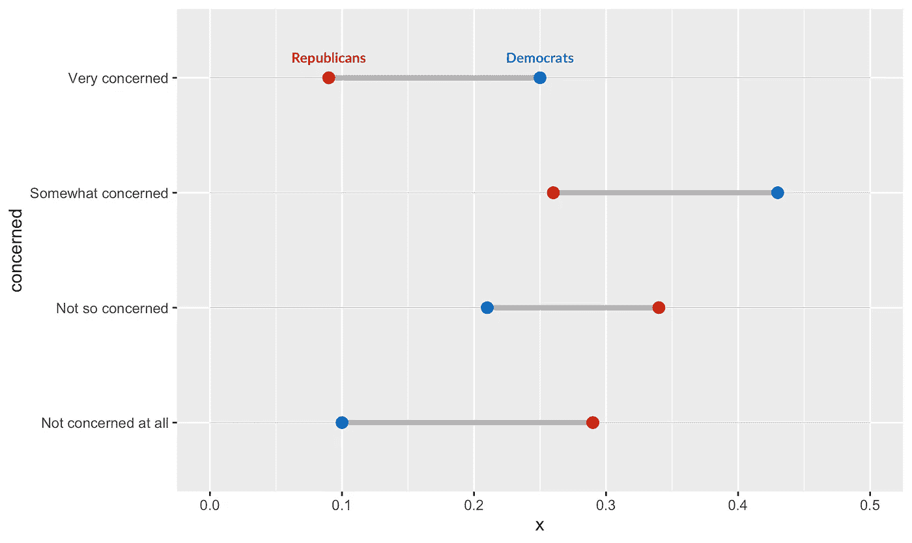

我们还必须为值添加直接标签，以便每个组的确切百分比清晰可见:

```
geom_text(data=infected, aes(x=rep, y=concerned, label=percent_first(rep)),
          color=red, size=2.75, vjust=2.5, family="Lato") +
geom_text(data=infected, color=blue, size=2.75, vjust=2.5, family="Lato",
          aes(x=dem, y=concerned, label=percent_first(dem)))
```

在这里，我们利用我们之前定义的函数`percent_first`，因为我们只希望百分比出现在第一个数字上(以减少混乱)。其余的标签只是代表百分比的数字。这里的语法是简单的语法，应该为`ggplot`用户所熟悉。它会创建以下输出:


# 第三步:差异栏

最后，我们想帮助我们的观众看到民主党和共和党之间的差异到底有多明显。我们通过差异列来实现这一点。

```
geom_rect(data=infected, aes(xmin=.5, xmax=.6, ymin=-Inf, ymax=Inf), fill="grey") +
geom_text(data=infected, aes(label=paste0(diff*100, "%"), y=concerned, x=.55), fontface="bold", size=3, family="Lato") +
geom_text(data=filter(infected, concerned=="Very concerned"), 
            aes(x=.55, y=concerned, label="Difference"),
            color="black", size=3.1, vjust=-2, fontface="bold", family="Lato") +
scale_x_continuous(expand=c(0,0), limits=c(0, .625)) +
scale_y_discrete(expand=c(0.2,0))
```

这里，我们首先创建一个带有`geom_rect`的灰色矩形。它垂直跨越了整个图表，这就是为什么`ymin`和`ymax`的范围从负无穷大到正无穷大。接下来，我们根据差异列创建标签。我们根据关注程度(我们的 y 轴)对它们进行定位。最后，我们扩展了图表的边界，使它看起来更漂亮一些:

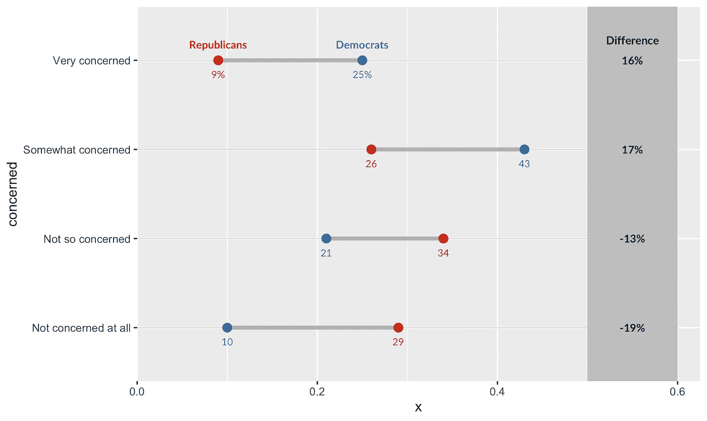

# 第四步:标题、标签和说明

最后，让我们添加标题、副标题、题注和轴标签:

```
labs(x=NULL, y=NULL, title="Republicans are less worried about COVID-19",
       subtitle="How concerned are you that you or someone you know will be infected with the coronavirus?",
       caption="Source: Quinnipiac University Poll, March 9, 2020\. Q27\n\nDesign: Connor Rothschild")
```

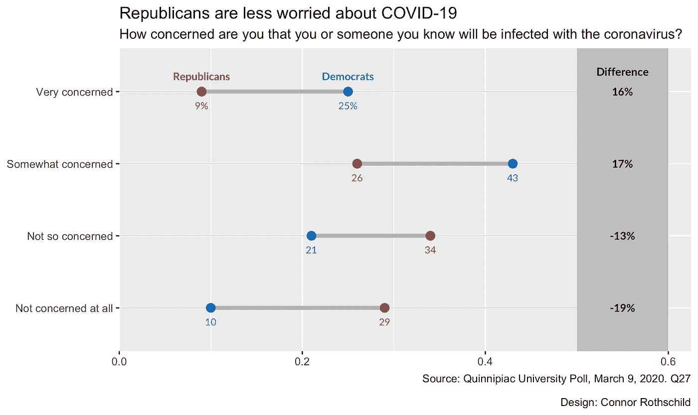

那是我们的阴谋！可惜它有点丑。让我们在最后一步解决这个问题。

# 步骤 5:美化

使用`theme`参数进行美化。

```
theme_bw(base_family="Lato") +
theme(
  panel.grid.major=element_blank(),
  panel.grid.minor=element_blank(),
  panel.border=element_blank(),
  axis.ticks=element_blank(),
  axis.text.x=element_blank(),
  plot.title=element_text(size = 16, face="bold"),
  plot.title.position = "plot",
  plot.subtitle=element_text(face="italic", size=12, margin=margin(b=12)),
  plot.caption=element_text(size=8, margin=margin(t=12), color="#7a7d7e")
)
```

在指定了我们的基本`ggplot`主题`theme_bw`之后，我们使用`theme()`来指定一系列的参数。

为了简化，上面的代码:

*   删除网格线(`panel.grid.major`，`panel.grid.minor`)
*   移除面板边框(`panel.border`)
*   删除轴记号和轴文本(`axis.ticks`、`axis.text.x`)
*   定位轴绘图、副标题和标题，并设置它们的样式(`plot.title`、`plot.title.position`、`plot.subtitle`、`plot.caption`)。

我们的最终产出:


# 总结

我们的过程看起来像这样:


上述可视化的代码，以及底层数据集和输出，可以在[这里](https://github.com/connorrothschild/R/tree/master/covid)找到。

感谢阅读！

[](https://twitter.com/CL_Rothschild) [## 康纳·罗斯柴尔德

### 康纳·罗斯柴尔德的最新推文(@CL_Rothschild)。数据科学和公共政策。使用内部字体系列…

twitter.com](https://twitter.com/CL_Rothschild) 

*原载于我的* [*博客*](https://connorrothschild.github.io/covid/) *。*