# 创建有效的比例数据可视化

> 原文：<https://towardsdatascience.com/create-effective-data-visualizations-of-proportions-94b69ad34410?source=collection_archive---------9----------------------->

## 在各种数据集规模下，查看个体对整体的贡献以及随时间变化的最佳方式—(包括简单、直观的演示、代码和数据)

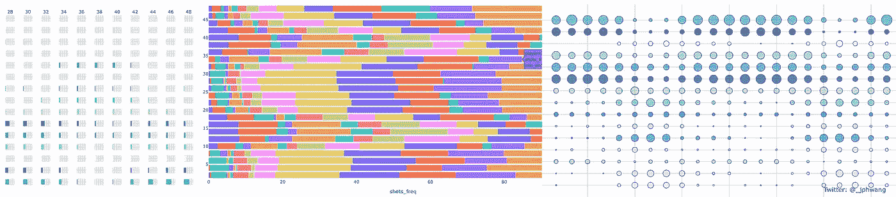

比例的各种可视化

绘制整体的比例可能是数据可视化中最常见的任务之一。例子包括幸福度、经济指标或犯罪的地区差异，投票模式、收入或支出的人口统计学差异，或者企业各部分对其底线的贡献。通常，数据还描述了随时间的变化，时间可能是几个月、几个季度、几年或几十年。

尽管它们都与整体的比例有关，但通常没有一种放之四海而皆准的方法适用于所有情况。

在这篇文章中，我描述了我认为的交流整体比例的有效技巧，以及随着时间的推移对它们的改变。我还将探讨随着数据点或数据系列数量的变化，图表有效性的变化。

和往常一样，这篇文章还将包括一些例子，这样你就可以跟随并创建你自己的、有趣的数据可视化。

对于代码，我将使用著名的 [Gapminder](https://www.gapminder.org) 数据集，以及上赛季多伦多猛龙队篮球投篮份额的一些数据。这些只是显示比例的数据集的例子，所以你不需要知道任何关于经济学或篮球的知识就能跟上。

# 在开始之前

## 数据

我将代码和数据包含在我的[git lab repo here](https://gitlab.com/jphwang/online_articles)(**viz _ proportions**目录)中。所以请随意使用它/改进它。

## 包装

我假设您熟悉 python。即使你相对较新，这个教程也不应该太难。

你需要`pandas`和`plotly`。用一个简单的`pip install [PACKAGE_NAME]`安装每一个(在你的虚拟环境中)。

# 想象简单的比例

## 加载和检查数据

很方便的是，`plotly`包提供了一些玩具数据集供我们使用， [Gapminder 数据集](https://www.gapminder.org)就是其中之一。我们可以加载:

```
import plotly.express as px
gap_df = px.data.gapminder()
```

用`gap_df.info()`和`gap_df.head()`检查数据，我们会看到它显示了每年多个国家的数据。

它包括人口和人均 GDP——所以让我们将两者相乘得到 GDP 数据。

```
gap_df = gap_df.assign(gdp=gap_df['pop'] * gap_df['gdpPercap'])
```

## 仅可视化一年的数据

对于第一次观想，让我们比较几种不同类型的图表。最初的数据包括 142 个国家 1952 年的数据。让我们简化数据，按大洲收集数据，并且只将最近一年的数据收集到`cont_df`中。

```
year_df = gap_df[gap_df.year == max(gap_df.year)]
cont_df = year_df.groupby('continent').agg({'gdp': 'sum'})
cont_df.reset_index(inplace=True)
```

这里，数据帧按洲分组，并重置索引，因为在 Plotly Express 中处理“平面”数据帧更容易。

现在可以使用 Plotly Express 绘制数据。绘制这些基本图形的代码非常简单。我注意到，对于气泡图，我添加了一个名为`dataType`的任意变量，这样它就可以用来在 Y 方向上对齐气泡。

```
# Pie chart
fig = px.pie(cont_df, values='gdp', names='continent')
fig.show()
# Bar chart
fig = px.bar(cont_df, color='continent', x='continent', y='gdp')
fig.show()
# Horizontal bar chart - stacked
fig = px.bar(cont_df, color='continent', x='gdp', orientation='h')
fig.show()
# Bubble chart
fig = px.scatter(cont_df.assign(dataType='GDP'), color='continent', x='continent', y='dataType', size='gdp', size_max=50)
fig.show()
```

我在这里收集了结果:

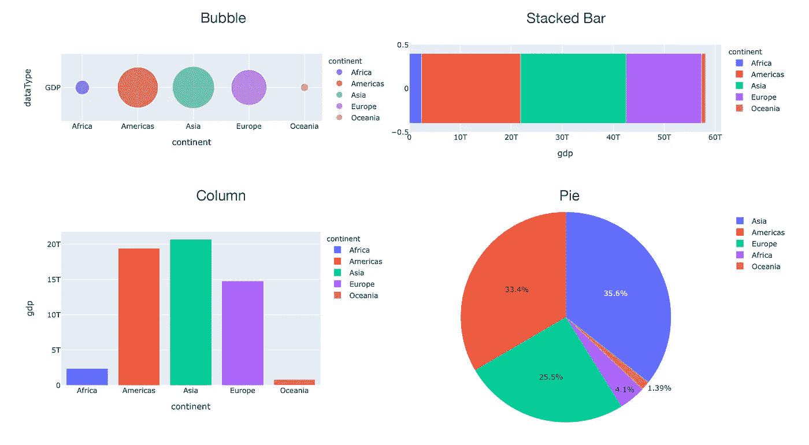

简单比例数据的图表类型比较

除了柱形图之外，所有的图表都不能很好地表明相对大小。

当数据点的大小接近时，如亚洲、美洲、欧洲的 GDP 数据，堆积条形图和饼图不允许数据点之间的简单比较，因为它们是从不同的参考开始的。

饼状图也有问题，因为众所周知，角度的差异很难准确感知，所以我们会忽略它们。

气泡图稍好一些，但是因为气泡的大小与数据集的大小有关，所以半径的差异变得比柱形图小(小一个平方根)。

当我们增加一个时间维度时会发生什么？

## 随着时间的推移可视化数据

对于这一部分，我们需要一个包含多年数据的数据框架。我们可以使用整个数据集，但让我们保持简单，只使用少量年份的数据。

数据集包含多个年份，但不是每个年份。我们可以使用`gap_df.year.unique()`来查看哪些年份的数据可用，选择 1985 年以后的年份，这是五个不同的年份。

我们的汇总数据框架可以构建如下:

```
mul_yrs_df = gap_df[gap_df.year > 1985]
mul_yr_cont_df = mul_yrs_df.groupby(['continent', 'year']).agg({'gdp': 'sum'})
mul_yr_cont_df.reset_index(inplace=True)
```

`groupby`方法将创建一个多索引数据帧，它可以被认为是`(continent, year)`的嵌套索引(如果您想了解更多关于层次/多索引的知识，[这是一个很好的资源](https://jakevdp.github.io/PythonDataScienceHandbook/03.05-hierarchical-indexing.html))。然后，在我们绘制它们之前，指数再次变平。

```
# Bar chart
mul_yr_cont_df = mul_yr_cont_df.assign(yrstr=mul_yr_cont_df.year.astype(str))
fig = px.bar(mul_yr_cont_df, color='continent', y='gdp', x='yrstr', barmode='group')
fig.show()
# Horizontal bar chart - stacked
fig = px.bar(mul_yr_cont_df, color='continent', x='gdp', orientation='h', y='yrstr')
fig.show()
# Bubble chart
fig = px.scatter(mul_yr_cont_df, y='continent', x='yrstr', color='continent', size='gdp', size_max=50)
fig.show()
```

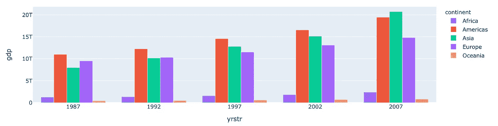

分组列

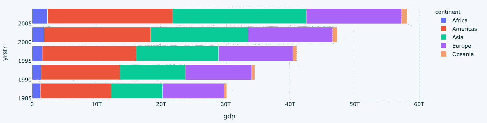

堆积条形图


泡泡图

有了这些，前面的属性仍然适用于在条形图中看到相对比例的容易程度。但是，通过在数据中增加另一个维度，可以进行新的观察。

虽然每个系列的大小仍然很难比较，但堆积条形图能够显示整体样本大小的变化，这一点很有价值。

就分组条形图而言，沿 x 轴分组变得很重要，因为不同组之间的比较变得更加困难，而同一组内的比较仍然很容易。尝试绘制和比较这两个:

```
fig = px.bar(mul_yr_cont_df, color='continent', y='gdp', x='yrstr', barmode='group')
fig.show()
fig = px.bar(mul_yr_cont_df, color='yrstr', y='gdp', x='continent', barmode='group')
fig.show()
```

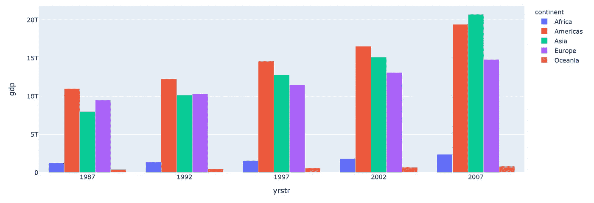

对各大洲的比较进行优先排序

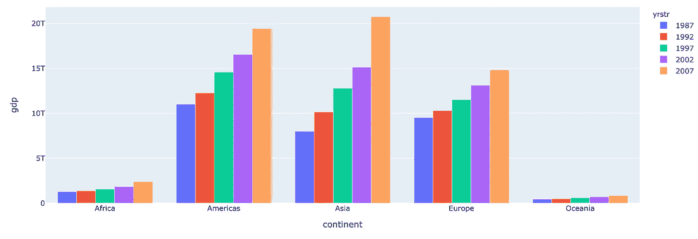

跨年度优先比较

在上图中，跨年度的比较优先于跨洲的比较，反之亦然。

对于跨两个轴的比较，气泡图将数据排列在网格中，这使得跨两个维度比较变化更加容易。

如果气泡图中的大小变化不够明显，条形图的网格(子图)可能会更好:

```
fig = px.bar(mul_yr_cont_df, color='continent', facet_col='continent', x='gdp', orientation='h', facet_row='yrstr')
fig.update_yaxes(showticklabels=False)
fig.show()
```

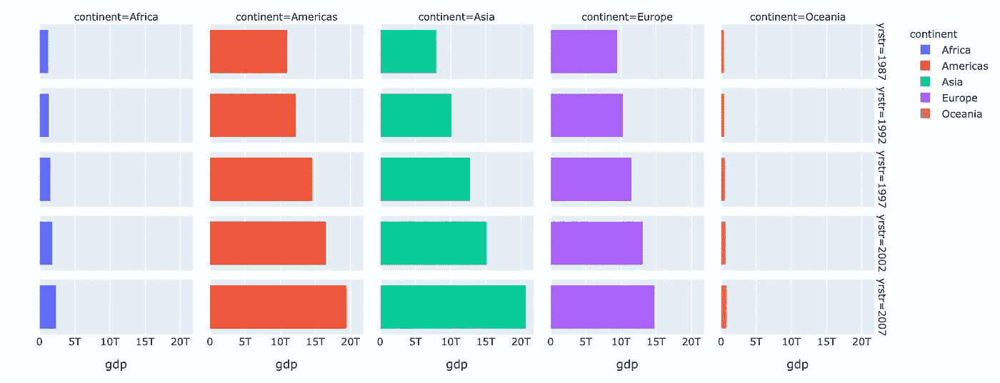

网格支线剧情

太好了。但是通常每个轴上有 5 个数据点。那么，如果级数增加会怎么样呢？

## 可视化更大的数据集

让我们针对 12 年数据集的所有数据重复这些图(为简洁起见，此处未显示代码—参见 git repo)。

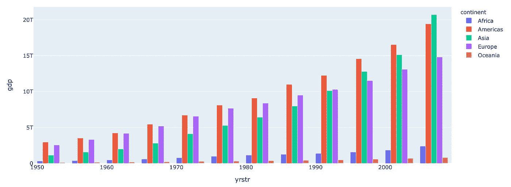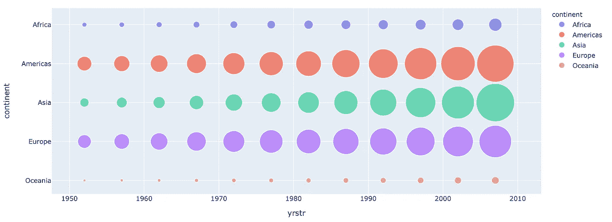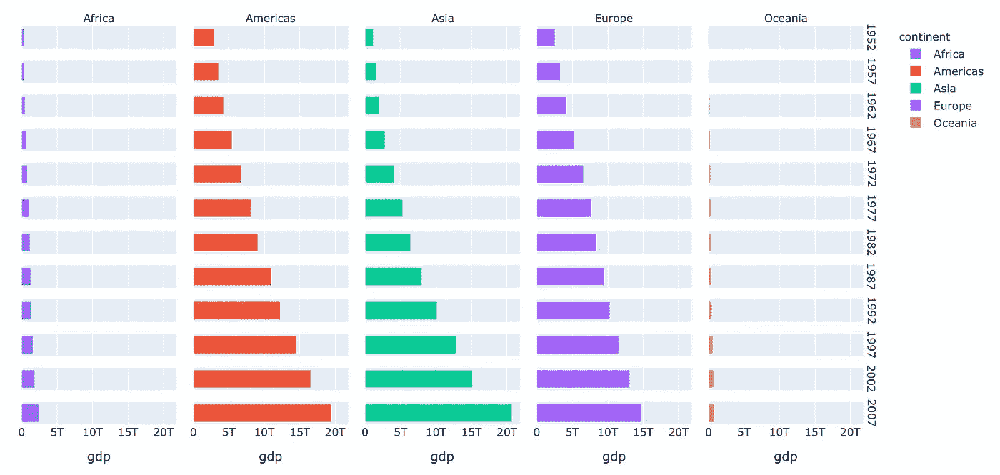

在这里，我们已经开始看到分组条形图的一些空间限制。不同组之间的比较也变得越来越困难，因为单个条形在高耸的彩色条形森林中迷失了，相邻条形的相对变化欺骗了我们的大脑。

尽管这个数据集在视觉上随着规模*相对*很好地缩放，这得益于 GDP 随时间的增长，但很容易看出其局限性。

最后一点，让我们来看看一个更大的、有序度更低的数据集。

# 奖励剧情:篮球投篮股份(2019 多伦多猛龙)

在一个 NBA 赛季的 82，48 分钟的规定时间里，一支球队要投篮 7000 次。在多伦多猛龙队的情况下，他们有 14 名球员至少获得 1%的投篮命中率。由此产生的 15 名“球员”(14 + 1 名“其他人”)如下所示，分为每 2 分钟一段。

这个数据集也与上面略有不同，因为我将展示百分比的分布。

在上述每种情节类型中，它们看起来是什么样的？

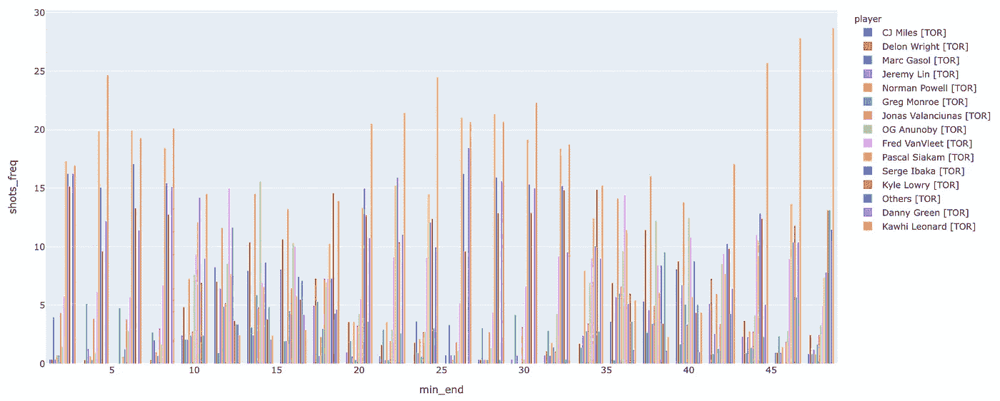

分组条形图

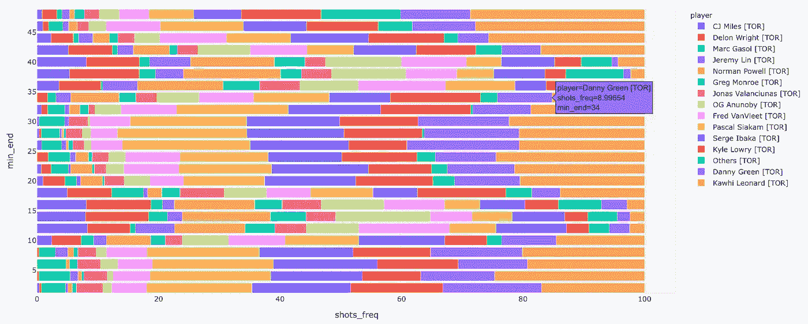

堆积条形图

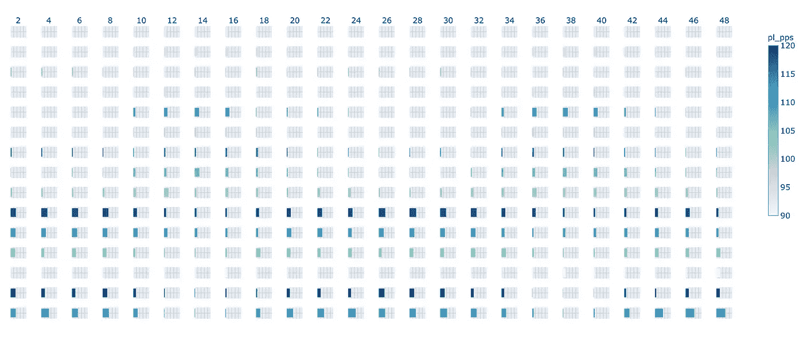

网格条支线剧情

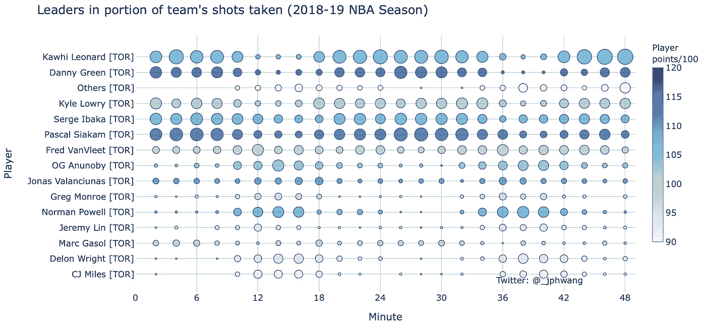

泡泡图

随着数据点在两个维度上变得越来越多，并且随着最大值与最小值之比的增加，网格中的气泡图开始发挥作用。

在气泡图中，条形图中 1 到 25 的高度变化变成了 1 到 5 的半径变化。事实上，尺寸的变化转化为半径的变化有效地压缩了视觉差异，并有助于显示更大的范围。它(以及条形子图方法)还有一个额外的优势，即能够将第四个变量演示为颜色，因为空间位置指定了它的两个维度。

您可能会发现，随着数据集变大，尤其是数据集变大，我更喜欢这种类型的子图方法。但是正如你之前看到的，在其他情况下，其他类型的观想效果明显更好。

# 那么——选择什么呢？

你可能已经看到了这一点，但在我看来，没有“一刀切”的方法。我甚至还没有开始在视觉比例方面触及这个领域的表面——比例、使用颜色的不同方法、符号类型、利用整体分布形状和突出比例等。

但我希望这些例子至少对你了解不同类型的观想有用，以及它们的功效如何随着样本大小而变化。我发现没有什么比练习更能真正学习数据可视化并变得更好了。所以，选择一个数据集，然后去做——你对这个主题领域越熟悉越好。

如果你喜欢这个，比如说👋/在 [twitter](https://twitter.com/_jphwang) 上关注，或关注更新。我还写了这篇关于我最喜欢的数据可视化书籍的文章，如果你以前没有读过的话:

[](/create-impactful-data-visualizations-with-these-books-ca9fbfecfde5) [## 用这些书创建有影响力的数据可视化

### 如果没有交流，好的分析没有什么意义。数据可视化会有所帮助。以下是我对…的建议

towardsdatascience.com](/create-impactful-data-visualizations-with-these-books-ca9fbfecfde5) 

同样，这也是一个大众的最爱:

[](/how-to-visualize-hidden-relationships-in-data-with-python-analysing-nba-assists-e480de59db50) [## 如何用 Python 可视化数据中的隐藏关系 NBA 助攻分析

### 使用交互式快照、气泡图和桑基图操纵和可视化数据，使用 Plotly(代码和数据…

towardsdatascience.com](/how-to-visualize-hidden-relationships-in-data-with-python-analysing-nba-assists-e480de59db50) 

下次见！