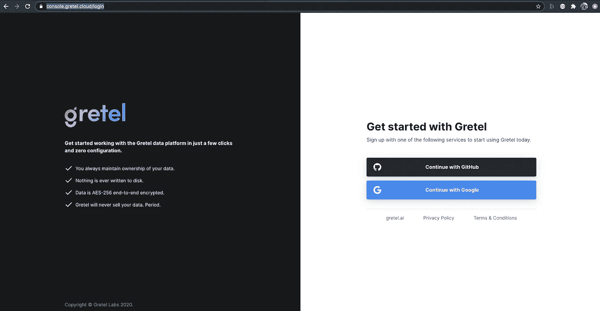
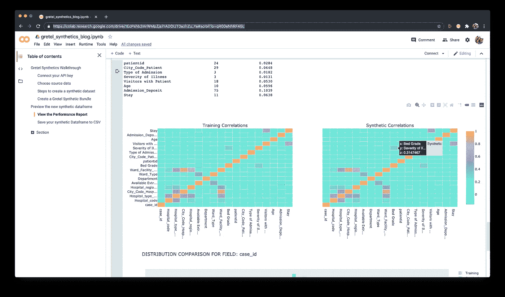

# 使用 Gretel.ai 和 Python 在您的云中创建高质量的合成数据

> 原文：<https://towardsdatascience.com/create-high-quality-synthetic-data-in-your-cloud-with-gretel-ai-and-python-fff3c98addef?source=collection_archive---------46----------------------->

## 创建[差异私有](https://en.wikipedia.org/wiki/Differential_privacy)、[合成](https://gretel.ai/gretel-synthetics-faqs/what-is-synthetic-data)版本的数据集；同时满足法规遵从性要求，将敏感数据保留在您批准的环境中。

无论您关注的是医疗保健行业的 [HIPAA](https://en.wikipedia.org/wiki/Health_Insurance_Portability_and_Accountability_Act) 、金融行业的 [PCI](https://en.wikipedia.org/wiki/Payment_Card_Industry_Data_Security_Standard) ，还是保护消费者数据的 [GDPR](https://en.wikipedia.org/wiki/General_Data_Protection_Regulation) 或 [CCPA](https://oag.ca.gov/privacy/ccpa) ，能够在不需要与 SaaS 服务合作的[数据处理协议](https://gdpr.eu/what-is-data-processing-agreement/) (DPA)的情况下开始构建，可以显著减少启动项目和开始创造价值所需的时间。今天，我们将通过一个示例，在本地(您的云或内部)配置中使用 Gretel.ai 来生成高质量的[合成数据](https://gretel.ai/blog/what-is-synthetic-data)和模型。


来源:设计单元格，通过 iStockPhoto

# 设置您的本地环境

要开始，你只需要三样东西。

1.  要以 CSV 或 Pandas 数据帧格式合成的数据集
2.  Gretel.ai API key(免费)
3.  本地计算机/虚拟机/云实例

**推荐设置。**我们推荐以下硬件配置:CPU:合成记录生成推荐 8+ vCPU 核。GPU:建议培训使用支持 CUDA 10.x 的 Nvidia Tesla P4。RAM: 8GB+。操作系统:Ubuntu 18.04 支持 GPU，或 Mac OS X(Mac 不支持 GPU)。

GPU 加速参见 TensorFlow 优秀的[设置指南](https://www.tensorflow.org/install/gpu)。虽然 GPU 不是必需的，但在 GPU 上进行训练通常比在 CPU 上快至少 10 倍。或者在 CPU 上运行并获取一个☕.

# 生成 API 密钥

使用 API 密匙，您可以免费访问 Gretel 公共测试版的高级功能，这些功能增强了我们的[开源库](https://github.com/gretelai/gretel-synthetics)用于合成数据生成，具有改进的字段间相关性、自动化合成数据记录验证以及合成数据质量报告。

用 Github 或谷歌邮箱登录或创建一个免费账户到 [Gretel.ai](https://gretel.ai/#signup) 。点击右上角的个人资料图标，然后点击 API 键。[生成一个新的 API 令牌](https://gretel.ai/blog/integrating-with-gretel-sdks-just-got-easier)并复制到剪贴板。



在 https://console.gretel.cloud 生成 API 密钥

# 设置您的系统并安装依赖项

我们建议为您的运行时设置一个虚拟 Python 环境，以保持您的系统整洁，在这个示例中，我们将使用 Anaconda 包管理器，因为它对 [Tensorflow](https://www.tensorflow.org/) 、GPU 加速和数千个数据科学包提供了强大的支持。你可以在这里下载并安装 Anaconda[https://www.anaconda.com/products/individual](https://www.anaconda.com/products/individual)。

## 创建虚拟环境

```
conda install python=3.8
conda create --name synthetics python=3.8 
conda activate synthetics # activate your virtual environment
conda install jupyter # set up notebook environment
jupyter notebook # launch notebook in browser
```

## 安装所需的 Python 包

将 [gretel-synthetics](https://github.com/gretelai/gretel-synthetics) 、Tensorflow、Pandas 和 Gretel helpers(需要 API 密钥)等依赖项安装到新的虚拟环境中。将下面的代码样本直接添加到您的笔记本中，或者从 Github 下载完整的[合成笔记本](https://gist.github.com/zredlined/1a9f5ff368dee86007adc1a8362565d0)。

## 训练模型并生成合成数据

将源文件从 CSV 加载到 Pandas 数据框架中，添加或删除任何列，配置训练参数，并训练模型。如果可能，我们建议至少有 5，000 行训练数据。

## 比较源数据集和合成数据集

使用 Gretel.ai 的报告功能来验证合成数据集是否包含与原始源数据相同的相关性和洞察力。

```
# Preview the synthetic Dataframe
bundle.synthetic_df()# Generate a synthetic data report
bundle.generate_report()# Save the synthetic dataset to CSV
bundle.synthetic_df().to_csv('synthetic-data.csv', index=False)
```

下载您的新合成数据集，探索合成数据报告中的相关性和见解！



比较源数据集和合成数据集之间的洞察力

## 想从头到尾贯穿一遍？

在 Github 上下载我们的[漫游笔记本](https://gist.github.com/zredlined/1a9f5ff368dee86007adc1a8362565d0)，将笔记本加载到您的本地笔记本服务器中，连接您的 API 密匙，并开始创建合成数据！

[](https://colab.research.google.com/drive/1EcPshb2mrWMpZjs7rADOIJT0azhZu_Ye?usp=sharing) [## 人工合成材料演练-笔记本

### 编辑描述

colab.research.google.com](https://colab.research.google.com/drive/1EcPshb2mrWMpZjs7rADOIJT0azhZu_Ye?usp=sharing) 

## 结论

在 [Gretel.ai](https://gretel.ai/) ，我们对使用合成数据来增强训练集以创建 ML 和 ai 模型的可能性感到非常兴奋，这些模型可以更好地概括未知数据，并减少算法偏差。我们很乐意听到您的使用案例——欢迎在评论中联系我们进行更深入的讨论， [twitter](https://twitter.com/gretel_ai) ，或 [hi@gretel.ai](mailto:hi@gretel.ai) 。比如`gretel-synthetics`？给我们一个 Github 上的[⭐](https://github.com/gretelai/gretel-synthetics)！