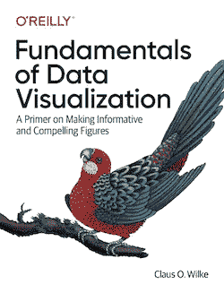
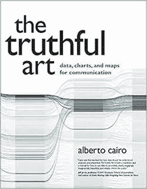
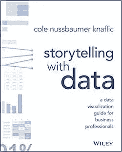
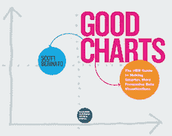
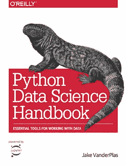
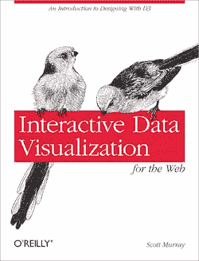
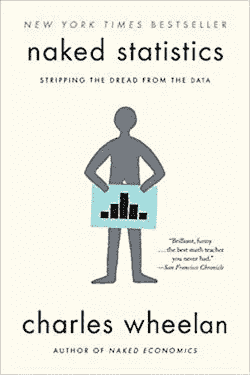
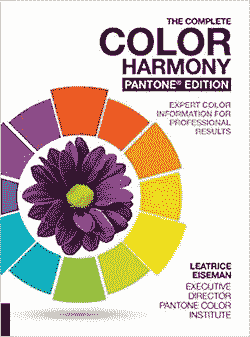
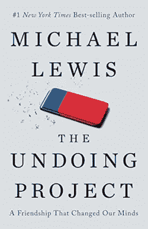

# 用这些书创建有影响力的数据可视化

> 原文：<https://towardsdatascience.com/create-impactful-data-visualizations-with-these-books-ca9fbfecfde5?source=collection_archive---------14----------------------->

## 如果没有交流，好的分析没有什么意义。数据可视化会有所帮助。以下是我对 2020 年增强 dataViz 的建议。

罗伯特·阿纳奇在 [Unsplash](https://unsplash.com/s/photos/book?utm_source=unsplash&utm_medium=referral&utm_content=creditCopyText) 上的照片

数据可视化可能是数据工作迷人的公众形象。

它们无所不在。我们都经常接触到我们最喜欢的网站、体育广播甚至广告上的图表和数据。

与数据科学的复杂性、数据挖掘的庞大数量以及数据新闻的冗长相比，数据可视化是简单、可访问和简短的。

数据可视化也吸引潜在的从业者；可能是因为 T4 看起来很容易。DataViz 输出看起来更像是我们可以创建的东西。我们都在 Excel 里画过图表，在 PowerPoint 里用过。会有多难呢？

但事实是，创建良好的数据可视化并不容易。要做到这一点，数据可视化必须准确，视觉冲击力强，有说服力。这是一个很高的标准(图表)，需要很好地掌握多个领域，如统计学、视觉传达、编程，甚至人类的感知和偏见。

在这篇文章中，我整理了几本书，我认为这些书将有助于开始数据可视化。此外，我试图保持列表的多样性，涵盖每个相关主题领域的一些内容。

如果你认为我错过了什么，请在评论或推特上告诉我！

> 注:这些书有些是免费的(这个社区是不是很精彩？).其他人的亚马逊是附属链接，这意味着在你没有额外费用的情况下，我会得到一小笔佣金。

# 数据可视化—概述

## 数据可视化基础(克劳斯·威尔基)

如果你不知道从哪里开始，这是一个很好的地方。

威尔基的书是那种适合用作参考手册，但天生可读的稀有书籍之一。我发现自己只是一章接一章地阅读，因为我发现这种经历既愉快又有启发性。

我不应该感到惊讶的是，一本关于数据可视化的书编排得很好，并以经济的方式传达了它的思想，但威尔基做得很好。作为一个简单的例子，威尔基将观想例子标记为“丑陋”或“糟糕”，这看起来是一个如此简单、明显的想法，但却真正抓住了你的注意力，让你的思维转向“为什么”以及应该如何去做。

它没有杂乱，也没有成本(如果你愿意的话)，因为威尔基已经将整个手稿作为一个精美的网站在线提供。

[在这里可以免费买到](https://serialmentor.com/dataviz/) |也可以在[亚马逊](https://www.amazon.com/gp/product/1492031089/ref=as_li_tl?ie=UTF8&tag=jphwang06-20&camp=1789&creative=9325&linkCode=as2&creativeASIN=1492031089&linkId=fac52d1716e998c32cb67d2d58a0b929)上买到

## 真实的艺术:用于交流的数据、图表和地图(阿尔贝托·开罗)

Alberto Cairo 几乎是数据可视化领域的名人。他有新闻记者*和学术证书*，他在社交媒体上相当活跃，经常称赞他人的良好工作，并领导反对错误信息的斗争。

在我看来，艾伯特·开罗关于数据或数据可视化的任何书籍都不会错。

如果要我选一个的话，我会选这个。他的第一本书更像是一本介绍性的书，倾向于在光谱的抽象部分多躺一会儿，他的最新的书是针对观想的消费者而不是创造者。这个对我来说可能是最合适的，因为它稍微更实用(在我看来),并且针对…数据可视化的供应方面。

在[亚马逊](https://www.amazon.com/gp/product/0321934075/ref=as_li_tl?ie=UTF8&tag=jphwang06-20&camp=1789&creative=9325&linkCode=as2&creativeASIN=0321934075&linkId=713987fef8e8d2e891322319c3e6564b)上有售

## 用数据讲故事(科尔·努斯鲍默·克纳弗里克)

这本书的一切都很谦逊，从简单的标题到严肃的封面。

这是这本书魅力的一部分。《用数据讲故事》是为商业专业人士写的，是一本很好的通才书籍，不像其他一些书那么专业，或许也不那么吓人。

我会向那些没有太多统计或数据分析背景的人推荐这本书，但可能不会向那些在数据相关领域有经验的人推荐。

在[亚马逊](https://www.amazon.com/gp/product/1119002257/ref=as_li_tl?ie=UTF8&tag=jphwang06-20&camp=1789&creative=9325&linkCode=as2&creativeASIN=1119002257&linkId=f6b671d22a6da52b421d4e3d49379996)上有售

## 好的图表:制作更聪明、更有说服力的数据可视化的 HBR 指南(斯科特·伯里纳托)

不要让标题中的“HBR”这几个字让你失去兴趣。这不是一本关于数据可视化基础知识的普通、最低标准的书。

虽然毫无疑问，它是为门外汉编写的，但 Berinato 并没有忽略历史和力学，或者数据可视化科学。

由此产生的产品是一个有效的，美丽的书，为从业者，管理者，或外行。Berinato 专注于创建有助于决策的有目的的图表，这在他的工作中得到了体现。

我经常发现一本“以业务为中心”的技术书籍往往会简化它，但在这种情况下，它有助于将精力用于实现目标和帮助决策者。

在[亚马逊](https://www.amazon.com/gp/product/1633690709/ref=as_li_tl?ie=UTF8&tag=jphwang06-20&camp=1789&creative=9325&linkCode=as2&creativeASIN=1633690709&linkId=93334bc1bcfb955c57144fb01581bade)上有售

# 数据可视化和编程

## Python 数据科学手册(Jake VanderPlas)

对于大多数从事数据可视化工作的人来说，他们的工作很可能也包括争论数据。

Python 是我选择的数据科学和分析语言，这意味着我经常使用包`numpy`和`pandas`。

这本书很好地介绍了这两者——尽管标题有些吓人，涉及到“数据科学”,但如果你熟悉 Python 的话，这是关于这个主题的较容易的书籍之一。免费提供！

[这里可以免费买到](https://jakevdp.github.io/PythonDataScienceHandbook/) |亚马逊[也有](https://www.amazon.com/gp/product/1491912057/ref=as_li_tl?ie=UTF8&tag=jphwang06-20&camp=1789&creative=9325&linkCode=as2&creativeASIN=1491912057&linkId=a46476e71ae79125971db9624c1497de)

## 网络交互式数据可视化(斯考特·玛瑞)

D3.js 是*可视化库，面向希望创建定制的交互式视觉效果的专业人员。*

*基于 JavaScript 的*之上，它确实有一个陡峭的学习曲线。以至于许多更容易使用的高级库都在它的上面(比如 Vega Lite 或 Plotly)。**

*如果你想或者需要使用 D3.js，这本书是一个很好的起点。Murray 引导你熟悉 D3.js 的旅程，尽管这是一个漫长的旅程，但他设法注入足够的幽默和小胜利来使它变得更容易。他还让这本书在网上免费提供，同时提供了要遵循的代码。*

*不，简单地说，这本书不会让你成为 D3.js 的大师，然而这是任何编程语言或库的真理。但这可能会节省你大量的时间和悲伤。*

*[在这里可以免费在线购买](https://alignedleft.com/work/d3-book) |也可以在[亚马逊](https://www.amazon.com/gp/product/1491921285/ref=as_li_tl?ie=UTF8&tag=jphwang06-20&camp=1789&creative=9325&linkCode=as2&creativeASIN=1491921285&linkId=e75051c27a3b812d09b68b83e20d5820)上购买*

# *背景材料*

## *赤裸裸的统计:从数据中剥离恐惧(查尔斯·惠兰)*

**

*我认为对统计学有良好的直觉理解在现代社会中是非常重要的。*

*在我看来，这对于任何一个“知识工作者”来说都是适用的，如果你做任何与数据有关的事情，对统计学的扎实掌握是必须的。*

*不幸的是，我也参加过一些统计学课程，我知道这些课程大多以最疏远的方式教授。所以当我看到这本书的时候，我一定要把它推荐给每个人。*

*对大多数人来说，统计学不应该是关于复杂的数学符号和 p 值的深奥讨论，或者哪种分布最适合。它是关于对我们观察世界的直观理解。反过来，它帮助我们剥去其他人试图通过扭曲统计数据来讲述的谎言，同时另一方面帮助我们讲述适合自己的故事。强烈推荐。*

*可从[亚马逊](https://www.amazon.com/gp/product/039334777X/ref=as_li_tl?ie=UTF8&tag=jphwang06-20&camp=1789&creative=9325&linkCode=as2&creativeASIN=039334777X&linkId=999e85d38a9f63eb124f0e7905d3c8b5)购买*

## *完整的色彩调和，潘通版(利阿特丽斯·艾斯曼)*

**

*如果你没有像我一样的设计背景，你对颜色的理解可能不会像你希望的那样好。*

*虽然我理解颜色背后的物理学，并对不同的颜色有一些初步的了解，但这本书帮助我理解了对颜色的情感感知。*

*一些描述可能看起来有点不准确，因为相当一部分框架和语言是情绪化的；然而，我认为她或多或少地捕捉到了人们对颜色的反应，以及为什么颜色会被这样使用。*

*可从[亚马逊](https://www.amazon.com/gp/product/1631592963/ref=as_li_tl?ie=UTF8&tag=jphwang06-20&camp=1789&creative=9325&linkCode=as2&creativeASIN=1631592963&linkId=121b34fc6a197310c0fba3f44089f60a)购买*

# ***奖金簿:数据相邻***

## *毁灭计划:改变了我们想法的友谊(迈克尔·刘易斯)*

**

*在书店找到一本迈克尔·刘易斯的书对我来说是个坏消息。*

*主要是因为我不可避免地坐立不安，游离于我对刘易斯的书的热爱的本能记忆中，比如《闪电侠》和《短暂的时光从我身边流逝》。*

*我推荐这本书，因为简单地了解行为心理学是一种丰富的经历，还因为休斯顿火箭队总经理达里尔·莫雷的章节本身就值得入场费。*

*如果你对体育和数据感兴趣，读读那一章，想想如果有一个像莫雷这样的老板，他的任务是用最好的数据做出最好的决定，那该有多好。此外，刘易斯是我们这个时代最好的作家之一，能够将一个看似平凡的主题转化为叙事黄金。*

*在[亚马逊](https://www.amazon.com/gp/product/0393354776/ref=as_li_tl?ie=UTF8&tag=jphwang06-20&camp=1789&creative=9325&linkCode=as2&creativeASIN=0393354776&linkId=847b3e59aa5c172397af3f297c48130b)上有售*

*显然，从几十本好书中挑选几本并不是一件容易的事情，但是我希望至少这些能帮助你开始。我打算不时更新这些，所以[如果你认为我做了一些惊人的遗漏，请务必让我知道](https://twitter.com/_jphwang)。*