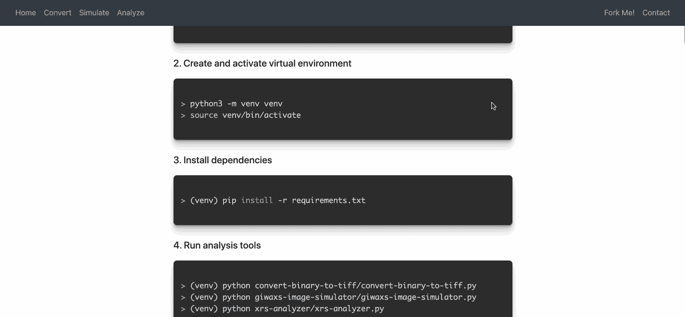
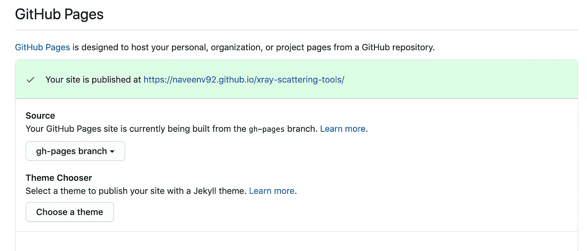

# 使用 GitHub 页面为您的项目创建登录页面

> 原文：<https://towardsdatascience.com/create-landing-pages-for-your-projects-with-github-pages-70cd2bd94425?source=collection_archive---------29----------------------->

## 使用自定义项目网站展示您的作品


Igor Miske 在 [Unsplash](https://unsplash.com?utm_source=medium&utm_medium=referral) 上拍摄的照片

我来自一个实验科学的背景，在那里我们要处理大量自制的实验装置和数据分析脚本。通常，这样做的结果可能是糟糕的文档和难以使用的代码，尤其是在最初的研究生(编写它的人)已经毕业并离开之后。出于这个原因，当我在研究生院研究期间开发一些数据分析脚本时，我决定尽我所能尝试并记录/演示它，以便任何未来的用户都可以直观地使用它。我努力的结果就是这个[登陆页面](https://naveenv92.github.io/xray-scattering-tools/)。



我能够用 GitHub Pages 生成这个网站，GitHub Pages 是一种服务，允许您轻松地为您的存储库托管一个静态网站。这样做非常简单，您的网站将位于 URL:

```
https://<username>.github.io/<repository_name>
```

# **1。创建一个孤立分支**

为了简单起见，我们不希望克隆我们的`master`分支的用户也看到将与我们的项目网站相关联的所有 HTML/CSS/JS 文件。为了解决这个问题，我们可以使用一个叫做“孤儿分支”的东西——本质上是一个位于树的根部、没有先前提交的分支。然后，通过将我们所有的网站文件保存在孤立分支中，当库被克隆时，默认情况下只有`master`上的文件会被显示(尽管任何人如果愿意，仍然可以访问网站分支)。

我们创建自己的孤立分支，用下面的命令将其命名为`gh-pages`:

```
git checkout --orphan gh-pages
```

# **2。清算** `**gh-pages**` **分支**

这是我第一次做这个的时候发现最恐怖的部分。为了清除`gh-pages`分支，您将从文件夹中删除*所有内容*。放心吧，你的`master`分科档案没了！使用以下命令:

```
git rm -rf .
```

你会注意到所有的文件都将从你的本地工作目录中消失，这就是我第一次这么做的原因。同样，不要担心，一切都会好的！

# **3。添加网页文件**

现在，将您的`index.html`文件，以及任何 CSS 样式表、Javascript 和您的网站运行所需的其他资源添加到您的本地工作目录中。现在准备并提交您的更改:

```
git add *
git commit -m "Commit Message"
```

最后，我们希望确保我们将我们的变更推到适当的分支(`gh-pages`)。

```
git push origin gh-pages
```

# **4。建立 GitHub 页面**

在线导航到你的 GitHub 库，进入设置。向下滚动时，您会注意到一个标题为“GitHub Pages”的部分。在标题为“Source”的区域下，您会看到一个下拉菜单，您可以使用它来选择构建您的网站的分支。我们将选择`gh-pages`。



等几分钟，然后砰！你的网站应该是活的！导航你的浏览器到`https://<username>.github.io/<repo_name>`看你的精彩创作。

# **5。为分支机构建立单独的目录**

随着您继续编辑您的网站和源代码，您会很快注意到您必须在两个分支之间不断切换:

```
# Switch to master branch
git checkout master# Switch to gh-pages branch
git checkout gh-pages
```

虽然简单，但过一段时间后这可能会变得很麻烦——幸运的是，我们可以使用名为`worktree`的特性为每个分支创建单独的目录。

首先，让我们创建一个单独的、与我们的存储库同名的新目录，或者清除我们的本地工作目录。如果我们清空当前目录，我们希望删除所有的`git`跟踪信息，我们可以通过以下方式来实现:

```
# Remove git tracking
rm -rf .git*
```

现在，让我们将我们的存储库重新克隆到子目录中。我们称这个目录为`source`，它将是我们保存所有源代码的地方。

```
git clone https://github.com/<username>/<reponame> source
```

您会注意到现在有了一个名为`source`的文件夹，其中包含了来自`master`分支的所有文件。现在让我们创建一个名为`gh-pages`的新目录，它将存放我们所有的网站文件:

```
mkdir gh-pages
```

导航到源文件夹:

```
cd source/
```

现在，我们使用`worktree`并使我们的`gh-pages`目录对应于远程`gh-pages`分支。

```
git worktree add ../gh-pages gh-pages
```

你完了！现在，你会注意到，当你转到`gh-pages`目录时，你将*只*看到`gh-pages`分支上的文件，如果你运行一个`git branch`命令，你将看到当你在`source`目录时你在`master`上，当在`gh-pages`目录时你在`gh-pages`上。

您现在可以同时自由编辑您的存储库网站和源代码，并且您在 GitHub 上有一个非常棒的项目登录页面！

# 结束语

感谢您的阅读！你可以在我的个人 [GitHub 页面](https://github.com/venkatesannaveen)看到我的一些作品。我感谢任何反馈，你可以在 [Twitter](https://twitter.com/naveenv_92) 上找到我，并在 [LinkedIn](https://www.linkedin.com/in/naveenvenkatesan/) 上与我联系以获取更多更新和文章。