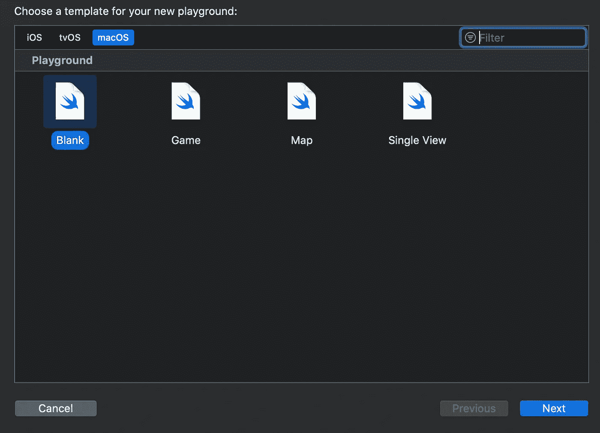
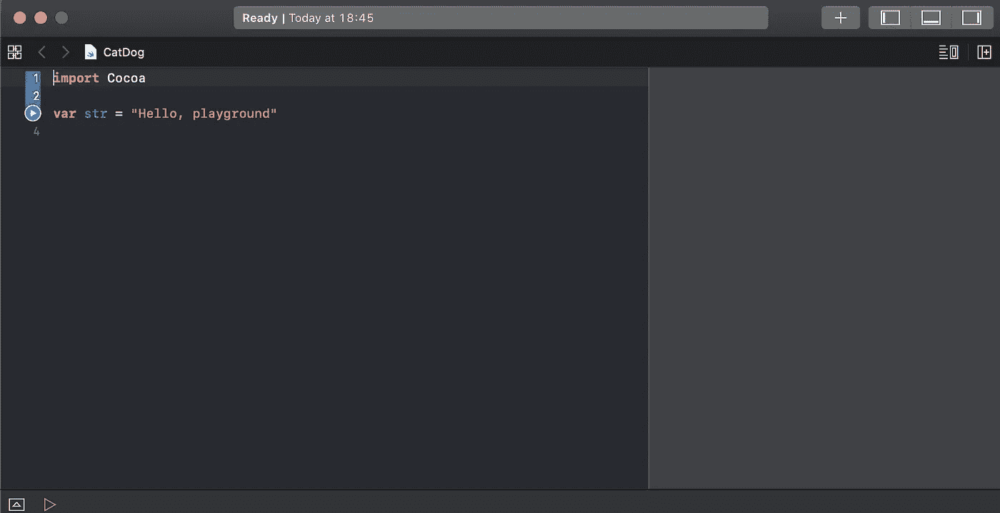
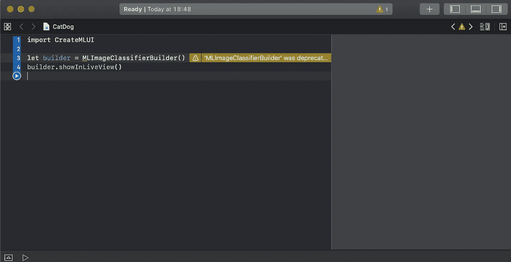
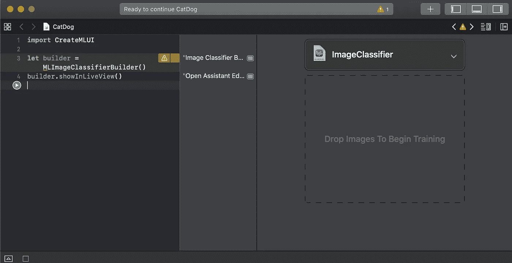
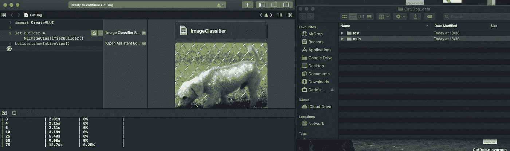
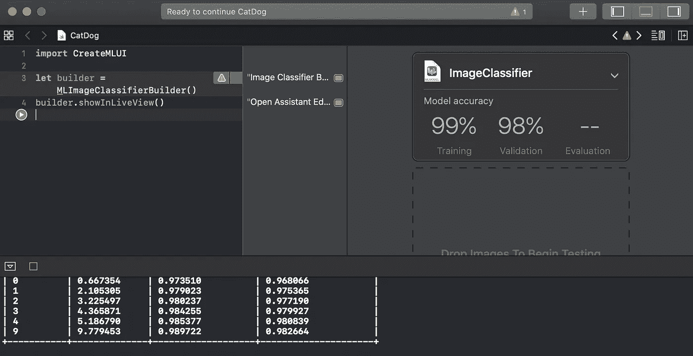
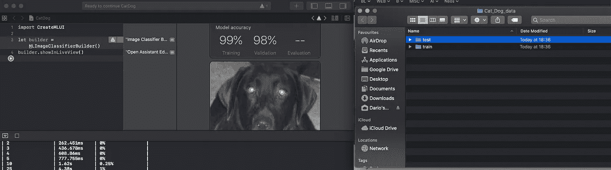
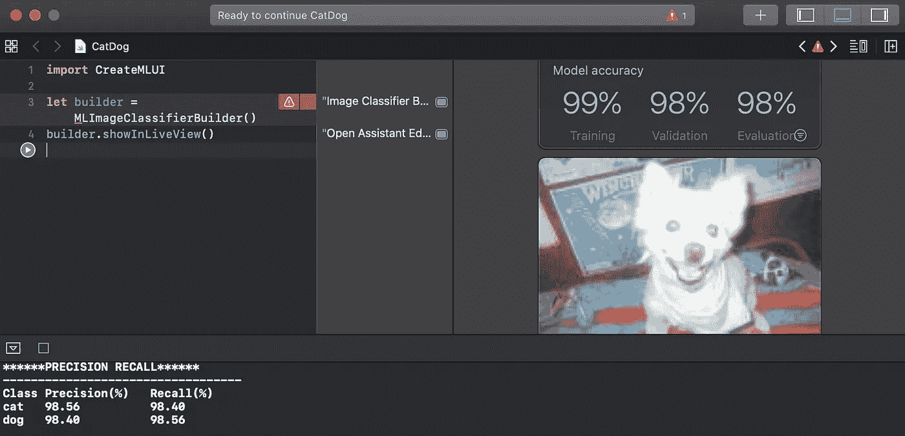
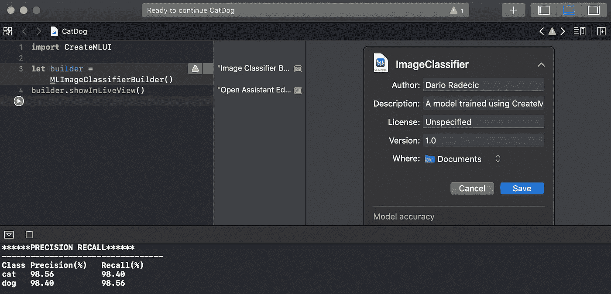
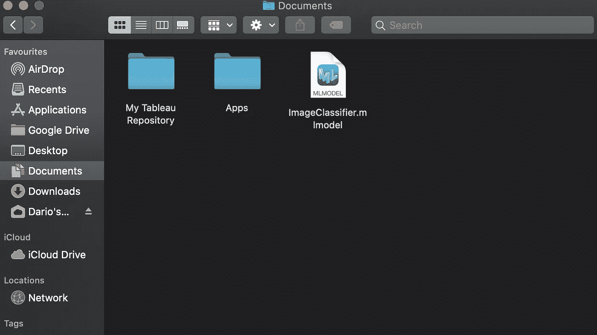

# 创建 ML:一个用于训练神经网络的 GUI

> 原文：<https://towardsdatascience.com/create-ml-a-gui-for-training-neural-networks-72bd1d651275?source=collection_archive---------32----------------------->

## 让我们用 3 行代码创建一个狗和猫的分类器。

几周前，我买了一台新的笔记本电脑——2019 年的 MacBook Pro，从那以后我就喜欢上了它。很自然地，我开始试验 Swift T1 和 T2 Xcode T3，主要是为了创建一些虚拟的 iOS 应用。在那里我发现了 Create ML——一个用于训练定制神经网络的 GUI 工具。


照片由[托马什·斯坦尼斯拉夫斯克](https://unsplash.com/@tomstanislavsky?utm_source=medium&utm_medium=referral)在 [Unsplash](https://unsplash.com?utm_source=medium&utm_medium=referral) 拍摄

这里有一个直接来自苹果官方文档的简短声明:

> 将 Create ML 与 Swift 和 macOS playgrounds 等熟悉的工具配合使用，在 Mac 上创建和训练定制的机器学习模型。您可以训练模型来执行任务，如识别图像、从文本中提取含义或查找数值之间的关系。[1]

很好。所以你可以看到，它不仅仅是像我们今天要做的图像分类。

首先要注意的是，对于大多数用户来说，创建 ML 肯定会有一个巨大的缺点——这是一个苛刻的要求:**你需要在 macOS 上运行。**

如果你没有苹果电脑，这并不是世界末日，因为像 MacInCloud.com 这样的解决方案已经存在。我还没有亲自测试过它们，所以我不能保证你会有一个完美流畅的体验——但总比没有好。

所以概括一下，如果你想继续，你需要运行 macOS，并且安装最新版本的 Xcode 。

这篇文章的结构如下:

1.  数据集下载
2.  3 行来训练他们
3.  模特培训
4.  模型评估
5.  模型保存
6.  结论和下一步措施

简单提一下，在下一篇文章中，我们将创建一个 iOS 应用程序，并将我们的训练模型链接到它。 [GitHub repo](https://github.com/daradecic/iOS_CNN_CatVsDog) 已经存在，可以随意查看。

# 数据集下载

如前所述，我们将制作一个狗和猫的图像分类器，数据集可以从这里下载。

如果您已经下载并解压缩了它，那么在根文件夹中，您将拥有以下结构:

```
├── test
│   ├── cat
│   └── dog
└── train
    ├── cat
    └── dog
```

这里有两件事你必须知道:

1.  在**训练**和**测试**文件夹中的子文件夹名称必须相同
2.  预测的类别名称将从子文件夹名称中推断出来——因此这里的**猫**和**狗**

*还在跟踪？*太好了，让我们在开始训练之前做好一切准备。

# 3 行来统治他们

我们现在可以打开 Xcode 并创建一个新的**游乐场**——一个用于 macOS 的空白游乐场:



随意命名，点击**下一个**。我们现在看到了以下屏幕:



太好了！在左边部分，我们将编写我们的代码，在右边部分，我们将训练我们的模型。

我们现在可以删除该占位符代码，并输入以下 3 行代码:

```
import CreateMLUIlet builder = MLImageClassifierBuilder()
builder.showInLiveView()
```

您的屏幕应该是这样的:



不要担心弃用警告，因为代码会工作得很好。现在，我们可以单击代码下方的蓝色播放按钮。几秒钟后，您将看到以下内容:



就这样，我们可以开始训练了！

# 模特培训

好了，现在你唯一要做的就是将 **train** 文件夹拖到这个 **Drop Images 开始训练**部分:



训练过程将立即开始，由于我们有超过 20K 的训练图像，这显然需要一些时间。所以，喝杯咖啡，休息一下，或者看看火车模型。

现在，过了一段时间(在我的机器上大约半小时)，模型被训练:



正如我们所看到的，它在训练集上表现出色，只需看看它在以前看不到的数据上的表现如何——因此在测试集上。让我们在下一节中探索这一点。

# 模型评估

要评估测试集上的模型，只需将**测试**文件夹拖至**拖放图像以开始测试**部分:



测试过程将大大缩短时间，因为我们只有 2500 张图像用于测试。尽管如此，你也可以休息一会儿，直到它结束。

好了，完成了吗？爽。正如我们所看到的，测试集上的准确率仍然令人印象深刻——98%。



现在我们知道我们的模型已经可以生产了，让我们在下一节探索如何导出它。

# 模型保存

我们需要保存这个模型，以便以后在我们的 iOS 应用程序中使用。为此，向上滚动模型培训部分并展开下拉列表:



如果您对自动填充的选项感到满意，请点击**保存**。记住，默认情况下，模型将被保存到 **Documents** 文件夹中——所以让我们快速验证一下它是否在那里:



厉害！注意**。mlmodel** 扩展？对于您希望在 iOS 上部署的任何模型，这都是强制性的，所以请记住这一点。

我们今天的工作已经完成了，所以让我们做一个简短的总结。

# 结论

做完这一切后，你可能想知道这个模型到底是怎么表现得这么好的？苹果官方声明如下:

> Create ML 利用了苹果产品内置的机器学习基础设施，如照片和 Siri。这意味着你的图像分类和自然语言模型更小，训练时间更少。[2]

简而言之，这意味着苹果有很多预训练的模型，它只需要调整输出层(也称为**迁移学习**)。如果你以前用过 *ResNet* 或者 *AlexNet* ，你就会知道我在说什么。

但是现在你有了它，大约 30 分钟来训练模型，并在测试集上达到 98%的准确率——对于只有 3 行代码来说非常令人印象深刻。

请继续关注下面的文章，我们将把这个模型整合到一个 iOS 应用程序中。

感谢阅读。

*喜欢这篇文章吗？成为* [*中等会员*](https://medium.com/@radecicdario/membership) *继续无限制学习。如果你使用下面的链接，我会收到你的一部分会员费，不需要你额外付费。*

[](https://medium.com/@radecicdario/membership) [## 通过我的推荐链接加入 Medium-Dario rade ci

### 作为一个媒体会员，你的会员费的一部分会给你阅读的作家，你可以完全接触到每一个故事…

medium.com](https://medium.com/@radecicdario/membership) 

# 资源

[1][https://developer.apple.com/documentation/createml](https://developer.apple.com/documentation/createml)

[2][https://developer.apple.com/documentation/createml](https://developer.apple.com/documentation/createml)