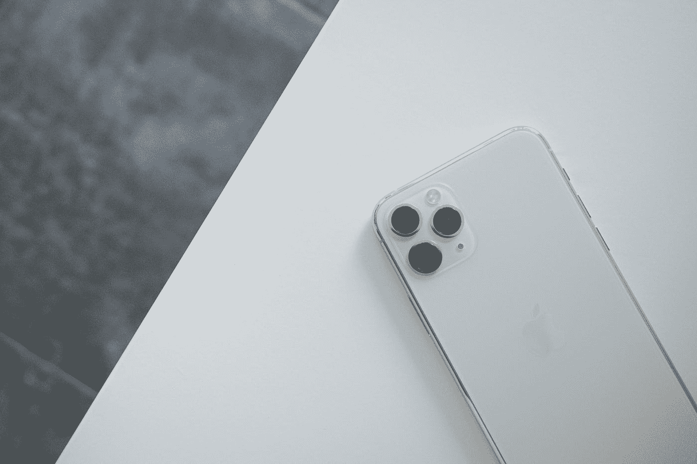
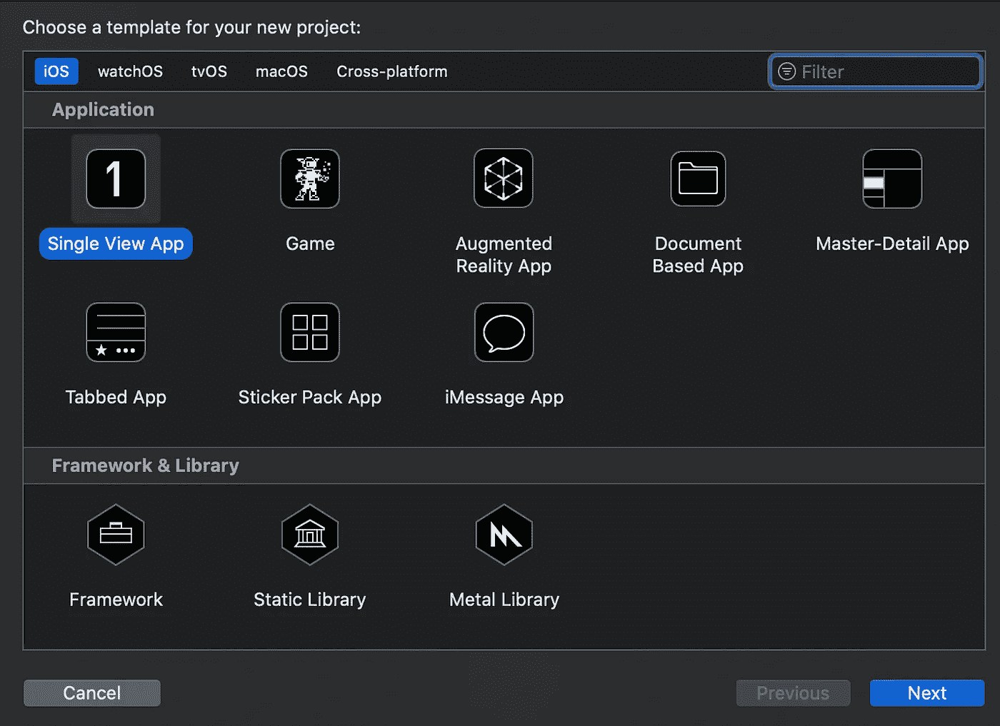
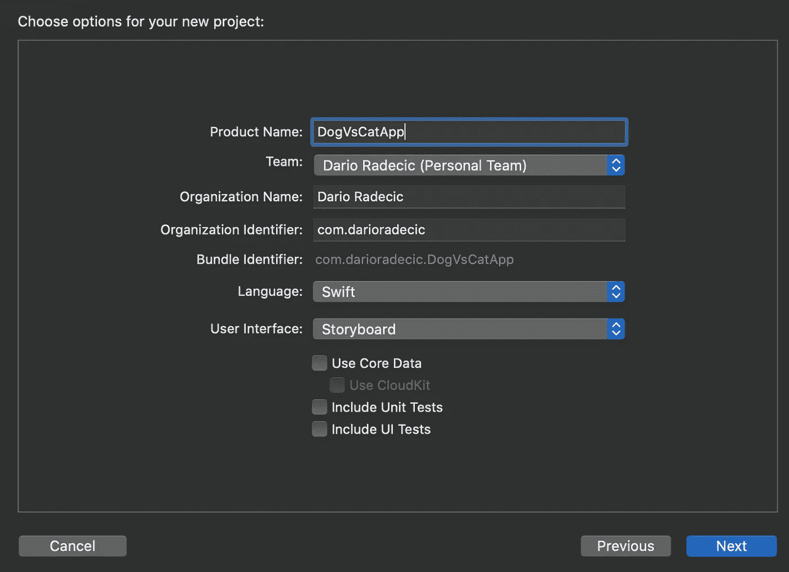
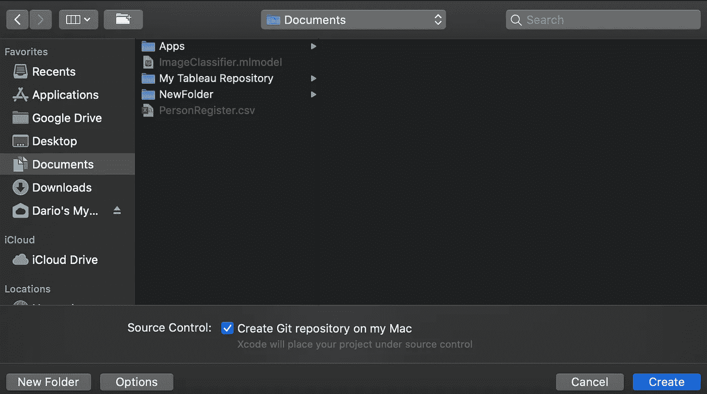
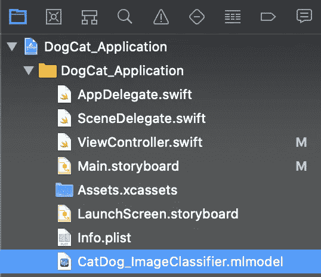
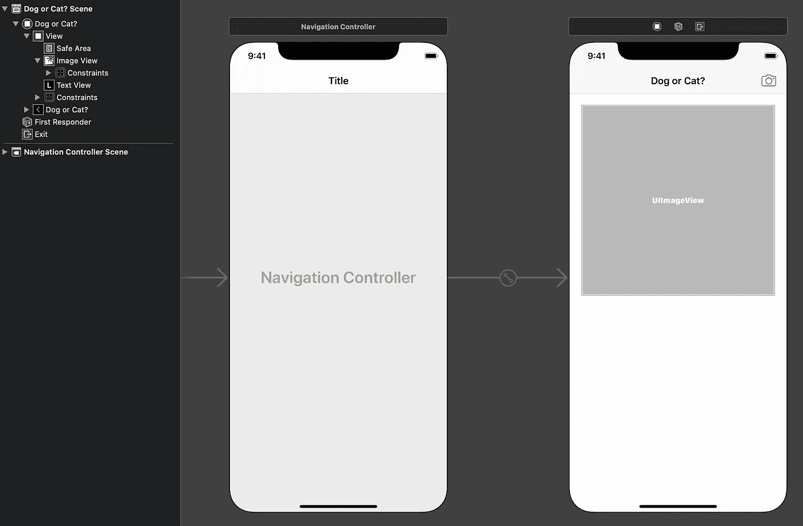
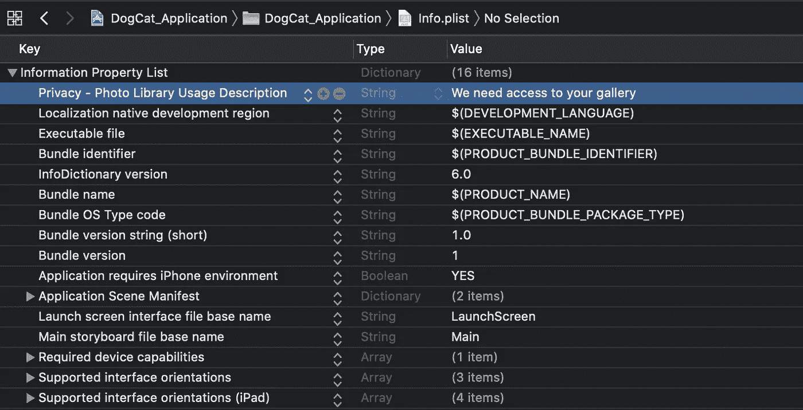
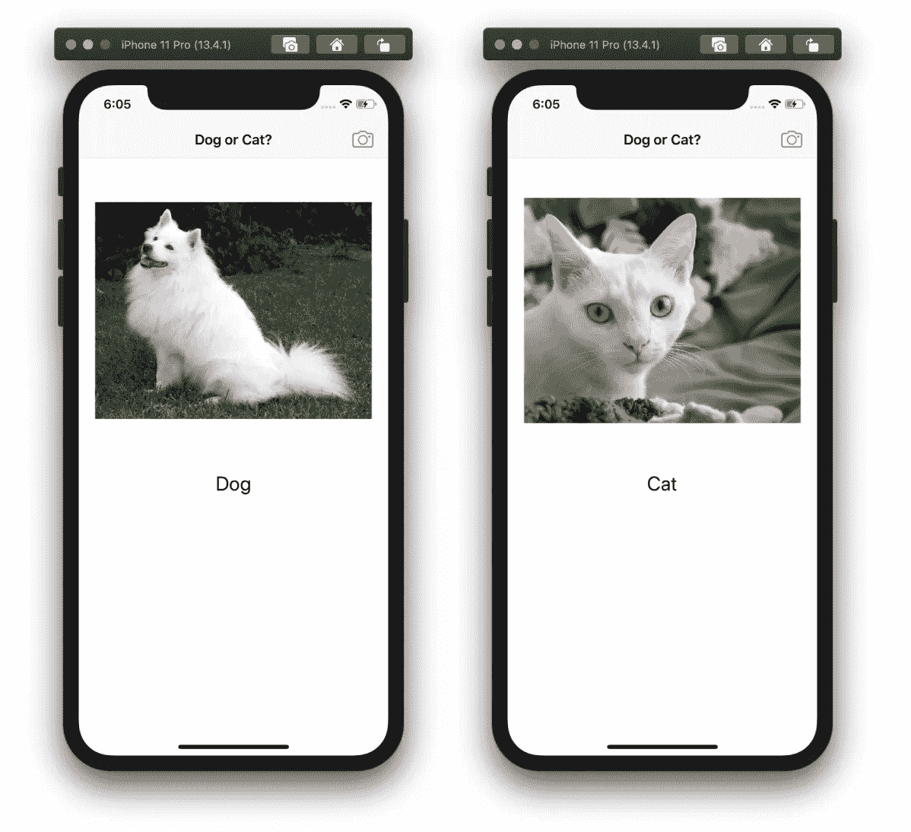

# 创建 ML:将模型部署到 iOS 应用程序

> 原文：<https://towardsdatascience.com/create-ml-deploy-the-model-to-an-ios-app-f52e5b62ab09?source=collection_archive---------47----------------------->

## 让我们创建一个简单的狗与猫的 iOS 应用程序！

几天前，我在 Create ML 部分发表了两篇文章中的第一篇，那篇讨论了收集数据和模型训练的过程。今天我们将会有更多的乐趣，因为在文章的最后，你将会在你的 iPhone 上拥有一个能够对狗和猫进行分类的应用程序(或者模拟器)!

安东尼·乔伦在 [Unsplash](https://unsplash.com?utm_source=medium&utm_medium=referral) 上的照片

***作者注:*** *我不是 iOS 开发者，这篇文章大概不会演示最干净的解决方案。然而，它仍然完美地工作着，我发现它值得与我的读者们分享。*

如果你错过了第一篇文章，你可以在这里找到它:

 [## 创建 ML:一个用于训练神经网络的 GUI

### 让我们用 3 行代码创建一个狗和猫的分类器。

towardsdatascience.com](/create-ml-a-gui-for-training-neural-networks-72bd1d651275) 

请记住，您不必完全阅读它，因为模型文件可以在官方的 [GitHub repo](https://github.com/daradecic/iOS_CNN_CatVsDog) 中获得。尽管如此，我还是强烈建议你这么做，因为你会发现现在训练图像分类器是多么容易。

跟随的**前提**依然苛刻:

1.  你需要一台苹果电脑(或者使用 MacInCloud.com)
2.  最新版本的 Xcode 是必须的
3.  你应该对 iOS 开发有所了解(目录结构，如何运行应用…)

如果你没有 iPhone，这很酷，因为这款应用可以在模拟器上运行。在开始编写代码之前，让我们快速浏览一下这个应用程序的最终版本,这样可以让你更有动力:

这篇文章的结构如下:

1.  iOS 项目创建
2.  布局
3.  代码
4.  让我们运行它
5.  结论

所以，事不宜迟，我们开始吧！

# iOS 项目创建

启动 Xcode 并选择**创建新的 Xcode 项目**。在那里，选择**单视图应用**:

这将打开一个新窗口。在这里，您可以指定应用程序的名称——这样做，并将其他所有内容保留为默认值。点击**下一个**:

最后一步是将应用程序存储在某个地方—您决定最佳位置:

现在将创建项目。这里我们需要做的最后一步是将我们的模型包含到应用程序中。为此，只需拖动**。mlmodel** 文件到项目文件:

这一节就讲到这里。在下一个中，我们将为应用程序创建**布局**。

# 布局

布局非常简单——我们将在 **Main.storyboard** 文件中设计它。我的决定是将视图包装在**导航控制器**中，这样我们就可以在导航栏中设置摄像头按钮。

还有，导航栏有个标题——**狗还是猫？**

此外，在内容部分，我们有一个基本的 **UIImageView** 来显示一个图像，在它下面，我们有一个**文本视图**来显示预测的类。您看不到它，因为默认情况下它是空白的，一旦我们选择一个图像，它就会被填充。

下面是你最后应该有的截图:

如果你有一些开发 iOS 应用的经验，像这样构造简单的 UI 不是问题。我决定不一步一步地展示这个过程，因为这篇文章很快就会变得很乱。非常欢迎你克隆[官方回购](https://github.com/daradecic/iOS_CNN_CatVsDog)，卡壳了可以借鉴。

好的，如果你现在已经跟上了，你应该已经完成了布局部分。在下一节中，我们将开始编写一些**代码**以及**管理权限**。

# 代码

在编写任何 Swift 代码之前，我们需要获得用户的照片库许可——转到 **Info.plist** 并添加如下:

就这样，现在用户可以允许我们访问他/她的图像。我们现在准备写一些 Swift 代码！

我绝不是 Swift 方面的专家，恰恰相反，我认为自己是一个绝对的初学者，但我发现这段代码工作得非常完美。也许它并没有考虑到最佳实践，但是它将适合我们的需要。

以下是我们需要执行的步骤(嗯，主要步骤):

1.  导入库
2.  为我们的视图声明变量
3.  按下相机按钮时显示图像拾取器
4.  处理图像拾取器
5.  为图像分类声明一个函数
6.  图像拾取控制器的链接检测功能

整个代码必须写在 **ViewController.swift** 文件中。您可以在下面的要点中找到代码，其中的步骤被写成了注释:

这就是关于代码的大部分内容！在下一部分，我们将运行这个应用程序(但我猜你已经知道它是如何执行的——如果你看过[视频演示](https://www.youtube.com/watch?v=eEGleqTldTs))。

# 让我们运行它

现在，我们实际上可以选择在哪个设备上运行应用程序。如果您没有 iPhone，您可以从下拉菜单中选择任何模拟器:

按下**启动**按钮，编译运行需要一分钟左右的时间。在模拟器上，我上网下载了一些免版税的猫狗图片。

一旦你这样做了，打开应用程序来测试它。以下是从我的设备获得的分类:

是的，我们确实有很多未使用的空白，设计也不完美——但这是一篇数据科学相关的文章，而不是 UI 设计相关的文章。不管怎样，今天就到这里，让我们在下一节快速总结一下。

# 结论

*我是 iOS 开发者吗？最肯定不是。*在设计和代码质量方面有改进的空间吗？*绝对可以。*

但是，作为数据科学家，我们没有义务在 UI 设计方面表现出色。我的意思是，你拥有这些技能很好，但这不是强制性的。

这篇文章和之前的 Create ML 文章背后的唯一目标是增加趣味，让你(和我)走出舒适区。编写算法代码并花费数周时间是一回事，但如果你只知道如何使用它，那又有什么意义呢？**如果没有好的方法来展示你的作品，那还有什么意义呢？**

花点时间想一想。它不必是一个移动应用程序，因为一个简单的网络应用程序与上传组件将只是这个项目的罚款。

感谢阅读。

***P.S.*** *如果模型对你的一些图片分类错误，请告诉我，因为我测试过的每一张图片都被正确分类了。*

*喜欢这篇文章吗？成为* [*中等会员*](https://medium.com/@radecicdario/membership) *继续无限制学习。如果你使用下面的链接，我会收到你的一部分会员费，不需要你额外付费。*

 [## 通过我的推荐链接加入 Medium-Dario rade ci

### 作为一个媒体会员，你的会员费的一部分会给你阅读的作家，你可以完全接触到每一个故事…

medium.com](https://medium.com/@radecicdario/membership)