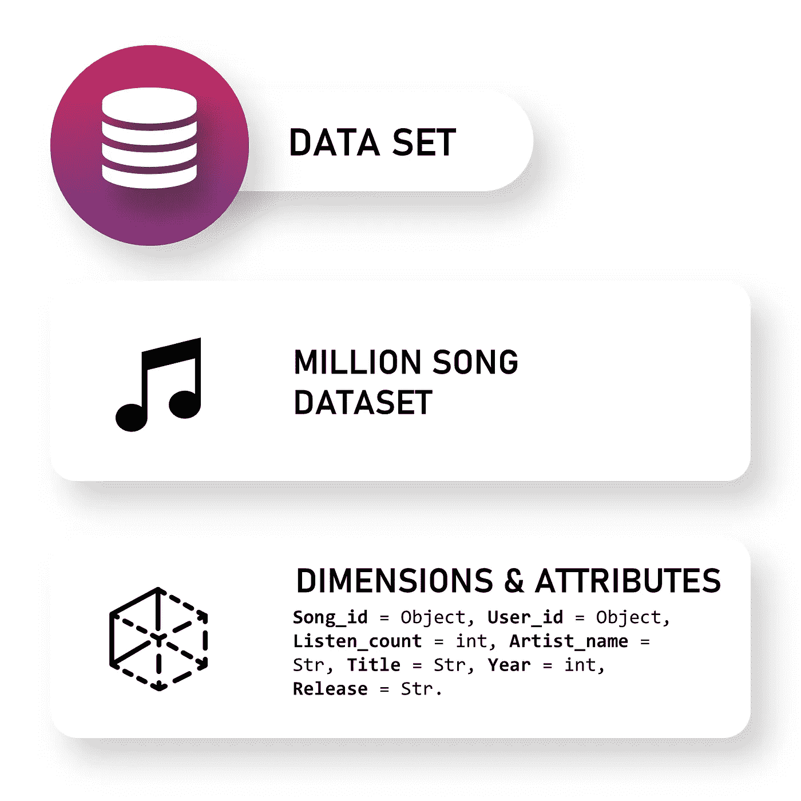
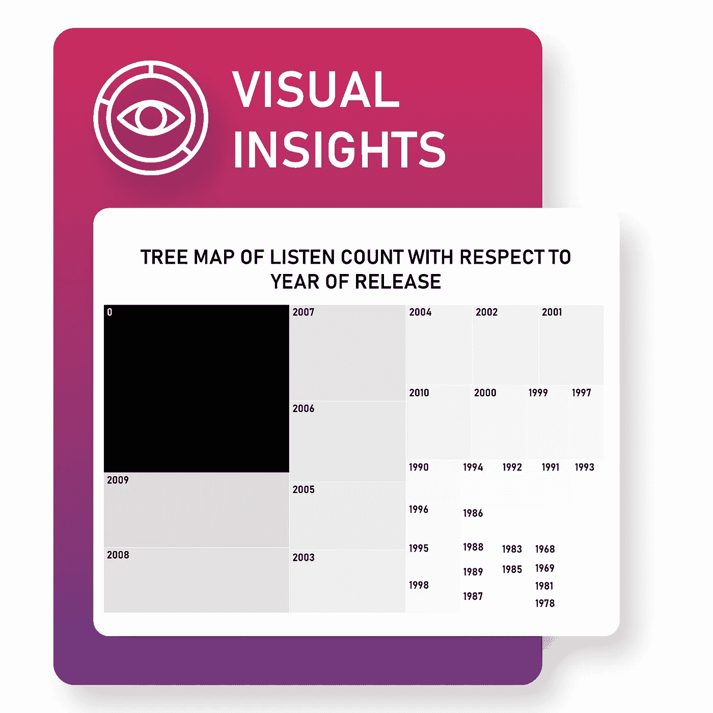
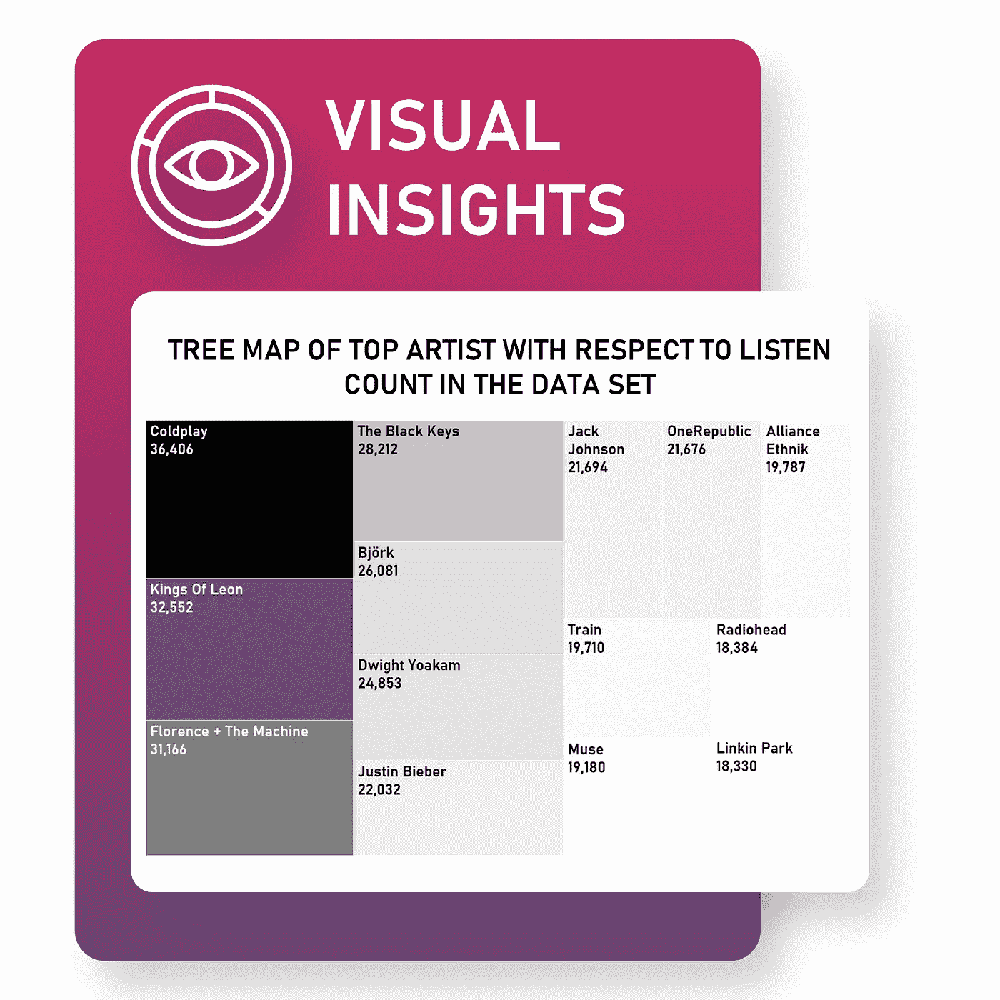
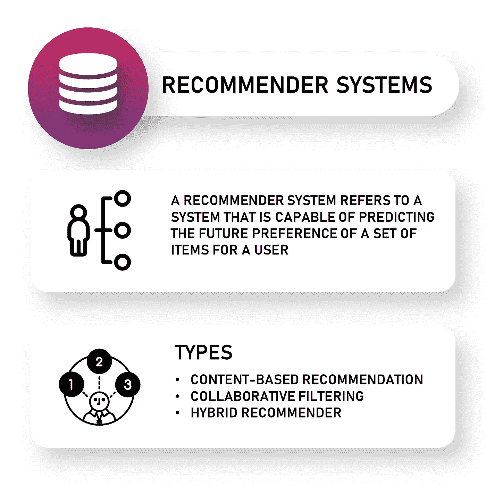
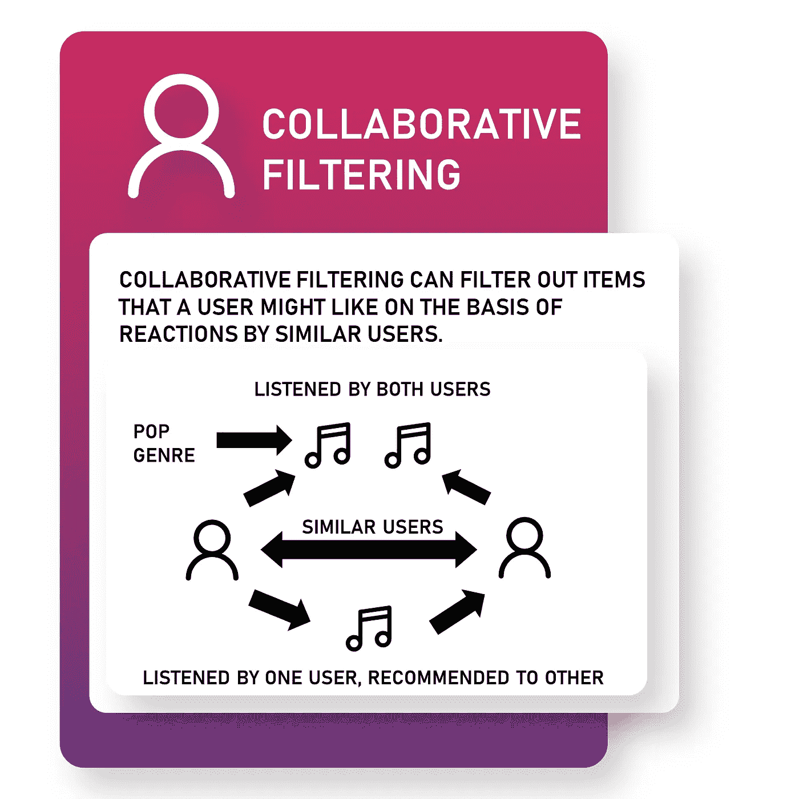
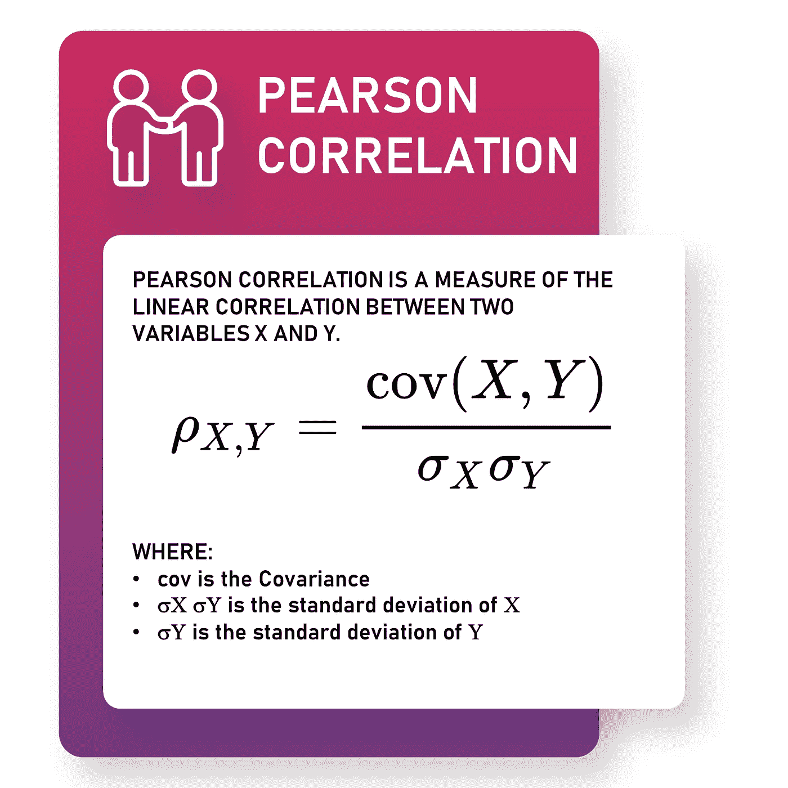
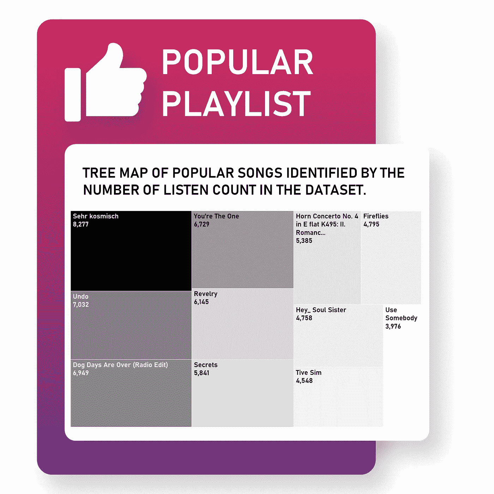
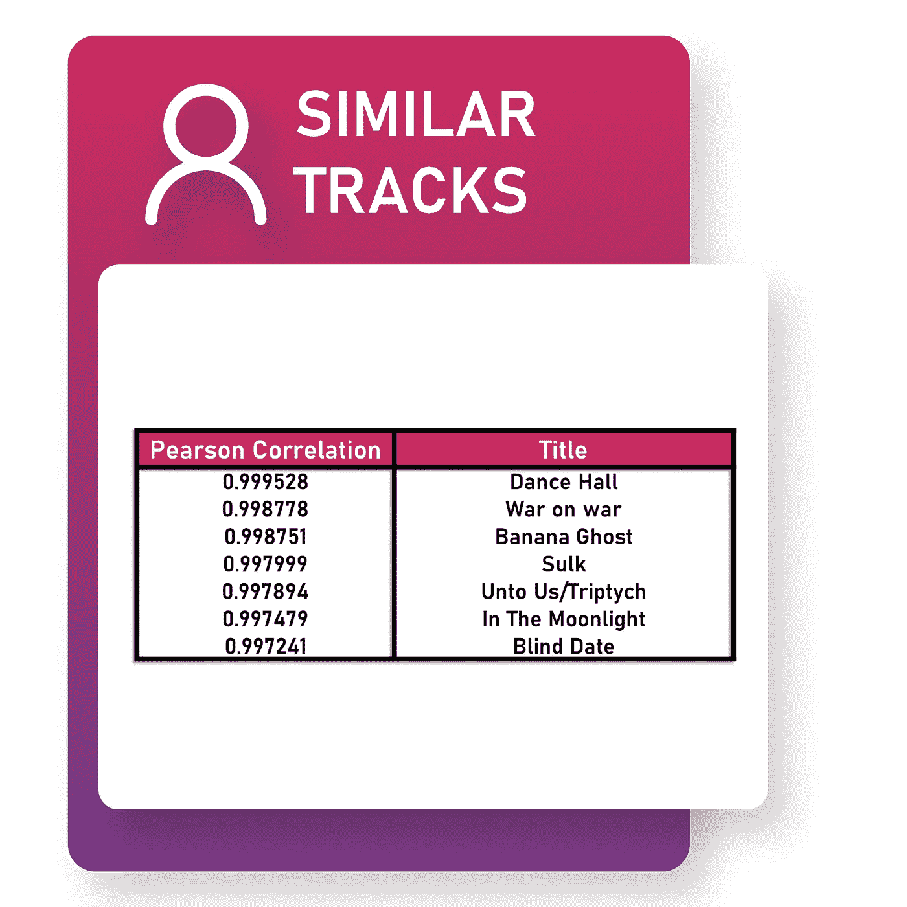

# 用 Python 创建音乐推荐系统

> 原文：<https://towardsdatascience.com/create-music-recommendation-system-using-python-ce5401317159?source=collection_archive---------3----------------------->

## 推荐系统

## 熟悉 Tableau 并创建一个协同过滤推荐系统


大家好！推荐系统在网上无处不在，相当标准。亚马逊、网飞和许多这样的公司都在使用推荐系统。我们要构建的这个与 Spotify 或 Youtube 音乐所用的非常相似，但要简单得多。

跟进所需的工具是 Tableau 和 Python3。你可以从[这里](https://www.tableau.com/academic/students)下载 Tableau。让我先带您浏览一下数据集，稍后我将在数据可视化部分提供 Tableau 的简要介绍。

# 数据集

[**百万首歌曲数据集**是一百万首当代流行音乐曲目](http://millionsongdataset.com/)的音频特征和元数据的免费收集。

**以下是数据集的链接:**

[https://static.turi.com/datasets/millionsong/10000.txt](https://static.turi.com/datasets/millionsong/10000.txt)

[https://static.turi.com/datasets/millionsong/song_data.csv](https://static.turi.com/datasets/millionsong/song_data.csv)



这是我们需要合并的两个数据集。我们将使用 Python3 连接数据集，并将其导入 Tableau 进行数据可视化。

```
#importing all the required libraries
import numpy as np
import pandas as pd#importing both the datasets
songmetadata = pd.read_csv(r'Path where the file is located')#one of the file is a text file hence we import it with pd.read_fwf
#fwf stands for fixed width file
othersongdata = pd.read_fwf(r'Path where the file is located')#naming the columns for the othersongdata
othersongdata.columns = ['user_id','song_id','listen_count’]#merging both the datasets and removing duplicates
song_df = pd.merge(othersongdata, songmetadata.drop_duplicates(['song_id']), on="song_id", how="left")#writing the file in .csv to visualize in Tableau
song_df.to_csv(r'Path where you want to store the exported CSV file\File Name.csv', index = False)
```

组合数据集后，我们得到的是百万首歌曲数据集。该数据集有超过一百万个观察值。数据集由七个变量组成。

```
**Song_id** = Object
#Unique ID for every song in the dataset, in total there are 1000 songs in the dataset
**User_id** = Object #Unique ID for every user
**Listen_count** = int 
#Number of times a song was listened by an user
**Artist_name** = Str 
#Name of Artist **Title** = Str 
#Title of each song
**Year** = int 
#Categorical variable with lot of zero values
**Release** = Str
#Album to which the songs belong to
```

# 数据可视化

> 视觉化给你你不知道的问题的答案—本·施奈德曼

将数据可视化、理解数据并找到见解总是一个很好的实践。我使用 Tableau 是因为它很快，并且提供了大量可视化数据集的选项。Tableau 极大地改进了我的工作流程，而且，我提到过它对学生是免费的吗？

## 什么是树形图？

我不想撒谎，我喜欢树状图。我在这个项目中广泛使用它们来显示数据。它们很漂亮，可定制，需要关注。

维基百科已经用一种比我更容易理解的格式解释了它，请看下面:

> 树形图将分层([树形结构](https://en.wikipedia.org/wiki/Tree_(data_structure)))数据显示为一组嵌套的矩形。树的每个分支都有一个矩形，然后用代表子分支的更小的矩形平铺。叶节点的矩形面积与数据的指定[维度成比例。](https://en.wikipedia.org/wiki/Dimension_(metadata))[【1】](https://en.wikipedia.org/wiki/Treemapping#cite_note-1)通常叶子节点是有颜色的，以显示数据的一个单独的维度。—维基百科

## （舞台上由人扮的）静态画面

在写这篇文章的时候，我在想，怎样才能最好地解释“如何在 Tableau 中创建树形图？”。而且我也不想走截图路线。我能做什么？所以我做了一个简单易懂的视频。

要将数据放入 Tableau，需要将。csv 到 excel 工作簿。您可以使用 python 中的以下命令轻松实现:

```
song_df.to_excel("millionsong.xlsx")
```

有时转换需要大量的时间，所以我在这里提供了一个可以下载的 excel 工作簿。

绝不是，这是一个全面的 Tableau 指南，它只是一个概述，让你熟悉 Tableau 如何工作以及如何制作树形图。学习 Tableau，查看免费培训，Tableau 官方网站提供[这里](https://www.tableau.com/learn)。



第一个树形图表示数据集中 **Year** 变量相对于 **Listen_count** 的比例。该图显示数据集中有许多零。因为我们在创建音乐推荐系统时不打算使用 **Year** 变量，所以我们不打算删除这些观察值。



第二个树形图表示相对于数据集中的总数 **Listen_count** 的艺术家。酷玩乐队以 36，406 的点击率成为数据集中最受欢迎的歌手，其次是莱昂国王 T21，点击率为 32，552。

# 商业问题

太多的选择会让用户不知所措。如果提供的选项太多，用户可能什么都不会买。像 Spotify 这样的流媒体服务有大量的目录。识别用户可能喜欢的曲目并推荐他们可能喜欢的产品对他们的业务至关重要。


我们将创建两个播放列表，一个是受欢迎的播放列表，第二个是识别与用户已经喜欢的歌曲相似的歌曲，从而为他们提供个性化的推荐。

# 推荐系统



## 基于内容的推荐系统

CBRS 根据项目的特点和其他项目要素之间的相似性推荐项目。假设用户已经看过喜剧类型的电影，CBRS 将推荐也属于喜剧类型的电影。

## 协同过滤推荐系统

用户的偏好和态度被认为是创造 CFRS。CFRS 推荐与用户已经选择的项目相似的项目。我们将使用皮尔逊相关来计算相似轨迹之间的关系。



***为什么我们不用联想而不用关联？***

关联只描述了两个变量之间的关系，而相关不仅描述了关系，还描述了强度。因此，当我们创建一个协同过滤推荐系统时，我们使用相关性。



# 让我们深入研究代码！

我们将首先创建**流行播放列表**。我们需要的只是一些数据争论。我尝试在评论中解释代码。尽管如此，如果你有问题，你可以在下面评论。



现在我们将制作 CFRS 并创建**个性化播放列表**。我使用的观察是，推荐系统的结果在下面给出。



如果你还和我在一起，谢谢。有人抽出时间来看我的作品对我来说意义重大。不要害羞，因为我就是。请在我的 [LinkedIn](https://www.linkedin.com/in/ajinkya-khobragade-6b6b08159/) 上与我联系，说‘你好！’，这将使我的一天。